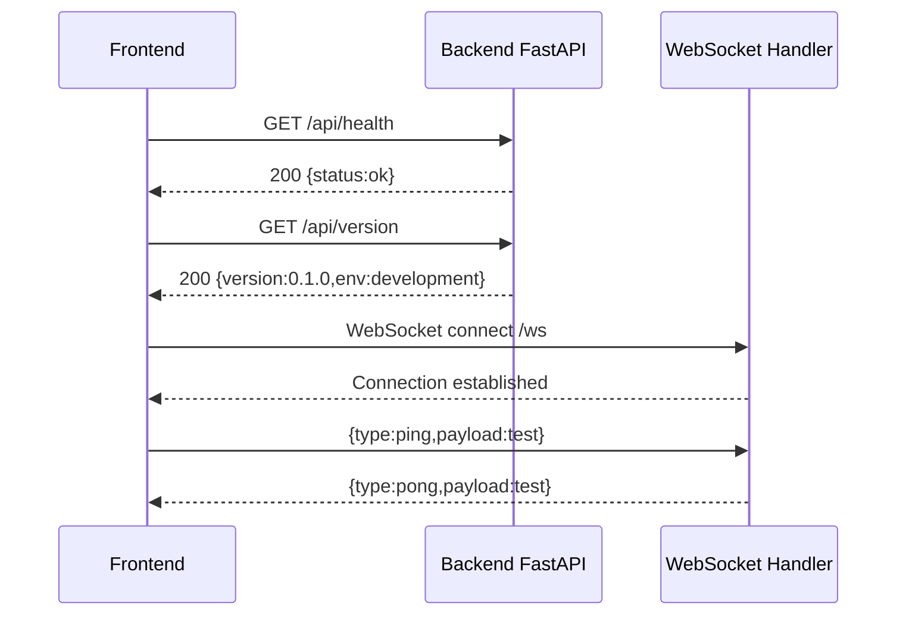

# Issue #4 — Backend-Frontend Communication Layer — Design

> **Branch:** `feature/backend-frontend-communication`
> **PR:** https://github.com/Svagtlys/Octave/pull/68
> **Date:** 2026-07-14

## Overview

Establish the communication layer between the Octave React frontend and FastAPI backend. This includes a structured REST API with CORS and error handling, a WebSocket endpoint for real-time streaming, and frontend client utilities to consume both channels. Also includes non-root Docker user configuration for both services.

## Approach

**Modular approach** — Backend code split into separate modules (middleware, routes, websocket). Frontend client utilities in a dedicated `lib/api` directory. Each module has a single responsibility and can be tested independently.

## Backend Architecture

### File Structure

```
backend/src/octave/
├── __init__.py
├── app.py              # FastAPI app factory, wires middleware + routes + WS
├── middleware.py        # CORS, request logging, global error handlers
├── routes/
│   ├── __init__.py
│   └── health.py        # GET /api/health, GET /api/version
└── websocket/
    ├── __init__.py
    └── connection.py    # WebSocket endpoint /ws, echo test
```

### Middleware (`middleware.py`)

- **CORS:** `CORSMiddleware` with configurable origins via `ALLOWED_ORIGINS` env var (default: `http://localhost:5173`).
- **Request logging:** Middleware logging method, path, status code, and duration for every request.
- **Error handling:** Global exception handlers returning consistent JSON: `{"error": string, "detail": string}`. Covers 404 and 500.

### Routes (`routes/health.py`)

- `GET /api/health` — Returns `{"status": "ok"}` (existing, moved from `app.py`).
- `GET /api/version` — Returns `{"version": "0.1.0", "env": "development"}`. Version read from package metadata; env from env var or defaults to `"development"`.

### WebSocket (`websocket/connection.py`)

- `WebSocket /ws` — Minimal echo endpoint for connection validation.
- Client sends `{"type": "ping", "payload": "..."}` → Server responds `{"type": "pong", "payload": "..."}`.
- Future work items will replace echo with actual message routing through Agent Manager.

### App Factory (`app.py`)

- Creates `FastAPI` instance with title `"Octave Backend"`.
- Registers middleware from `middleware.py`.
- Includes `APIRouter` from `routes/health.py` under `/api` prefix.
- Includes WebSocket endpoint from `websocket/connection.py` at `/ws`.

## Frontend Architecture

### File Structure

```
frontend/src/lib/api/
├── client.ts        # Fetch wrapper with base URL, typing, error handling
└── useWebSocket.ts  # React hook for WebSocket connection lifecycle
```

### API Client (`client.ts`)

- Reads base URL from `import.meta.env.VITE_API_URL` (set via Docker Compose, defaults to `http://localhost:8000`).
- Exports typed functions: `get()`, `post()`, `put()`, `delete()`.
- Automatic JSON parsing on success.
- Throws `ApiError` (with `status` and `message`) on HTTP errors.
- Exports convenience functions: `fetchHealth()`, `fetchVersion()`.

### WebSocket Hook (`useWebSocket.ts`)

- Accepts optional `url` parameter (defaults to `ws://localhost:8000/ws`, derived from `VITE_API_URL`).
- Returns `{ status: "connecting" | "open" | "closed" | "error", send: (msg: string) => void, lastMessage: string | null }`.
- Automatic reconnection with exponential backoff (1s → 2s → 4s → 8s max).
- Cleans up WebSocket connection on component unmount.

## REST API Endpoints

| Method | Path | Description | Response |
|--------|------|-------------|----------|
| GET | `/api/health` | Health check | `{"status": "ok"}` |
| GET | `/api/version` | Version info | `{"version": "0.1.0", "env": "development"}` |

## WebSocket Protocol

| Direction | Message |
|-----------|---------|
| Client → Server | `{"type": "ping", "payload": "..."}` |
| Server → Client | `{"type": "pong", "payload": "..."}` |

## Non-Root Docker Configuration

### Backend Dockerfile
- Create user `octave` with `RUN useradd --create-home octave`.
- Set `USER octave` before `CMD`.
- Ensure `WORKDIR /app` is accessible.

### Frontend Dockerfile
- Use built-in `node` user from `node:22-alpine`.
- Set `USER node` before `CMD`.
- Ensure `node_modules` and source are readable.

## Connection Flow



## Testing Strategy

### Backend Tests (pytest + httpx)

| Test File | Coverage |
|-----------|----------|
| `tests/test_health.py` | Health endpoint returns 200 with `{"status": "ok"}` (update path to `/api/health`) |
| `tests/test_version.py` | Version endpoint returns version string and env |
| `tests/test_cors.py` | CORS headers present for allowed origins |
| `tests/test_error_handling.py` | 404 and 500 return JSON error format |
| `tests/test_websocket.py` | WebSocket connect, ping/pong echo, disconnect |

### Frontend Tests (Vitest + React Testing Library)

| Test File | Coverage |
|-----------|----------|
| `src/lib/api/client.test.ts` | Fetch wrapper: success parsing, `ApiError` on 4xx/5xx |
| `src/lib/api/useWebSocket.test.ts` | Hook: connect, send, receive, cleanup on unmount |

### Docker Verification
- Build both images and verify container process runs as non-root user.

## Out of Scope

- Agent Manager message routing through WebSocket (future work item)
- Authentication/authorization
- File upload endpoints
- SSE (Server-Sent Events) — WebSocket chosen as the primary real-time channel
