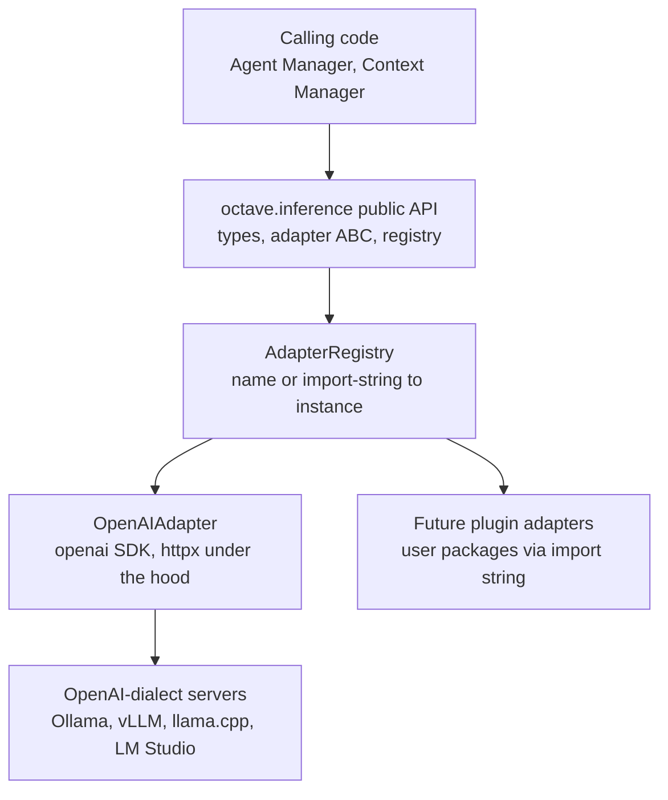

# Design: Pluggable Inference Adapter Interface

- **Issue:** [#8 — feat(inference): design pluggable inference adapter interface](https://github.com/Svagtlys/Octave/issues/8)
- **Branch:** `feature/inference-adapter-interface`
- **Draft PR:** [#73](https://github.com/Svagtlys/Octave/pull/73)
- **Date:** 2026-09-08
- **Status:** Approved

## Problem

Octave must talk to LLM inference engines without hard-coding any single backend. The
architecture defines an *Inference Engine Connector* that is "pluggable adapter interface
for LLM inference engines (OpenAI-compatible REST format)"
([`docs/ARCHITECTURE.md`](../../docs/ARCHITECTURE.md)). Calling code (Agent Manager,
Context Manager) should be able to swap inference backends by changing configuration,
not code.

This work item defines the **contract** (abstract adapter interface) and the **loading
mechanism** (adapter registry), plus one concrete adapter to prove and test the contract.

## Goals

1. An abstract `InferenceAdapter` base class specifying the contract every adapter
   implements: `complete`, `stream`, `embed`, `list_models`.
2. An `AdapterRegistry` that resolves and instantiates an adapter from configuration.
3. A concrete `OpenAIAdapter` speaking the OpenAI-compatible dialect (works against
   Ollama, vLLM, llama.cpp server, LM Studio) — including streaming — used to validate
   the contract end to end.
4. A reusable **conformance test suite** any adapter (built-in or third-party plugin)
   must pass.

## Non-goals (deferred to follow-up issues)

- Tool / function calling in the ABC — largest OpenAI surface; needs its own design.
- Prompt assembly pipeline (Architecture TODO: Inference #4).
- Engine health check + fallback mechanism (TODO: Inference #5). `list_models()` serves
  as a stopgap probe.
- Model capability tagging (`thinking`, `coding`, `quick`) — Octave-side metadata, not
  adapter data (TODO: Inference #7).
  *Verified during design:* the OpenAI `Model` object exposes no labels or capability
  metadata — its schema is exactly `id`, `object`, `created`, `owned_by`, `shutdown_date`
  ([`refs/openapi.yaml:44506`](../../refs/openapi.yaml)); the generic `Metadata` key-value
  map at [`refs/openapi.yaml:44485`](../../refs/openapi.yaml) belongs to Assistants/Threads
  objects, not models, and `supported_endpoints` appears nowhere in the spec. Local
  backends (Ollama, vLLM, llama.cpp, LM Studio) return only the minimal subset. `ModelInfo`
  therefore stays minimal (`id`, `created`, `owned_by`) with **no** unknown-field
  passthrough; extra fields are introduced only when the tagging issue is designed.
- DB-backed / Settings-UI-backed config (the unified database does not exist yet).
- Multimodal message content parts.

## Decisions from brainstorming

| # | Topic | Decision |
|---|-------|----------|
| 1 | Scope | ABC + registry + real OpenAI-compatible adapter **including streaming** |
| 2 | Reference specs | Vendor only `refs/openapi.yaml`; guard over-tailoring via conformance suite, not more specs |
| 3 | Registry loading | Hybrid: `@register` decorator for built-ins + `package.module:ClassName` import-string escape hatch for user plugins |
| 4 | Wire layer | Official `openai` Python SDK (`AsyncOpenAI`), **quarantined** behind the ABC |
| 5 | Config source | Env vars + `.env` via `pydantic-settings`; registry consumes an `AdapterConfig` object so DB-backed config later is a drop-in |

### Why the openai SDK (and how it stays safe)

The user chose the SDK to avoid hand-maintaining wire models and to keep the option of
targeting cloud OpenAI directly later. To contain the coupling and prevent OpenAI
vocabulary leaking into Octave's interface (the over-tailoring risk raised during
brainstorming), the design enforces a **structural quarantine rule**:

> Exactly one module — `octave/inference/openai_adapter.py` — may import `openai`.
> The ABC, domain types, errors, and registry are vendor-neutral. SDK exceptions are
> translated to Octave exceptions at the boundary. SDK types never appear in public
> signatures.

The anti-over-tailoring enforcement is the conformance suite (below): any future backend
(Ollama-native, Anthropic, cloud) must satisfy the same vendor-neutral contract. If a
future backend genuinely cannot, *that* is the evidence-driven moment to vendor its spec
and revise the ABC.

## Architecture



### Package layout

New package `backend/src/octave/inference/`:

| File | Responsibility |
|------|----------------|
| `types.py` | Octave domain types — the only vocabulary callers see |
| `errors.py` | Octave exception hierarchy — SDK exceptions never escape |
| `adapter.py` | `InferenceAdapter` ABC |
| `config.py` | `AdapterConfig` dataclass + `InferenceSettings` (pydantic-settings, env-backed) |
| `registry.py` | `@register` decorator, `AdapterRegistry`, import-string resolution |
| `openai_adapter.py` | `OpenAIAdapter` — **the only module allowed to import `openai`** |
| `__init__.py` | Public re-exports; imports `openai_adapter` so built-ins self-register |

## Domain types (`types.py`)

Pydantic v2 models (FastAPI already depends on pydantic). Minimal and use-case-driven.

```python
Message(role: Literal["system", "user", "assistant"], content: str)

CompletionRequest(
    model: str | None,
    messages: list[Message],
    temperature: float | None = None,
    max_tokens: int | None = None,
    top_p: float | None = None,
    stop: list[str] | None = None,
    extra: dict[str, Any] = {},
)

CompletionResult(text: str, model: str, finish_reason: str | None, usage: Usage | None)
CompletionChunk(delta_text: str, finish_reason: str | None = None)
Usage(prompt_tokens: int, completion_tokens: int, total_tokens: int)

EmbeddingRequest(model: str | None, inputs: list[str], dimensions: int | None = None)
EmbeddingResult(embeddings: list[list[float]], model: str, usage: Usage | None)
ModelInfo(id: str, created: int | None = None, owned_by: str | None = None)
```

Design notes:

- **`extra: dict` is the anti-over-tailoring valve.** Backend-specific parameters
  (Ollama `num_ctx`, Anthropic `budget_tokens`) pass through `extra` and are forwarded by
  the adapter to its wire layer. The ABC stays minimal; callers can use backend features
  without the ABC growing vendor fields.
- `model: None` resolves to the config's `default_model` inside the adapter.
- These are **Octave types**, deliberately not a 1:1 copy of OpenAI schemas. Only the
  subset shared across OpenAI-dialect local servers is modeled directly; the rest flows
  through `extra`.

## The ABC (`adapter.py`)

```python
class InferenceAdapter(ABC):
    def __init__(self, config: AdapterConfig) -> None: ...

    @abstractmethod
    async def complete(self, request: CompletionRequest) -> CompletionResult: ...

    @abstractmethod
    def stream(self, request: CompletionRequest) -> AsyncIterator[CompletionChunk]: ...

    @abstractmethod
    async def embed(self, request: EmbeddingRequest) -> EmbeddingResult: ...

    @abstractmethod
    async def list_models(self) -> list[ModelInfo]: ...

    async def aclose(self) -> None:
        """Release resources. Concrete no-op default; adapters override."""
```

- `stream` is a **method returning an async iterator**, not a request flag — the type
  difference makes it impossible to misuse.
- `aclose` is concrete (no-op) so simple adapters need not implement it; `OpenAIAdapter`
  overrides it to close its HTTP client.
- `list_models()` doubles as the interim health probe; a dedicated `health()` is deferred.

## Config (`config.py`)

```python
@dataclass(frozen=True)
class AdapterConfig:
    adapter: str                 # "openai" OR "package.module:ClassName"
    base_url: str
    api_key: str = ""            # local servers accept empty; never logged (*** per logging rules)
    default_model: str | None = None
    timeout_seconds: float = 120.0
    max_retries: int = 2
    extra: dict[str, Any] = field(default_factory=dict)
```

`InferenceSettings` (pydantic-settings, `env_prefix="OCTAVE_INFERENCE_"`) reads
`ADAPTER`, `BASE_URL`, `API_KEY`, `DEFAULT_MODEL`, `TIMEOUT_SECONDS`, `MAX_RETRIES` from
environment / `.env` (already gitignored) and exposes `.to_adapter_config() -> AdapterConfig`.

Rationale (two-layer config): this backend is Docker-deployed, so env vars are the
12-factor-idiomatic bootstrap layer. API keys are secrets and stay out of committed
files. The registry depends on `AdapterConfig`, not on env — when the unified DB and
Settings view land, they populate the same `AdapterConfig` at the composition root.

## Registry (`registry.py`)

```python
@register("openai")                 # built-ins self-register on import
class OpenAIAdapter(InferenceAdapter): ...

class AdapterRegistry:
    def register(self, name: str, cls: type[InferenceAdapter]) -> None: ...
    def resolve(self, name_or_import_string: str) -> type[InferenceAdapter]: ...
    def create(self, config: AdapterConfig) -> InferenceAdapter: ...
    def names(self) -> list[str]: ...          # for future Settings UI
```

Resolution order in `resolve`:

1. Exact registered name → return the class.
2. String contains `:` → treat as `module.path:ClassName`; `importlib.import_module` +
   `getattr` → return the class (user plugin adapter).
3. Otherwise → raise `UnknownAdapterError` listing registered names.

Rules:

- Duplicate registration of the same name → `AdapterRegistrationError` at import time
  (fail fast).
- Import-string resolution failure → `AdapterLoadError` (wraps the import error).
- A resolved class that is not an `InferenceAdapter` subclass → `AdapterLoadError`.
- Unknown-name and load failures are logged as `WARN` in the pipe-delimited format from
  [`.agents/rules/coding.md`](../rules/coding.md); API keys redacted as `***`.

## OpenAIAdapter (`openai_adapter.py`)

- Constructed with `AsyncOpenAI(base_url=config.base_url,
  api_key=config.api_key or "unused", timeout=config.timeout_seconds,
  max_retries=config.max_retries)`. Accepts an optional injected `httpx.AsyncClient`
  (passed to the SDK via `http_client=`) — this is what makes offline testing possible
  with `httpx.MockTransport`.
- Method mapping:
  - `complete` → `client.chat.completions.create(...)`; map `choices[0].message.content`,
    `model`, `finish_reason`, `usage` → `CompletionResult`.
  - `stream` → same call with `stream=True`; iterate SDK chunks, map
    `choices[0].delta.content` → `CompletionChunk.delta_text` and `finish_reason`. The
    SDK handles SSE framing and `[DONE]` internally.
  - `embed` → `client.embeddings.create(input=request.inputs, ...)`; map
    `data[i].embedding` → `EmbeddingResult`.
  - `list_models` → `client.models.list()`; map `data[i]` → `ModelInfo`.
- `request.extra` is splatted into the SDK `create(...)` kwargs (via `extra_body` / direct
  kwargs) so backend-specific params flow through.
- `model` falls back to `config.default_model` when `request.model is None`.
- `aclose` closes the underlying client.

### Exception translation (boundary rule)

Callers only ever catch Octave types. `openai_adapter` wraps every SDK call:

| SDK exception | Octave exception |
|---------------|------------------|
| `APIConnectionError`, `APITimeoutError` | `AdapterConnectionError` |
| `AuthenticationError` | `AdapterAuthError` |
| `RateLimitError` | `AdapterRateLimitError` |
| `NotFoundError` | `ModelNotFoundError` |
| `APIStatusError` | `AdapterResponseError(status_code)` |
| `APIError` (catch-all) | `AdapterError` |

All are subclasses of `AdapterError` (defined in `errors.py`).

## Dependencies

Add to `backend/pyproject.toml` `[project.dependencies]`:

- `openai>=2.0.0`
- `pydantic-settings>=2.0.0`

`httpx` is already present in dev deps; the `openai` SDK depends on `httpx` at runtime,
so no separate runtime pin is required (the injected-client seam uses it in tests).
Code must remain `mypy --strict` clean (SDK is fully typed) and `ruff` clean.

## Testing

Offline only (local-first; no network in tests).

- **`tests/inference/conformance.py`** — `InferenceAdapterConformanceSuite`, a pytest
  mixin exercising the full contract: `complete` returns text; `stream` yields chunks and
  the final chunk carries a `finish_reason`; `embed` returns one vector per input;
  `list_models` returns ids; each error class is raised on its trigger. **Any adapter —
  built-in or plugin — must pass this suite.** This is the standing anti-over-tailoring
  enforcement.
- **`tests/inference/test_openai_adapter.py`** — runs the conformance suite against
  `OpenAIAdapter` using an injected `httpx.MockTransport`. Fixtures are realistic payloads
  extracted from `refs/openapi.yaml` examples (e.g., the `chatcmpl-123` streaming chunk
  sequence near [`refs/openapi.yaml:33941`](../../refs/openapi.yaml)).
- **`tests/inference/test_registry.py`** — decorator registration, duplicate rejection,
  name resolution, import-string plugin loading (via a test-local fake adapter),
  unknown-name error, non-subclass error.
- **`tests/inference/test_config.py`** — env parsing, defaults, `AdapterConfig` production.
- **`tests/inference/fakes.py`** — minimal `FakeAdapter` used by registry tests, proving a
  plugin-shaped adapter satisfies the contract.

## Conformance to project rules

- Type hints on all signatures; `async/await` for I/O ([`.agents/rules/coding.md`](../rules/coding.md)).
- Explicit error handling; no bare `except` — boundary translation is explicit.
- Logging uses the pipe-delimited format; secrets redacted `***`.
- Docstrings on all public classes/functions.
- `docs/ARCHITECTURE.md` updated to reflect the adapter interface and registry.
- Tests independent; no shared state.

## Open follow-ups to file after this issue

- Tool / function calling design for the ABC.
- Health check + fallback mechanism (may introduce a dedicated `health()`).
- DB/Settings-backed config populating `AdapterConfig`.
