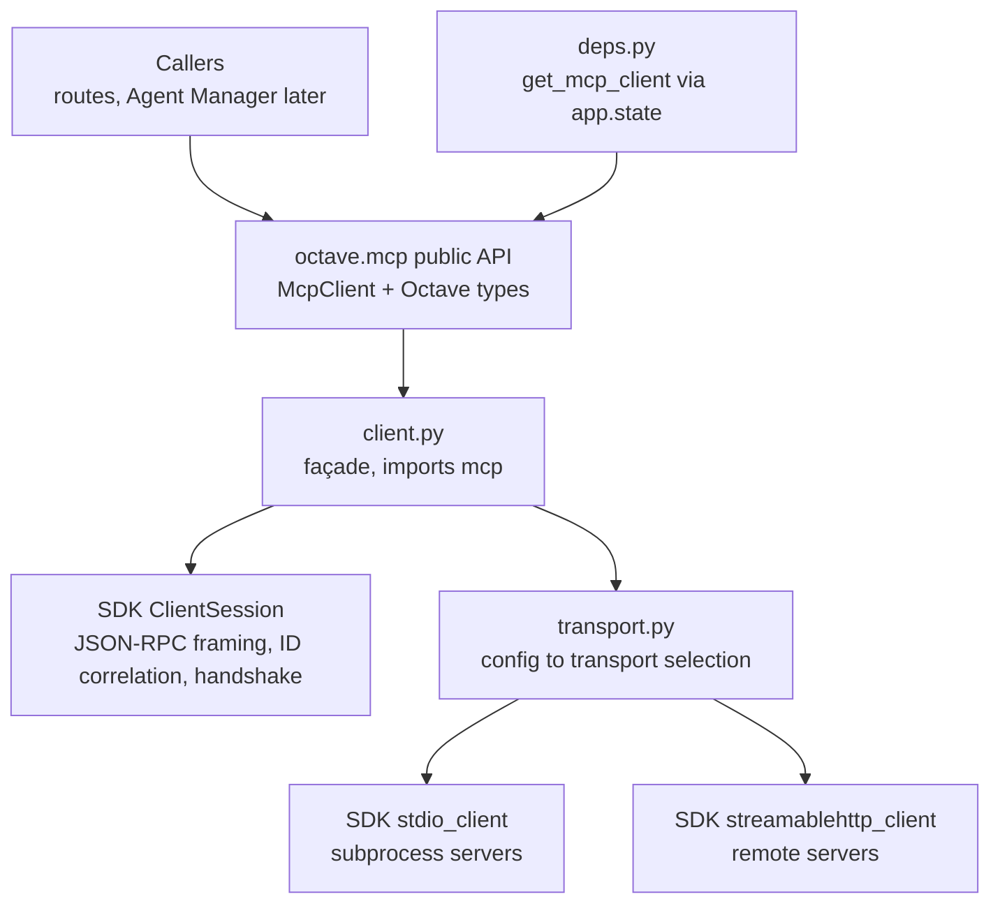

# Design: MCP Client Core — JSON-RPC 2.0 Transport Layer

- **Issue:** #15 — feat(mcp): implement JSON-RPC 2.0 transport layer
- **Branch:** `feature/mcp-client-core-json-rpc`
- **Draft PR:** [#81](https://github.com/Svagtlys/Octave/pull/81)
- **Date:** 2026-09-10
- **Status:** Approved

## Problem

Octave communicates with MCP servers over JSON-RPC 2.0 via stdio or HTTP transports
([`docs/ARCHITECTURE.md`](../../docs/ARCHITECTURE.md) — MCP Connector). This work item
delivers the foundation of the MCP Connector: a client core that can open a connection to
an MCP server, send requests, correlate responses, deliver notifications, and surface
errors — the prerequisite for server lifecycle management, tool discovery, and tool
execution (roadmap MCP Connector #4–#6).

## Decisions from brainstorming

| # | Topic | Decision |
|---|-------|----------|
| 1 | Scope | Full connect-and-talk core: JSON-RPC transport **plus** both SDK transport backends (stdio subprocess, Streamable HTTP). Roadmap #2/#3 reduce to config persistence + Settings UI wiring. |
| 2 | Build vs adopt | **Adopt the official `mcp` Python SDK**, quarantined behind an Octave façade — mirrors the `openai` SDK precedent in [the inference design](./2026-09-08-inference-adapter-interface-design.md) (decision 4). The SDK supplies spec-compliant JSON-RPC 2.0 framing, ID correlation, the initialize handshake, and both transports; hand-rolling would re-implement plumbing the roadmap then depends on. |
| 3 | Façade level | Wrap `ClientSession` (MCP-aware), not `BaseSession` (raw JSON-RPC). `ClientSession` already provides exactly the issue's scope (request/response framing, result delivery, error responses) plus the handshake; a raw layer would be rewrapped one issue later. A `send_request` raw escape hatch covers methods the façade hasn't typed yet. |
| 4 | Directionality | Outbound requests + responses + inbound/outbound notifications. Inbound server→client **requests** (sampling, roots, elicitation) are deferred to a follow-up; the `ClientSession` `message_handler` seam is structured so a handler registry can be added without rearchitecting. |
| 5 | DI | Thin integration point: `get_mcp_client()` FastAPI resolver backed by `app.state`, proven via `dependency_overrides` in tests. No lifespan/startup wiring — connection bootstrapping belongs to the lifecycle manager (roadmap #4). |
| 6 | HTTP dialect | Streamable HTTP (`streamablehttp_client`) only. The legacy `sse_client` is deprecated upstream and deliberately **not** wrapped. |
| 7 | Config source | `McpSettings` (pydantic-settings, `env_prefix="OCTAVE_MCP_"`) for global defaults (timeout); `ServerConfig` is a plain frozen dataclass consumed by the façade so DB-backed config (roadmap #7) is a drop-in at the composition root — same two-layer pattern as inference. |

### Quarantine rule

> Exactly two modules may `import mcp`, each with a strictly bounded role:
>
> - `octave/mcp/client.py` — all MCP semantics (sessions, requests, results, errors).
> - `octave/mcp/transport.py` — transport constructors only (`stdio_client`,
>   `streamablehttp_client`); context-manager plumbing, no MCP semantics.
>
> All other modules — domain types, errors, config, DI resolver — are Octave-owned and
> SDK-free. SDK exceptions are translated to Octave exceptions at the `client.py`
> boundary; SDK types (`Tool`, `CallToolResult`, `Implementation`, `McpError`, …) never
> appear in public signatures.

## Architecture



Below `client.py` the SDK supplies everything: JSON-RPC 2.0 message framing, request ID
correlation for concurrent calls, standard error codes (−32700…−32000), the MCP
initialize handshake, and both transport backends. Octave supplies the typed boundary
above it.

### Package layout

New package `backend/src/octave/mcp/`:

| File | Responsibility |
|------|----------------|
| `types.py` | Octave domain types — the only vocabulary callers see |
| `errors.py` | Octave exception hierarchy — SDK exceptions never escape |
| `config.py` | `ServerConfig` frozen dataclass + `McpSettings` (pydantic-settings, env-backed global defaults) |
| `transport.py` | `open_transport(config)` — stdio vs Streamable-HTTP selection from `ServerConfig` |
| `client.py` | `McpClient` façade — **the only module importing `mcp` for MCP semantics** |
| `deps.py` | `get_mcp_client()` FastAPI dependency resolver (`app.state.mcp_client`) |
| `__init__.py` | Public re-exports |

## Domain types (`types.py`)

Pydantic v2 models, minimal and use-case-driven (same style as
[`inference/types.py`](../../backend/src/octave/inference/types.py)):

```python
ServerInfo(name: str, version: str, protocol_version: str)

ToolInfo(name: str, description: str | None,
         input_schema: dict[str, Any])

ToolResult(content: list[ToolContent], is_error: bool = False)
ToolContent(kind: Literal["text"], text: str)   # images/blobs deferred

Notification(method: str, params: dict[str, Any])
```

Design notes:

- `ToolContent` models text only for now; MCP image/audio/resource content types are
  added when a caller needs them (YAGNI). `input_schema` stays a raw JSON Schema dict —
  Octave forwards it to inference engines, it never interprets it.
- `ServerInfo` is populated from the initialize handshake (server `implementation` +
  negotiated `protocolVersion`).

## Config (`config.py`)

```python
@dataclass(frozen=True)
class StdioConfig:
    command: str
    args: list[str] = field(default_factory=list)
    env: dict[str, str] = field(default_factory=dict)

@dataclass(frozen=True)
class HttpConfig:
    url: str
    headers: dict[str, str] = field(default_factory=dict)

ServerConfig = StdioConfig | HttpConfig   # discriminated by type
```

`McpSettings` (pydantic-settings, `env_prefix="OCTAVE_MCP_"`) exposes global defaults:
`REQUEST_TIMEOUT_SECONDS` (default 30.0). Per-server config lists come from the unified
database in roadmap #7; `ServerConfig` objects are what that persistence will produce.

Secrets (`env` values, auth headers) are never logged — redacted `***` per
[`.agents/rules/coding.md`](../rules/coding.md).

## Transport (`transport.py`)

```python
@asynccontextmanager
async def open_transport(config: ServerConfig) -> AsyncIterator[TransportStreams]: ...
```

- `StdioConfig` → SDK `stdio_client(StdioServerParameters(...))` — spawns the subprocess.
- `HttpConfig` → SDK `streamablehttp_client(url, headers=...)`.
- Returns the `(read, write)` message streams (plus `get_session_id` for HTTP, ignored
  here). Owns an `AsyncExitStack` so subprocess termination / HTTP teardown happens on
  context exit.
- Unknown/malformed config → `McpConfigError` (raised before any I/O).

## The façade (`client.py`)

```python
class McpClient:
    async def connect(self, config: ServerConfig) -> None:
        """Open transport + session and run the MCP initialize handshake."""

    @property
    def server_info(self) -> ServerInfo: ...          # post-initialize
    async def list_tools(self) -> list[ToolInfo]: ...
    async def call_tool(self, name: str, arguments: dict[str, Any] | None = None) -> ToolResult: ...
    async def send_request(self, method: str, params: dict[str, Any] | None = None) -> dict[str, Any]: ...
    async def send_notification(self, method: str, params: dict[str, Any] | None = None) -> None: ...
    def subscribe_notifications(self) -> AsyncIterator[Notification]: ...
    async def ping(self) -> bool: ...
    async def aclose(self) -> None: ...
```

- **Concurrency:** safe for concurrent use within one event loop (same contract wording
  as [`InferenceAdapter`](../../backend/src/octave/inference/adapter.py)). ID correlation
  is the SDK session's job; many `call_tool`/`send_request` calls may be in flight.
- **Timeouts:** every request runs under an `anyio` timeout scope using
  `McpSettings.request_timeout_seconds`; expiry raises `McpTimeoutError` and the pending
  request is abandoned (the SDK session tolerates unanswered requests).
- **Notifications:** the session's `message_handler` funnels inbound notifications onto
  a per-subscriber `memory channel` fan-out. Inbound **requests** hit a default handler
  that returns JSON-RPC `MethodNotFound` (−32601) — the seam where the follow-up
  request-handler registry plugs in.
- **Lifecycle:** `connect()` opens an internal `AsyncExitStack` (transport +
  `ClientSession`); `aclose()` unwinds it (terminate subprocess, close HTTP). Calling
  methods before `connect()` or after `aclose()` raises `McpNotConnectedError`.
- **Raw escape hatch:** `send_request`/`send_notification` accept arbitrary method names
  and return raw dict results — unblocks methods the façade hasn't typed yet without
  leaking SDK types.

### Exception translation (boundary rule)

Callers only ever catch Octave types. `client.py` wraps every SDK call:

| SDK / underlying exception | Octave exception |
|----------------------------|------------------|
| `McpError` (wrapping a `JSONRPCError`) | `McpRpcError(code, message, data)` |
| subprocess spawn failure (` FileNotFoundError`, `PermissionError`) | `McpConnectionError` |
| `httpx` connect/protocol errors (surface through SDK) | `McpConnectionError` |
| `anyio` timeout scope expiry | `McpTimeoutError` |
| session closed / not connected | `McpNotConnectedError` |
| catch-all `McpError` | `McpError` |

All are subclasses of `McpError` (defined in `errors.py`). `McpRpcError` carries the
JSON-RPC `code` verbatim so callers can branch on standard codes (−32700 parse error,
−32600 invalid request, −32601 method not found, −32602 invalid params, −32603 internal
error, −32000 server error, plus the −32000..−32099 server-error range MCP uses).

## Errors (`errors.py`)

```python
class McpError(Exception): ...
class McpConnectionError(McpError): ...
class McpNotConnectedError(McpError): ...
class McpTimeoutError(McpError): ...
class McpConfigError(McpError): ...
class McpRpcError(McpError):
    def __init__(self, message: str, *, code: int, data: Any = None) -> None: ...
```

Same shape and fail-loud philosophy as
[`inference/errors.py`](../../backend/src/octave/inference/errors.py).

## DI integration (`deps.py`)

```python
async def get_mcp_client(request: Request) -> McpClient:
    client = getattr(request.app.state, "mcp_client", None)
    if client is None:
        raise HTTPException(status_code=503, detail="MCP client not configured")
    return client
```

No changes to [`app.py`](../../backend/src/octave/app.py) startup/shutdown — the
lifecycle manager (roadmap #4) will populate `app.state.mcp_client` via a lifespan once
server configs exist. This item proves the seam: routes/tests resolve through
`Depends(get_mcp_client)`, tests override with
`app.dependency_overrides[get_mcp_client]`.

## Dependencies

Add to `backend/pyproject.toml` `[project.dependencies]`:

- `mcp>=1.0.0` (version pinned precisely by the spike task in the plan — the SDK moves
  fast; `streamablehttp_client` and `create_connected_server_and_client_session` test
  helpers must exist in the pinned version)

`anyio` arrives transitively via the SDK (`mcp` depends on it; FastAPI/starlette too).
Code must remain `mypy --strict` clean and `ruff` clean; the SDK is fully typed.

## Testing

Offline first, one real-subprocess integration test last. No network.

- **`tests/mcp/conftest.py`** — fixtures building an in-process SDK `Server` connected
  back-to-back with the client over the SDK's in-memory stream pair
  (`create_connected_server_and_client_session` or `memory_streams()`); parametrizable
  tool/notification handlers.
- **`tests/mcp/test_types.py`, `test_errors.py`, `test_config.py`** — model validation,
  exception hierarchy, env parsing and defaults.
- **`tests/mcp/test_client.py`** — happy path: `connect` performs initialize and exposes
  `server_info`; `list_tools`/`call_tool` map SDK results to Octave types; `ping`.
  Failure paths: server error response → `McpRpcError` with correct code; timeout →
  `McpTimeoutError`; use-before-connect / after-close → `McpNotConnectedError`.
  Concurrency: N parallel `call_tool` calls correlate responses correctly.
  Notifications: server-originated notification arrives on `subscribe_notifications()`;
  inbound request → −32601 response (default handler).
- **`tests/mcp/test_transport.py`** — config→transport selection; malformed config →
  `McpConfigError`.
- **`tests/mcp/test_stdio_integration.py`** — a ~20-line FastMCP echo server script under
  `tests/mcp/fixtures/echo_server.py`, spawned for real via `StdioConfig`; full
  connect→initialize→call_tool→aclose round trip. Marked so it can be skipped in
  constrained environments.
- **`tests/test_mcp_deps.py`** — FastAPI `TestClient`: `dependency_overrides` returns a
  fake; unset `app.state` → 503.

## Conformance to project rules

- Type hints on all signatures; `async/await` for I/O
  ([`.agents/rules/coding.md`](../rules/coding.md)).
- Explicit error handling; no bare `except` — boundary translation is explicit.
- Logging uses the pipe-delimited format (`octave.mcp.client` as module tag); secrets
  redacted `***`.
- Docstrings on all public classes/functions.
- `docs/ARCHITECTURE.md` MCP Connector section updated to reflect SDK-backed core.
- Tests independent; no shared state.

## Roadmap consequences

- **MCP Connector #2/#3** (stdio, HTTP/SSE transports): reduce to config persistence +
  Settings UI wiring — transports already exist behind `open_transport`.
- **#4** (lifecycle manager): consumes `ServerConfig`, owns `app.state.mcp_client`
  population via lifespan, adds restart/health on top of `ping()`.
- **#5/#6** (discovery, execution): thin caching/tagging layers over
  `list_tools`/`call_tool`.
- **New follow-up to file:** inbound server→client request handling (sampling/roots/
  elicitation handler registry).

## Open follow-ups to file after this issue

- Inbound request handler registry (decision 4 seam).
- Non-text `ToolContent` kinds (image/audio/resource links).
- DB/Settings-backed `ServerConfig` persistence (roadmap #7).
- Progress notifications / cancellation tokens (MCP advanced features) as callers emerge.
