# MCP Client Core — JSON-RPC 2.0 Transport Layer Implementation Plan

> **For agentic workers:** REQUIRED SUB-SKILL: Use subagent-driven-development (recommended) or executing-plans to implement this plan task-by-task. Steps use checkbox (`- [ ]`) syntax for tracking.

**Goal:** Implement the `octave.mcp` package — an `McpClient` façade over the official `mcp` Python SDK that connects to MCP servers (stdio subprocess or Streamable HTTP), performs the initialize handshake, correlates concurrent JSON-RPC 2.0 requests, delivers notifications, and translates every SDK error into the Octave `McpError` hierarchy.

**Architecture:** New package `backend/src/octave/mcp/` exposing vendor-neutral types, errors, config, and the façade. Quarantine rule: exactly two modules may `import mcp` — `client.py` (all MCP semantics) and `transport.py` (transport constructors only). The SDK supplies JSON-RPC framing, ID correlation, error codes, and both transports; Octave supplies the typed boundary above it. DI is a thin `get_mcp_client()` resolver reading `app.state.mcp_client` (no lifespan wiring yet).

**Tech Stack:** Python 3.12, official `mcp` SDK, pydantic v2 + pydantic-settings, anyio (transitive), FastAPI. Tests: pytest (`asyncio_mode = "auto"` — no markers needed), in-process SDK server over `mcp.shared.memory` streams, one real-subprocess integration test. ruff, mypy strict. **All commands run from `backend/` unless stated otherwise.**

**Spec:** [`.agents/specs/2026-09-10-mcp-client-core-design.md`](2026-09-10-mcp-client-core-design.md) — approved 2026-09-10.
**Branch:** `feature/mcp-client-core-json-rpc` · **Draft PR:** [#81](https://github.com/Svagtlys/Octave/pull/81)

---

## File Map

| Action | File | Purpose |
|--------|------|---------|
| Modify | `pyproject.toml` | Add `mcp` runtime dependency (pinned by Task 1 spike) |
| Create | `src/octave/mcp/__init__.py` | Public re-exports |
| Create | `src/octave/mcp/errors.py` | Octave exception hierarchy — SDK exceptions never escape |
| Create | `src/octave/mcp/types.py` | Octave domain types (the only vocabulary callers see) |
| Create | `src/octave/mcp/config.py` | `StdioConfig` / `HttpConfig` / `McpSettings` (env-backed defaults) |
| Create | `src/octave/mcp/transport.py` | `open_transport()` — **one of two modules importing `mcp`** (constructors only) |
| Create | `src/octave/mcp/client.py` | `McpClient` façade — **the other module importing `mcp`** (all MCP semantics) |
| Create | `src/octave/mcp/deps.py` | `get_mcp_client()` FastAPI resolver (`app.state.mcp_client`) |
| Create | `tests/mcp/__init__.py` | Test package |
| Create | `tests/mcp/test_errors.py` | Exception hierarchy tests |
| Create | `tests/mcp/test_types.py` | Domain type tests |
| Create | `tests/mcp/test_config.py` | Config/env parsing tests, secret-redaction tests |
| Create | `tests/mcp/test_transport.py` | Config validation → `McpConfigError` tests |
| Create | `tests/mcp/conftest.py` | In-process server↔client harness over memory streams |
| Create | `tests/mcp/test_client.py` | Handshake, tool mapping, error translation, timeouts, notifications, concurrency |
| Create | `tests/mcp/fixtures/echo_server.py` | ~15-line FastMCP server for the stdio integration test |
| Create | `tests/mcp/test_stdio_integration.py` | Real subprocess connect→initialize→call_tool→aclose round trip |
| Create | `tests/test_mcp_deps.py` | Resolver tests: `dependency_overrides`, unset state → 503 |
| Create | `scripts/smoke_mcp.py` | Manual smoke script — point at a live server, list/call tools |
| Modify | `../docs/ARCHITECTURE.md` | MCP Connector section: reflect SDK-backed core |
| Create | `tests/mcp/fixtures/` (dir) | Holds `echo_server.py` |

Task dependency order (each task's tests run against the previous tasks' code):

```mermaid
graph LR
    T1[Task 1 deps + skeleton] --> T2[Task 2 errors] --> T3[Task 3 types] --> T4[Task 4 config] --> T5[Task 5 transport] --> T6[Task 6 harness + lifecycle] --> T7[Task 7 tools + RPC errors] --> T8[Task 8 timeouts + raw hatch] --> T9[Task 9 notifications + concurrency] --> T10[Task 10 DI resolver] --> T11[Task 11 stdio integration] --> T12[Task 12 smoke + docs + gate]
```



Commit messages follow `type(scope): description` with scope `mcp` ([`.agents/rules/coding.md`](../rules/coding.md)).

---

## Task 1: Dependencies and package skeleton

**Files:**
- Modify: `pyproject.toml:6-13`
- Create: `src/octave/mcp/__init__.py`
- Create: `tests/mcp/__init__.py`

- [ ] **Step 1: Add the runtime dependency (provisional constraint)**

In `pyproject.toml`, replace:

```toml
dependencies = [
    "fastapi>=0.115.0",
    # <3.0: SDK 3.x switched its wire layer to the `httpx2` fork, breaking the
    # injected-httpx-client test seam the adapter relies on.
    "openai>=2.0.0,<3.0.0",
    "pydantic-settings>=2.0.0",
    "uvicorn[standard]>=0.34.0",
]
```

with:

```toml
dependencies = [
    "fastapi>=0.115.0",
    # Spike in Task 1 Step 3 pins the resolved version; the SDK moves fast and
    # streamablehttp_client + memory-stream test helpers must exist.
    "mcp>=1.0.0",
    # <3.0: SDK 3.x switched its wire layer to the `httpx2` fork, breaking the
    # injected-httpx-client test seam the adapter relies on.
    "openai>=2.0.0,<3.0.0",
    "pydantic-settings>=2.0.0",
    "uvicorn[standard]>=0.34.0",
]
```

(`anyio` arrives transitively via the SDK; do not add it explicitly.)

- [ ] **Step 2: Install**

Run: `uv sync --extra dev`
Expected: resolves and installs `mcp`; `uv.lock` updated (commit it in Step 5).

- [ ] **Step 3: Spike — verify the SDK API surface this plan relies on**

Run:

```bash
uv run python - <<'PY'
import inspect
import mcp
from mcp import ClientSession, StdioServerParameters
from mcp.client.stdio import stdio_client
from mcp.client.streamable_http import streamablehttp_client
from mcp.shared.memory import create_client_server_memory_streams
from mcp.shared.message import SessionMessage
from mcp.shared.exceptions import McpError
assert (
    "result_type" in inspect.signature(ClientSession.send_request).parameters
), "send_request signature drifted — update Task 8's raw escape hatch call"
assert (
    "message_handler" in inspect.signature(ClientSession.__init__).parameters
), "message_handler kwarg gone — update Task 9's notification fan-out"
print("mcp", mcp.__version__)
PY
```

Expected: prints `mcp 1.x.y` with no `ImportError` and no `AssertionError`. If any import or the assert fails, STOP — the SDK API drifted; update the import paths and `send_request` usage in this plan before continuing.

- [ ] **Step 4: Pin the floor to the resolved version**

Replace `"mcp>=1.0.0"` in `pyproject.toml` with `"mcp>=<1.x.y>,<2.0.0"` using the exact version printed in Step 3 (e.g. `"mcp>=1.27.0,<2.0.0"`). Then re-run `uv sync --extra dev` and confirm it still resolves.

- [ ] **Step 5: Create the package skeleton**

`src/octave/mcp/__init__.py`:

```python
"""MCP client core — typed façade over the official mcp SDK.

Quarantine rule (see design spec): only ``client.py`` and ``transport.py``
may import ``mcp``. Everything else here is Octave-owned and SDK-free.
"""
```

`tests/mcp/__init__.py`:

```python
"""Tests for the MCP client core."""
```

- [ ] **Step 6: Verify nothing broke**

Run: `uv run pytest -q`
Expected: all existing tests pass (no errors).

Run: `uv run ruff check src tests && uv run mypy src`
Expected: no errors.

- [ ] **Step 7: Commit**

```bash
git add pyproject.toml uv.lock src/octave/mcp/__init__.py tests/mcp/__init__.py
git commit -m "chore(mcp): add mcp SDK dependency and package skeleton"
```

---

## Task 2: Exception hierarchy (`errors.py`)

**Files:**
- Create: `src/octave/mcp/errors.py`
- Test: `tests/mcp/test_errors.py`

- [ ] **Step 1: Write the failing test**

`tests/mcp/test_errors.py`:

```python
"""The Octave MCP exception hierarchy — callers only ever catch these."""

from octave.mcp.errors import (
    McpConfigError,
    McpConnectionError,
    McpError,
    McpNotConnectedError,
    McpRpcError,
    McpTimeoutError,
)


def test_all_errors_subclass_base() -> None:
    for cls in (
        McpConnectionError,
        McpNotConnectedError,
        McpTimeoutError,
        McpConfigError,
        McpRpcError,
    ):
        assert issubclass(cls, McpError)


def test_rpc_error_carries_code_and_data() -> None:
    err = McpRpcError("nope", code=-32601, data={"x": 1})
    assert err.code == -32601
    assert err.data == {"x": 1}
    assert str(err) == "nope"


def test_rpc_error_data_defaults_none() -> None:
    assert McpRpcError("boom", code=-32603).data is None
```

- [ ] **Step 2: Run test to verify it fails**

Run: `uv run pytest tests/mcp/test_errors.py -v`
Expected: FAIL — `ModuleNotFoundError: No module named 'octave.mcp.errors'`

- [ ] **Step 3: Write minimal implementation**

`src/octave/mcp/errors.py`:

```python
"""Octave MCP exception hierarchy.

Wire-layer exceptions (the ``mcp`` SDK, ``httpx``, OS spawn failures) must
never escape ``octave.mcp.client``; they are translated at that boundary.
Same fail-loud philosophy as ``octave.inference.errors``.
"""

from typing import Any

__all__ = [
    "McpConfigError",
    "McpConnectionError",
    "McpError",
    "McpNotConnectedError",
    "McpRpcError",
    "McpTimeoutError",
]


class McpError(Exception):
    """Base class for every MCP client failure."""


class McpConnectionError(McpError):
    """The server could not be reached or spawned."""


class McpNotConnectedError(McpError):
    """A method was used before connect() or after aclose()."""


class McpTimeoutError(McpError):
    """A request exceeded the configured timeout; the request is abandoned."""


class McpConfigError(McpError):
    """Server configuration is malformed (raised before any I/O)."""


class McpRpcError(McpError):
    """A JSON-RPC 2.0 error response from the server.

    ``code`` is the JSON-RPC code verbatim so callers can branch on the
    standard set: -32700 parse error, -32600 invalid request, -32601 method
    not found, -32602 invalid params, -32603 internal error, and the
    -32000..-32099 server-error range MCP uses.
    """

    def __init__(self, message: str, *, code: int, data: Any = None) -> None:
        super().__init__(message)
        self.code = code
        self.data = data
```

- [ ] **Step 4: Run test to verify it passes**

Run: `uv run pytest tests/mcp/test_errors.py -v`
Expected: 3 passed.

- [ ] **Step 5: Commit**

```bash
git add src/octave/mcp/errors.py tests/mcp/test_errors.py
git commit -m "feat(mcp): add Octave MCP exception hierarchy"
```

---

## Task 3: Domain types (`types.py`)

**Files:**
- Create: `src/octave/mcp/types.py`
- Test: `tests/mcp/test_types.py`

- [ ] **Step 1: Write the failing test**

`tests/mcp/test_types.py`:

```python
"""Octave MCP domain types — the only vocabulary callers see."""

import pytest
from pydantic import ValidationError

from octave.mcp.types import (
    Notification,
    ServerInfo,
    ToolContent,
    ToolInfo,
    ToolResult,
)


def test_server_info_requires_all_fields() -> None:
    info = ServerInfo(name="s", version="1.0", protocol_version="2025-06-18")
    assert info.name == "s"
    with pytest.raises(ValidationError):
        ServerInfo(name="s", version="1.0")  # type: ignore[call-arg]


def test_tool_info_defaults() -> None:
    tool = ToolInfo(name="add", input_schema={"type": "object"})
    assert tool.description is None


def test_tool_content_rejects_non_text_kind() -> None:
    with pytest.raises(ValidationError):
        ToolContent(kind="image", text="x")  # type: ignore[arg-type]


def test_tool_result_is_error_defaults_false() -> None:
    assert ToolResult(content=[]).is_error is False


def test_notification_params_default_empty() -> None:
    assert Notification(method="notifications/progress").params == {}
    assert Notification(method="m", params={"a": 1}).params == {"a": 1}
```

- [ ] **Step 2: Run test to verify it fails**

Run: `uv run pytest tests/mcp/test_types.py -v`
Expected: FAIL — `ModuleNotFoundError: No module named 'octave.mcp.types'`

- [ ] **Step 3: Write minimal implementation**

`src/octave/mcp/types.py`:

```python
"""Octave MCP domain types.

These models are the entire vocabulary callers of ``McpClient`` see. SDK
types (``Tool``, ``CallToolResult``, ``Implementation``, …) never appear in
public Octave signatures — translation lives in ``octave.mcp.client``.
"""

from typing import Any, Literal

from pydantic import BaseModel

__all__ = [
    "Notification",
    "ServerInfo",
    "ToolContent",
    "ToolInfo",
    "ToolResult",
]


class ServerInfo(BaseModel):
    """Server identity captured from the initialize handshake."""

    name: str
    version: str
    protocol_version: str


class ToolInfo(BaseModel):
    """One tool as advertised by a server.

    ``input_schema`` stays a raw JSON Schema dict — Octave forwards it to
    inference engines, it never interprets it.
    """

    name: str
    description: str | None = None
    input_schema: dict[str, Any]


class ToolContent(BaseModel):
    """One content block of a tool result. Text only for now; image/audio/
    resource kinds are added when a caller needs them (see spec follow-ups)."""

    kind: Literal["text"]
    text: str


class ToolResult(BaseModel):
    """The result of a tool call. ``is_error`` mirrors MCP-level tool
    failure (distinct from a JSON-RPC error, which raises ``McpRpcError``)."""

    content: list[ToolContent]
    is_error: bool = False


class Notification(BaseModel):
    """An inbound server→client notification, method plus raw params."""

    method: str
    params: dict[str, Any] = {}
```

- [ ] **Step 4: Run test to verify it passes**

Run: `uv run pytest tests/mcp/test_types.py -v`
Expected: 5 passed.

- [ ] **Step 5: Commit**

```bash
git add src/octave/mcp/types.py tests/mcp/test_types.py
git commit -m "feat(mcp): add Octave MCP domain types"
```

## Task 4: Server config + global settings (`config.py`)

**Files:**
- Create: `src/octave/mcp/config.py`
- Test: `tests/mcp/test_config.py`

Two layers, mirroring [`inference/config.py`](../../backend/src/octave/inference/config.py): frozen dataclasses the façade consumes (`StdioConfig` / `HttpConfig` — what DB-backed persistence in roadmap #7 will produce), plus env-backed global defaults (`McpSettings`). `env` values and `headers` may carry secrets — `__repr__` redacts every value to `***` per [`.agents/rules/coding.md`](../rules/coding.md).

- [ ] **Step 1: Write the failing test**

`tests/mcp/test_config.py`:

```python
"""Frozen server configs + env-backed global defaults."""

import pytest
from dataclasses import FrozenInstanceError

from octave.mcp.config import HttpConfig, McpSettings, StdioConfig


def test_stdio_config_defaults() -> None:
    config = StdioConfig(command="mcp-server")
    assert config.args == []
    assert config.env == {}


def test_configs_are_frozen() -> None:
    config = StdioConfig(command="mcp-server")
    with pytest.raises(FrozenInstanceError):
        config.command = "other"  # type: ignore[misc]


def test_stdio_repr_redacts_env_values() -> None:
    config = StdioConfig(command="srv", env={"API_KEY": "hunter2"})
    text = repr(config)
    assert "hunter2" not in text
    assert "***" in text


def test_http_repr_redacts_header_values() -> None:
    config = HttpConfig(url="https://x.example/mcp", headers={"Authorization": "Bearer t0ken"})
    text = repr(config)
    assert "t0ken" not in text
    assert "Bearer" not in text
    assert "***" in text


def test_settings_default_timeout(monkeypatch: pytest.MonkeyPatch) -> None:
    monkeypatch.delenv("OCTAVE_MCP_REQUEST_TIMEOUT_SECONDS", raising=False)
    assert McpSettings().request_timeout_seconds == 30.0


def test_settings_env_override(monkeypatch: pytest.MonkeyPatch) -> None:
    monkeypatch.setenv("OCTAVE_MCP_REQUEST_TIMEOUT_SECONDS", "5")
    assert McpSettings().request_timeout_seconds == 5.0
```

- [ ] **Step 2: Run test to verify it fails**

Run: `uv run pytest tests/mcp/test_config.py -v`
Expected: FAIL — `ModuleNotFoundError: No module named 'octave.mcp.config'`

- [ ] **Step 3: Write minimal implementation**

`src/octave/mcp/config.py`:

```python
"""MCP server configuration.

Two layers, mirroring ``octave.inference.config``: the frozen ``StdioConfig`` /
``HttpConfig`` dataclasses are what the façade consumes — populated from the
unified database at the composition root later (roadmap #7), from tests today.
``McpSettings`` carries global env-backed defaults (``OCTAVE_MCP_*``).

``env`` values and ``headers`` may carry secrets: never log them — ``__repr__``
redacts every value to ``***``.
"""

from dataclasses import dataclass, field

from pydantic_settings import BaseSettings, SettingsConfigDict

__all__ = ["HttpConfig", "McpSettings", "ServerConfig", "StdioConfig"]


def _redact(mapping: dict[str, str]) -> dict[str, str]:
    """Replace every value with ``***``, keeping keys visible for debugging."""
    return {key: "***" for key in mapping}


@dataclass(frozen=True)
class StdioConfig:
    """Spawn a subprocess MCP server and talk to it over stdio."""

    command: str
    args: list[str] = field(default_factory=list)
    env: dict[str, str] = field(default_factory=dict)

    def __repr__(self) -> str:
        return (
            f"StdioConfig(command={self.command!r}, args={self.args!r}, "
            f"env={_redact(self.env)!r})"
        )


@dataclass(frozen=True)
class HttpConfig:
    """Connect to a remote MCP server over Streamable HTTP."""

    url: str
    headers: dict[str, str] = field(default_factory=dict)

    def __repr__(self) -> str:
        return f"HttpConfig(url={self.url!r}, headers={_redact(self.headers)!r})"


ServerConfig = StdioConfig | HttpConfig
"""Discriminated by type: ``isinstance`` checks route each variant."""


class McpSettings(BaseSettings):
    """Env-backed global defaults (``OCTAVE_MCP_*`` vars / ``.env``)."""

    model_config = SettingsConfigDict(
        env_prefix="OCTAVE_MCP_",
        env_file=".env",
        env_file_encoding="utf-8",
        extra="ignore",
    )

    request_timeout_seconds: float = 30.0
```

- [ ] **Step 4: Run test to verify it passes**

Run: `uv run pytest tests/mcp/test_config.py -v`
Expected: 6 passed.

- [ ] **Step 5: Commit**

```bash
git add src/octave/mcp/config.py tests/mcp/test_config.py
git commit -m "feat(mcp): add frozen server configs and env-backed global settings"
```

---

## Task 5: Transport selection (`transport.py`)

**Files:**
- Create: `src/octave/mcp/transport.py`
- Test: `tests/mcp/test_transport.py`

One of exactly **two** modules allowed to `import mcp`. Its only job: map a `ServerConfig` to the right SDK transport context manager and hand back the message streams. No MCP semantics — the session is built in `client.py` (Task 6). Malformed config raises `McpConfigError` **before any I/O**.

- [ ] **Step 1: Write the failing test**

`tests/mcp/test_transport.py`:

```python
"""Config validation and transport selection in open_transport()."""

import sys
from typing import Any

import pytest

from octave.mcp.config import HttpConfig, StdioConfig
from octave.mcp.errors import McpConfigError
from octave.mcp.transport import open_transport


@pytest.mark.parametrize(
    "config",
    [
        StdioConfig(command=""),
        HttpConfig(url=""),
        HttpConfig(url="ftp://example/mcp"),
        object(),  # an unknown config type must not reach the SDK
    ],
)
async def test_malformed_config_raises_before_io(config: Any) -> None:
    with pytest.raises(McpConfigError):
        async with open_transport(config):
            pytest.fail("must not yield")


async def test_stdio_transport_opens_and_closes() -> None:
    # A real subprocess that exits immediately: proves the SDK stdio_client
    # spawns under this config and teardown unwinds cleanly.
    config = StdioConfig(command=sys.executable, args=["-c", "pass"])
    async with open_transport(config) as streams:
        assert streams.read is not None
        assert streams.write is not None
```

- [ ] **Step 2: Run test to verify it fails**

Run: `uv run pytest tests/mcp/test_transport.py -v`
Expected: FAIL — `ModuleNotFoundError: No module named 'octave.mcp.transport'`

- [ ] **Step 3: Write minimal implementation**

`src/octave/mcp/transport.py`:

```python
"""Transport constructors — one of exactly two modules importing ``mcp``.

Bounded role (design spec quarantine rule): config → SDK transport selection
and context-manager plumbing only. No sessions, no MCP semantics. The
returned streams are consumed by ``octave.mcp.client``.
"""

from collections.abc import AsyncIterator
from contextlib import asynccontextmanager
from dataclasses import dataclass

from anyio.streams.memory import (
    MemoryObjectReceiveStream,
    MemoryObjectSendStream,
)
from mcp import StdioServerParameters
from mcp.client.stdio import stdio_client
from mcp.client.streamable_http import streamablehttp_client
from mcp.shared.message import SessionMessage

from octave.mcp.config import HttpConfig, ServerConfig, StdioConfig
from octave.mcp.errors import McpConfigError

__all__ = ["TransportStreams", "open_transport"]


@dataclass(frozen=True)
class TransportStreams:
    """The read/write message streams of an open transport."""

    read: MemoryObjectReceiveStream[SessionMessage | Exception]
    write: MemoryObjectSendStream[SessionMessage]


@asynccontextmanager
async def open_transport(config: ServerConfig) -> AsyncIterator[TransportStreams]:
    """Open the SDK transport matching ``config``; teardown runs on exit.

    ``StdioConfig`` spawns the subprocess (SDK ``stdio_client``);
    ``HttpConfig`` opens a Streamable HTTP session (SDK
    ``streamablehttp_client``; the session-id callback is deliberately
    ignored). Malformed or unknown configs raise ``McpConfigError`` before
    any I/O.
    """
    if isinstance(config, StdioConfig):
        if not config.command:
            raise McpConfigError("StdioConfig.command must be a non-empty string")
        params = StdioServerParameters(
            command=config.command,
            args=list(config.args),
            # Empty env must fall back to the SDK's default environment
            # (PATH etc.), not replace it with nothing.
            env=dict(config.env) or None,
        )
        async with stdio_client(params) as (read, write):
            yield TransportStreams(read=read, write=write)
    elif isinstance(config, HttpConfig):
        if not config.url.startswith(("http://", "https://")):
            raise McpConfigError(
                f"Invalid HttpConfig.url {config.url!r}: needs http(s):// scheme"
            )
        async with streamablehttp_client(config.url, headers=dict(config.headers)) as (
            read,
            write,
            _get_session_id,
        ):
            yield TransportStreams(read=read, write=write)
    else:  # pragma: no cover - guards config types added in the future
        raise McpConfigError(f"Unknown ServerConfig type: {type(config).__name__}")
```

- [ ] **Step 4: Run tests to verify they pass**

Run: `uv run pytest tests/mcp/test_transport.py -v`
Expected: 5 passed.

- [ ] **Step 5: Lint and type-check**

Run: `uv run ruff check src/octave/mcp tests/mcp && uv run mypy src`
Expected: no errors.

- [ ] **Step 6: Commit**

```bash
git add src/octave/mcp/transport.py tests/mcp/test_transport.py
git commit -m "feat(mcp): add open_transport with stdio and streamable-http backends"
```

---

## Task 6: Test harness + client lifecycle (`conftest.py`, `client.py`)

**Files:**
- Create: `tests/mcp/conftest.py`
- Create: `src/octave/mcp/client.py`
- Test: `tests/mcp/test_client.py`

Creates the façade with its lifecycle (`connect` handshake, `aclose`, `server_info`, `ping`, not-connected guards) and the in-process test harness every later client task builds on. The harness wires a low-level SDK `Server` to the `McpClient` over the SDK's memory-stream pair — no subprocesses, no sockets. `McpClient` takes a `transport_factory` seam (defaults to `open_transport`) so the harness can inject those streams.

- [ ] **Step 1: Create the in-process harness**

`tests/mcp/conftest.py`:

```python
"""In-process harness: an SDK ``Server`` wired to ``McpClient`` via memory streams.

The fixture ``harness`` yields ``(client, peer)`` via its context manager.
``client`` is connected (initialize handshake done); ``peer`` pokes the wire
directly — sending raw notifications/requests and reading raw responses — for
tests that need server-initiated traffic the harness ``Server`` cannot
produce on its own.
"""

from collections.abc import AsyncIterator, Callable
from contextlib import AbstractAsyncContextManager, asynccontextmanager
from dataclasses import dataclass
from typing import Any

import anyio
import pytest
from anyio.streams.memory import (
    MemoryObjectReceiveStream,
    MemoryObjectSendStream,
)
from mcp.server import Server
from mcp.shared.exceptions import McpError as SdkMcpError
from mcp.shared.memory import create_client_server_memory_streams
from mcp.shared.message import SessionMessage
from mcp.types import (
    ErrorData,
    JSONRPCMessage,
    JSONRPCNotification,
    JSONRPCRequest,
    TextContent,
    Tool,
)

from octave.mcp.client import McpClient
from octave.mcp.config import McpSettings, ServerConfig, StdioConfig
from octave.mcp.transport import TransportStreams

# The harness server's fixed toolset; every client test exercises these.
_SCHEMA: dict[str, Any] = {
    "type": "object",
    "properties": {"text": {"type": "string"}},
}
_TOOL_NAMES = ("echo", "slow", "tool_error")


def build_server() -> Server:
    """Low-level SDK server with a deterministic toolset.

    - ``echo``       → returns ``arguments["text"]``
    - ``slow``       → sleeps 30 s (client timeout tests)
    - ``tool_error`` → MCP-level failure: CallToolResult with ``isError``
    - unknown name   → raises SDK McpError(-32601) → JSON-RPC error response
    """
    server = Server("harness")

    @server.list_tools()
    async def _list() -> list[Tool]:
        return [
            Tool(name=n, description=n, inputSchema=dict(_SCHEMA)) for n in _TOOL_NAMES
        ]

    @server.call_tool()
    async def _call(name: str, arguments: dict[str, Any]) -> Any:
        if name == "echo":
            return [TextContent(type="text", text=str(arguments.get("text", "")))]
        if name == "slow":
            await anyio.sleep(30)
            return [TextContent(type="text", text="too late")]
        if name == "tool_error":
            return {"content": [{"type": "text", "text": "tool failed"}], "isError": True}
        raise SdkMcpError(ErrorData(code=-32601, message=f"unknown tool: {name}"))

    return server


@dataclass
class Peer:
    """Direct wire access to the server side of the memory streams."""

    sread: MemoryObjectReceiveStream[SessionMessage | Exception]
    swrite: MemoryObjectSendStream[SessionMessage]

    async def send_notification(self, method: str, params: dict[str, Any]) -> None:
        """Push a raw server→client JSON-RPC notification."""
        await self.swrite.send(
            SessionMessage(
                JSONRPCMessage(root=JSONRPCNotification(method=method, params=params))
            )
        )

    async def send_request(self, method: str, params: dict[str, Any] | None = None) -> None:
        """Push a raw server→client JSON-RPC request (inbound-request seam)."""
        await self.swrite.send(
            SessionMessage(
                JSONRPCMessage(
                    root=JSONRPCRequest(method=method, params=params or {}, id=42)
                )
            )
        )

    async def next_message(self) -> JSONRPCMessage:
        """Read the next message the client sent (e.g. an error response)."""
        message = await self.sread.receive()
        assert isinstance(message, SessionMessage)
        return message.message


@asynccontextmanager
async def harness_cm(
    *, request_timeout: float = 5.0
) -> AsyncIterator[tuple[McpClient, Peer]]:
    """Connect an ``McpClient`` to an in-process SDK server."""
    server = build_server()
    async with create_client_server_memory_streams() as (
        (cread, cwrite),
        (sread, swrite),
    ):

        @asynccontextmanager
        async def _factory(_config: ServerConfig) -> AsyncIterator[TransportStreams]:
            # The config is ignored: we hand the client pre-built streams.
            yield TransportStreams(read=cread, write=cwrite)

        client = McpClient(
            transport_factory=_factory,
            settings=McpSettings(request_timeout_seconds=request_timeout),
        )
        async with anyio.create_task_group() as tg:

            async def _run_server() -> None:
                await server.run(sread, swrite, server.create_initialization_options())

            tg.start_soon(_run_server)
            await client.connect(StdioConfig(command="in-process"))
            try:
                yield client, Peer(sread=sread, swrite=swrite)
            finally:
                await client.aclose()


@pytest.fixture
def harness() -> Callable[..., AbstractAsyncContextManager[tuple[McpClient, Peer]]]:
    """Return the harness context manager: ``async with harness() as (client, peer)``."""
    return harness_cm
```

- [ ] **Step 2: Write the failing lifecycle tests**

`tests/mcp/test_client.py`:

```python
"""McpClient lifecycle: handshake, server_info, ping, connect/close guards."""

from typing import Any

import pytest

from octave.mcp.client import McpClient
from octave.mcp.config import StdioConfig
from octave.mcp.errors import McpError, McpNotConnectedError


async def test_connect_runs_initialize_and_captures_server_info(harness: Any) -> None:
    async with harness() as (client, _peer):
        assert client.server_info.name == "harness"
        assert client.server_info.version
        assert client.server_info.protocol_version


async def test_ping_round_trips(harness: Any) -> None:
    async with harness() as (client, _peer):
        assert await client.ping() is True


async def test_ping_before_connect_raises_not_connected() -> None:
    client = McpClient()
    with pytest.raises(McpNotConnectedError):
        await client.ping()


def test_server_info_before_connect_raises_not_connected() -> None:
    with pytest.raises(McpNotConnectedError):
        _ = McpClient().server_info


async def test_methods_after_aclose_raise_not_connected(harness: Any) -> None:
    async with harness() as (client, _peer):
        pass  # harness ran aclose() for us
    with pytest.raises(McpNotConnectedError):
        await client.ping()


async def test_double_connect_raises(harness: Any) -> None:
    async with harness() as (client, _peer):
        with pytest.raises(McpError):
            await client.connect(StdioConfig(command="again"))


async def test_aclose_is_idempotent(harness: Any) -> None:
    async with harness() as (client, _peer):
        await client.aclose()
        await client.aclose()
```

- [ ] **Step 3: Run tests to verify they fail**

Run: `uv run pytest tests/mcp/test_client.py -v`
Expected: FAIL — `ModuleNotFoundError: No module named 'octave.mcp.client'`

- [ ] **Step 4: Implement the façade (lifecycle portion)**

`src/octave/mcp/client.py`:

```python
"""MCP client façade — the second of two modules importing ``mcp``.

Role (design spec quarantine rule): all MCP semantics live here — sessions,
requests, results, and the boundary where SDK exceptions are translated to
``octave.mcp.errors``. SDK types never appear in public signatures.
"""

from collections.abc import Awaitable
from contextlib import AbstractAsyncContextManager, AsyncExitStack
from typing import Any, Callable

import anyio
from mcp import ClientSession

from octave.mcp.config import McpSettings, ServerConfig
from octave.mcp.errors import McpError, McpNotConnectedError, McpTimeoutError
from octave.mcp.transport import TransportStreams, open_transport
from octave.mcp.types import ServerInfo

__all__ = ["McpClient"]

TransportFactory = Callable[[ServerConfig], AbstractAsyncContextManager[TransportStreams]]
"""Seam letting tests inject in-memory streams instead of a real transport.
``open_transport`` itself satisfies this protocol (``@asynccontextmanager``)."""


class McpClient:
    """Typed façade over one MCP server connection.

    Safe for concurrent use within one event loop (same contract as
    ``InferenceAdapter``): request-ID correlation is the SDK session's job,
    so many ``call_tool``/``send_request`` calls may be in flight.
    """

    def __init__(
        self,
        *,
        transport_factory: TransportFactory = open_transport,
        settings: McpSettings | None = None,
    ) -> None:
        self._transport_factory = transport_factory
        self._settings = settings or McpSettings()
        self._stack: AsyncExitStack | None = None
        self._session: ClientSession | None = None
        self._server_info: ServerInfo | None = None

    async def connect(self, config: ServerConfig) -> None:
        """Open transport + session and run the MCP initialize handshake."""
        if self._session is not None:
            raise McpError("Already connected — call aclose() first")
        stack = AsyncExitStack()
        try:
            streams = await stack.enter_async_context(self._transport_factory(config))
            session = await stack.enter_async_context(
                ClientSession(streams.read, streams.write)
            )
            with anyio.fail_after(self._settings.request_timeout_seconds):
                init = await session.initialize()
        except TimeoutError as exc:
            await stack.aclose()
            raise McpTimeoutError(
                f"initialize handshake timed out after "
                f"{self._settings.request_timeout_seconds}s"
            ) from exc
        except Exception:
            # Config, transport, or handshake failure — unwind the stack
            # before re-raising so a half-open connection never leaks.
            await stack.aclose()
            raise
        self._stack = stack
        self._session = session
        self._server_info = ServerInfo(
            name=init.serverInfo.name,
            version=init.serverInfo.version,
            protocol_version=init.protocolVersion,
        )

    async def aclose(self) -> None:
        """Unwind the connection (terminate subprocess / close HTTP). Idempotent."""
        stack = self._stack
        self._stack = None
        self._session = None
        self._server_info = None
        if stack is not None:
            await stack.aclose()

    @property
    def server_info(self) -> ServerInfo:
        """Server identity captured from the initialize handshake."""
        if self._server_info is None:
            raise McpNotConnectedError("No server info — connect() first")
        return self._server_info

    async def ping(self) -> bool:
        """Round-trip liveness check."""
        session = self._require_session("ping")
        await self._run("ping", session.send_ping())
        return True

    def _require_session(self, operation: str) -> ClientSession:
        if self._session is None:
            raise McpNotConnectedError(f"cannot {operation}: not connected")
        return self._session

    async def _run(self, operation: str, awaitable: Awaitable[Any]) -> Any:
        """Await ``awaitable`` under the request timeout; translate failures.

        Error translation grows here in Tasks 7–8 as each SDK failure mode
        gains its first test.
        """
        try:
            with anyio.fail_after(self._settings.request_timeout_seconds):
                return await awaitable
        except TimeoutError as exc:
            raise McpTimeoutError(
                f"{operation} timed out after {self._settings.request_timeout_seconds}s"
            ) from exc
```

- [ ] **Step 5: Run tests to verify they pass**

Run: `uv run pytest tests/mcp/test_client.py -v`
Expected: 7 passed.

- [ ] **Step 6: Lint and type-check**

Run: `uv run ruff check src/octave/mcp tests/mcp && uv run mypy src`
Expected: no errors.

- [ ] **Step 7: Commit**

```bash
git add src/octave/mcp/client.py tests/mcp/conftest.py tests/mcp/test_client.py
git commit -m "feat(mcp): add McpClient lifecycle with in-process test harness"
```

---

## Task 7: Tool mapping + RPC-error / spawn-error translation (`client.py`)

**Files:**
- Modify: `src/octave/mcp/client.py` (imports, `connect`, `_run`, new methods)
- Modify: `tests/mcp/conftest.py` (`tool_error` returns an explicit `CallToolResult`)
- Test: `tests/mcp/test_client.py` (append)

Fulfils the design spec's exception-translation table: a JSON-RPC error response from the server surfaces as `McpRpcError` with the wire `code` verbatim; a subprocess that fails to spawn surfaces as `McpConnectionError`; tool results map SDK content blocks onto Octave `ToolContent`.

- [ ] **Step 1: Make the harness `tool_error` deterministic**

In `tests/mcp/conftest.py`, add `CallToolResult` to the `mcp.types` import list, then replace the `tool_error` branch of `_call`:

```python
        if name == "tool_error":
            return {"content": [{"type": "text", "text": "tool failed"}], "isError": True}
```

with:

```python
        if name == "tool_error":
            return CallToolResult(
                content=[TextContent(type="text", text="tool failed")],
                isError=True,
            )
```

(An explicit `CallToolResult` is guaranteed to pass through the SDK server untouched; the dict form relies on undocumented coercion.)

- [ ] **Step 2: Write the failing tests**

Append to `tests/mcp/test_client.py` (extend the existing imports accordingly):

```python
from octave.mcp.errors import (
    McpConnectionError,
    McpError,
    McpNotConnectedError,
    McpRpcError,
)
from octave.mcp.types import ToolContent, ToolResult


async def test_list_tools_maps_to_octave_types(harness: Any) -> None:
    async with harness() as (client, _peer):
        tools = await client.list_tools()
    assert [tool.name for tool in tools] == ["echo", "slow", "tool_error"]
    assert tools[0].description == "echo"
    assert tools[0].input_schema["type"] == "object"


async def test_call_tool_maps_text_content(harness: Any) -> None:
    async with harness() as (client, _peer):
        result = await client.call_tool("echo", {"text": "hi"})
    assert result == ToolResult(content=[ToolContent(kind="text", text="hi")])


async def test_call_tool_surfaces_mcp_level_error_flag(harness: Any) -> None:
    async with harness() as (client, _peer):
        result = await client.call_tool("tool_error")
    assert result.is_error is True
    assert result.content[0].text == "tool failed"


async def test_unknown_tool_raises_rpc_error_with_wire_code(harness: Any) -> None:
    async with harness() as (client, _peer):
        with pytest.raises(McpRpcError) as excinfo:
            await client.call_tool("nope")
    assert excinfo.value.code == -32601


async def test_connect_spawn_failure_raises_connection_error() -> None:
    # Real transport (no harness): a non-existent binary must fail at spawn.
    client = McpClient()
    with pytest.raises(McpConnectionError):
        await client.connect(StdioConfig(command="/nonexistent/octave-mcp-binary"))
```

- [ ] **Step 3: Run tests to verify they fail**

Run: `uv run pytest tests/mcp/test_client.py -v`
Expected: the 5 new tests FAIL — `AttributeError: 'McpClient' object has no attribute 'list_tools'` (×3) / `'call_tool'` (×2); the spawn test fails with an **uncaught** `FileNotFoundError`.

- [ ] **Step 4: Implement the mapping and translation**

In `src/octave/mcp/client.py`:

4a. Extend the imports (SDK imports are legal here — this is one of the two quarantined modules):

```python
from mcp.shared.exceptions import McpError as SdkMcpError
from mcp.types import TextContent as SdkTextContent

from octave.mcp.errors import (
    McpConnectionError,
    McpError,
    McpNotConnectedError,
    McpRpcError,
    McpTimeoutError,
)
from octave.mcp.types import ServerInfo, ToolContent, ToolInfo, ToolResult
```

4b. In `connect()`, add a spawn-failure clause **before** the `except Exception:` clause (order matters: `FileNotFoundError`/`PermissionError` are `Exception` subclasses, and the `TimeoutError` clause must stay first):

```python
        except (FileNotFoundError, PermissionError) as exc:
            await stack.aclose()
            raise McpConnectionError(f"Could not spawn server process: {exc}") from exc
```

4c. Replace `_run` with the version that also translates SDK errors:

```python
    async def _run(self, operation: str, awaitable: Awaitable[Any]) -> Any:
        """Await ``awaitable`` under the request timeout; translate failures.

        An SDK ``McpError`` (a JSON-RPC error response on the wire) becomes
        ``McpRpcError`` carrying the code verbatim; timeout becomes
        ``McpTimeoutError``. Callers only ever catch Octave types.
        """
        try:
            with anyio.fail_after(self._settings.request_timeout_seconds):
                return await awaitable
        except TimeoutError as exc:
            raise McpTimeoutError(
                f"{operation} timed out after {self._settings.request_timeout_seconds}s"
            ) from exc
        except SdkMcpError as exc:
            raise McpRpcError(
                exc.error.message, code=exc.error.code, data=exc.error.data
            ) from exc
```

4d. Add the two typed tool methods after `ping`:

```python
    async def list_tools(self) -> list[ToolInfo]:
        """Tools advertised by the server, mapped to Octave types."""
        session = self._require_session("list_tools")
        result = await self._run("list_tools", session.list_tools())
        return [
            ToolInfo(
                name=tool.name,
                description=tool.description,
                input_schema=dict(tool.inputSchema),
            )
            for tool in result.tools
        ]

    async def call_tool(
        self, name: str, arguments: dict[str, Any] | None = None
    ) -> ToolResult:
        """Invoke a tool. MCP-level tool failure comes back as
        ``ToolResult(is_error=True)``; a JSON-RPC error raises ``McpRpcError``.
        Non-text content blocks are skipped (deferred — see spec follow-ups)."""
        session = self._require_session("call_tool")
        result = await self._run(
            f"call_tool({name})", session.call_tool(name, arguments=arguments or {})
        )
        content: list[ToolContent] = []
        for block in result.content:
            if isinstance(block, SdkTextContent):
                content.append(ToolContent(kind="text", text=block.text))
        return ToolResult(content=content, is_error=bool(result.isError))
```

- [ ] **Step 5: Run tests to verify they pass**

Run: `uv run pytest tests/mcp/test_client.py -v`
Expected: 12 passed (7 from Task 6 + 5 new).

- [ ] **Step 6: Lint and type-check**

Run: `uv run ruff check src/octave/mcp tests/mcp && uv run mypy src`
Expected: no errors.

- [ ] **Step 7: Commit**

```bash
git add src/octave/mcp/client.py tests/mcp/conftest.py tests/mcp/test_client.py
git commit -m "feat(mcp): map tool results and translate RPC/spawn errors"
```

---

## Task 8: Raw escape hatch + timeout semantics (`client.py`)

**Files:**
- Modify: `src/octave/mcp/client.py` (two new methods)
- Test: `tests/mcp/test_client.py` (append)

`send_request`/`send_notification` unblock any JSON-RPC method the façade hasn't typed yet, without leaking SDK types (results come back as raw dicts). The timeout test proves `McpTimeoutError` **and** that the session survives an abandoned request — the SDK tolerates unanswered requests, so later calls still work.

- [ ] **Step 1: Write the failing tests**

Append to `tests/mcp/test_client.py` (extend the existing errors import to include `McpTimeoutError`):

```python
async def test_send_request_hits_raw_jsonrpc(harness: Any) -> None:
    async with harness() as (client, _peer):
        assert await client.send_request("ping") == {}


async def test_send_request_unknown_method_raises_rpc_error(harness: Any) -> None:
    async with harness() as (client, _peer):
        with pytest.raises(McpRpcError) as excinfo:
            await client.send_request("octave/definitely-not-a-method")
    assert excinfo.value.code == -32601


async def test_send_notification_is_fire_and_forget(harness: Any) -> None:
    async with harness() as (client, _peer):
        # A method the SDK server understands and silently handles.
        await client.send_notification(
            "notifications/cancelled", {"requestId": "x", "reason": "smoke"}
        )


async def test_slow_tool_times_out_and_session_survives(harness: Any) -> None:
    async with harness(request_timeout=0.5) as (client, _peer):
        with pytest.raises(McpTimeoutError):
            await client.call_tool("slow")
        # Abandoning the request must not poison the session (design spec).
        assert await client.ping() is True
```

- [ ] **Step 2: Run tests to verify they fail**

Run: `uv run pytest tests/mcp/test_client.py -v`
Expected: the first three new tests FAIL with `AttributeError: 'McpClient' object has no attribute 'send_request'` / `'send_notification'`; the timeout test PASSES already (`_run` handles timeouts since Task 6) — keep it as the regression guard.

- [ ] **Step 3: Write minimal implementation**

Add to `McpClient` after `call_tool`:

```python
    async def send_request(
        self, method: str, params: dict[str, Any] | None = None
    ) -> dict[str, Any]:
        """Raw JSON-RPC escape hatch: any method, raw dict result.

        Covers methods the façade hasn't typed yet without leaking SDK types.
        """
        session = self._require_session(f"send_request({method})")
        result = await self._run(
            method, session.send_request(method, params or {}, result_type=None)
        )
        # The SDK may hand back a parsed result model or the raw dict.
        return dict(getattr(result, "root", result) or {})

    async def send_notification(
        self, method: str, params: dict[str, Any] | None = None
    ) -> None:
        """Raw JSON-RPC notification (fire-and-forget)."""
        session = self._require_session(f"send_notification({method})")
        await self._run(method, session.send_notification(method, params))
```

- [ ] **Step 4: Run tests to verify they pass**

Run: `uv run pytest tests/mcp/test_client.py -v`
Expected: 16 passed.

- [ ] **Step 5: Lint and type-check**

Run: `uv run ruff check src/octave/mcp tests/mcp && uv run mypy src`
Expected: no errors.

- [ ] **Step 6: Commit**

```bash
git add src/octave/mcp/client.py tests/mcp/test_client.py
git commit -m "feat(mcp): add raw request/notification escape hatch"
```

---

## Task 9: Notification fan-out + concurrency + inbound-request seam (`client.py`)

**Files:**
- Modify: `src/octave/mcp/client.py` (message handler, `subscribe_notifications`)
- Test: `tests/mcp/test_client.py` (append)

Three behaviours from the design spec:
1. **Outbound notifications** — server-originated notifications funnel through the `ClientSession` `message_handler` onto per-subscriber memory channels.
2. **Concurrency** — ID correlation is the SDK session's job; N parallel `call_tool` calls must land the right answers back.
3. **Inbound requests** — server→client requests (sampling/roots/elicitation) get a JSON-RPC `-32601` response. That is the SDK's default behaviour with no callback registered; the third test pins it down as the seam where the future request-handler registry plugs in (design decision 4). It runs against a **stub peer** (no harness server) so the `-32601` response is observable without racing the server's read loop.

- [ ] **Step 1: Write the failing tests**

Append to `tests/mcp/test_client.py`. Top of file: add imports

```python
import anyio
from mcp.shared.memory import create_client_server_memory_streams
from mcp.shared.message import SessionMessage
from mcp.types import (
    JSONRPCMessage,
    JSONRPCRequest,
    JSONRPCResponse,
    LATEST_PROTOCOL_VERSION,
)

from octave.mcp.client import McpClient  # already imported
from octave.mcp.config import McpSettings, ServerConfig, StdioConfig  # extend existing
from octave.mcp.transport import TransportStreams
from octave.mcp.types import Notification  # extend existing types import

_INIT_RESULT = {
    "protocolVersion": LATEST_PROTOCOL_VERSION,
    "capabilities": {},
    "serverInfo": {"name": "stub", "version": "0.0"},
}
```

Tests:

```python
async def test_server_notification_reaches_subscriber(harness: Any) -> None:
    async with harness() as (client, peer):
        subscriber = client.subscribe_notifications()
        await peer.send_notification("octave/test", {"hello": "world"})
        notification = await subscriber.__anext__()
        assert notification == Notification(method="octave/test", params={"hello": "world"})
        await subscriber.aclose()


async def test_concurrent_calls_correlate_responses(harness: Any) -> None:
    async with harness() as (client, _peer):
        results: list[str] = [""] * 10

        async def _call(index: int) -> None:
            result = await client.call_tool("echo", {"text": f"ping-{index}"})
            results[index] = result.content[0].text

        async with anyio.create_task_group() as tg:
            for i in range(10):
                tg.start_soon(_call, i)

    assert results == [f"ping-{i}" for i in range(10)]


async def test_inbound_request_rejected_with_method_not_found() -> None:
    """Server→client requests get JSON-RPC -32601 (SDK default; design decision 4).

    Standalone stub peer — no harness server — so the client's error response
    is read directly instead of racing the server's receive loop.
    """
    async with create_client_server_memory_streams() as (
        (cread, cwrite),
        (sread, swrite),
    ):

        @asynccontextmanager
        async def _factory(_config: ServerConfig) -> AsyncIterator[TransportStreams]:
            yield TransportStreams(read=cread, write=cwrite)

        client = McpClient(
            transport_factory=_factory,
            settings=McpSettings(request_timeout_seconds=5.0),
        )
        captured: list[JSONRPCMessage] = []
        got_response = anyio.Event()

        async def _stub_peer() -> None:
            async for message in sread:
                root = message.message.root
                if isinstance(root, JSONRPCRequest) and root.method == "initialize":
                    await swrite.send(
                        SessionMessage(
                            JSONRPCMessage(
                                root=JSONRPCResponse(
                                    jsonrpc="2.0", id=root.id, result=_INIT_RESULT
                                )
                            )
                        )
                    )
                elif isinstance(root, JSONRPCResponse):
                    captured.append(message.message)
                    got_response.set()
                # everything else (e.g. notifications/initialized): ignore

        async with anyio.create_task_group() as tg:
            tg.start_soon(_stub_peer)
            await client.connect(StdioConfig(command="stub-peer"))
            await swrite.send(
                SessionMessage(
                    JSONRPCMessage(
                        root=JSONRPCRequest(
                            jsonrpc="2.0",
                            id=42,
                            method="sampling/createMessage",
                            params={},
                        )
                    )
                )
            )
            with anyio.fail_after(5):
                await got_response.wait()
            await client.aclose()
            tg.cancel_scope.cancel()

    response = captured[0].root
    assert isinstance(response, JSONRPCResponse)
    assert response.error is not None
    assert response.error.code == -32601
```

Also add at the top of the file (needed by the stub test):

```python
from collections.abc import AsyncIterator
from contextlib import asynccontextmanager
```

- [ ] **Step 2: Run tests to verify they fail**

Run: `uv run pytest tests/mcp/test_client.py -v`
Expected: `test_server_notification_reaches_subscriber` FAILs with `AttributeError: 'McpClient' object has no attribute 'subscribe_notifications'`. The other two may already pass (SDK defaults) — keep them as regression guards.

- [ ] **Step 3: Write minimal implementation**

In `src/octave/mcp/client.py`:

3a. Extend imports — restore `AsyncIterator` (Task 7's cleanup removed it from `client.py`) and add the anyio stream types:

```python
from collections.abc import AsyncIterator, Awaitable

from anyio.streams.memory import (
    MemoryObjectReceiveStream,
    MemoryObjectSendStream,
)

from octave.mcp.types import Notification, ServerInfo, ToolContent, ToolInfo, ToolResult
```

3b. In `__init__`, after the existing attribute assignments:

```python
        self._notification_senders: list[MemoryObjectSendStream[Notification]] = []
```

3c. In `connect()`, install the message handler — replace the `ClientSession(...)` construction:

```python
            session = await stack.enter_async_context(
                ClientSession(
                    streams.read, streams.write, message_handler=self._on_inbound_message
                )
            )
```

3d. Add the fan-out methods to `McpClient`:

```python
    def subscribe_notifications(self) -> AsyncIterator[Notification]:
        """A private stream of inbound server→client notifications.

        Registration happens at call time (not first ``__anext__``) so a
        notification sent immediately after subscribing is buffered, not
        dropped. Close the returned iterator when done.
        """
        send, receive = anyio.create_memory_object_stream[Notification](
            max_buffer_size=100
        )
        self._notification_senders.append(send)
        return self._drain_notifications(receive, send)

    async def _drain_notifications(
        self,
        receive: MemoryObjectReceiveStream[Notification],
        send: MemoryObjectSendStream[Notification],
    ) -> AsyncIterator[Notification]:
        try:
            async for notification in receive:
                yield notification
        finally:
            if send in self._notification_senders:
                self._notification_senders.remove(send)
            await send.aclose()
            await receive.aclose()

    async def _on_inbound_message(self, *args: Any) -> None:
        """``ClientSession`` message_handler: fan notifications to subscribers.

        ``*args`` absorbs both SDK call conventions — the current
        ``(context, message)`` and the older ``(message)`` — the message is
        always the last positional argument. Inbound server→client *requests*
        never reach here: the SDK answers them with -32601 unless a callback
        is registered — the seam where a request-handler registry plugs in
        later (design decision 4).
        """
        message = args[-1]
        root = getattr(message, "root", message)
        method = getattr(root, "method", None)
        if not isinstance(method, str):
            return  # not a notification — nothing to fan out
        raw_params = getattr(root, "params", None)
        params = dict(getattr(raw_params, "root", raw_params) or {})
        for send in list(self._notification_senders):
            try:
                send.send_nowait(Notification(method=method, params=params))
            except (anyio.BrokenResourceError, anyio.ClosedResourceError):
                # Subscriber went away; drop it silently.
                self._notification_senders.remove(send)
            except anyio.WouldBlock:
                pass  # subscriber buffer full — drop the notification
```

- [ ] **Step 4: Run tests to verify they pass**

Run: `uv run pytest tests/mcp/test_client.py -v`
Expected: 19 passed.

- [ ] **Step 5: Lint and type-check**

Run: `uv run ruff check src/octave/mcp tests/mcp && uv run mypy src`
Expected: no errors.

- [ ] **Step 6: Commit**

```bash
git add src/octave/mcp/client.py tests/mcp/test_client.py
git commit -m "feat(mcp): add notification fan-out and pin inbound-request seam"
```

---

## Task 10: DI resolver (`deps.py`)

**Files:**
- Create: `src/octave/mcp/deps.py`
- Test: `tests/test_mcp_deps.py` (top-level `tests/`, like `test_cors.py` — it exercises the FastAPI app, not the mcp package internals)

The thin integration point from design decision 5: a resolver reading `app.state.mcp_client`, proven via `dependency_overrides`. **No changes to `app.py`** — the lifecycle manager (roadmap #4) populates `app.state` later.

- [ ] **Step 1: Write the failing test**

`tests/test_mcp_deps.py`:

```python
"""get_mcp_client resolver: app.state lookup, overrides, 503 when unset."""

from fastapi import Depends, FastAPI
from fastapi.testclient import TestClient

from octave.mcp.client import McpClient
from octave.mcp.deps import get_mcp_client


def _probe_app() -> FastAPI:
    """A minimal app whose only route depends on the MCP client."""
    app = FastAPI()

    @app.get("/probe")
    async def _probe(client: McpClient = Depends(get_mcp_client)) -> dict[str, str]:
        return {"client": type(client).__name__}

    return app


def test_unset_state_returns_503() -> None:
    response = TestClient(_probe_app()).get("/probe")
    assert response.status_code == 503
    assert response.json()["detail"] == "MCP client not configured"


def test_state_provides_client() -> None:
    app = _probe_app()
    app.state.mcp_client = McpClient()  # never connected — resolver only wires DI
    response = TestClient(app).get("/probe")
    assert response.status_code == 200
    assert response.json() == {"client": "McpClient"}


def test_dependency_override_wins() -> None:
    class FakeMcpClient(McpClient):
        """No-op stand-in proving routes resolve through the override seam."""

    app = _probe_app()
    app.dependency_overrides[get_mcp_client] = lambda: FakeMcpClient()
    response = TestClient(app).get("/probe")
    assert response.status_code == 200
    assert response.json() == {"client": "FakeMcpClient"}
```

- [ ] **Step 2: Run test to verify it fails**

Run: `uv run pytest tests/test_mcp_deps.py -v`
Expected: FAIL — `ModuleNotFoundError: No module named 'octave.mcp.deps'`

- [ ] **Step 3: Write minimal implementation**

`src/octave/mcp/deps.py`:

```python
"""FastAPI dependency resolver for the MCP client.

Thin seam by design (spec decision 5): the lifecycle manager (roadmap #4)
will populate ``app.state.mcp_client`` via a lifespan once server configs
exist. This module only proves the seam resolves.
"""

from fastapi import HTTPException, Request

from octave.mcp.client import McpClient

__all__ = ["get_mcp_client"]


async def get_mcp_client(request: Request) -> McpClient:
    """Resolve the app-wide MCP client from ``app.state.mcp_client``.

    Raises 503 while no client is configured — Octave boots fine without
    any MCP servers.
    """
    client: McpClient | None = getattr(request.app.state, "mcp_client", None)
    if client is None:
        raise HTTPException(status_code=503, detail="MCP client not configured")
    return client
```

- [ ] **Step 4: Run tests to verify they pass**

Run: `uv run pytest tests/test_mcp_deps.py -v`
Expected: 3 passed.

- [ ] **Step 5: Lint and type-check**

Run: `uv run ruff check src/octave/mcp tests/test_mcp_deps.py && uv run mypy src`
Expected: no errors.

- [ ] **Step 6: Commit**

```bash
git add src/octave/mcp/deps.py tests/test_mcp_deps.py
git commit -m "feat(mcp): add get_mcp_client FastAPI resolver over app.state"
```

---

## Task 11: Real-subprocess stdio integration test

**Files:**
- Create: `tests/mcp/fixtures/echo_server.py`
- Create: `tests/mcp/test_stdio_integration.py`

The one test that leaves the in-process harness: spawns a real MCP server subprocess via `StdioConfig` and runs the full `connect → initialize → list_tools → call_tool → aclose` round trip. Skippable in constrained environments via `OCTAVE_MCP_SKIP_SUBPROCESS_TESTS=1`.

- [ ] **Step 1: Create the fixture server**

`tests/mcp/fixtures/echo_server.py` (not named `test_*`, so pytest never collects it — it is only ever spawned as a subprocess):

```python
"""Minimal stdio MCP server for the integration test.

Spawned by tests/mcp/test_stdio_integration.py via StdioConfig — exercises
the real SDK stdio_client path (subprocess pipes, newline-delimited JSON).
"""

from mcp.server.fastmcp import FastMCP

server = FastMCP("echo-fixture")


@server.tool()
def echo(text: str) -> str:
    """Echo the input text back."""
    return text


if __name__ == "__main__":
    server.run()
```

- [ ] **Step 2: Write the test**

`tests/mcp/test_stdio_integration.py`:

```python
"""Real subprocess: StdioConfig → connect → tools → call → close.

Skipped when OCTAVE_MCP_SKIP_SUBPROCESS_TESTS=1 (sandboxes that forbid
spawning subprocesses).
"""

import os
import sys
from pathlib import Path

import pytest

from octave.mcp.client import McpClient
from octave.mcp.config import StdioConfig

pytestmark = pytest.mark.skipif(
    os.environ.get("OCTAVE_MCP_SKIP_SUBPROCESS_TESTS") == "1",
    reason="subprocess tests opted out via OCTAVE_MCP_SKIP_SUBPROCESS_TESTS",
)

_ECHO_SERVER = Path(__file__).parent / "fixtures" / "echo_server.py"


async def test_stdio_round_trip_against_real_subprocess() -> None:
    client = McpClient()
    try:
        await client.connect(
            StdioConfig(command=sys.executable, args=[str(_ECHO_SERVER)])
        )
        assert client.server_info.name == "echo-fixture"
        assert client.server_info.protocol_version

        tools = await client.list_tools()
        assert [tool.name for tool in tools] == ["echo"]

        result = await client.call_tool("echo", {"text": "hello subprocess"})
        assert result.content[0].text == "hello subprocess"
        assert result.is_error is False
    finally:
        await client.aclose()
```

- [ ] **Step 3: Run the test**

Run: `uv run pytest tests/mcp/test_stdio_integration.py -v`
Expected: PASS (the implementation already exists from Tasks 6–7; this task adds coverage, not features). If it fails with `McpConnectionError`, debug the fixture: `uv run python tests/mcp/fixtures/echo_server.py` should start and hang waiting on stdin (Ctrl-C to exit) — proving it runs.

- [ ] **Step 4: Verify the skip switch works**

Run: `OCTAVE_MCP_SKIP_SUBPROCESS_TESTS=1 uv run pytest tests/mcp/test_stdio_integration.py -v`
Expected: 1 skipped.

- [ ] **Step 5: Commit**

```bash
git add tests/mcp/fixtures/echo_server.py tests/mcp/test_stdio_integration.py
git commit -m "test(mcp): add real-subprocess stdio integration round trip"
```

---

## Task 12: Public API, smoke script, docs, final gate

**Files:**
- Modify: `src/octave/mcp/__init__.py` (re-exports)
- Create: `tests/mcp/test_package.py`
- Create: `scripts/smoke_mcp.py`
- Modify: `../docs/ARCHITECTURE.md` (MCP Connector section)

Closes the work item: the package surface callers use, a manual smoke script (mirroring [`scripts/smoke_inference.py`](../backend/scripts/smoke_inference.py)), the architecture doc update, and the green-gate check. The smoke script doubles as the **manual end-to-end test** — run against this repo's own echo fixture, no external server needed.

- [ ] **Step 1: Write the failing package-surface test**

`tests/mcp/test_package.py`:

```python
"""Public API surface of octave.mcp — the caller-facing vocabulary."""

import octave.mcp as mcp_pkg


def test_public_names_are_exported() -> None:
    for name in (
        "McpClient",
        "McpSettings",
        "StdioConfig",
        "HttpConfig",
        "ServerInfo",
        "ToolInfo",
        "ToolResult",
        "ToolContent",
        "Notification",
        "McpError",
        "McpRpcError",
        "McpConnectionError",
        "McpNotConnectedError",
        "McpTimeoutError",
        "McpConfigError",
        "get_mcp_client",
    ):
        assert hasattr(mcp_pkg, name), name


def test_sdk_types_do_not_leak() -> None:
    # The quarantine rule: no SDK symbols in the package namespace.
    for leaked in ("ClientSession", "StdioServerParameters", "Tool", "CallToolResult"):
        assert not hasattr(mcp_pkg, leaked), leaked
```

- [ ] **Step 2: Run test to verify it fails**

Run: `uv run pytest tests/mcp/test_package.py -v`
Expected: FAIL — `assert hasattr(mcp_pkg, "McpClient")` fails (module has only a docstring).

- [ ] **Step 3: Write the re-exports**

Replace the contents of `src/octave/mcp/__init__.py` with:

```python
"""MCP client core — typed façade over the official mcp SDK.

Quarantine rule (see design spec): only ``client.py`` and ``transport.py``
import ``mcp``. Everything re-exported here is Octave-owned; SDK types
never cross this boundary.
"""

from octave.mcp.client import McpClient
from octave.mcp.config import HttpConfig, McpSettings, ServerConfig, StdioConfig
from octave.mcp.deps import get_mcp_client
from octave.mcp.errors import (
    McpConfigError,
    McpConnectionError,
    McpError,
    McpNotConnectedError,
    McpRpcError,
    McpTimeoutError,
)
from octave.mcp.types import (
    Notification,
    ServerInfo,
    ToolContent,
    ToolInfo,
    ToolResult,
)

__all__ = [
    "HttpConfig",
    "McpClient",
    "McpConfigError",
    "McpConnectionError",
    "McpError",
    "McpNotConnectedError",
    "McpRpcError",
    "McpSettings",
    "McpTimeoutError",
    "Notification",
    "ServerConfig",
    "ServerInfo",
    "StdioConfig",
    "ToolContent",
    "ToolInfo",
    "ToolResult",
    "get_mcp_client",
]
```

- [ ] **Step 4: Run test to verify it passes**

Run: `uv run pytest tests/mcp/test_package.py -v`
Expected: 2 passed.

- [ ] **Step 5: Create the smoke script**

`scripts/smoke_mcp.py`:

```python
#!/usr/bin/env python
"""Manual smoke test: point the MCP client core at a live server.

Usage (from backend/):

    # stdio server — everything after `--` is the server command:
    uv run scripts/smoke_mcp.py -- python tests/mcp/fixtures/echo_server.py

    # Streamable HTTP server:
    uv run scripts/smoke_mcp.py --url http://localhost:8000/mcp

    # invoke a tool too:
    uv run scripts/smoke_mcp.py --call echo --args '{"text": "smoke ok"}' \\
        -- python tests/mcp/fixtures/echo_server.py

Connects, prints server info, lists tools; optionally calls one. Exits
non-zero on any McpError. Not part of the test suite.
"""

import argparse
import asyncio
import json
import sys

from octave.mcp import HttpConfig, McpClient, McpError, ServerConfig, StdioConfig


async def run(
    config: ServerConfig, *, call: str | None, args: dict[str, object] | None
) -> int:
    """Connect, probe, list tools, optionally call one; print everything."""
    client = McpClient()
    try:
        await client.connect(config)
        info = client.server_info
        print(f"server:   {info.name} {info.version} (protocol {info.protocol_version})")
        tools = await client.list_tools()
        for tool in tools:
            print(f"tool:     {tool.name} — {tool.description or '(no description)'}")
        if call is not None:
            if not any(tool.name == call for tool in tools):
                print(f"\u2717 server does not advertise tool {call!r}", file=sys.stderr)
                return 1
            result = await client.call_tool(call, args)
            for block in result.content:
                print(block.text)
            print(f"\n\u2713 is_error={result.is_error}")
        return 0
    except McpError as exc:
        print(f"\n\u2717 {type(exc).__name__}: {exc}", file=sys.stderr)
        return 1
    finally:
        await client.aclose()


def main() -> None:
    parser = argparse.ArgumentParser(
        description="Smoke-test the MCP client core against a live server."
    )
    parser.add_argument("--url", help="Streamable HTTP endpoint (http:// or https://)")
    parser.add_argument("--call", help="Tool name to invoke after listing")
    parser.add_argument("--args", help="JSON object of tool arguments (with --call)")
    parser.add_argument(
        "command",
        nargs="*",
        help="stdio server command, after `--` (e.g. `-- uvx mcp-server-git`)",
    )
    parsed = parser.parse_args()

    command = [c for c in parsed.command if c != "--"]  # strip the separator
    if parsed.url:
        config: ServerConfig = HttpConfig(url=parsed.url)
    elif command:
        config = StdioConfig(command=command[0], args=command[1:])
    else:
        parser.error("pass --url <endpoint> or `-- <command> [args...]`")

    args: dict[str, object] | None = None
    if parsed.args:
        try:
            args = json.loads(parsed.args)
        except json.JSONDecodeError as exc:
            parser.error(f"--args is not valid JSON: {exc}")

    sys.exit(asyncio.run(run(config, call=parsed.call, args=args)))


if __name__ == "__main__":
    main()
```

- [ ] **Step 6: Manual verification — smoke script against the repo's own fixture server**

Run (from `backend/`):

```bash
uv run scripts/smoke_mcp.py -- python tests/mcp/fixtures/echo_server.py
```

Expected output (exit 0), protocol version depending on the pinned SDK:

```
server:   echo-fixture 0.1.0 (protocol 2025-06-18)
tool:     echo — Echo the input text back.
```

Run:

```bash
uv run scripts/smoke_mcp.py --call echo --args '{"text": "smoke ok"}' -- python tests/mcp/fixtures/echo_server.py
```

Expected output additionally contains:

```
smoke ok

✓ is_error=False
```

Run (failure path): `uv run scripts/smoke_mcp.py -- /nonexistent-binary; echo "exit=$?"`
Expected: `✗ McpConnectionError: Could not spawn server process: ...` on stderr, `exit=1`.

- [ ] **Step 7: Update the architecture doc**

In [`docs/ARCHITECTURE.md`](../../docs/ARCHITECTURE.md) (line 68–69), replace:

```markdown
- **JSON-RPC 2.0 Client Core** — Transport-agnostic RPC layer
- **Transport Support** — stdio (subprocess) and HTTP/SSE (remote) transports
```

with:

```markdown
- **JSON-RPC 2.0 Client Core** — Typed `McpClient` façade (`octave.mcp`) over the official `mcp` Python SDK: framing, request-ID correlation, initialize handshake, error translation
- **Transport Support** — stdio (subprocess) and Streamable HTTP behind `open_transport`; legacy SSE deliberately not wrapped
```

- [ ] **Step 8: Full gate**

Run: `uv run pytest -q`
Expected: all tests pass (existing suite + `tests/mcp/` + `tests/test_mcp_deps.py`), no errors.

Run: `uv run ruff check src tests scripts && uv run mypy src`
Expected: no errors.

- [ ] **Step 9: Commit**

```bash
git add src/octave/mcp/__init__.py tests/mcp/test_package.py scripts/smoke_mcp.py ../docs/ARCHITECTURE.md
git commit -m "feat(mcp): expose public API, add smoke script, update architecture doc"
```

---

## Definition of Done

- [ ] All 12 tasks committed; `uv run pytest -q` green (integration test may skip only via its documented env switch)
- [ ] `uv run ruff check src tests scripts && uv run mypy src` clean
- [ ] Quarantine holds: `grep -rl "from mcp\|import mcp" src/octave --include="*.py"` lists exactly `src/octave/mcp/client.py` and `src/octave/mcp/transport.py`
- [ ] Manual: `uv run scripts/smoke_mcp.py -- python tests/mcp/fixtures/echo_server.py` prints server info + tool list, exit 0
- [ ] Draft PR #81 updated; roadmap notes #2/#3 reduced to config/UI wiring (spec "Roadmap consequences")
- [ ] Follow-up issues filed: inbound request-handler registry; non-text `ToolContent` kinds (spec "Open follow-ups")
