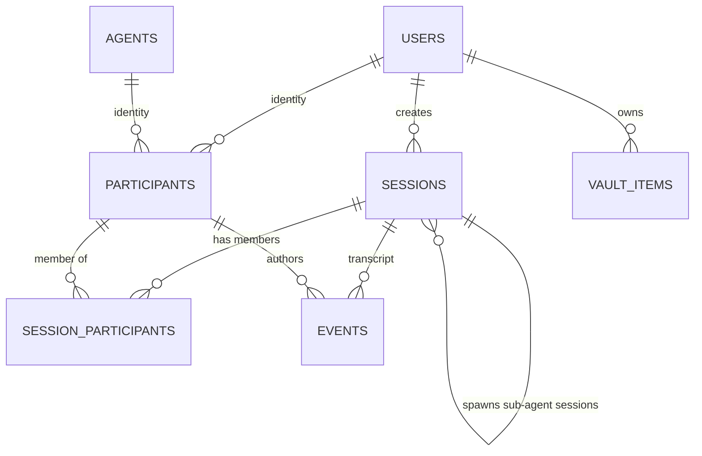

# Database Layer — Vector DB Adapter, SQLAlchemy ORM, Alembic Schema — Design

**Work item:** vector-db-schema-orm
**Branch:** `feature/vector-db-schema-orm` · **Draft PR:** [#84](https://github.com/Svagtlys/Octave/pull/84)
**Date:** 2026-09-13
**Status:** Approved in brainstorming 2026-09-13, revised same day to cut multi-agent orchestration out of scope (pending written-spec review)

**Scope summary:** the shipped schema supports exactly one runtime shape — **1 user + 1 agent chat** — plus durable vault and MCP-server storage. Multi-party / A2A / autonomous behavior is explicitly deferred (follow-up issue 3); the schema is designed so those can be added without re-modeling the transcript.

---

## Context

Octave's data layer is specified but unbuilt. [`architecture.md`](../context/architecture.md) names "SQLite with vec0 extension (default) or PostgreSQL with pgvector", Alembic migrations, and a single vector-capable database storing MCP server configs, context vault items with embeddings, conversation history, and agent run results. The ER model in [`data-flow.md`](../../docs/diagrams/data-flow.md) sketches `VAULT_ITEM` and tag/link tables.

This work item builds the persistence foundation: engine selection behind an adapter seam, SQLAlchemy ORM models, an Alembic migration chain, and the base tables — designed so that session/agent/A2A features that arrive in later work items do not require re-modeling.

### Requirements gathered during brainstorming

1. **Adapter-style engine abstraction**, mirroring the inference package (ABC + registry + import-string plugins); ship exactly one adapter (SQLite + vec0).
2. **Thin adapter**: adapter owns engine/session lifecycle, vector-store DDL, and similarity search. ORM models and the Alembic chain stay adapter-neutral; CRUD uses plain ORM sessions.
3. **Transcript vocabulary**: `sessions` + `events` (not `conversations` + `messages`) — non-conversational LLM runs exist (automations, agent runs), and transcript entries include tool calls/results, not just text.
4. **Multi-party sessions**: sub-agent runs are first-class sessions (tree lineage); participants can be users and/or agents; A2A and group conversations must remain *reachable* without re-modeling. **Behavior is out of scope** — this work item implements only 1-user + 1-agent chat.
5. **Table scope**: 8 tables now; tool caches, vault links/tags, and injection rules deferred to their consumer work items.
6. **Migration execution parity with the MCP package**: library + CLI tested via fixtures; **lifespan wiring and auto-migrate-on-startup deferred to a follow-up issue**.
7. **Embedding dimension**: config-driven (`OCTAVE_DB_EMBEDDING_DIM`, default 768), dim-suffixed virtual table (`vec_vault_items_<N>`), detect + drop/recreate at vector-store setup, re-embed left as a loud-`WARN` stub for the Context Manager work item.

---

## Decision 1 — Adapter seam (`octave.db`), inference-style

The inference package's pattern is "thick per-verb, narrow in surface": complete operations behind a small verb set, vendor types quarantined, errors translated at the boundary. The DB adapter replicates it.

| Inference (`octave.inference`) | Database (`octave.db`) |
|---|---|
| `AdapterConfig` / `InferenceSettings` (`OCTAVE_INFERENCE_*`) | `DbConfig` / `DatabaseSettings` (`OCTAVE_DB_*`) |
| `AdapterRegistry` + `@register` + `module.path:ClassName` plugins | `DbAdapterRegistry` + `@register_db` + import-string plugins |
| `InferenceAdapter` ABC: `complete/stream/embed/list_models` | `DbAdapter` ABC: engine/session lifecycle, vector store, search |
| OpenAI SDK quarantined to `openai_adapter.py` | `sqlite_vec` quarantined to `sqlite_adapter.py` |
| `octave.inference.errors` hierarchy | `octave.db.errors` hierarchy |

**`DbAdapter` ABC (the entire surface):**

```python
class DbAdapter(ABC):
    def __init__(self, config: DbConfig) -> None: ...

    @abstractmethod
    def make_engine(self) -> AsyncEngine:
        """Create the async engine for this config."""

    @abstractmethod
    def make_session_factory(self, engine: AsyncEngine) -> async_sessionmaker[AsyncSession]: ...

    @abstractmethod
    async def ensure_vector_store(self, session: AsyncSession, dim: int) -> None:
        """Create the vector index for `dim`; detect a stale/mismatched-dim
        index, drop and recreate it, logging WARN that vault re-embedding
        is pending. Idempotent."""

    @abstractmethod
    async def search_similar(
        self, session: AsyncSession, embedding: Sequence[float], *, limit: int
    ) -> list[VectorHit]:
        """Nearest neighbours over the vector store. VectorHit = (item_id, distance)."""

    @abstractmethod
    async def aclose(self) -> None: ...
```

**Registered now:** `"sqlite"` → `SqliteVecAdapter`. **Not built now:** a pgvector adapter — it will register itself via the import-string plugin path when its work item lands. No Postgres code, no Postgres CI, no compose service.

**Quarantine rule** (mirrors `octave.mcp`): only `octave/db/sqlite_adapter.py` may `import sqlite_vec`. No other module in the package touches vec0 SQL.

**Why not thicker:** wrapping per-table CRUD in repositories would re-abstract SQLAlchemy itself; the engine-neutral schema and ORM models already *are* the abstraction. Why not thinner (DSN factory only): that wouldn't match the inference pattern, and vector storage/search has to live somewhere.

## Decision 2 — Vocabulary: `sessions` / `events` / `participants`

- **`conversations` → `sessions`**: an LLM run thread is not necessarily a conversation (automations, autonomous agent runs), so the container is named for the general case. The shipped scope exercises exactly one shape: 1 user + 1 agent chat. A `mode` discriminator is **not** shipped — with no orchestration behavior to drive, it would be an unenforceable label, and the shapes it would name become derivable once a termination-authority column exists (deferred; see Non-goals and the rationale section).
- **`messages` → `events`**: transcript entries are typed (`kind`), not all text. `kind` is TEXT with app-level enum validation (no DB CHECK — the enum will grow; a CHECK would require ALTER TABLE per new kind). Integrity for `payload` lives in Pydantic models per kind.
- **Sub-agent runs are sessions**: `parent_session_id` self-FK for lineage. This replaces the would-be `agent_runs` table — the Agent Manager's result collector queries `sessions` + `events`. Spawning will also append a parent-side reference event once orchestration lands (issue 3); the lineage FK ships now, the event kind does not.
- **`participants` supertype over `users` and `agents`** (class-table inheritance): exactly one of `user_id`/`agent_id` non-null (DB CHECK + UNIQUE on each). Gives `events.author_participant_id` a single FK target; A2A is an event with `target_participant_id`.
- **`session_participants`** membership join: `role` (`speaker` | `observer`), `joined_at`, `left_at`. N humans + M agents is expressible with zero schema change.
- **Ownership ≠ participation**: `sessions.created_by_user_id NOT NULL` — one human owner (listing, cascade, backup scoping); participation is N via membership. Even autonomous sessions trace to a human owner; a NULL would be an orphaned-session bug, so NOT NULL is the fail-loud choice.

**Event kinds shipped as enum members:** `user_message`, `assistant_message`, `tool_call`, `tool_result`, `system`. Pydantic payload models ship for `user_message` and `assistant_message` (the kinds this work item exercises); the others pass through as validated JSON dicts.

**Extending the enum is free** — `kind` is TEXT with app-level validation and no DB CHECK, so a new kind costs one enum member plus one payload model, with **no migration**. That is why the list is kept minimal: there is no "add it later" penalty to dodge. Kinds that presuppose orchestration (`agent_run`, `agent_result`, `handoff`, `turn_assigned`) arrive with the Agent Manager work item.

**Deferred columns:** `events.turn_id`, `events.token_count`, per-event embeddings. `turn_id`/`token_count` would need an SQLite batch-mode table rebuild to add later, but they are speculative enough that accepting that cost now is the honest trade.

## Decision 3 — Schema: 8 tables + adapter-owned virtual table



All tables use `TEXT` primary keys (app-generated UUID4 hex) and UTC timezone-aware timestamps (`DateTime(timezone=True)`).

### `users`
| column | type | notes |
|---|---|---|
| `id` | TEXT PK | |
| `display_name` | TEXT NOT NULL | |
| `created_at` | TIMESTAMP NOT NULL | |

Deliberately minimal — preferences are `vault_items(kind=preference)` per [vault-separation ADR](../memory/decisions.md). This is an ownership anchor, not a profile.

### `agents`
| column | type | notes |
|---|---|---|
| `id` | TEXT PK | |
| `name` | TEXT NOT NULL | |
| `model_tag` | TEXT NULL | capability tag (`thinking`/`coding`/`quick`), tag-driven wiring principle |
| `status` | TEXT NOT NULL default `active` | `active | paused | terminated` (app-validated) |
| `created_at` | TIMESTAMP NOT NULL | |

### `participants`
| column | type | notes |
|---|---|---|
| `id` | TEXT PK | |
| `user_id` | TEXT FK users NULL | |
| `agent_id` | TEXT FK agents NULL | |
| `label` | TEXT NOT NULL | display name in sessions |

`CHECK ((user_id IS NULL) != (agent_id IS NULL))`; `UNIQUE(user_id)`; `UNIQUE(agent_id)` — one identity per entity.

### `sessions`
| column | type | notes |
|---|---|---|
| `id` | TEXT PK | |
| `created_by_user_id` | TEXT FK users NOT NULL | single owner (see Decision 2) |
| `parent_session_id` | TEXT FK sessions NULL | sub-agent lineage; NULL for top-level chat. Kept despite having no spawner yet — one nullable column now beats rebuilding `sessions` later |
| `status` | TEXT NOT NULL default `active` | `active | waiting | completed | failed | cancelled` (app-validated) |
| `title` | TEXT NULL | |
| `created_at` / `updated_at` | TIMESTAMP NOT NULL | |
| `ended_at` | TIMESTAMP NULL | terminal transition timestamp |

Indexes: `created_by_user_id`, `parent_session_id`.

No `mode`, `driver_participant_id`, or `turn_policy` column. Shipped termination is user-driven via the owner, so no authority column is needed; see the rationale section for the deferred design.

### `session_participants`
| column | type | notes |
|---|---|---|
| `session_id` | TEXT FK NOT NULL | composite PK |
| `participant_id` | TEXT FK NOT NULL | composite PK |
| `role` | TEXT NOT NULL | `speaker | observer` (app-validated) |
| `joined_at` | TIMESTAMP NOT NULL | |
| `left_at` | TIMESTAMP NULL | |

### `events`
| column | type | notes |
|---|---|---|
| `id` | TEXT PK | |
| `session_id` | TEXT FK NOT NULL | |
| `seq` | INTEGER NOT NULL | per-session monotonic; `UNIQUE(session_id, seq)`; gap-free ordering for replay/turn grouping |
| `kind` | TEXT NOT NULL | app-level enum (see Decision 2) |
| `author_participant_id` | TEXT FK participants NULL | NULL allowed for `system` events |
| `target_participant_id` | TEXT NULL | NULL = broadcast to the session; **always NULL in shipped scope** (1:1 chat has one possible addressee). Kept because adding a composite FK later requires an SQLite batch-mode rebuild of `events` |
| `payload` | JSON NOT NULL default `{}` | Pydantic-validated per kind in the app layer |
| `created_at` | TIMESTAMP NOT NULL | |

Index: `(session_id, seq)` unique.

### `mcp_servers`
| column | type | notes |
|---|---|---|
| `id` | TEXT PK | |
| `name` | TEXT NOT NULL UNIQUE | |
| `transport` | TEXT NOT NULL | `stdio | http` |
| `command` / `args` | TEXT NULL / JSON NULL | stdio fields |
| `url` | TEXT NULL | http field |
| `env` | JSON NULL | secrets — never logged; redact `***` per coding rules |
| `enabled` | BOOLEAN NOT NULL default true | |
| `created_at` / `updated_at` | TIMESTAMP NOT NULL | |

`CHECK` transport-shape: stdio requires `command`; http requires `url`.

### `vault_items`
| column | type | notes |
|---|---|---|
| `id` | TEXT PK | |
| `user_id` | TEXT FK NOT NULL | ownership + search scoping |
| `kind` | TEXT NOT NULL | `skill | prompt | preference | agent_state` (app-validated) |
| `name` | TEXT NOT NULL | |
| `content` | TEXT NOT NULL | **source of truth**; everything else derived |
| `metadata` | JSON NOT NULL default `{}` | tags live here for now (no `vault_tags` table) |
| `embedding` | BLOB NULL | little-endian float32; engine-neutral cache so the ORM can express the field on any engine |
| `embedding_model` | TEXT NULL | provenance |
| `embedding_dim` | INTEGER NULL | staleness detection against `OCTAVE_DB_EMBEDDING_DIM` |
| `created_at` / `updated_at` | TIMESTAMP NOT NULL | |

Index: `(user_id, kind)`. No `status`/archival column until the Context Manager defines archival semantics.

### `vec_vault_items_<N>` — adapter-private, not an ORM table

`CREATE VIRTUAL TABLE vec_vault_items_<N> USING vec0(...)` with the dim baked into the **table name**. Not Alembic-managed; owned entirely by `SqliteVecAdapter.ensure_vector_store`. Rowid ↔ `vault_items.id` mapping via a mapping column. Naming by dimension gives: trivial staleness detection ("does `vec_vault_items_1024` exist?"), old/new coexistence during rebuild without a rename dance, and zero relational-side churn.

## Decision 4 — Embedding dimension lifecycle

### Concurrency posture (multiple sources writing at once)

Sessions, agents, the vault, and MCP config will be written by several concurrent sources (chat, agents, background jobs). The shipped layer provides the mechanics, deliberately without policy:

- **Async + pooled access:** SQLAlchemy 2.0 async engine over `aiosqlite`; each session checks out its own connection, so concurrent coroutines interleave safely.
- **WAL + busy_timeout pragmas** (set on every SQLite connection by the adapter's bootstrap): readers never block the writer; colliding writers wait up to `busy_timeout` instead of immediately raising `SQLITE_BUSY`.
- **Fail-closed ordering:** `UNIQUE(session_id, seq)` means two concurrent appends racing for the same `seq` produce a loud `IntegrityError`, never a silently reordered transcript.

**Pinned pattern for the first event-append path (recorded so it isn't re-litigated later):** compute `seq = MAX(seq)+1` for the session **inside the same write transaction** as the insert, and retry the whole transaction on `IntegrityError` (bounded attempts). A `seq` computed outside the transaction is a race by construction.

`OCTAVE_DB_EMBEDDING_DIM` (default **768**, matching common Ollama embedders). Changing an embedding model's dimension is a full index rebuild — vec0/pgvector cannot pad or truncate; existing vectors are not semantically reusable. Because `vault_items.content` is canonical and re-embedding is a free local batch call, the rebuild procedure collapses to:

1. `ensure_vector_store(dim)` finds no virtual table at the configured dim but finds one at another dim → drop the stale table, create the new one, log `WARN` ("vault vector index rebuilt at dim N; re-embedding pending — <count> items unindexed").
2. Re-embed job: **out of scope** (no embedding pipeline exists yet). The WARN stub is the documented seam the Context Manager work item fills.

No re-embed scheduling, no blue/green cutover — single-user local SQLite has no mid-migration availability requirement.

## Decision 5 — Migrations, config, wiring

**Stack:** SQLAlchemy 2.0 (async; `aiosqlite` driver) + Alembic. The Alembic chain covers the 8 relational tables only (`Base.metadata`); virtual-table DDL is adapter-managed, keeping the chain adapter-neutral. Migrations run programmatically through a thin `octave.db.migrations.upgrade(engine_or_url)` wrapper over Alembic's command API (sync engine derived from config for migration time), plus the standard `alembic` CLI (`backend/alembic.ini`, `backend/src/octave/db/migrations/`).

**Initial migration:** one revision creating all 8 tables with constraints/indexes above. Future revisions via Alembic autogenerate against the models.

**Config (`octave.db.config`):** `DatabaseSettings(BaseSettings)`, env prefix `OCTAVE_DB_`, `.env`-backed like `InferenceSettings`:

| field | default |
|---|---|
| `engine` | `sqlite` |
| `url` | `sqlite+aiosqlite:///octave.db` |
| `embedding_dim` | `768` |
| `adapter` | `sqlite` (registry name or import string) |

`to_db_config()` projects a frozen `DbConfig` consumed by adapters/registry. (No `auto_migrate` flag yet — arrives with the lifespan issue.)

**DI seam (`octave.db.deps`):** `get_db_session()` FastAPI dependency resolving from `app.state.db_session_factory`, yielding a session with rollback-on-exception; unset state → 503. Exactly the `octave.mcp.deps` precedent — no lifespan wiring in this work item.

**Errors (`octave.db.errors`):** `DbError` base; `DbConfigError` (malformed config, pre-I/O), `DbMigrationError` (failed upgrade), `DbDimensionMismatchError` (search called with wrong-width vector). Vendor errors (`sqlite3`, `sqlite_vec`, SQLAlchemy) translate at the adapter boundary and never escape.

## Package layout

```
backend/src/octave/db/
  __init__.py          # public re-exports
  errors.py            # DbError hierarchy
  config.py            # DbConfig + DatabaseSettings (OCTAVE_DB_*)
  types.py             # VectorHit, EventKind enum, payload models
  adapter.py           # DbAdapter ABC
  registry.py          # DbAdapterRegistry, @register_db, default_registry
  sqlite_adapter.py    # SqliteVecAdapter — ONLY module importing sqlite_vec
  deps.py              # get_db_session() resolver (app.state)
  models/
    __init__.py        # Base + all model re-exports
    core.py            # users, agents, participants
    sessions.py        # sessions, session_participants, events
    mcp.py             # mcp_servers
    vault.py           # vault_items
  migrations/
    env.py, script.py.mako, versions/
backend/alembic.ini
```

## Testing

- **Fixtures:** temp-file SQLite database per test (independent, no shared state per coding rules); `upgrade()` run explicitly in the fixture.
- **`tests/db/test_config.py`, `test_errors.py`, `test_registry.py`** — mirror inference package tests (env parsing, hierarchy, duplicate registration, import-string plugins).
- **`tests/db/test_models.py`** — constraint enforcement against a real temp DB: participants exactly-one CHECK + uniqueness, transport-shape CHECK, composite FK (event targeting a non-member fails), `UNIQUE(session_id, seq)`, FK cascades.
- **`tests/db/test_migrations.py`** — `upgrade` from empty creates all 8 tables; idempotent re-run; alembic version stamped.
- **`tests/db/test_sqlite_adapter.py`** — `ensure_vector_store` idempotent; dim change drops/recreates (old table gone, new exists, WARN logged); `search_similar` returns correctly ranked known vectors; wrong-dim query → `DbDimensionMismatchError`.
- **`tests/db/conformance.py`** — reusable `DbAdapter` conformance suite (mirrors `tests/inference/conformance.py`) so future adapters run the same contract tests.
- **`tests/test_db_deps.py`** — resolver: `dependency_overrides`, unset state → 503, rollback-on-exception.
- **Spike gate (Task 1):** verify `sqlite-vec` loads under `aiosqlite` via SQLAlchemy connect-event listener before schema work proceeds; if the seam drifts, STOP and revise.
- **Spike gate (Task 1):** verify Alembic autogenerate against `Base.metadata` emits the CHECK/composite-FK constraints (they may need hand-editing into the revision — expected, documented).
- Gates per task: `uv run pytest -q`, `uv run ruff check src tests`, `uv run mypy src`.

## Dependencies added

`pyproject.toml` runtime: `sqlalchemy[asyncio]>=2.0`, `aiosqlite`, `alembic`, `sqlite-vec`. Versions pinned by Task 1 spike (same discipline as the `mcp` SDK pin).

## Documentation updates

- `docs/ARCHITECTURE.md` + `.agents/context/architecture.md` — Data Layer section reflects adapter design and sessions/events vocabulary.
- `docs/diagrams/data-flow.md` — replace the `VAULT_ITEM`-only ER sketch with the shipped ER model (vault_items retained; sessions/events/participants added; `tool_tag`/`model_tag`/`skill_link` marked as planned).
- `.agents/memory/decisions.md` — two ADRs: (1) adapter-style DB engine seam, SQLite+vec0 first; (2) sessions/events/participants transcript vocabulary with ownership-vs-participation split.

## Follow-up issues (created via `create-work-item` during execution)

1. **Wire DB lifespan + auto-migrate on startup** — FastAPI lifespan builds adapter from `DatabaseSettings`, runs `upgrade()`, `ensure_vector_store()`, stores session factory on `app.state`; `OCTAVE_DB_AUTO_MIGRATE` (default true) gates startup migration; health endpoint reports DB status. *Blocked by this PR.*
2. **Multi-user vault visibility** — if a session ever has 2+ humans, vector-search scoping of `vault_items.user_id` risks cross-user context injection. Record as a known constraint now; design when multi-user enters scope.
3. **Multi-agent orchestration & session control** — sub-agent spawning, turn arbitration, termination authority. Adds `sessions.driver_participant_id` (nullable, composite FK to `session_participants`, NULL = owner-driven), `sessions.turn_policy` (`round_robin | llm_select | supervisor | handoff`), optional turn cursor and budget columns, and the `agent_run` / `agent_result` / `handoff` / `turn_assigned` event kinds. Design rationale preserved in the section below. *Blocked by this PR.*

## Non-goals (this work item)

- Lifespan wiring / auto-migration at startup (issue 1 above).
- pgvector adapter, Postgres CI, compose Postgres service.
- Re-embed/reindex job (WARN stub only).
- `tools`, `tool_tags`, `skill_links`, `model_tags`, `injection_rules` tables — additive migrations in their consumer work items.
- Embedding pipeline / Context Manager logic.
- **Multi-agent orchestration** (issue 3 above): `sessions.mode`, `sessions.driver_participant_id`, `sessions.turn_policy`, turn cursors, budget/limit columns, and the `agent_run` / `agent_result` / `handoff` / `turn_assigned` event kinds. The shipped schema is designed not to block them; none of their behavior is built.
- A2A routing, autonomous termination, group addressing — no code paths and no tests beyond constraint existence.
- `events.turn_id`, `events.token_count`.
- Health endpoint changes.
- **SQLite write-contention policy:** no retry-on-busy helper, no optimistic-locking (`version_id`) columns, no application-level single-writer queue. The pragmas and constraints in "Concurrency posture" make contention *safe*; contention *policy* is deferred until a real write path exists to design against (first candidate: the event-append helper, which must follow the pinned `seq` transaction pattern).

## Design rationale for the deferred orchestration set

Preserved from design discussion so the follow-up work item does not re-derive it.

- **Termination authority and turn-taking are two separate axes.** `driver_participant_id` answers "who may end this session"; `turn_policy` answers "how is the next speaker chosen". They coincide in the supervisor pattern and diverge in round-robin, so neither subsumes the other.
- **`mode` is not derivable from participants alone** — 2+ humans with 2+ agents under a user driver is a group, and one agent with a user *observer* is autonomous, yet both can look identical by membership counts. It **becomes** derivable once a termination-authority column exists, which is why `mode` is dropped rather than deferred: it is a display label over facts the later work item will store anyway.
- **A2A (Agent2Agent, now under the Linux Foundation) does not model group conversations.** It is point-to-point client→remote-agent task delegation: Agent Card discovery, `message/send` / `tasks/send`, a task lifecycle (`submitted` / `working` / `input-required` / `completed` / `failed` / `canceled` / `rejected`), SSE or push-notification streaming, `referenceTaskIds` linking. No room, shared transcript, or speaker-selection concept — three "group" members would be three pairwise relationships plus an external transcript-holder. MCP likewise has no multi-agent semantics. Verify against the live A2A spec before building on this.
- **Frameworks implement speaker selection as application-level pluggable policy**, confirming it is not protocol-provided: AutoGen/AG2 `GroupChatManager` (round-robin, LLM `SelectorGroupChat`, `SocietyOfMind`); MS Agent Framework `GroupChatPolicy`; LangGraph control-flow edges plus `langgraph-supervisor` / `langgraph-swarm` with durable checkpoints; OpenAI Agents SDK handoffs; CrewAI sequential vs hierarchical. The four collapsed patterns are round-robin, LLM-moderated selection, supervisor, and handoff/swarm.
- **Octave's `events` table plus the Context Vault already form a blackboard**, with `session_participants.role = 'speaker'` encoding eligibility — so the later work item needs a policy and a cursor, not new storage.
- **A runaway-loop backstop is mandatory** in any autonomous or A2A design: semantic completion (driver declares the goal met), convergence (emergent, no further action), and budget (turn / token / wall-clock) layer together; convergence alone is unreliable, since two agents can agree with each other indefinitely.
- **A2A would arrive as a transport/adapter, not as schema**, consistent with the MCP-as-abstraction ADR. This work item's only obligation is not to block it.
