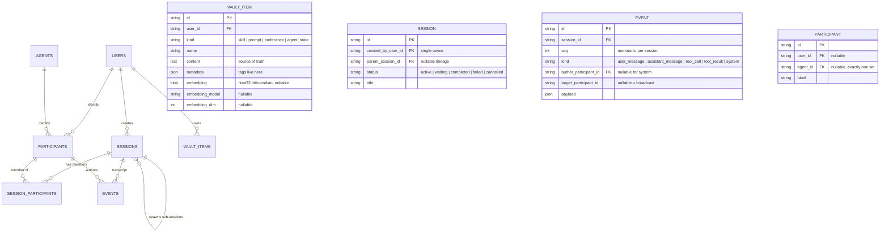

# Database Layer (Vector DB Adapter, SQLAlchemy ORM, Alembic Schema) Implementation Plan

> **For agentic workers:** REQUIRED SUB-SKILL: Use subagent-driven-development (recommended) or executing-plans to implement this plan task-by-task. Steps use checkbox (`- [ ]`) syntax for tracking.

**Goal:** Build the `octave.db` package — an adapter-seamed, vector-capable persistence layer (SQLAlchemy 2.0 async + Alembic + SQLite/vec0) with eight relational tables — so later features (chat, vault, MCP config, agents) share one schema and one engine seam.

**Architecture:** `octave.db` mirrors `octave.inference`: a `DbAdapter` ABC plus a name/import-string registry, with the `sqlite-vec` dependency quarantined to `sqlite_adapter.py`. The eight ORM models and the single Alembic revision are adapter-neutral; the vec0 virtual table (`vec_vault_items_<N>`) is adapter-private and **not** Alembic-managed. A `get_db_session()` resolver proves the DI seam only — no lifespan wiring (deferred to follow-up issue 1).

**Tech Stack:** Python 3.12, SQLAlchemy 2.0 (async, `aiosqlite`), Alembic, `sqlite-vec`, pydantic v2 + pydantic-settings, FastAPI (resolver only). Tests: pytest (`asyncio_mode = "auto"` — no markers needed), real temp-file SQLite databases. ruff, mypy strict. **All commands run from `backend/` unless stated otherwise.**

**Spec:** [`.agents/specs/2026-09-13-vector-db-schema-orm-design.md`](2026-09-13-vector-db-schema-orm-design.md) — approved 2026-09-13 (scope-cut revision).
**Branch:** `feature/vector-db-schema-orm` · **Draft PR:** [#84](https://github.com/Svagtlys/Octave/pull/84)

---

## Scope guardrails (read before starting)

- Shipped runtime shape is **1 user + 1 agent chat**. No orchestration behavior: no `sessions.mode`, no `driver_participant_id`, no `turn_policy`, no `agent_run`/`handoff` event kinds. Do not add them; the spec's "Design rationale for the deferred orchestration set" preserves the reasoning.
- No PostgreSQL, no pgvector adapter, no compose service, no CI matrix entry.
- No lifespan wiring, no auto-migrate on startup, no `/api/health` changes. `migrations.upgrade()` ships as a tested callable only.
- No re-embed job. `ensure_vector_store` drops/recreates a stale-dimension index and logs `WARN`.
- Logging follows [`.agents/rules/coding.md`](../rules/coding.md): the formatter supplies level/correlation id/module; log messages must never contain secrets (`mcp_servers.env` values → `***`).
- Concurrency posture (spec "Concurrency posture"): WAL + `busy_timeout` pragmas make concurrent writers *safe* (SQLite serializes them; collisions wait, then raise `SQLITE_BUSY` as `OperationalError`). Contention *policy* — retry-on-busy helpers, optimistic locking, seq-append retry helper — is deferred until a write path exists. The first event-append implementation MUST compute `seq = MAX(seq)+1` inside the same write transaction as the insert and retry the transaction on `IntegrityError`; never compute `seq` outside the transaction.

## Concurrency posture (multiple sources writing at once)

Sessions, agents, the vault, and MCP config will be written by several concurrent sources (chat, agents, background jobs). The shipped layer provides the mechanics, deliberately without policy:

- **Async + pooled access:** SQLAlchemy 2.0 async engine over `aiosqlite`; each session checks out its own connection, so concurrent coroutines interleave safely.
- **WAL + busy_timeout pragmas** (set on every SQLite connection by the adapter's bootstrap): readers never block the writer; colliding writers wait up to `busy_timeout` instead of immediately raising `SQLITE_BUSY`.
- **Fail-closed ordering:** `UNIQUE(session_id, seq)` means two concurrent appends racing for the same `seq` produce a loud `IntegrityError`, never a silently reordered transcript.

**Pinned pattern for the first event-append path:** compute `seq = MAX(seq)+1` for the session **inside the same write transaction** as the insert, and retry the whole transaction on `IntegrityError` (bounded attempts). A `seq` computed outside the transaction is a race by construction.

## File Map

| Action | File | Purpose |
|--------|------|---------|
| Create | `.agents/specs/2026-09-13-vector-db-schema-orm-design.md` | (already written) committed in Task 0 |
| Modify | `pyproject.toml` | Add `sqlalchemy[asyncio]`, `aiosqlite`, `alembic`, `sqlite-vec`; pin by spike |
| Create | `src/octave/db/__init__.py` | Public re-exports |
| Create | `src/octave/db/errors.py` | `DbError` hierarchy — vendor errors never escape |
| Create | `src/octave/db/config.py` | `DbConfig` + `DatabaseSettings` (`OCTAVE_DB_*`) + `sync_url` |
| Create | `src/octave/db/types.py` | `EventKind`, `VectorHit`, payload models |
| Create | `src/octave/db/adapter.py` | `DbAdapter` ABC (lifecycle + vector-store verbs) |
| Create | `src/octave/db/registry.py` | `DbAdapterRegistry`, `@register_db`, `default_registry` |
| Create | `src/octave/db/_bootstrap.py` | SQLite connect hook: `sqlite_vec` load + pragmas |
| Create | `src/octave/db/sqlite_adapter.py` | `SqliteVecAdapter` — **only module importing `sqlite_vec` for queries** |
| Create | `src/octave/db/migrations/__init__.py` | `upgrade(url)` / `current(url)` over Alembic's command API (lives in the package `__init__` — a sibling `migrations.py` module would be shadowed by the package) |
| Create | `src/octave/db/deps.py` | `get_db_session()` resolver (`app.state.db_session_factory`) |
| Create | `src/octave/db/models/__init__.py` | `Base`, `utcnow`, re-export all models |
| Create | `src/octave/db/models/core.py` | `User`, `Agent`, `Participant` |
| Create | `src/octave/db/models/sessions.py` | `Session`, `SessionParticipant`, `Event` |
| Create | `src/octave/db/models/mcp.py` | `McpServer` |
| Create | `src/octave/db/models/vault.py` | `VaultItem` |
| Create | `alembic.ini` | Alembic CLI config (`script_location` → package) |
| Create | `src/octave/db/migrations/env.py`, `script.py.mako` | Alembic environment (sync engine) |
| Create | `src/octave/db/migrations/versions/<rev>_initial_schema.py` | One revision: all 8 tables |
| Create | `tests/db/__init__.py`, `conftest.py` | Test package; temp-DB + adapter fixtures |
| Create | `tests/db/test_errors.py`, `test_config.py`, `test_types.py`, `test_registry.py` | Unit tests |
| Create | `tests/db/test_models.py` | Constraint enforcement on a real temp DB |
| Create | `tests/db/test_migrations.py` | `upgrade()`/`current()` + migration↔model schema equivalence |
| Create | `tests/db/test_sqlite_adapter.py` | Vector store lifecycle, dim change, search |
| Create | `tests/db/conformance.py` | Reusable `DbAdapter` conformance suite |
| Create | `tests/test_db_deps.py` | Resolver: override, unset → 503, rollback |
| Modify | `../docs/ARCHITECTURE.md`, `../.agents/context/architecture.md` | Data Layer section |
| Modify | `../docs/diagrams/data-flow.md` | Replace ER sketch with shipped model |
| Modify | `../.agents/memory/decisions.md` | Two ADRs |

Task dependency order:


Commit messages follow `type(scope): description` with scope `db`.

---

## Task 0: Commit the approved design and this plan

**Files:**
- Add: `../.agents/specs/2026-09-13-vector-db-schema-orm-design.md`
- Add: `../.agents/specs/2026-09-13-vector-db-schema-orm.md`

- [ ] **Step 1: Confirm branch**

Run: `git branch --show-current`
Expected: `feature/vector-db-schema-orm`. If not, run `git fetch origin && git checkout feature/vector-db-schema-orm`.

- [ ] **Step 2: Commit**

```bash
cd .. && git add .agents/specs/2026-09-13-vector-db-schema-orm-design.md .agents/specs/2026-09-13-vector-db-schema-orm.md
git commit -m "docs(db): add database layer design and implementation plan"
git push
```

- [ ] **Step 3: Return to `backend/` for all remaining tasks**

Run: `cd backend && pwd`
Expected: path ending in `/backend`.

---

## Task 1: Dependencies and spike gates

Two unknowns must be proven before any schema code is written, because both would invalidate later tasks: (a) `sqlite-vec` loading under `aiosqlite` through SQLAlchemy, (b) Alembic autogenerate fidelity for CHECK/composite-FK constraints.

**Files:**
- Modify: `pyproject.toml:6-18`
- Create: `src/octave/db/__init__.py`
- Create: `tests/db/__init__.py`

- [ ] **Step 1: Add runtime dependencies (provisional constraints)**

In `pyproject.toml`, replace the `dependencies` block:

```toml
dependencies = [
    "fastapi>=0.115.0",
    # Spike in Task 1 Step 3 pins the resolved version; the SDK moves fast and
    # streamablehttp_client + memory-stream test helpers must exist.
    # <2.0.0: SDK 2.x renamed streamablehttp_client and moved its wire layer to
    # the httpx2 fork; this plan targets the 1.x API.
    "mcp>=1.30.0,<2.0.0",
    # <3.0: SDK 3.x switched its wire layer to the `httpx2` fork, breaking the
    # injected-httpx-client test seam the adapter relies on.
    "openai>=2.0.0,<3.0.0",
    "pydantic-settings>=2.0.0",
    "uvicorn[standard]>=0.34.0",
]
```

with:

```toml
dependencies = [
    "alembic>=1.14.0",
    "aiosqlite>=0.20.0",
    "fastapi>=0.115.0",
    # Spike in Task 1 Step 3 pins the resolved version; the SDK moves fast and
    # streamablehttp_client + memory-stream test helpers must exist.
    # <2.0.0: SDK 2.x renamed streamablehttp_client and moved its wire layer to
    # the httpx2 fork; this plan targets the 1.x API.
    "mcp>=1.30.0,<2.0.0",
    # <3.0: SDK 3.x switched its wire layer to the `httpx2` fork, breaking the
    # injected-httpx-client test seam the adapter relies on.
    "openai>=2.0.0,<3.0.0",
    "pydantic-settings>=2.0.0",
    # vec0 vector index for SQLite. Pinned by the Task 1 spike: the vec0 KNN
    # syntax and serialize_float32 helper are relied on in sqlite_adapter.py.
    "sqlite-vec>=0.1.6",
    # async engine + 2.0 typed ORM declarative base.
    "sqlalchemy[asyncio]>=2.0.36",
    "uvicorn[standard]>=0.34.0",
]
```

- [ ] **Step 2: Install**

Run: `uv sync --extra dev`
Expected: resolves and installs `alembic`, `aiosqlite`, `sqlite-vec`, `sqlalchemy`; `uv.lock` updated (committed in Step 7).

- [ ] **Step 3: Spike A — sqlite-vec under aiosqlite via SQLAlchemy async engine**

Run:

```bash
uv run python - <<'PY'
import asyncio
import sqlite_vec
from sqlalchemy import event, text
from sqlalchemy.ext.asyncio import create_async_engine

print("sqlite-vec", sqlite_vec.__version__)


def unwrap(dbapi_connection):  # noqa: ANN001, ANN202
    """Walk SQLAlchemy/aiosqlite proxies down to the raw sqlite3 connection.

    AsyncAdapt wrapper -> _connection (aiosqlite.Connection) -> _conn
    (sqlite3.Connection, the only one with enable_load_extension).
    """
    conn = dbapi_connection
    for attr in ("driver_connection", "_connection", "_conn"):
        inner = getattr(conn, attr, None)
        if inner is not None and inner is not conn:
            conn = inner
    assert hasattr(conn, "enable_load_extension"), f"unwrapped to {conn!r}"
    return conn


async def main() -> None:
    engine = create_async_engine("sqlite+aiosqlite:///:memory:")

    @event.listens_for(engine.sync_engine, "connect")
    def _load(dbapi_connection, _record):  # noqa: ANN001
        raw = unwrap(dbapi_connection)
        raw.enable_load_extension(True)
        sqlite_vec.load(raw)
        raw.enable_load_extension(False)

    async with engine.connect() as conn:
        version = (await conn.execute(text("SELECT vec_version()"))).scalar_one()
        print("SPIKE_A_VEC_VERSION", version)
        await conn.execute(
            text("CREATE VIRTUAL TABLE t USING vec0(item_id TEXT PRIMARY KEY, "
                 "embedding float[3] distance_metric=cosine)")
        )
        await conn.execute(
            text("INSERT INTO t(item_id, embedding) VALUES ('a', :v)"),
            {"v": sqlite_vec.serialize_float32([1.0, 0.0, 0.0])},
        )
        rows = (
            await conn.execute(
                text("SELECT item_id, distance FROM t "
                     "WHERE embedding MATCH :q AND k = 1 ORDER BY distance"),
                {"q": sqlite_vec.serialize_float32([0.9, 0.1, 0.0])},
            )
        ).all()
        print("SPIKE_A_KNN", rows)
        assert rows and rows[0][0] == "a", "KNN returned nothing"
    await engine.dispose()
    print("SPIKE_A_OK")


asyncio.run(main())
PY
```

Expected: prints `SPIKE_A_VEC_VERSION v0.1.x`, `SPIKE_A_KNN [('a', ...)]`, `SPIKE_A_OK`.

**If it raises** (`AttributeError` on `enable_load_extension`, threading `ProgrammingError`, or "extension loading disabled"): the `_conn` unwrap does not work on this SQLAlchemy version. Use **Variant B** for the rest of the plan — build the async engine with an `async_creator` (full code given in Task 11 Step 3/4) and note the choice in the Task 11 commit message. Do **not** proceed on a half-working hook.

- [ ] **Step 4: Spike B — Alembic autogenerate constraint fidelity**

Run:

```bash
uv run python - <<'PY'
from alembic.autogenerate import compare_metadata
from alembic.runtime.migration import MigrationContext
from sqlalchemy import (CheckConstraint, Column, ForeignKeyConstraint, MetaData,
                        Table, Text, create_engine)

md = MetaData()
Table("parent", md, Column("id", Text, primary_key=True))
Table(
    "child", md,
    Column("pid", Text),
    Column("other", Text),
    ForeignKeyConstraint(["pid", "other"], ["parent.id", "parent.id"],
                         name="fk_child_parent"),
    CheckConstraint("pid IS NOT NULL", name="ck_child"),
)
engine = create_engine("sqlite://")
md.create_all(engine)
with engine.connect() as conn:
    diff = compare_metadata(MigrationContext.configure(conn), md)
print("SPIKE_B_DIFF", diff)
print("SPIKE_B_HAS_CREATE_TABLE",
      any("CREATE TABLE" in str(d) for d in diff))
PY
```

Expected: prints a diff list. Record whether `CreateTableOp` renders the `CheckConstraint` and `ForeignKeyConstraint`.

**Interpretation:** if autogenerate omits either constraint type, the initial revision in Task 10 **must be hand-edited** to add them — Task 10 Step 1's schema-equivalence test is the backstop that catches any omission either way. Write the observed result into the Task 10 commit message.

- [ ] **Step 5: Pin the resolved versions**

Run: `uv run python -c "import sqlalchemy, sqlite_vec, alembic; print(sqlalchemy.__version__, sqlite_vec.__version__, alembic.__version__)"`

Replace the floor of each new constraint in `pyproject.toml` with the printed versions (e.g. `"sqlalchemy[asyncio]>=2.0.41"`), then re-run `uv sync --extra dev` and confirm it resolves.

- [ ] **Step 6: Create the package skeletons**

`src/octave/db/__init__.py`:

```python
"""Octave persistence layer — adapter-seamed, vector-capable storage.

Quarantine rule (see design spec): only ``sqlite_adapter.py`` and
``_bootstrap.py`` touch ``sqlite_vec`` / SQLite extension loading. Everything
else here is engine-neutral SQLAlchemy + Alembic.
"""
```

`tests/db/__init__.py`:

```python
"""Tests for the Octave persistence layer."""
```

- [ ] **Step 7: Verify nothing broke, then commit**

Run: `uv run pytest -q`
Expected: all pre-existing tests pass.

Run: `uv run ruff check src tests && uv run mypy src`
Expected: no errors.

```bash
git add pyproject.toml uv.lock src/octave/db/__init__.py tests/db/__init__.py
git commit -m "chore(db): add sqlalchemy, alembic and sqlite-vec dependencies"
```

---

## Task 2: Exception hierarchy (`errors.py`)

**Files:**
- Create: `src/octave/db/errors.py`
- Test: `tests/db/test_errors.py`

- [ ] **Step 1: Write the failing test**

`tests/db/test_errors.py`:

```python
"""The Octave DB exception hierarchy — callers only ever catch these."""

from octave.db.errors import (
    DbAdapterLoadError,
    DbAdapterRegistrationError,
    DbConfigError,
    DbDimensionMismatchError,
    DbError,
    DbMigrationError,
    UnknownDbAdapterError,
)


def test_all_errors_subclass_base() -> None:
    for cls in (
        DbConfigError,
        DbMigrationError,
        DbDimensionMismatchError,
        DbAdapterRegistrationError,
        DbAdapterLoadError,
        UnknownDbAdapterError,
    ):
        assert issubclass(cls, DbError)


def test_dimension_mismatch_carries_dims() -> None:
    err = DbDimensionMismatchError(expected=768, actual=1024)
    assert err.expected == 768
    assert err.actual == 1024
    assert "768" in str(err) and "1024" in str(err)


def test_unknown_adapter_lists_known_names() -> None:
    err = UnknownDbAdapterError("pgvector", ["sqlite"])
    assert err.name == "pgvector"
    assert err.known == ["sqlite"]
    assert "sqlite" in str(err)
```

- [ ] **Step 2: Run test to verify it fails**

Run: `uv run pytest tests/db/test_errors.py -v`
Expected: FAIL — `ModuleNotFoundError: No module named 'octave.db.errors'`

- [ ] **Step 3: Write minimal implementation**

`src/octave/db/errors.py`:

```python
"""Octave DB exception hierarchy.

Vendor exceptions (``sqlite3``, ``sqlite_vec``, SQLAlchemy, Alembic) must
never escape ``octave.db``; they are translated at the adapter/migration
boundary. Same fail-loud philosophy as ``octave.inference.errors`` and
``octave.mcp.errors``.
"""

from collections.abc import Iterable

__all__ = [
    "DbAdapterLoadError",
    "DbAdapterRegistrationError",
    "DbConfigError",
    "DbDimensionMismatchError",
    "DbError",
    "DbMigrationError",
    "UnknownDbAdapterError",
]


class DbError(Exception):
    """Base class for every persistence-layer failure."""


class DbConfigError(DbError):
    """Configuration is malformed (raised before any I/O)."""


class DbMigrationError(DbError):
    """An Alembic migration failed to apply."""


class DbDimensionMismatchError(DbError):
    """A vector was stored or queried at the wrong width.

    vec0/pgvector cannot pad or truncate, so this is a hard error rather than
    something to repair silently: the caller must re-embed.
    """

    def __init__(self, *, expected: int, actual: int) -> None:
        super().__init__(
            f"embedding has {actual} dimensions, but the vector store "
            f"is indexed at {expected}; re-embed before searching"
        )
        self.expected = expected
        self.actual = actual


class DbAdapterRegistrationError(DbError):
    """An adapter name is already registered."""


class DbAdapterLoadError(DbError):
    """An import-string adapter could not be loaded."""


class UnknownDbAdapterError(DbError):
    """No adapter is registered under the requested name."""

    def __init__(self, name: str, known: Iterable[str]) -> None:
        self.name = name
        self.known = sorted(known)
        super().__init__(f"unknown db adapter {name!r}; known adapters: {self.known}")
```

- [ ] **Step 4: Run test to verify it passes**

Run: `uv run pytest tests/db/test_errors.py -v`
Expected: 3 passed.

- [ ] **Step 5: Commit**

```bash
git add src/octave/db/errors.py tests/db/test_errors.py
git commit -m "feat(db): add Octave DB exception hierarchy"
```

---

## Task 3: Configuration (`config.py`)

**Files:**
- Create: `src/octave/db/config.py`
- Test: `tests/db/test_config.py`

- [ ] **Step 1: Write the failing test**

`tests/db/test_config.py`:

```python
"""Env-backed DB settings and the frozen adapter-facing config."""

import pytest
from pydantic import ValidationError

from octave.db.config import DbConfig, DatabaseSettings


def test_defaults_are_local_sqlite(monkeypatch: pytest.MonkeyPatch) -> None:
    for var in ("OCTAVE_DB_URL", "OCTAVE_DB_EMBEDDING_DIM", "OCTAVE_DB_ADAPTER"):
        monkeypatch.delenv(var, raising=False)
    settings = DatabaseSettings(_env_file=None)
    assert settings.adapter == "sqlite"
    assert settings.url == "sqlite+aiosqlite:///octave.db"
    assert settings.embedding_dim == 768


def test_reads_octave_db_env_vars(monkeypatch: pytest.MonkeyPatch) -> None:
    monkeypatch.setenv("OCTAVE_DB_URL", "sqlite+aiosqlite:///elsewhere.db")
    monkeypatch.setenv("OCTAVE_DB_EMBEDDING_DIM", "1024")
    monkeypatch.setenv("OCTAVE_DB_ADAPTER", "pgvector")
    settings = DatabaseSettings(_env_file=None)
    assert settings.url == "sqlite+aiosqlite:///elsewhere.db"
    assert settings.embedding_dim == 1024
    assert settings.adapter == "pgvector"


def test_embedding_dim_must_be_positive(monkeypatch: pytest.MonkeyPatch) -> None:
    monkeypatch.setenv("OCTAVE_DB_EMBEDDING_DIM", "0")
    with pytest.raises(ValidationError):
        DatabaseSettings(_env_file=None)


def test_to_db_config_projects_fields(monkeypatch: pytest.MonkeyPatch) -> None:
    monkeypatch.setenv("OCTAVE_DB_EMBEDDING_DIM", "512")
    config = DatabaseSettings(_env_file=None).to_db_config()
    assert config == DbConfig(
        adapter="sqlite",
        url="sqlite+aiosqlite:///octave.db",
        embedding_dim=512,
    )


def test_sync_url_strips_async_driver() -> None:
    config = DbConfig(
        adapter="sqlite", url="sqlite+aiosqlite:///octave.db", embedding_dim=768
    )
    assert config.sync_url == "sqlite:///octave.db"


def test_sync_url_rejects_non_sqlite() -> None:
    config = DbConfig(
        adapter="pgvector",
        url="postgresql+asyncpg://localhost/octave",
        embedding_dim=768,
    )
    with pytest.raises(NotImplementedError):
        config.sync_url


def test_config_is_frozen() -> None:
    config = DbConfig(
        adapter="sqlite", url="sqlite+aiosqlite:///:memory:", embedding_dim=4
    )
    with pytest.raises((AttributeError, TypeError)):
        config.embedding_dim = 8  # type: ignore[misc]
```

- [ ] **Step 2: Run test to verify it fails**

Run: `uv run pytest tests/db/test_config.py -v`
Expected: FAIL — `ModuleNotFoundError: No module named 'octave.db.config'`

- [ ] **Step 3: Write minimal implementation**

`src/octave/db/config.py`:

```python
"""Database configuration.

Two layers, mirroring ``octave.inference.config``: ``DbConfig`` is what the
registry and adapters consume — frozen, safe to share. ``DatabaseSettings`` is
env-backed bootstrap config (``OCTAVE_DB_*`` vars / ``.env``).

No secret material lives here; ``mcp_servers.env`` secrets are rows, not config.
"""

from dataclasses import dataclass

from pydantic import Field
from pydantic_settings import BaseSettings, SettingsConfigDict

__all__ = ["DbConfig", "DatabaseSettings"]


@dataclass(frozen=True)
class DbConfig:
    """Everything an adapter needs to connect. Frozen; safe to share."""

    adapter: str
    """Registered adapter name or a ``module.path:ClassName`` import string."""

    url: str
    """Async SQLAlchemy URL, e.g. ``sqlite+aiosqlite:///octave.db``."""

    embedding_dim: int
    """Width of the vector index this deployment expects."""

    @property
    def sync_url(self) -> str:
        """Sync mirror of ``url`` for Alembic, which drives a sync engine.

        Only SQLite is implemented; a future pgvector adapter adds its own
        driver mapping rather than a string substitution.
        """
        if self.url.startswith("sqlite+aiosqlite://"):
            return self.url.replace("sqlite+aiosqlite://", "sqlite://", 1)
        raise NotImplementedError(
            f"sync_url is only derived for sqlite URLs, got {self.url!r}"
        )


class DatabaseSettings(BaseSettings):
    """Env-backed bootstrap config (``OCTAVE_DB_*`` vars / ``.env``)."""

    model_config = SettingsConfigDict(
        env_prefix="OCTAVE_DB_",
        env_file=".env",
        env_file_encoding="utf-8",
        extra="ignore",
    )

    adapter: str = "sqlite"
    url: str = "sqlite+aiosqlite:///octave.db"
    embedding_dim: int = Field(default=768, gt=0)

    def to_db_config(self) -> DbConfig:
        """Project these settings into the adapter-facing config object."""
        return DbConfig(
            adapter=self.adapter,
            url=self.url,
            embedding_dim=self.embedding_dim,
        )
```

- [ ] **Step 4: Run test to verify it passes**

Run: `uv run pytest tests/db/test_config.py -v`
Expected: 7 passed.

- [ ] **Step 5: Commit**

```bash
git add src/octave/db/config.py tests/db/test_config.py
git commit -m "feat(db): add env-backed database configuration"
```

---

## Task 4: Domain types (`types.py`)

**Files:**
- Create: `src/octave/db/types.py`
- Test: `tests/db/test_types.py`

- [ ] **Step 1: Write the failing test**

`tests/db/test_types.py`:

```python
"""Octave DB domain types — event kinds, vector hits, payload models."""

import pytest
from pydantic import ValidationError

from octave.db.types import (
    AssistantMessagePayload,
    EventKind,
    UserMessagePayload,
    VectorHit,
)


def test_event_kind_wire_values() -> None:
    assert EventKind.USER_MESSAGE == "user_message"
    assert EventKind.ASSISTANT_MESSAGE == "assistant_message"
    assert EventKind.TOOL_CALL == "tool_call"
    assert EventKind.TOOL_RESULT == "tool_result"
    assert EventKind.SYSTEM == "system"


def test_event_kind_rejects_unknown_value() -> None:
    with pytest.raises(ValueError):
        EventKind("agent_run")


def test_event_kind_revalidates_stored_text() -> None:
    """``events.kind`` is TEXT in the DB; the enum is the app-level guard."""
    assert EventKind(EventKind.USER_MESSAGE.value) is EventKind.USER_MESSAGE


def test_vector_hit_carries_id_and_distance() -> None:
    hit = VectorHit(item_id="v_1", distance=0.125)
    assert hit.item_id == "v_1"
    assert hit.distance == 0.125


def test_message_payloads_require_content() -> None:
    assert UserMessagePayload(content="hi").content == "hi"
    assert AssistantMessagePayload(content="yo").content == "yo"
    with pytest.raises(ValidationError):
        UserMessagePayload()  # type: ignore[call-arg]


def test_assistant_payload_model_is_optional() -> None:
    assert AssistantMessagePayload(content="x").model_name is None
```

- [ ] **Step 2: Run test to verify it fails**

Run: `uv run pytest tests/db/test_types.py -v`
Expected: FAIL — `ModuleNotFoundError: No module named 'octave.db.types'`

- [ ] **Step 3: Write minimal implementation**

`src/octave/db/types.py`:

```python
"""Octave DB domain types.

``events.kind`` and ``sessions.status`` are TEXT columns: the enums here are
the app-level validation layer. A DB ``CHECK`` would force an ``ALTER TABLE``
(a table rebuild on SQLite) for every new kind, so the enum is deliberately
the single source of truth and grows freely.

Only the two message payload models ship — the kinds this work item writes.
``tool_call`` / ``tool_result`` / ``system`` payloads pass through as validated
JSON dicts until their consumers exist.
"""

from dataclasses import dataclass
from enum import Enum

from pydantic import BaseModel

__all__ = [
    "AssistantMessagePayload",
    "EventKind",
    "UserMessagePayload",
    "VectorHit",
]


class EventKind(str, Enum):
    """One transcript entry's type. Values are stored verbatim in ``events.kind``."""

    USER_MESSAGE = "user_message"
    ASSISTANT_MESSAGE = "assistant_message"
    TOOL_CALL = "tool_call"
    TOOL_RESULT = "tool_result"
    SYSTEM = "system"


@dataclass(frozen=True)
class VectorHit:
    """One neighbour returned by a similarity search."""

    item_id: str
    distance: float
    """vec0 ``distance`` under the cosine metric: 0 is identical, 2 is opposite."""


class UserMessagePayload(BaseModel):
    """Human input. ``content`` is the text as entered."""

    content: str


class AssistantMessagePayload(BaseModel):
    """LLM output, tagged with the model that produced it when known."""

    content: str
    model_name: str | None = None
```

- [ ] **Step 4: Run test to verify it passes**

Run: `uv run pytest tests/db/test_types.py -v`
Expected: 6 passed.

- [ ] **Step 5: Commit**

```bash
git add src/octave/db/types.py tests/db/test_types.py
git commit -m "feat(db): add event kinds, vector hit and payload types"
```

---

## Task 5: Adapter contract and registry (`adapter.py`, `registry.py`)

**Spec refinement:** the spec sketches `ensure_vector_store(session, dim)` / `search_similar(session, ...)`. This plan passes an `AsyncConnection` instead of an `AsyncSession`: vector-store DDL and KNN queries are not ORM work, carry no identity map, and a connection makes caller-owned transactions explicit (`async with engine.begin()`). Recorded in the Task 5 commit message.

**Files:**
- Create: `src/octave/db/adapter.py`
- Create: `src/octave/db/registry.py`
- Test: `tests/db/test_registry.py`

- [ ] **Step 1: Write the failing test**

`tests/db/test_registry.py`:

```python
"""DbAdapterRegistry: names, import strings, duplicate registration, errors."""

from collections.abc import Sequence

import pytest
from sqlalchemy.ext.asyncio import AsyncConnection, AsyncEngine
from sqlalchemy.ext.asyncio import AsyncSession, async_sessionmaker

from octave.db.adapter import DbAdapter
from octave.db.config import DbConfig
from octave.db.errors import (
    DbAdapterLoadError,
    DbAdapterRegistrationError,
    UnknownDbAdapterError,
)
from octave.db.registry import DbAdapterRegistry, register_db
from octave.db.types import VectorHit


class StubAdapter(DbAdapter):
    """Minimal contract-satisfying adapter; registry tests never hit I/O."""

    def make_engine(self) -> AsyncEngine:
        raise NotImplementedError

    def make_session_factory(
        self, engine: AsyncEngine
    ) -> async_sessionmaker[AsyncSession]:
        raise NotImplementedError

    async def ensure_vector_store(
        self, connection: AsyncConnection, *, dim: int | None = None
    ) -> None:
        raise NotImplementedError

    async def search_similar(
        self,
        connection: AsyncConnection,
        embedding: Sequence[float],
        *,
        limit: int = 10,
    ) -> list[VectorHit]:
        raise NotImplementedError


def _config(adapter: str = "stub") -> DbConfig:
    return DbConfig(
        adapter=adapter, url="sqlite+aiosqlite:///:memory:", embedding_dim=4
    )


@pytest.fixture
def registry() -> DbAdapterRegistry:
    reg = DbAdapterRegistry()
    reg.register("stub", StubAdapter)
    return reg


def test_resolve_registered_name(registry: DbAdapterRegistry) -> None:
    assert registry.resolve("stub") is StubAdapter


def test_names_sorted(registry: DbAdapterRegistry) -> None:
    registry.register("another", StubAdapter)
    assert registry.names() == ["another", "stub"]


def test_duplicate_registration_fails_fast(registry: DbAdapterRegistry) -> None:
    with pytest.raises(DbAdapterRegistrationError):
        registry.register("stub", StubAdapter)


def test_create_uses_config_adapter_name(registry: DbAdapterRegistry) -> None:
    assert isinstance(registry.create(_config()), StubAdapter)


def test_unknown_name_raises_with_known_list(
    registry: DbAdapterRegistry,
) -> None:
    with pytest.raises(UnknownDbAdapterError) as exc:
        registry.resolve("pgvector")
    assert exc.value.known == ["stub"]


def test_resolve_import_string(registry: DbAdapterRegistry) -> None:
    assert registry.resolve("tests.db.test_registry:StubAdapter") is StubAdapter


def test_import_string_missing_module_raises_load_error(
    registry: DbAdapterRegistry,
) -> None:
    with pytest.raises(DbAdapterLoadError):
        registry.resolve("nope.nope:Nope")


def test_import_string_wrong_base_raises_load_error(
    registry: DbAdapterRegistry,
) -> None:
    with pytest.raises(DbAdapterLoadError):
        registry.resolve("tests.db.test_registry:_config")


def test_register_db_decorator() -> None:
    reg = DbAdapterRegistry()

    @register_db("decorated", registry=reg)
    class Decorated(StubAdapter):
        pass

    assert reg.resolve("decorated") is Decorated
```

- [ ] **Step 2: Run test to verify it fails**

Run: `uv run pytest tests/db/test_registry.py -v`
Expected: FAIL — `ModuleNotFoundError: No module named 'octave.db.adapter'`

- [ ] **Step 3: Write minimal implementation**

`src/octave/db/adapter.py`:

```python
"""The adapter contract every database engine implements.

Deliberately thin, mirroring ``octave.inference.adapter``: the adapter owns
engine/session lifecycle, vector-store DDL, and similarity search. Per-table
CRUD is engine-neutral SQLAlchemy ORM work and stays OUT of this interface —
SQLAlchemy already is that abstraction; wrapping it would re-abstract it.

Implementations must be safe for concurrent use within one event loop.
"""

from abc import ABC, abstractmethod
from collections.abc import Sequence

from sqlalchemy.ext.asyncio import AsyncConnection, AsyncEngine
from sqlalchemy.ext.asyncio import AsyncSession, async_sessionmaker

from octave.db.config import DbConfig
from octave.db.types import VectorHit

__all__ = ["DbAdapter"]


class DbAdapter(ABC):
    """Contract for database engines. SQLite + vec0 is the first implementation."""

    def __init__(self, config: DbConfig) -> None:
        self._config = config

    @property
    def config(self) -> DbConfig:
        """The configuration this adapter was created with."""
        return self._config

    @abstractmethod
    def make_engine(self) -> AsyncEngine:
        """Create the async engine for ``self.config.url``.

        Implementations must wire whatever the engine needs to function (for
        SQLite: the ``sqlite_vec`` extension and pragmas — see
        ``octave.db._bootstrap``).
        """

    @abstractmethod
    def make_session_factory(
        self, engine: AsyncEngine
    ) -> async_sessionmaker[AsyncSession]:
        """Build the session factory callers share. Expire-on-commit off so
        rows stay readable after ``commit()`` without a re-load."""

    @abstractmethod
    async def ensure_vector_store(
        self, connection: AsyncConnection, *, dim: int | None = None
    ) -> None:
        """Create the vector index for ``dim`` (default: the config's).

        Idempotent. If an index exists at a different dimension, drop it and
        create the requested one, logging WARN that vault re-embedding is
        pending — vec0 cannot pad or truncate, so a dimension change is always
        a full rebuild. The caller owns the transaction.
        """

    @abstractmethod
    async def search_similar(
        self,
        connection: AsyncConnection,
        embedding: Sequence[float],
        *,
        limit: int = 10,
    ) -> list[VectorHit]:
        """Nearest neighbours, ascending distance.

        Raises ``DbDimensionMismatchError`` when ``len(embedding)`` does not
        match the configured index width.
        """

    async def aclose(self) -> None:
        """Release resources. Concrete no-op default; adapters override."""
        return None
```

`src/octave/db/registry.py`:

```python
"""Adapter registry: adapter name or import string → adapter instance.

Mirrors ``octave.inference.registry`` exactly, so the Settings UI can list
registered adapters the same way it lists inference engines.
"""

import importlib
import logging
from collections.abc import Callable

from octave.db.adapter import DbAdapter
from octave.db.config import DbConfig
from octave.db.errors import (
    DbAdapterLoadError,
    DbAdapterRegistrationError,
    UnknownDbAdapterError,
)

__all__ = ["DbAdapterRegistry", "default_registry", "register_db"]

logger = logging.getLogger(__name__)


class DbAdapterRegistry:
    """Maps adapter names (or ``module.path:ClassName`` strings) to classes."""

    def __init__(self) -> None:
        self._adapters: dict[str, type[DbAdapter]] = {}

    def register(self, name: str, cls: type[DbAdapter]) -> None:
        """Register a class under a name. Duplicates fail fast."""
        if name in self._adapters:
            raise DbAdapterRegistrationError(f"Adapter {name!r} is already registered")
        self._adapters[name] = cls

    def names(self) -> list[str]:
        """Registered adapter names, sorted (for diagnostics / Settings UI)."""
        return sorted(self._adapters)

    def resolve(self, name_or_import_string: str) -> type[DbAdapter]:
        """Resolve a registered name, else a ``module.path:ClassName`` plugin."""
        if name_or_import_string in self._adapters:
            return self._adapters[name_or_import_string]
        if ":" in name_or_import_string:
            return self._resolve_import_string(name_or_import_string)
        logger.warning(
            "Unknown db adapter %r; known adapters: %s",
            name_or_import_string,
            self.names(),
        )
        raise UnknownDbAdapterError(name_or_import_string, self._adapters.keys())

    def create(self, config: DbConfig) -> DbAdapter:
        """Instantiate the adapter named in the config."""
        return self.resolve(config.adapter)(config)

    def _resolve_import_string(self, import_string: str) -> type[DbAdapter]:
        module_name, _, class_name = import_string.partition(":")
        try:
            cls: object = getattr(importlib.import_module(module_name), class_name)
        except (ImportError, AttributeError) as exc:
            logger.warning("Failed to load db adapter %r: %s", import_string, exc)
            raise DbAdapterLoadError(
                f"Could not load db adapter {import_string!r}"
            ) from exc
        if not (isinstance(cls, type) and issubclass(cls, DbAdapter)):
            logger.warning("%r is not a DbAdapter subclass", import_string)
            raise DbAdapterLoadError(
                f"{import_string!r} does not resolve to a DbAdapter subclass"
            )
        return cls


default_registry = DbAdapterRegistry()


def register_db(
    name: str, *, registry: DbAdapterRegistry | None = None
) -> Callable[[type[DbAdapter]], type[DbAdapter]]:
    """Class decorator registering the adapter; defaults to the global registry."""
    target = default_registry if registry is None else registry

    def decorator(cls: type[DbAdapter]) -> type[DbAdapter]:
        target.register(name, cls)
        return cls

    return decorator
```

- [ ] **Step 4: Run test to verify it passes**

Run: `uv run pytest tests/db/test_registry.py -v`
Expected: 9 passed.

- [ ] **Step 5: Commit**

```bash
git add src/octave/db/adapter.py src/octave/db/registry.py tests/db/test_registry.py
git commit -m "feat(db): add DbAdapter contract and adapter registry

Passes AsyncConnection (not AsyncSession) to vector-store verbs: DDL and KNN
are not ORM work and the caller owns the transaction."
```

---

## Task 6: Base + identity models (`models/base.py`, `models/core.py`)

Creates `tests/db/conftest.py` — shared fixtures used by every model/migration/adapter test. SQLite FK enforcement is per-connection (`PRAGMA foreign_keys=ON`); without the connect-event hook below, FK tests silently pass. Production gets the same pragma via `_bootstrap.py` (Task 11).

**Files:**
- Create: `tests/db/conftest.py`
- Create: `src/octave/db/models/__init__.py`
- Create: `src/octave/db/models/base.py`
- Create: `src/octave/db/models/core.py`
- Test: `tests/db/test_models.py` (created here; Tasks 7–8 append)

- [ ] **Step 1: Create the test fixtures**

`tests/db/conftest.py`:

```python
"""Shared fixtures: temp-file SQLite DB, async engine, session factory.

Temp FILE (not :memory:) so every connection shares one database, and
constraints are exercised on a real SQLite file — no mocks.

The connect hook unwraps the async DBAPI proxy to the raw sqlite3
connection before executing PRAGMAs (same unwrap the Task 1 spike proves);
calling ``cursor()`` on the async adapter object would hand back an
adapter cursor whose ``execute`` is a coroutine nobody awaits — the pragma
would silently never apply, and FK tests would pass vacuously.
"""

from collections.abc import AsyncIterator
from pathlib import Path
from typing import Any

import pytest
import pytest_asyncio
from sqlalchemy import event
from sqlalchemy.ext.asyncio import AsyncEngine, AsyncSession, async_sessionmaker
from sqlalchemy.ext.asyncio import create_async_engine

from octave.db.models import Base


def _unwrap(dbapi_connection: Any) -> Any:
    conn = dbapi_connection
    for attr in ("driver_connection", "_connection", "_conn"):
        inner = getattr(conn, attr, None)
        if inner is not None and inner is not conn:
            conn = inner
    return conn


@pytest_asyncio.fixture
async def engine(tmp_path: Path) -> AsyncIterator[AsyncEngine]:
    """Fresh SQLite file per test (tests stay independent per coding rules)."""
    eng = create_async_engine(f"sqlite+aiosqlite:///{tmp_path / 'test.db'}")

    @event.listens_for(eng.sync_engine, "connect")
    def _enforce_foreign_keys(dbapi_connection: Any, _record: Any) -> None:
        raw = _unwrap(dbapi_connection)
        cursor = raw.cursor()
        cursor.execute("PRAGMA foreign_keys=ON")
        cursor.execute("PRAGMA busy_timeout=5000")
        cursor.close()

    async with eng.begin() as conn:
        await conn.run_sync(Base.metadata.create_all)
    yield eng
    await eng.dispose()


@pytest_asyncio.fixture
async def session_factory(engine: AsyncEngine) -> async_sessionmaker[AsyncSession]:
    return async_sessionmaker(engine, expire_on_commit=False)
```

- [ ] **Step 2: Write the failing tests**

`tests/db/test_models.py`:

```python
"""Constraint enforcement on a real temp SQLite DB (no mocks)."""

import pytest
from sqlalchemy import func, select
from sqlalchemy.exc import IntegrityError
from sqlalchemy.ext.asyncio import AsyncSession, async_sessionmaker

from octave.db.models import Agent, Participant, User


async def test_identity_round_trip(
    session_factory: async_sessionmaker[AsyncSession],
) -> None:
    async with session_factory() as session:
        session.add(User(id="u_1", display_name="Alice"))
        session.add(Agent(id="a_1", name="Octave", model_tag="quick"))
        session.add(Participant(id="p_1", user_id="u_1", label="Alice"))
        session.add(Participant(id="p_2", agent_id="a_1", label="Octave"))
        await session.commit()
        loaded = await session.get(User, "u_1")
        assert loaded is not None
        assert loaded.display_name == "Alice"
        assert loaded.created_at.tzinfo is not None


async def test_agent_status_defaults_active(
    session_factory: async_sessionmaker[AsyncSession],
) -> None:
    async with session_factory() as session:
        session.add(Agent(id="a_1", name="Octave"))
        await session.commit()
        agent = await session.get(Agent, "a_1")
        assert agent is not None and agent.status == "active"


async def test_participant_requires_one_identity(
    session_factory: async_sessionmaker[AsyncSession],
) -> None:
    async with session_factory() as session:
        session.add(Participant(id="p_bad", label="neither"))
        with pytest.raises(IntegrityError):
            await session.commit()


async def test_participant_rejects_both_identities(
    session_factory: async_sessionmaker[AsyncSession],
) -> None:
    async with session_factory() as session:
        session.add(User(id="u_1", display_name="Alice"))
        session.add(Agent(id="a_1", name="Octave"))
        session.add(
            Participant(id="p_bad", user_id="u_1", agent_id="a_1", label="both")
        )
        with pytest.raises(IntegrityError):
            await session.commit()


async def test_participant_unique_per_user(
    session_factory: async_sessionmaker[AsyncSession],
) -> None:
    async with session_factory() as session:
        session.add(User(id="u_1", display_name="Alice"))
        session.add(Participant(id="p_1", user_id="u_1", label="Alice"))
        session.add(Participant(id="p_2", user_id="u_1", label="Alice again"))
        with pytest.raises(IntegrityError):
            await session.commit()


async def test_participant_fk_to_user_enforced(
    session_factory: async_sessionmaker[AsyncSession],
) -> None:
    async with session_factory() as session:
        session.add(Participant(id="p_bad", user_id="ghost", label="nobody"))
        with pytest.raises(IntegrityError):
            await session.commit()
```

- [ ] **Step 3: Run tests to verify they fail**

Run: `uv run pytest tests/db/test_models.py -v`
Expected: FAIL — `ModuleNotFoundError: No module named 'octave.db.models'`

- [ ] **Step 4: Write the implementation**

`src/octave/db/models/base.py`:

```python
"""Declarative base and the single timestamp source.

Lives apart from ``models/__init__.py`` to avoid the circular import between
the package re-export and the model modules.

Every constraint in this package carries an explicit, self-describing name
(``ck_participants_exactly_one_identity``, ``uq_events_session_seq``, ...)
instead of relying on a ``MetaData`` naming convention: names must be stable so
later Alembic revisions can ``op.drop_constraint`` them, and an explicit name
reads better in a generated migration than a convention template does.
"""

from datetime import datetime, timezone

from sqlalchemy.orm import DeclarativeBase

__all__ = ["Base", "utcnow"]


def utcnow() -> datetime:
    """Timezone-aware UTC now — the single timestamp source for all rows."""
    return datetime.now(timezone.utc)


class Base(DeclarativeBase):
    """Base class for every ORM model in the package."""
```

`src/octave/db/models/core.py`:

```python
"""Identity tables: users, agents, and the participants supertype.

``participants`` is class-table inheritance over ``users`` and ``agents``:
exactly one of the two FKs is non-null, giving ``events.author_participant_id``
a single FK target. A2A is then just an event authored by one participant and
addressed to another — no special machinery.
"""

from datetime import datetime

from sqlalchemy import CheckConstraint, DateTime, ForeignKey, Text, UniqueConstraint
from sqlalchemy.orm import Mapped, mapped_column

from octave.db.models.base import Base, utcnow

__all__ = ["Agent", "Participant", "User"]


class User(Base):
    """The human who owns Octave's data. Local-first: exactly one row today.

    Deliberately minimal — preferences are ``vault_items(kind=preference)``
    per the vault-separation ADR. This is an ownership anchor, not a profile.
    """

    __tablename__ = "users"

    id: Mapped[str] = mapped_column(Text, primary_key=True)
    display_name: Mapped[str] = mapped_column(Text, nullable=False)
    created_at: Mapped[datetime] = mapped_column(
        DateTime(timezone=True), default=utcnow, nullable=False
    )


class Agent(Base):
    """The Agent Registry. An agent is NOT a subtype of user: it has model
    tags and a lifecycle, and it never owns data (``sessions``/``vault_items``
    point at ``users``)."""

    __tablename__ = "agents"

    id: Mapped[str] = mapped_column(Text, primary_key=True)
    name: Mapped[str] = mapped_column(Text, nullable=False)
    model_tag: Mapped[str | None] = mapped_column(Text)
    """Capability tag (``thinking``/``coding``/``quick``); tag-driven wiring."""

    status: Mapped[str] = mapped_column(Text, nullable=False, default="active")
    """``active | paused | terminated`` — app-validated, TEXT by design."""

    created_at: Mapped[datetime] = mapped_column(
        DateTime(timezone=True), default=utcnow, nullable=False
    )


class Participant(Base):
    """A speaking entity: exactly one of ``user_id`` / ``agent_id`` is set."""

    __tablename__ = "participants"
    __table_args__ = (
        CheckConstraint(
            "(user_id IS NULL) != (agent_id IS NULL)",
            name="ck_participants_exactly_one_identity",
        ),
        UniqueConstraint("user_id", name="uq_participants_user"),
        UniqueConstraint("agent_id", name="uq_participants_agent"),
    )

    id: Mapped[str] = mapped_column(Text, primary_key=True)
    user_id: Mapped[str | None] = mapped_column(
        ForeignKey("users.id", ondelete="CASCADE")
    )
    agent_id: Mapped[str | None] = mapped_column(
        ForeignKey("agents.id", ondelete="CASCADE")
    )
    label: Mapped[str] = mapped_column(Text, nullable=False)
    """Display name within sessions; denormalised for transcript rendering."""
```

`src/octave/db/models/__init__.py` (created here with core only; Tasks 7–8 extend):

```python
"""ORM models — the adapter-neutral schema.

All tables use TEXT primary keys (app-generated UUID4 hex) and timezone-aware
UTC timestamps. The enum-ish columns (``kind``/``status``/``role``/``mode``-like)
are TEXT with app-level validation so the enums can grow without migrations.
"""

from octave.db.models.base import Base, utcnow
from octave.db.models.core import Agent, Participant, User

__all__ = [
    "Agent",
    "Base",
    "Participant",
    "User",
    "utcnow",
]
```

- [ ] **Step 5: Run tests to verify they pass**

Run: `uv run pytest tests/db/test_models.py -v`
Expected: 6 passed.

- [ ] **Step 6: Commit**

```bash
git add src/octave/db/models/ tests/db/conftest.py tests/db/test_models.py
git commit -m "feat(db): add declarative base and identity models"
```

---

## Task 7: Session transcript models (`models/sessions.py`)

**Files:**
- Modify: `src/octave/db/models/sessions.py` (create)
- Modify: `src/octave/db/models/__init__.py`
- Test: `tests/db/test_models.py` (append)

- [ ] **Step 1: Write the failing tests (append to `tests/db/test_models.py`)**

```python
from octave.db.models import Event, Session, SessionParticipant


async def _seed_chat(session_factory: async_sessionmaker[AsyncSession]) -> None:
    """One user + one agent, both members of session ``s_1``."""
    async with session_factory() as session:
        session.add(User(id="u_1", display_name="Alice"))
        session.add(Agent(id="a_1", name="Octave"))
        session.add(Participant(id="p_user", user_id="u_1", label="Alice"))
        session.add(Participant(id="p_agent", agent_id="a_1", label="Octave"))
        session.add(Session(id="s_1", created_by_user_id="u_1"))
        session.add(SessionParticipant(session_id="s_1", participant_id="p_user"))
        session.add(SessionParticipant(session_id="s_1", participant_id="p_agent"))
        await session.commit()


async def test_transcript_round_trip_ordered_by_seq(
    session_factory: async_sessionmaker[AsyncSession],
) -> None:
    await _seed_chat(session_factory)
    async with session_factory() as session:
        session.add(
            Event(
                id="e_1", session_id="s_1", seq=1, kind="user_message",
                author_participant_id="p_user", payload={"content": "hi"},
            )
        )
        session.add(
            Event(
                id="e_2", session_id="s_1", seq=2, kind="assistant_message",
                author_participant_id="p_agent", payload={"content": "hello"},
            )
        )
        await session.commit()
    async with session_factory() as session:
        rows = (
            await session.execute(select(Event).order_by(Event.seq))
        ).scalars().all()
    assert [e.kind for e in rows] == ["user_message", "assistant_message"]
    assert rows[0].payload == {"content": "hi"}


async def test_duplicate_seq_in_one_session_rejected(
    session_factory: async_sessionmaker[AsyncSession],
) -> None:
    await _seed_chat(session_factory)
    async with session_factory() as session:
        session.add(Event(id="e_1", session_id="s_1", seq=1, kind="system", payload={}))
        session.add(
            Event(id="e_1b", session_id="s_1", seq=1, kind="system", payload={})
        )
        with pytest.raises(IntegrityError):
            await session.commit()


async def test_seq_may_repeat_across_sessions(
    session_factory: async_sessionmaker[AsyncSession],
) -> None:
    await _seed_chat(session_factory)
    async with session_factory() as session:
        session.add(Session(id="s_2", created_by_user_id="u_1"))
        session.add(Event(id="e_a", session_id="s_1", seq=1, kind="system", payload={}))
        session.add(Event(id="e_b", session_id="s_2", seq=1, kind="system", payload={}))
        await session.commit()


async def test_event_target_must_be_session_member(
    session_factory: async_sessionmaker[AsyncSession],
) -> None:
    """Composite FK: an event cannot address a participant outside the session."""
    await _seed_chat(session_factory)
    async with session_factory() as session:
        # a_2 (not a_1): a_1 already has participant p_agent, and
        # uq_participants_agent would raise before the composite FK is tested.
        session.add(Agent(id="a_2", name="Stranger"))
        session.add(Participant(id="p_ghost", agent_id="a_2", label="Ghost"))
        await session.commit()
    async with session_factory() as session:
        session.add(
            Event(
                id="e_bad", session_id="s_1", seq=1, kind="system",
                target_participant_id="p_ghost", payload={},
            )
        )
        with pytest.raises(IntegrityError):
            await session.commit()


async def test_event_null_target_is_broadcast(
    session_factory: async_sessionmaker[AsyncSession],
) -> None:
    await _seed_chat(session_factory)
    async with session_factory() as session:
        session.add(
            Event(
                id="e_ok", session_id="s_1", seq=1, kind="user_message",
                author_participant_id="p_user", target_participant_id=None,
                payload={"content": "hi"},
            )
        )
        await session.commit()


async def test_duplicate_membership_rejected(
    session_factory: async_sessionmaker[AsyncSession],
) -> None:
    async with session_factory() as session:
        session.add(User(id="u_1", display_name="Alice"))
        session.add(Participant(id="p_user", user_id="u_1", label="Alice"))
        session.add(Session(id="s_1", created_by_user_id="u_1"))
        session.add(SessionParticipant(session_id="s_1", participant_id="p_user"))
        session.add(SessionParticipant(session_id="s_1", participant_id="p_user"))
        with pytest.raises(IntegrityError):
            await session.commit()


async def test_session_delete_cascades_events_and_membership(
    session_factory: async_sessionmaker[AsyncSession],
) -> None:
    await _seed_chat(session_factory)
    async with session_factory() as session:
        session.add(Event(id="e_1", session_id="s_1", seq=1, kind="system", payload={}))
        await session.commit()
    async with session_factory() as session:
        events = (
            await session.execute(select(func.count()).select_from(Event))
        ).scalar_one()
        members = (
            await session.execute(
                select(func.count()).select_from(SessionParticipant)
            )
        ).scalar_one()
    assert events == 0
    assert members == 0


async def test_parent_session_lineage_and_cascade(
    session_factory: async_sessionmaker[AsyncSession],
) -> None:
    await _seed_chat(session_factory)
    async with session_factory() as session:
        session.add(
            Session(id="s_child", created_by_user_id="u_1", parent_session_id="s_1")
        )
        await session.commit()
    async with session_factory() as session:
        parent = await session.get(Session, "s_1")
        assert parent is not None
        await session.delete(parent)
        await session.commit()
    async with session_factory() as session:
        assert await session.get(Session, "s_child") is None


async def test_session_requires_existing_owner(
    session_factory: async_sessionmaker[AsyncSession],
) -> None:
    async with session_factory() as session:
        session.add(Session(id="s_bad", created_by_user_id="ghost"))
        with pytest.raises(IntegrityError):
            await session.commit()
```

- [ ] **Step 2: Run tests to verify they fail**

Run: `uv run pytest tests/db/test_models.py -v`
Expected: FAIL — `ImportError: cannot import name 'Event'` (or similar).

- [ ] **Step 3: Write the implementation**

`src/octave/db/models/sessions.py`:

```python
"""Session transcript tables: sessions, membership, events.

Vocabulary per the design spec: ``sessions`` (not ``conversations``) because
an LLM run thread is not necessarily a conversation; ``events`` (not
``messages``) because entries are typed and not all text. Shipped runtime
shape is 1 user + 1 agent chat; multi-party/A2A is reachable via these tables
without re-modeling, but no orchestration columns ship (see spec Non-goals).
"""

from datetime import datetime
from typing import Any

from sqlalchemy import (
    JSON,
    DateTime,
    ForeignKey,
    ForeignKeyConstraint,
    Index,
    Integer,
    PrimaryKeyConstraint,
    Text,
    UniqueConstraint,
)
from sqlalchemy.orm import Mapped, mapped_column

from octave.db.models.base import Base, utcnow

__all__ = ["Event", "Session", "SessionParticipant"]


class Session(Base):
    """Any thread of LLM-driven activity.

    ``created_by_user_id`` is the single owner (listing, cascade, backup
    scoping) — NOT the participant set, which is N via membership. NOT NULL:
    even an autonomous run traces to a human owner; a NULL would be an
    orphaned-session bug, so the constraint is the fail-loud choice.
    """

    __tablename__ = "sessions"
    __table_args__ = (
        Index("ix_sessions_created_by_user", "created_by_user_id"),
        Index("ix_sessions_parent", "parent_session_id"),
    )

    id: Mapped[str] = mapped_column(Text, primary_key=True)
    created_by_user_id: Mapped[str] = mapped_column(
        ForeignKey("users.id", ondelete="RESTRICT"), nullable=False
    )
    parent_session_id: Mapped[str | None] = mapped_column(
        ForeignKey("sessions.id", ondelete="CASCADE")
    )
    """Sub-agent lineage. NULL for top-level chat. Spawning a sub-agent later
    = create child session (+ parent-side reference event, deferred)."""

    status: Mapped[str] = mapped_column(Text, nullable=False, default="active")
    """``active | waiting | completed | failed | cancelled`` (app-validated)."""

    title: Mapped[str | None] = mapped_column(Text)
    created_at: Mapped[datetime] = mapped_column(
        DateTime(timezone=True), default=utcnow, nullable=False
    )
    updated_at: Mapped[datetime] = mapped_column(
        DateTime(timezone=True), default=utcnow, onupdate=utcnow, nullable=False
    )
    ended_at: Mapped[datetime | None] = mapped_column(DateTime(timezone=True))


class SessionParticipant(Base):
    """Membership: identity (participant) × place (session), with a role.

    ``speaker`` may emit events; ``observer`` watches. ``left_at`` NULL =
    current member. N humans + M agents is expressible with zero schema change.
    """

    __tablename__ = "session_participants"
    __table_args__ = (
        PrimaryKeyConstraint("session_id", "participant_id", name="pk_session_participants"),
    )

    session_id: Mapped[str] = mapped_column(
        ForeignKey("sessions.id", ondelete="CASCADE"), nullable=False
    )
    participant_id: Mapped[str] = mapped_column(
        ForeignKey("participants.id", ondelete="CASCADE"), nullable=False
    )
    role: Mapped[str] = mapped_column(Text, nullable=False, default="speaker")
    joined_at: Mapped[datetime] = mapped_column(
        DateTime(timezone=True), default=utcnow, nullable=False
    )
    left_at: Mapped[datetime | None] = mapped_column(DateTime(timezone=True))


class Event(Base):
    """One transcript entry. ``kind`` is TEXT with app-level enum validation
    (``octave.db.types.EventKind``) — a DB CHECK would force a table rebuild
    per new kind. ``payload`` integrity lives in Pydantic models per kind."""

    __tablename__ = "events"
    __table_args__ = (
        UniqueConstraint("session_id", "seq", name="uq_events_session_seq"),
        # Composite FK: an event may only address a member of its own session.
        # NULL target = broadcast (SQLite FK is MATCH SIMPLE, so NULLs pass).
        # ondelete CASCADE: membership rows are only removed when the session
        # or participant dies, which cascades to the event anyway.
        ForeignKeyConstraint(
            ["session_id", "target_participant_id"],
            ["session_participants.session_id", "session_participants.participant_id"],
            name="fk_events_target_membership",
            ondelete="CASCADE",
        ),
    )

    id: Mapped[str] = mapped_column(Text, primary_key=True)
    session_id: Mapped[str] = mapped_column(
        ForeignKey("sessions.id", ondelete="CASCADE"), nullable=False
    )
    seq: Mapped[int] = mapped_column(Integer, nullable=False)
    """Per-session monotonic (gap-free) ordering for replay and turn grouping;
    clock resolution cannot guarantee this."""

    kind: Mapped[str] = mapped_column(Text, nullable=False)
    author_participant_id: Mapped[str | None] = mapped_column(
        ForeignKey("participants.id", ondelete="CASCADE")
    )
    """NULL allowed for ``system`` events."""

    target_participant_id: Mapped[str | None] = mapped_column(Text)
    """NULL = broadcast. Always NULL in shipped 1:1 scope; kept now because
    adding a composite FK later requires an SQLite batch-mode rebuild."""

    payload: Mapped[dict[str, Any]] = mapped_column(JSON, nullable=False, default=dict)
    created_at: Mapped[datetime] = mapped_column(
        DateTime(timezone=True), default=utcnow, nullable=False
    )
```

Extend `src/octave/db/models/__init__.py`:

```python
from octave.db.models.base import Base, utcnow
from octave.db.models.core import Agent, Participant, User
from octave.db.models.sessions import Event, Session, SessionParticipant

__all__ = [
    "Agent",
    "Base",
    "Event",
    "Participant",
    "Session",
    "SessionParticipant",
    "User",
    "utcnow",
]
```

- [ ] **Step 4: Run tests to verify they pass**

Run: `uv run pytest tests/db/test_models.py -v`
Expected: all passed (16 passed total).

- [ ] **Step 5: Commit**

```bash
git add src/octave/db/models/sessions.py src/octave/db/models/__init__.py tests/db/test_models.py
git commit -m "feat(db): add session, membership and event transcript models"
```

---

## Task 8: MCP + vault models (`models/mcp.py`, `models/vault.py`)

**Files:**
- Create: `src/octave/db/models/mcp.py`
- Create: `src/octave/db/models/vault.py`
- Modify: `src/octave/db/models/__init__.py`
- Test: `tests/db/test_models.py` (append)

- [ ] **Step 1: Write the failing tests (append to `tests/db/test_models.py`)**

```python
from octave.db.models import McpServer, VaultItem


async def _seed_user(session_factory: async_sessionmaker[AsyncSession]) -> None:
    async with session_factory() as session:
        session.add(User(id="u_1", display_name="Alice"))
        await session.commit()


async def test_mcp_stdio_round_trip(
    session_factory: async_sessionmaker[AsyncSession],
) -> None:
    async with session_factory() as session:
        session.add(
            McpServer(
                id="m_1", name="fs", transport="stdio",
                command="npx", args=["server-fs"], env={"KEY": "secret"},
            )
        )
        await session.commit()
        server = await session.get(McpServer, "m_1")
        assert server is not None
        assert server.args == ["server-fs"]
        assert server.enabled is True


async def test_mcp_http_round_trip(
    session_factory: async_sessionmaker[AsyncSession],
) -> None:
    async with session_factory() as session:
        session.add(
            McpServer(id="m_1", name="remote", transport="http", url="http://x/mcp")
        )
        await session.commit()


async def test_mcp_stdio_requires_command(
    session_factory: async_sessionmaker[AsyncSession],
) -> None:
    async with session_factory() as session:
        session.add(McpServer(id="m_bad", name="bad", transport="stdio"))
        with pytest.raises(IntegrityError):
            await session.commit()


async def test_mcp_http_rejects_command(
    session_factory: async_sessionmaker[AsyncSession],
) -> None:
    async with session_factory() as session:
        session.add(
            McpServer(
                id="m_bad", name="bad", transport="http",
                url="http://x/mcp", command="npx",
            )
        )
        with pytest.raises(IntegrityError):
            await session.commit()


async def test_mcp_name_unique(
    session_factory: async_sessionmaker[AsyncSession],
) -> None:
    async with session_factory() as session:
        session.add(McpServer(id="m_1", name="fs", transport="http", url="http://a"))
        session.add(McpServer(id="m_2", name="fs", transport="http", url="http://b"))
        with pytest.raises(IntegrityError):
            await session.commit()


async def test_vault_item_round_trip_with_embedding(
    session_factory: async_sessionmaker[AsyncSession],
) -> None:
    await _seed_user(session_factory)
    async with session_factory() as session:
        session.add(
            VaultItem(
                id="v_1", user_id="u_1", kind="preference",
                name="Terse answers", content="Lead with the result.",
                meta={"tags": ["comms"]},
                embedding=b"\x00\x00\x80?" * 8,
                embedding_model="nomic-embed-text", embedding_dim=8,
            )
        )
        await session.commit()
        item = await session.get(VaultItem, "v_1")
        assert item is not None
        assert item.meta == {"tags": ["comms"]}
        assert item.embedding is not None and len(item.embedding) == 32


def test_vault_metadata_column_name_survives_reserved_attribute() -> None:
    """``metadata`` is reserved on DeclarativeBase; attribute ``meta`` maps to
    SQL column ``metadata``."""
    assert "metadata" in VaultItem.__table__.c
    assert VaultItem.__table__.c["metadata"].name == "metadata"


async def test_vault_item_fk_to_user_enforced(
    session_factory: async_sessionmaker[AsyncSession],
) -> None:
    async with session_factory() as session:
        session.add(
            VaultItem(id="v_bad", user_id="ghost", kind="skill", name="n", content="c")
        )
        with pytest.raises(IntegrityError):
            await session.commit()
```

- [ ] **Step 2: Run tests to verify they fail**

Run: `uv run pytest tests/db/test_models.py -v`
Expected: FAIL — `ImportError: cannot import name 'McpServer'`.

- [ ] **Step 3: Write the implementation**

`src/octave/db/models/mcp.py`:

```python
"""MCP Connector configuration persistence.

Replaces the env-file config story. ``env`` may carry secrets — never log it;
redact ``***`` per the coding rules.
"""

from datetime import datetime
from typing import Any

from sqlalchemy import JSON, Boolean, CheckConstraint, DateTime, Text, UniqueConstraint
from sqlalchemy.orm import Mapped, mapped_column

from octave.db.models.base import Base, utcnow

__all__ = ["McpServer"]


class McpServer(Base):
    """One configured MCP server. Transport shape is enforced in the DB:
    stdio requires ``command``, http requires ``url``, and the two are
    mutually exclusive."""

    __tablename__ = "mcp_servers"
    __table_args__ = (
        UniqueConstraint("name", name="uq_mcp_servers_name"),
        CheckConstraint(
            "(transport = 'stdio' AND command IS NOT NULL AND url IS NULL) OR "
            "(transport = 'http' AND url IS NOT NULL AND command IS NULL)",
            name="ck_mcp_servers_transport_shape",
        ),
    )

    id: Mapped[str] = mapped_column(Text, primary_key=True)
    name: Mapped[str] = mapped_column(Text, nullable=False)
    transport: Mapped[str] = mapped_column(Text, nullable=False)
    """``stdio | http``."""

    command: Mapped[str | None] = mapped_column(Text)
    args: Mapped[list[str] | None] = mapped_column(JSON)
    url: Mapped[str | None] = mapped_column(Text)
    env: Mapped[dict[str, str] | None] = mapped_column(JSON)
    enabled: Mapped[bool] = mapped_column(Boolean, nullable=False, default=True)
    created_at: Mapped[datetime] = mapped_column(
        DateTime(timezone=True), default=utcnow, nullable=False
    )
    updated_at: Mapped[datetime] = mapped_column(
        DateTime(timezone=True), default=utcnow, onupdate=utcnow, nullable=False
    )
```

`src/octave/db/models/vault.py`:

```python
"""Context Vault items.

Three-tier data model: ``content`` is the truth; ``embedding`` is an
engine-neutral cache (little-endian float32 BLOB); ``vec_vault_items_<N>`` is
the adapter-private derived index. ``embedding_model`` + ``embedding_dim``
make stale embeddings detectable against ``OCTAVE_DB_EMBEDDING_DIM``.
"""

from datetime import datetime
from typing import Any

from sqlalchemy import (
    JSON,
    DateTime,
    ForeignKey,
    Index,
    Integer,
    LargeBinary,
    Text,
)
from sqlalchemy.orm import Mapped, mapped_column

from octave.db.models.base import Base, utcnow

__all__ = ["VaultItem"]


class VaultItem(Base):
    """One vault entry: skill | prompt | preference | agent_state."""

    __tablename__ = "vault_items"
    __table_args__ = (Index("ix_vault_items_user_kind", "user_id", "kind"),)

    id: Mapped[str] = mapped_column(Text, primary_key=True)
    user_id: Mapped[str] = mapped_column(
        ForeignKey("users.id", ondelete="CASCADE"), nullable=False
    )
    """Ownership AND vector-search scoping."""

    kind: Mapped[str] = mapped_column(Text, nullable=False)
    name: Mapped[str] = mapped_column(Text, nullable=False)
    content: Mapped[str] = mapped_column(Text, nullable=False)
    meta: Mapped[dict[str, Any]] = mapped_column(
        "metadata", JSON, nullable=False, default=dict
    )
    """SQL column ``metadata`` — the ORM attribute is ``meta`` because
    ``metadata`` is reserved on ``DeclarativeBase``. Tags live here for now
    (no ``vault_tags`` table)."""

    embedding: Mapped[bytes | None] = mapped_column(LargeBinary)
    embedding_model: Mapped[str | None] = mapped_column(Text)
    embedding_dim: Mapped[int | None] = mapped_column(Integer)
    created_at: Mapped[datetime] = mapped_column(
        DateTime(timezone=True), default=utcnow, nullable=False
    )
    updated_at: Mapped[datetime] = mapped_column(
        DateTime(timezone=True), default=utcnow, onupdate=utcnow, nullable=False
    )
```

Extend `src/octave/db/models/__init__.py` (final form):

```python
from octave.db.models.base import Base, utcnow
from octave.db.models.core import Agent, Participant, User
from octave.db.models.mcp import McpServer
from octave.db.models.sessions import Event, Session, SessionParticipant
from octave.db.models.vault import VaultItem

__all__ = [
    "Agent",
    "Base",
    "Event",
    "McpServer",
    "Participant",
    "Session",
    "SessionParticipant",
    "User",
    "VaultItem",
    "utcnow",
]
```

- [ ] **Step 4: Run tests to verify they pass**

Run: `uv run pytest tests/db/test_models.py -v`
Expected: 25 passed.

- [ ] **Step 5: Commit**

```bash
git add src/octave/db/models/ tests/db/test_models.py
git commit -m "feat(db): add mcp_servers and vault_items models"
```

---

## Task 9: Alembic scaffold + programmatic `upgrade()`

Migrations run on a **sync** engine (`DbConfig.sync_url`): Alembic's command API is synchronous. `render_as_batch=True` is required for SQLite — without it, any future column change emits invalid DDL.

**Files:**
- Create: `alembic.ini`
- Create: `src/octave/db/migrations/env.py`
- Create: `src/octave/db/migrations/script.py.mako`
- Create: `src/octave/db/migrations/__init__.py` (docstring + the `upgrade`/`current` wrapper — there must be **no** sibling `migrations.py`; a package shadows a same-named module, so the wrapper belongs in the package `__init__`)
- Test: `tests/db/test_migrations.py`

- [ ] **Step 1: Write the failing test**

`tests/db/test_migrations.py`:

```python
"""Migrations run programmatically against a temp SQLite file."""

from pathlib import Path

import pytest
from sqlalchemy import create_engine, inspect

from octave.db.errors import DbMigrationError
from octave.db.migrations import current, upgrade

EXPECTED_TABLES = {
    "users",
    "agents",
    "participants",
    "sessions",
    "session_participants",
    "events",
    "mcp_servers",
    "vault_items",
}


def test_upgrade_creates_all_tables(tmp_path: Path) -> None:
    url = f"sqlite:///{tmp_path / 'm.db'}"
    upgrade(url)
    engine = create_engine(url)
    try:
        assert EXPECTED_TABLES <= set(inspect(engine).get_table_names())
    finally:
        engine.dispose()


def test_upgrade_is_idempotent(tmp_path: Path) -> None:
    url = f"sqlite:///{tmp_path / 'm.db'}"
    upgrade(url)
    upgrade(url)  # second run must not raise
    engine = create_engine(url)
    try:
        assert EXPECTED_TABLES <= set(inspect(engine).get_table_names())
    finally:
        engine.dispose()


def test_current_reports_head(tmp_path: Path) -> None:
    url = f"sqlite:///{tmp_path / 'm.db'}"
    assert current(url) is None
    upgrade(url)
    assert current(url) is not None


def test_upgrade_bad_url_raises_db_migration_error() -> None:
    with pytest.raises(DbMigrationError):
        upgrade("sqlite:////nonexistent-dir-42/x.db")
```

- [ ] **Step 2: Run test to verify it fails**

Run: `uv run pytest tests/db/test_migrations.py -v`
Expected: FAIL — `ModuleNotFoundError: No module named 'octave.db.migrations'`

- [ ] **Step 3: Create `alembic.ini`** (repo `backend/` root, for CLI use)

```ini
[alembic]
script_location = src/octave/db/migrations
prepend_sys_path =
    .
    src
sqlalchemy.url =

[loggers]
keys = root,sqlalchemy,alembic

[handlers]
keys = console

[formatters]
keys = generic

[logger_root]
level = WARN
handlers = console
qualname =

[logger_sqlalchemy]
level = WARN
handlers =
qualname = sqlalchemy.engine

[logger_alembic]
level = INFO
handlers =
qualname = alembic

[handler_console]
class = StreamHandler
args = (sys.stderr,)
level = NOTSET
formatter = generic

[formatter_generic]
format = %(levelname)-5.5s | %(name)s | %(message)s
datefmt = %H:%M:%S
```

- [ ] **Step 4: Create the migration environment**

`src/octave/db/migrations/env.py`:

```python
"""Alembic environment.

Runs on a sync engine. The URL arrives two ways: ``octave.db.migrations.upgrade``
passes it as ``config.attributes["sync_url"]``; the CLI falls back to
``alembic.ini`` / ``OCTAVE_DB_URL``.

``render_as_batch`` is mandatory for SQLite: without it Alembic emits
``ALTER TABLE`` forms SQLite does not support.
"""

from logging.config import fileConfig

from alembic import context
from sqlalchemy import engine_from_config, pool

from octave.db.models import Base

config = context.config

if config.config_file_name is not None:
    fileConfig(config.config_file_name)

target_metadata = Base.metadata


def _sync_url() -> str:
    """Resolve the sync URL: programmatic attribute, else ini, else env."""
    attribute_url = config.attributes.get("sync_url")
    if attribute_url:
        return str(attribute_url)
    ini_url = config.get_main_option("sqlalchemy.url")
    if ini_url:
        return str(ini_url)
    from octave.db.config import DatabaseSettings

    return DatabaseSettings().to_db_config().sync_url


def run_migrations_offline() -> None:
    context.configure(
        url=_sync_url(),
        target_metadata=target_metadata,
        literal_binds=True,
        dialect_opts={"paramstyle": "named"},
        render_as_batch=True,
    )
    with context.begin_transaction():
        context.run_migrations()


def run_migrations_online() -> None:
    section = config.get_section(config.config_ini_section, {})
    section["sqlalchemy.url"] = _sync_url()
    connectable = engine_from_config(
        section, prefix="sqlalchemy.", poolclass=pool.NullPool
    )
    with connectable.connect() as connection:
        context.configure(
            connection=connection,
            target_metadata=target_metadata,
            render_as_batch=True,
        )
        with context.begin_transaction():
            context.run_migrations()
    connectable.dispose()


# context.is_offline_mode() is True for `alembic upgrade --sql`; do not key off
# an env var, which would desync from the CLI's actual mode.
if context.is_offline_mode():
    run_migrations_offline()
else:
    run_migrations_online()
```

`src/octave/db/migrations/script.py.mako`:

```mako
"""${message}

Revision ID: ${up_revision}
Revises: ${down_revision | comma,n}
Create Date: ${create_date}

"""
from collections.abc import Sequence

from alembic import op
import sqlalchemy as sa
${imports if imports else ""}

revision: str = ${repr(up_revision)}
down_revision: str | None = ${repr(down_revision)}
branch_labels: str | Sequence[str] | None = ${repr(branch_labels)}
depends_on: str | Sequence[str] | None = ${repr(depends_on)}


def upgrade() -> None:
    ${upgrades if upgrades else "pass"}


def downgrade() -> None:
    ${downgrades if downgrades else "pass"}
```

- [ ] **Step 5: Create the programmatic wrapper**

`src/octave/db/migrations/__init__.py`:

```python
"""Alembic migration environment + programmatic Alembic access.

``upgrade`` / ``current`` ship as tested callables only. Invoking them from
app startup (auto-migrate) is deliberately deferred to the lifespan work
item; see spec Decision 5.

The wrapper lives in the package ``__init__`` because ``migrations.py`` as a
sibling module would be shadowed by this package. ``env.py`` is loaded only
by Alembic at migration time, never on import of this package.
"""

import logging
from pathlib import Path

from alembic.command import upgrade as _alembic_upgrade
from alembic.config import Config
from alembic.runtime.migration import MigrationContext
from sqlalchemy import create_engine

from octave.db.errors import DbMigrationError

__all__ = ["current", "upgrade"]

logger = logging.getLogger(__name__)

_HERE = Path(__file__).resolve().parent
_INI = _HERE.parents[3] / "alembic.ini"
"""backend/alembic.ini — ``_HERE`` is ``src/octave/db/migrations``, so
``parents[3]`` is ``backend/``. Verify in Step 6: a wrong depth fails with
``FileNotFoundError: No file .../alembic.ini found``."""


def _config(sync_url: str) -> Config:
    cfg = Config(str(_INI))
    cfg.set_main_option("script_location", str(_HERE))
    cfg.attributes["sync_url"] = sync_url
    return cfg


def upgrade(sync_url: str) -> None:
    """Apply all pending migrations to ``sync_url``. Idempotent.

    Raises ``DbMigrationError`` on failure; Alembic's own exceptions never
    escape this module.
    """
    logger.info("applying migrations to %s", sync_url)
    try:
        _alembic_upgrade(_config(sync_url), "head")
    except Exception as exc:  # Alembic raises broad; translate at the boundary
        logger.exception("migration failed for %s", sync_url)
        raise DbMigrationError(f"migration failed: {exc}") from exc
    logger.info("migrations applied to %s", sync_url)


def current(sync_url: str) -> str | None:
    """Revision stamped on ``sync_url``, or None when the DB is unmigrated."""
    engine = create_engine(sync_url)
    try:
        with engine.connect() as connection:
            context = MigrationContext.configure(connection)
            revision: str | None = context.get_current_revision()
            return revision
    finally:
        engine.dispose()
```

- [ ] **Step 6: Run tests to confirm they fail on a missing revision, not on imports or paths**

Run: `uv run pytest tests/db/test_migrations.py -v`
Expected: `test_upgrade_bad_url_raises_db_migration_error` PASSES now (it needs no revision). The three happy-path tests FAIL because no revision exists yet — the failure must be `DbMigrationError` (or `FileNotFoundError: ...alembic.ini`, which means the `_INI` depth is wrong), **never** an `ImportError`. Fix the wrapper before continuing.

- [ ] **Step 7: Commit scaffold**

```bash
git add alembic.ini src/octave/db/migrations/ tests/db/test_migrations.py
git commit -m "feat(db): add Alembic environment and programmatic upgrade wrapper"
```

---

## Task 10: Initial revision — all 8 tables

Autogenerate is the *starting point*, not the deliverable: SQLite cannot round-trip `CHECK` constraints, and Task 1 Spike B tells you whether composite FKs survive autogenerate. The Step 1 schema-equivalence test is the backstop that catches any omission regardless.

**Files:**
- Create: `src/octave/db/migrations/versions/<rev>_initial_schema.py`
- Test: `tests/db/test_migrations.py` (append)

- [ ] **Step 1: Write the failing schema-equivalence test** (append to `tests/db/test_migrations.py`)

`Path` is already imported (Task 9). Append:

```python
def test_migrated_schema_matches_models(tmp_path: Path) -> None:
    """The migration chain and the ORM must describe one schema.

    Catches autogenerate silently dropping CHECKs or composite FKs.
    """
    from sqlalchemy import create_engine

    from octave.db.models import Base

    migrated_url = f"sqlite:///{tmp_path / 'eq.db'}"
    upgrade(migrated_url)
    migrated_engine = create_engine(migrated_url)

    model_url = f"sqlite:///{tmp_path / 'model.db'}"
    model_engine = create_engine(model_url)
    Base.metadata.create_all(model_engine)

    try:
        migrated = inspect(migrated_engine)
        model = inspect(model_engine)
        # ``alembic_version`` exists only in the migrated DB — exclude it.
        migrated_tables = set(migrated.get_table_names()) - {"alembic_version"}
        model_tables = set(model.get_table_names())
        assert migrated_tables == model_tables, (
            f"table set differs: migration={sorted(migrated_tables)} "
            f"models={sorted(model_tables)}"
        )
        for table in sorted(model_tables):
            assert (
                _columns(migrated, table) == _columns(model, table)
            ), f"columns differ for {table}"
            assert (
                _checks(migrated, table) == _checks(model, table)
            ), f"CHECK constraints differ for {table}"
            assert (
                _fks(migrated, table) == _fks(model, table)
            ), f"foreign keys differ for {table}"
    finally:
        migrated_engine.dispose()
        model_engine.dispose()


def _columns(insp: Any, table: str) -> set[tuple[str, str]]:
    return {(c["name"], str(c["type"])) for c in insp.get_columns(table)}


def _checks(insp: Any, table: str) -> set[str]:
    return {c["name"] for c in insp.get_check_constraints(table)}


def _fks(insp: Any, table: str) -> set[tuple[str, ...]]:
    """SQLite does not persist FK constraint names, so ``name`` is normalised
    to ``""`` on both sides — the comparison then checks columns + target."""
    return {
        (fk["name"] or "", tuple(fk["constrained_columns"]), fk["referred_table"])
        for fk in insp.get_foreign_keys(table)
    }
```

Add `from typing import Any` to the imports at the top of `tests/db/test_migrations.py`.

`Path`, `create_engine`, and `inspect` are already imported by Task 9's header. Remove the now-redundant local `from sqlalchemy import create_engine` inside `test_migrated_schema_matches_models` (keep the local `from octave.db.models import Base`).

Run: `uv run pytest tests/db/test_migrations.py -v`
Expected: the three Task 9 happy-path tests and `test_migrated_schema_matches_models` FAIL — no revision exists, so `upgrade()` raises `DbMigrationError` (no versions found).

- [ ] **Step 3: Generate the revision**

Run: `uv run alembic revision --autogenerate -m "initial schema"`
Expected: creates `src/octave/db/migrations/versions/<hash>_initial_schema.py`.

- [ ] **Step 4: Hand-verify and repair the generated revision**

Open the generated file and confirm, editing as needed:

1. **All 8 tables present** in `op.create_table` calls.
2. **`vault_items.metadata`** is created as a column literally named `metadata` (autogenerate may emit `sa.Column('metadata', ...)` — keep it).
3. **CHECK constraints present.** If autogenerate omitted them (Task 1 Spike B predicted this for SQLite), add them explicitly inside each table's `create_table` call:

```python
        sa.CheckConstraint(
            "(user_id IS NULL) != (agent_id IS NULL)",
            name="ck_participants_exactly_one_identity",
        ),
```

```python
        sa.CheckConstraint(
            "(transport = 'stdio' AND command IS NOT NULL AND url IS NULL) OR "
            "(transport = 'http' AND url IS NOT NULL AND command IS NULL)",
            name="ck_mcp_servers_transport_shape",
        ),
```

4. **Composite FK on `events` present.** If omitted, add after the `events` table and `session_participants` table are both created:

```python
    with op.batch_alter_table("events") as batch_op:
        batch_op.create_foreign_key(
            "fk_events_target_membership",
            "session_participants",
            ["session_id", "target_participant_id"],
            ["session_id", "participant_id"],
            ondelete="CASCADE",
        )
```

5. **Unique constraint on `events(session_id, seq)`** named `uq_events_session_seq`; `uq_mcp_servers_name`; `uq_participants_user`; `uq_participants_agent`.
6. **Indexes**: `ix_sessions_created_by_user`, `ix_sessions_parent`, `ix_vault_items_user_kind`.
7. **`downgrade()` drops in reverse dependency order** (events → session_participants → sessions → participants → vault_items → agents → mcp_servers → users).

- [ ] **Step 5: Run tests to verify they pass**

Run: `uv run pytest tests/db/test_migrations.py -v`
Expected: 5 passed.

Run: `uv run pytest tests/db -q`
Expected: all db tests pass.

- [ ] **Step 6: Commit**

```bash
git add src/octave/db/migrations/versions/ tests/db/test_migrations.py
git commit -m "feat(db): add initial Alembic revision for all eight tables

Record Task 1 Spike B result here: whether autogenerate emitted the CHECK
constraints and composite FK, and what was hand-added."
```

---

## Task 11: SQLite adapter — engine, session factory, vector store

**Files:**
- Create: `src/octave/db/_bootstrap.py`
- Create: `src/octave/db/sqlite_adapter.py`
- Create: `tests/db/conftest.py` (append `adapter` fixture)
- Test: `tests/db/test_sqlite_adapter.py`

- [ ] **Step 1: Write the failing test**

`tests/db/test_sqlite_adapter.py`:

```python
"""SqliteVecAdapter: extension loading, vector-store lifecycle, dim change."""

import logging
from pathlib import Path

import pytest
from sqlalchemy import text

from octave.db.config import DbConfig
from octave.db.models import Base, User
from octave.db.sqlite_adapter import SqliteVecAdapter, vector_table_name


def _config(tmp_path: Path, dim: int = 4) -> DbConfig:
    return DbConfig(
        adapter="sqlite",
        url=f"sqlite+aiosqlite:///{tmp_path / 'vec.db'}",
        embedding_dim=dim,
    )


def test_vector_table_name_is_dim_suffixed() -> None:
    assert vector_table_name(768) == "vec_vault_items_768"


async def test_extension_is_loaded_on_every_connection(
    tmp_path: Path,
) -> None:
    adapter = SqliteVecAdapter(_config(tmp_path))
    engine = adapter.make_engine()
    try:
        async with engine.connect() as conn:
            version = (await conn.execute(text("SELECT vec_version()"))).scalar_one()
        assert str(version).startswith("v")
    finally:
        await engine.dispose()


async def test_ensure_vector_store_is_idempotent(tmp_path: Path) -> None:
    adapter = SqliteVecAdapter(_config(tmp_path))
    engine = adapter.make_engine()
    try:
        async with engine.begin() as conn:
            await adapter.ensure_vector_store(conn)
            await adapter.ensure_vector_store(conn)
            names = {
                row[0]
                for row in (
                    await conn.execute(
                        text("SELECT name FROM sqlite_master WHERE type='table'")
                    )
                ).all()
            }
        assert "vec_vault_items_4" in names
    finally:
        await engine.dispose()


async def test_dim_change_drops_stale_index_and_warns(
    tmp_path: Path, caplog: pytest.LogCaptureFixture
) -> None:
    adapter = SqliteVecAdapter(_config(tmp_path, dim=4))
    engine = adapter.make_engine()
    try:
        async with engine.begin() as conn:
            await adapter.ensure_vector_store(conn)
        with caplog.at_level(logging.WARNING, logger="octave.db.sqlite_adapter"):
            rebuilt = SqliteVecAdapter(_config(tmp_path, dim=8))
            async with engine.begin() as conn:
                await rebuilt.ensure_vector_store(conn)
            async with engine.connect() as conn:
                names = {
                    row[0]
                    for row in (
                        await conn.execute(
                            text("SELECT name FROM sqlite_master WHERE type='table'")
                        )
                    ).all()
                }
        assert "vec_vault_items_8" in names
        assert "vec_vault_items_4" not in names
        assert any("re-embed" in record.message for record in caplog.records)
    finally:
        await engine.dispose()


async def test_make_session_factory_keeps_rows_readable(
    tmp_path: Path,
) -> None:
    """``expire_on_commit=False`` — rows stay readable after commit."""
    adapter = SqliteVecAdapter(_config(tmp_path))
    engine = adapter.make_engine()
    try:
        async with engine.begin() as conn:
            await conn.run_sync(Base.metadata.create_all)
        factory = adapter.make_session_factory(engine)
        assert factory.kw["expire_on_commit"] is False
        async with factory() as session:
            created = User(id="u_1", display_name="Alice")
            session.add(created)
            await session.commit()
            # expire_on_commit=False: the instance is still usable here...
            assert created.display_name == "Alice"
            # ...and still readable after a fresh session loads it.
        async with factory() as session:
            loaded = await session.get(User, "u_1")
        assert loaded is not None
        assert loaded.display_name == "Alice"
    finally:
        await engine.dispose()
```

- [ ] **Step 2: Run test to verify it fails**

Run: `uv run pytest tests/db/test_sqlite_adapter.py -v`
Expected: FAIL — `ModuleNotFoundError: No module named 'octave.db.sqlite_adapter'`

- [ ] **Step 3: Write the connect hook**

`src/octave/db/_bootstrap.py`:

```python
"""SQLite connection bootstrap — extension loading and pragmas.

One of the two modules in this package allowed to touch ``sqlite_vec``. Every
new SQLite connection needs the extension loaded and ``foreign_keys`` on;
SQLite defaults leave FK enforcement off per-connection.

The connect event fires with SQLAlchemy's async wrapper, not the raw
``sqlite3`` connection. ``_unwrap`` walks the proxy chain
(``driver_connection`` → ``_connection`` → ``_conn``) to the one object that
has ``enable_load_extension``. Proven by the Task 1 spike; if it drifts,
switch ``make_engine`` to an ``async_creator``.
"""

import logging
from typing import Any

import sqlite_vec
from sqlalchemy import event
from sqlalchemy.engine import Engine

__all__ = ["configure_sqlite_engine"]

logger = logging.getLogger(__name__)


def _unwrap(dbapi_connection: Any) -> Any:
    conn = dbapi_connection
    for attr in ("driver_connection", "_connection", "_conn"):
        inner = getattr(conn, attr, None)
        if inner is not None and inner is not conn:
            conn = inner
    if not hasattr(conn, "enable_load_extension"):
        raise RuntimeError(
            f"could not unwrap SQLite connection to sqlite3 level: got {conn!r}"
        )
    return conn


def configure_sqlite_engine(engine: Engine) -> None:
    """Attach the connect listener that loads vec0 and sets pragmas."""

    @event.listens_for(engine, "connect")
    def _configure(dbapi_connection: Any, _record: Any) -> None:
        raw = _unwrap(dbapi_connection)
        cursor = raw.cursor()
        cursor.execute("PRAGMA foreign_keys=ON")
        cursor.execute("PRAGMA journal_mode=WAL")
        # Concurrent-writer collisions wait up to 5s for the write lock
        # instead of raising SQLITE_BUSY immediately (spec: Concurrency
        # posture). Policy beyond this (retry helpers) is deferred.
        cursor.execute("PRAGMA busy_timeout=5000")
        cursor.close()
        raw.enable_load_extension(True)
        sqlite_vec.load(raw)
        raw.enable_load_extension(False)
        logger.debug("configured SQLite connection with vec0 and pragmas")
```

- [ ] **Step 4: Write the adapter**

`src/octave/db/sqlite_adapter.py`:

```python
"""SQLite + vec0 adapter — the only module that queries vec0.

Quarantine rule: ``sqlite_vec`` / vec0 SQL lives here (and in ``_bootstrap``
for extension loading). Nothing else in ``octave.db`` knows vec0 exists.

The vector index is a dim-suffixed virtual table (``vec_vault_items_<N>``):
the dimension is baked into vec0's DDL and cannot be altered, so naming by
dimension makes staleness a name lookup and lets old/new coexist during a
rebuild. It is adapter-private and deliberately NOT Alembic-managed.
"""

import logging
from collections.abc import Sequence

import sqlite_vec
from sqlalchemy import text
from sqlalchemy.ext.asyncio import AsyncConnection, AsyncEngine
from sqlalchemy.ext.asyncio import AsyncSession, async_sessionmaker
from sqlalchemy.ext.asyncio import create_async_engine

from octave.db._bootstrap import configure_sqlite_engine
from octave.db.adapter import DbAdapter
from octave.db.errors import DbDimensionMismatchError
from octave.db.registry import register_db
from octave.db.types import VectorHit

__all__ = ["SqliteVecAdapter", "vector_table_name"]

logger = logging.getLogger(__name__)


def vector_table_name(dim: int) -> str:
    """Name of the vec0 virtual table for a given embedding width."""
    return f"vec_vault_items_{dim}"


@register_db("sqlite")
class SqliteVecAdapter(DbAdapter):
    """SQLite engine + vec0 vector index."""

    def make_engine(self) -> AsyncEngine:
        engine = create_async_engine(self._config.url)
        configure_sqlite_engine(engine.sync_engine)
        return engine

    def make_session_factory(
        self, engine: AsyncEngine
    ) -> async_sessionmaker[AsyncSession]:
        return async_sessionmaker(engine, expire_on_commit=False)

    def _dim(self, dim: int | None) -> int:
        """Resolve the working dimension.

        ``ensure_vector_store`` takes an explicit ``dim``; ``search_similar``
        always uses the configured one — searching an index that was not
        built at the configured width is a deployment bug, not a choice.
        """
        return self._config.embedding_dim if dim is None else dim

    async def _existing_vector_dims(self, connection: AsyncConnection) -> list[int]:
        rows = (
            await connection.execute(
                text(
                    "SELECT name FROM sqlite_master "
                    "WHERE type='table' AND name LIKE 'vec_vault_items_%'"
                )
            )
        ).all()
        dims: list[int] = []
        for (name,) in rows:
            suffix = str(name).rsplit("_", 1)[-1]
            if suffix.isdigit():
                dims.append(int(suffix))
        return dims

    async def ensure_vector_store(
        self, connection: AsyncConnection, *, dim: int | None = None
    ) -> None:
        target = self._dim(dim)
        existing = await self._existing_vector_dims(connection)
        if target in existing:
            return
        stale = [d for d in existing if d != target]
        for stale_dim in stale:
            logger.warning(
                "dropping stale vector index vec_vault_items_%s; vault "
                "re-embedding is pending at dim %s",
                stale_dim,
                target,
            )
            await connection.execute(text(f"DROP TABLE IF EXISTS {vector_table_name(stale_dim)}"))
        await connection.execute(
            text(
                f"CREATE VIRTUAL TABLE {vector_table_name(target)} USING vec0("
                "item_id TEXT PRIMARY KEY, "
                f"embedding float[{target}] distance_metric=cosine)"
            )
        )
        logger.info("created vector index %s", vector_table_name(target))

    async def search_similar(
        self,
        connection: AsyncConnection,
        embedding: Sequence[float],
        *,
        limit: int = 10,
    ) -> list[VectorHit]:
        target = self._dim(None)
        if len(embedding) != target:
            raise DbDimensionMismatchError(expected=target, actual=len(embedding))
        table = vector_table_name(target)
        rows = (
            await connection.execute(
                text(
                    f"SELECT item_id, distance FROM {table} "  # noqa: S608 (name is int-formatted)
                    "WHERE embedding MATCH :query AND k = :k ORDER BY distance"
                ),
                {
                    "query": sqlite_vec.serialize_float32(list(embedding)),
                    "k": limit,
                },
            )
        ).all()
        return [VectorHit(item_id=str(row[0]), distance=float(row[1])) for row in rows]

    async def aclose(self) -> None:
        return None
```

**Note on interpolation:** `vector_table_name()` returns an f-string of an `int`, so the DDL/table-name interpolation cannot carry user input. Values (`embedding`, `k`) are always bound parameters — required by [`.agents/rules/coding.md`](../rules/coding.md).

- [ ] **Step 4b: Variant B — ONLY if Task 1 Spike A failed (event-hook unwrapping doesn't work)**

Keep `sqlite_adapter.py` unchanged except `make_engine`; replace `_bootstrap.py` entirely with an `async_creator` factory — the extension is loaded inside the coroutine, on aiosqlite's own thread, so no proxy unwrapping is involved:

`src/octave/db/_bootstrap.py` (Variant B):

```python
"""SQLite connection bootstrap — async_creator variant (Spike A Variant B).

Used when the connect-event unwrap path failed the Task 1 spike. aiosqlite
awaits everything on its own thread, which is also the *correct* thread for
load_extension — no cross-thread sqlite3 calls.
"""

import logging
from pathlib import Path

import aiosqlite
import sqlite_vec
from sqlalchemy.engine import URL

__all__ = ["make_async_creator"]

logger = logging.getLogger(__name__)


def make_async_creator(url: URL, dim_unused: int = 0):  # noqa: ANN201
    """Return an async_creator callable for ``create_async_engine``."""
    db_path = url.database or ":memory:"

    async def _connect() -> aiosqlite.Connection:
        conn = await aiosqlite.connect(db_path)
        await conn.enable_load_extension(True)
        await conn.load_extension(sqlite_vec.loadable_path())
        await conn.enable_load_extension(False)
        await conn.execute("PRAGMA foreign_keys=ON")
        await conn.execute("PRAGMA journal_mode=WAL")
        logger.debug("configured aiosqlite connection with vec0 and pragmas")
        return conn

    return _connect
```

And in `sqlite_adapter.make_engine` (Variant B):

```python
    def make_engine(self) -> AsyncEngine:
        from sqlalchemy.engine import make_url

        url = make_url(self._config.url)
        return create_async_engine(
            "sqlite+aiosqlite://", async_creator=make_async_creator(url)
        )
```

The Task 11 test suite passes unchanged under either variant — `vec_version()` and the vector-store tests don't care how the extension got loaded. Note the variant in the commit message.

- [ ] **Step 5: Run tests to verify they pass**

Run: `uv run pytest tests/db/test_sqlite_adapter.py -v`
Expected: 5 passed.

- [ ] **Step 6: Commit**

```bash
git add src/octave/db/_bootstrap.py src/octave/db/sqlite_adapter.py tests/db/test_sqlite_adapter.py
git commit -m "feat(db): add SQLite + vec0 adapter with dim-suffixed vector index"
```

---

## Task 12: Similarity search + reusable conformance suite

**Files:**
- Create: `tests/db/conformance.py`
- Modify: `tests/db/conftest.py` (append two fixtures)
- Test: `tests/db/test_sqlite_adapter.py` (append)

- [ ] **Step 1: Write the failing tests** (append to `tests/db/test_sqlite_adapter.py`)

Add to the imports at the top of the file (`text`, `Base`, `User`, `SqliteVecAdapter`, `vector_table_name`, `pytest` are already imported there; `tests.db` is importable because pytest's rootdir insertion puts `backend/` on `sys.path`):

```python
from sqlite_vec import serialize_float32

from octave.db.errors import DbDimensionMismatchError
from octave.db.models import VaultItem
from tests.db.conformance import run_db_adapter_conformance
```

Then append:

```python
async def test_search_similar_ranks_nearest_first(tmp_path: Path) -> None:
    config = _config(tmp_path, dim=3)
    adapter = SqliteVecAdapter(config)
    engine = adapter.make_engine()
    try:
        async with engine.begin() as conn:
            await conn.run_sync(Base.metadata.create_all)
            await adapter.ensure_vector_store(conn)
        factory = adapter.make_session_factory(engine)
        async with factory() as session:
            session.add(User(id="u_1", display_name="Alice"))
            await session.commit()
        vectors = {
            "v_east": [1.0, 0.0, 0.0],
            "v_near_east": [0.9, 0.1, 0.0],
            "v_north": [0.0, 1.0, 0.0],
        }
        async with engine.begin() as conn:
            for item_id, vector in vectors.items():
                await conn.execute(
                    VaultItem.__table__.insert().values(
                        id=item_id, user_id="u_1", kind="skill",
                        name=item_id, content=item_id,
                        # Core insert bypasses ORM defaults — supply the
                        # NOT NULL JSON column explicitly. Column is named
                        # ``metadata`` in SQL (ORM attribute is ``meta``).
                        metadata={}, embedding_dim=3,
                    )
                )
                await conn.execute(
                    text(
                        f"INSERT INTO {vector_table_name(3)}(item_id, embedding) "
                        "VALUES (:id, :vec)"
                    ),
                    {"id": item_id, "vec": serialize_float32(vector)},
                )
            hits = await adapter.search_similar(conn, [1.0, 0.0, 0.0], limit=2)
        assert [hit.item_id for hit in hits] == ["v_east", "v_near_east"]
        assert hits[0].distance <= hits[1].distance
    finally:
        await engine.dispose()


async def test_search_similar_rejects_wrong_dim(tmp_path: Path) -> None:
    adapter = SqliteVecAdapter(_config(tmp_path, dim=3))
    engine = adapter.make_engine()
    try:
        async with engine.begin() as conn:
            await adapter.ensure_vector_store(conn)
            with pytest.raises(DbDimensionMismatchError) as exc:
                await adapter.search_similar(conn, [1.0, 0.0], limit=1)
        assert exc.value.expected == 3
        assert exc.value.actual == 2
    finally:
        await engine.dispose()


async def test_sqlite_adapter_passes_conformance(tmp_path: Path) -> None:
    """Dim 2 keeps the hand-rolled conformance encoding cheap to write."""
    adapter = SqliteVecAdapter(_config(tmp_path, dim=2))
    engine = adapter.make_engine()
    try:
        await run_db_adapter_conformance(adapter, engine)
    finally:
        await engine.dispose()
```

- [ ] **Step 2: Run tests to verify they fail**

Run: `uv run pytest tests/db/test_sqlite_adapter.py -v`
Expected: FAIL — `ModuleNotFoundError: No module named 'tests.db.conformance'` (the first two tests may already pass; the conformance import must fail).

- [ ] **Step 3: Write the conformance suite**

`tests/db/conformance.py`:

```python
"""Reusable DbAdapter conformance suite — the anti-over-tailoring enforcement.

Any adapter claiming to satisfy ``DbAdapter`` must pass these. Mirrors
``tests/inference/conformance.py``. Deliberately coarse: it tests the contract,
not vec0 specifics (dim-change behaviour lives in test_sqlite_adapter.py).
"""

from sqlalchemy import text
from sqlalchemy.ext.asyncio import AsyncEngine

from octave.db.adapter import DbAdapter
from octave.db.types import VectorHit

__all__ = ["run_db_adapter_conformance"]


async def run_db_adapter_conformance(
    adapter: DbAdapter, engine: AsyncEngine
) -> None:
    """Assert the ``DbAdapter`` contract against a live engine."""
    dim = adapter.config.embedding_dim

    async with engine.connect() as conn:
        version = (
            await conn.execute(text("SELECT 1"))
        ).scalar_one()
    assert version == 1, "engine must be usable"

    async with engine.begin() as conn:
        await adapter.ensure_vector_store(conn)
        await adapter.ensure_vector_store(conn)  # idempotent

    async with engine.begin() as conn:
        await conn.execute(
            text(
                f"INSERT INTO vec_vault_items_{dim}(item_id, embedding) "
                "VALUES (:id, :vec)"
            ),
            {"id": "c_1", "vec": _serialize([1.0] + [0.0] * (dim - 1))},
        )
        hits = await adapter.search_similar(
            conn, [1.0] + [0.0] * (dim - 1), limit=5
        )
    assert isinstance(hits, list)
    assert all(isinstance(hit, VectorHit) for hit in hits)
    assert [hit.item_id for hit in hits] == ["c_1"]

    await adapter.aclose()
    await adapter.aclose()  # must be safe to call twice


def _serialize(vector: list[float]) -> bytes:
    """Driver-neutral float32 encoding; adapters must accept this layout."""
    import struct

    return b"".join(struct.pack("<f", value) for value in vector)
```

**Why hand-rolled `_serialize`:** the conformance suite must not import `sqlite_vec` — a pgvector adapter would take raw bytes too, and importing the SQLite driver here would bake one engine's assumption into the shared contract. The layout is the little-endian float32 form the spec fixes for `vault_items.embedding`.

- [ ] **Step 4: Run tests to verify they pass**

Run: `uv run pytest tests/db/test_sqlite_adapter.py -v`
Expected: 8 passed.

- [ ] **Step 5: Commit**

```bash
git add tests/db/conformance.py tests/db/test_sqlite_adapter.py
git commit -m "test(db): add vector search tests and adapter conformance suite"
```

---

## Task 13: DI resolver (`deps.py`)

Thin seam only, exactly like `octave.mcp.deps`. Lifespan wiring is deferred (follow-up issue 1).

**Files:**
- Create: `src/octave/db/deps.py`
- Test: `tests/test_db_deps.py`

- [ ] **Step 1: Write the failing test**

`tests/test_db_deps.py`:

```python
"""get_db_session resolver: app.state lookup, overrides, 503 when unset."""

from pathlib import Path

import pytest
from fastapi import Depends, FastAPI
from fastapi.testclient import TestClient
from sqlalchemy.ext.asyncio import AsyncSession, async_sessionmaker

from octave.db.deps import get_db_session
from octave.db.models import Base, User


def _probe_app() -> FastAPI:
    """A minimal app whose only route depends on a DB session."""
    app = FastAPI()

    @app.get("/probe")
    async def _probe(
        session: AsyncSession = Depends(get_db_session),
    ) -> dict[str, int]:
        return {"users": 0}

    @app.get("/probe-write")
    async def _probe_write(
        session: AsyncSession = Depends(get_db_session),
    ) -> dict[str, str]:
        session.add(User(id="u_probe", display_name="Probe"))
        await session.commit()
        return {"id": "u_probe"}

    return app


@pytest.fixture
def factory(tmp_path: Path) -> async_sessionmaker[AsyncSession]:
    """Schema built with a SYNC engine; the async engine is only ever used
    inside TestClient's loop. Building it with ``asyncio.run`` here would
    strand pooled connections on a closed event loop."""
    from sqlalchemy import create_engine
    from sqlalchemy.ext.asyncio import create_async_engine

    path = tmp_path / "deps.db"
    sync_engine = create_engine(f"sqlite:///{path}")
    Base.metadata.create_all(sync_engine)
    sync_engine.dispose()
    return async_sessionmaker(
        create_async_engine(f"sqlite+aiosqlite:///{path}"), expire_on_commit=False
    )


def test_unset_state_returns_503() -> None:
    response = TestClient(_probe_app()).get("/probe")
    assert response.status_code == 503
    assert response.json()["detail"] == "database session factory not configured"


def test_state_provides_session(factory: async_sessionmaker[AsyncSession]) -> None:
    app = _probe_app()
    app.state.db_session_factory = factory
    response = TestClient(app).get("/probe")
    assert response.status_code == 200


def test_session_writes_through(factory: async_sessionmaker[AsyncSession]) -> None:
    app = _probe_app()
    app.state.db_session_factory = factory
    response = TestClient(app).get("/probe-write")
    assert response.status_code == 200


def test_dependency_override_wins() -> None:
    app = _probe_app()
    app.dependency_overrides[get_db_session] = lambda: None
    response = TestClient(app).get("/probe")
    assert response.status_code == 200
```

- [ ] **Step 2: Run test to verify it fails**

Run: `uv run pytest tests/test_db_deps.py -v`
Expected: FAIL — `ModuleNotFoundError: No module named 'octave.db.deps'`

- [ ] **Step 3: Write the resolver**

`src/octave/db/deps.py`:

```python
"""FastAPI dependency resolver for database sessions.

Thin seam by design (spec Decision 5): the lifespan work item (follow-up
issue 1) will populate ``app.state.db_session_factory`` from settings and run
migrations. This module only proves the seam resolves, mirroring
``octave.mcp.deps``.
"""

from collections.abc import AsyncIterator

from fastapi import HTTPException, Request
from sqlalchemy.ext.asyncio import AsyncSession, async_sessionmaker

__all__ = ["get_db_session"]


async def get_db_session(request: Request) -> AsyncIterator[AsyncSession]:
    """Yield a session from ``app.state.db_session_factory``.

    Rolls back on any exception so a failed request cannot leave a partial
    transaction. Does not commit — callers own transaction boundaries.
    """
    factory: async_sessionmaker[AsyncSession] | None = getattr(
        request.app.state, "db_session_factory", None
    )
    if factory is None:
        raise HTTPException(
            status_code=503, detail="database session factory not configured"
        )
    async with factory() as session:
        try:
            yield session
        except Exception:
            await session.rollback()
            raise
```

- [ ] **Step 4: Run tests to verify they pass**

Run: `uv run pytest tests/test_db_deps.py -v`
Expected: 4 passed.

- [ ] **Step 5: Commit**

```bash
git add src/octave/db/deps.py tests/test_db_deps.py
git commit -m "feat(db): add get_db_session dependency resolver"
```

---

## Task 14: Public API surface + documentation + ADRs

**Files:**
- Modify: `src/octave/db/__init__.py`
- Modify: `../docs/ARCHITECTURE.md` (Data Layer section)
- Modify: `../.agents/context/architecture.md:93-99` (Data Layer)
- Modify: `../docs/diagrams/data-flow.md:46-83` (ER model)
- Modify: `../.agents/memory/decisions.md`

- [ ] **Step 1: Finalize the package exports**

Replace `src/octave/db/__init__.py` with:

```python
"""Octave persistence layer — adapter-seamed, vector-capable storage.

Public vocabulary: ``DbAdapter`` + ``default_registry`` for engine selection,
``DatabaseSettings`` for configuration, ``upgrade`` for migrations, and the ORM
models for CRUD.

Quarantine rule (see design spec): only ``sqlite_adapter.py`` and
``_bootstrap.py`` touch ``sqlite_vec`` / SQLite extension loading. Everything
else here is engine-neutral SQLAlchemy + Alembic.
"""

from octave.db.adapter import DbAdapter
from octave.db.config import DbConfig, DatabaseSettings
from octave.db.errors import DbError
from octave.db.migrations import current, upgrade
from octave.db.models import Base
from octave.db.registry import DbAdapterRegistry, default_registry, register_db
from octave.db.types import EventKind, VectorHit

# Imported for adapter registration side effects (registers "sqlite").
from octave.db.sqlite_adapter import SqliteVecAdapter  # noqa: F401

__all__ = [
    "Base",
    "DbAdapter",
    "DbAdapterRegistry",
    "DbConfig",
    "DbError",
    "DatabaseSettings",
    "EventKind",
    "SqliteVecAdapter",
    "VectorHit",
    "current",
    "default_registry",
    "register_db",
    "upgrade",
]
```

- [ ] **Step 2: Update the Data Layer section in both architecture docs**

In [`docs/ARCHITECTURE.md`](../../docs/ARCHITECTURE.md) and [`​.agents/context/architecture.md`](../context/architecture.md), replace the Data Layer bullet list body with:

```markdown
Single vector-capable database behind an adapter seam (`octave.db`), mirroring
the inference adapter pattern:

- **`DbAdapter` ABC + registry** — engine selection by name or import string;
  `sqlite` (SQLite + vec0) is the only adapter registered today, `pgvector`
  will self-register via the plugin path when it lands
- **Alembic** for schema migrations, run programmatically via
  `octave.db.migrations.upgrade()` (startup auto-migration is a separate work item)
- **Transcript vocabulary**: `sessions` / `session_participants` / `events`
  (`events.kind` is a typed, app-validated enum — not every entry is text),
  with `participants` as the identity supertype over `users` and `agents`
- **Vector index is adapter-private**: `vec_vault_items_<N>` is a dim-suffixed
  vec0 virtual table, not Alembic-managed; `vault_items.embedding` is the
  engine-neutral cache and `content` is the source of truth
- Stores: MCP server configs, vault items with embeddings, session transcripts,
  agent registry entries
```

- [ ] **Step 3: Replace the ER sketch in `docs/diagrams/data-flow.md`**

Replace the `## Context Vault Data Model` section (the fenced `erDiagram` block) with the content below. **Note:** the outer fence here is four backticks only because the payload contains a triple-backtick mermaid block — what you paste into `data-flow.md` starts at the `##` heading and uses normal triple backticks for the mermaid fence.

````markdown
## Shipped Schema (v1 — PR #84)



Planned, not yet created (additive migrations in their consumer work items):
`SKILL_LINK`, `TOOL_TAG`, `MODEL_TAG`, `TOOLS`, `INJECTION_RULES`.
````

- [ ] **Step 4: Append two ADRs to `.agents/memory/decisions.md`**

```markdown
### 2026-09-13 — Adapter-Style Database Engine Seam

**Context:** The architecture names both SQLite+vec0 and PostgreSQL+pgvector. We need one supported engine now without locking the schema to it, and the inference package already has a proven adapter pattern.

**Options Considered:**
1. SQLite only, hard-coded — simplest, abandons the stated dual-engine plan
2. Both engines now, with a dialect abstraction and dual CI — doubles migration and test surface before either is proven
3. Adapter seam (ABC + registry) mirroring `octave.inference`, one adapter registered — matches an established project pattern

**Decision:** Option 3. `DbAdapter` owns engine/session lifecycle, vector-store DDL, and similarity search; ORM models and the Alembic chain stay adapter-neutral; `sqlite_vec` is quarantined to `sqlite_adapter.py`/`_bootstrap.py`.

**Rationale:** The inference adapter is "thick per-verb, narrow in surface" — four complete operations, nothing else. Replicating that keeps the two pluggable subsystems recognisably identical. Per-table CRUD is NOT wrapped in repositories: SQLAlchemy already abstracts it, and wrapping it would re-abstract an abstraction.

**Consequences:** A pgvector adapter is additive (register a class, no schema change). Vector-index DDL cannot live in Alembic (it is engine-specific), so the index is adapter-managed and un-migrated — schema equivalence is enforced by a migration-vs-model test instead.

### 2026-09-13 — Sessions/Events/Participants Transcript Vocabulary

**Context:** The issue named `conversations` and `messages`. But not every LLM run is a conversation (automations, agent runs), not every transcript entry is a message (tool calls, results, context injection), and both users and agents must be able to author entries — including future A2A between agents.

**Options Considered:**
1. `conversations` + `messages` as specified — cheapest, forces a rename migration the first time an automation stores a transcript
2. `sessions` + `messages` — fixes the container; `messages` is defensible via LLM-API content-block semantics but invents a non-API kind for context injection
3. `sessions` + `events` + a `participants` identity supertype over `users`/`agents`

**Decision:** Option 3. `events.kind` is TEXT with app-level enum validation. `sessions.created_by_user_id` is the single owner; participation is N via `session_participants`.

**Rationale:** A `CHECK` on `kind` would force a table rebuild per new kind on SQLite. Ownership and participation are different axes — conflating them breaks the moment a session has two humans.

**Consequences:** Multi-party/A2A/autonomous sessions are *reachable* without re-modeling, but no orchestration behavior ships: no `mode`, `driver_participant_id`, or `turn_policy` column (deferred, with rationale, to the multi-agent work item). Multi-human sessions raise an unresolved vault-visibility question, tracked as a follow-up issue.
```

- [ ] **Step 5: Verify everything still passes**

Run: `uv run pytest -q && uv run ruff check src tests && uv run mypy src`
Expected: all green.

- [ ] **Step 6: Commit** (run from `backend/`)

```bash
git add src/octave/db/__init__.py \
  ../docs/ARCHITECTURE.md ../docs/diagrams/data-flow.md \
  ../.agents/context/architecture.md ../.agents/memory/decisions.md
git commit -m "docs(db): document adapter seam, transcript vocabulary and shipped schema"
```

---

## Task 15: Follow-up issues and final gate

**Files:** none (GitHub issues + verification).

- [ ] **Step 1: Create three follow-up issues** using the `create-work-item` skill, with the bodies from the spec's "Follow-up issues" section:

1. **Wire DB lifespan + auto-migrate on startup** — lifespan builds the adapter from `DatabaseSettings`, runs `upgrade()`, calls `ensure_vector_store()`, stores `db_session_factory` on `app.state`; `OCTAVE_DB_AUTO_MIGRATE` (default true) gates startup migration; health endpoint reports DB status. *Blocked by #84.*
2. **Multi-user vault visibility** — with 2+ humans in one session, `vault_items.user_id` scoping risks cross-user context injection. *Not blocked; design when multi-user enters scope.*
3. **Multi-agent orchestration & session control** — sub-agent spawning, turn arbitration, termination authority. Adds `sessions.driver_participant_id`, `sessions.turn_policy`, optional cursor/budget columns, and the `agent_run` / `agent_result` / `handoff` / `turn_assigned` event kinds. Cite the spec section "Design rationale for the deferred orchestration set" so the reasoning is not re-derived. *Blocked by #84.*

- [ ] **Step 2: Full verification gate**

Run from `backend/`:

```bash
uv run pytest -q
uv run ruff check src tests
uv run mypy src
uv run alembic upgrade head --sql
```

Expected:
- pytest: all tests pass, including every pre-existing suite
- ruff / mypy: no errors
- `alembic upgrade head --sql`: emits offline SQL for all 8 tables (proves the migration is renderable without a live DB)

- [ ] **Step 3: Confirm the migration/model equivalence test is green**

Run: `uv run pytest tests/db/test_migrations.py::test_migrated_schema_matches_models -v`
Expected: PASS. If it fails, autogenerate dropped a constraint — repair the revision in Task 10 Step 4, do not weaken the test.

- [ ] **Step 4: Push and update the PR**

```bash
git push
gh pr edit 84 --body "Closes #<issue-number>

Adds the octave.db persistence layer: DbAdapter seam (SQLite+vec0), SQLAlchemy 2.0 async models for 8 tables, Alembic chain, dim-suffixed vector index, get_db_session resolver.

Spec: .agents/specs/2026-09-13-vector-db-schema-orm-design.md
Plan: .agents/specs/2026-09-13-vector-db-schema-orm.md

Deferred to follow-up issues: lifespan/auto-migrate wiring, multi-user vault visibility, multi-agent orchestration."
```

Replace `<issue-number>` with the issue number linked on the branch (from the `start-work-item` session).

- [ ] **Step 5: Confirm the quarantine rule held**

Run: `grep -rl "sqlite_vec" src/octave/ | sort`
Expected output lists exactly:

```
src/octave/db/_bootstrap.py
src/octave/db/sqlite_adapter.py
```

Any third file is a quarantine violation — move the vec0 reference behind `SqliteVecAdapter`.