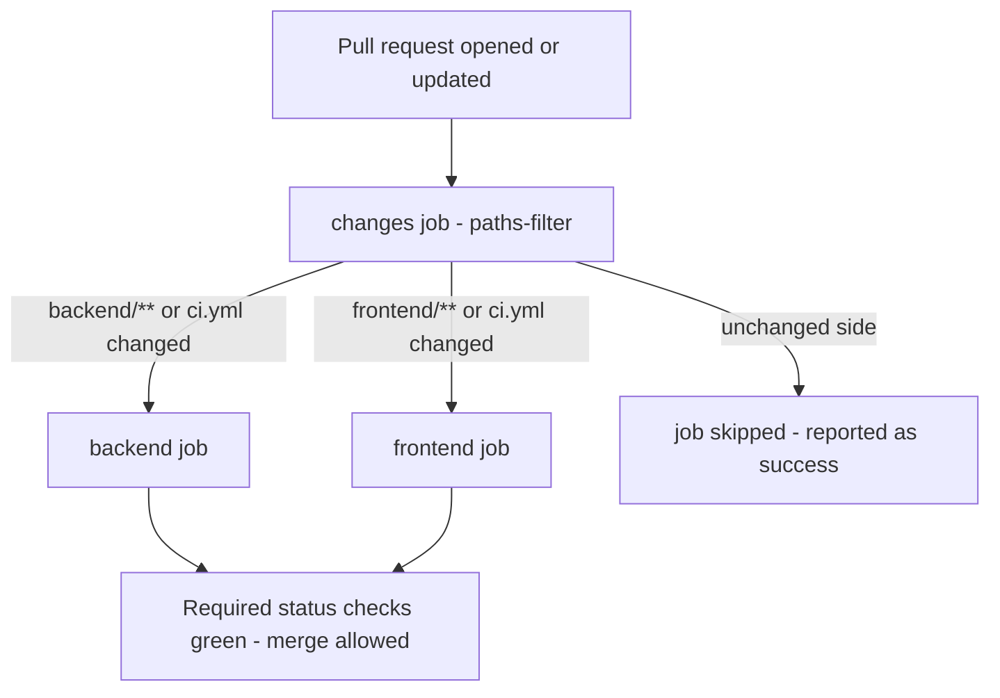

# Design: PR CI Workflow

**Date:** 2026-09-16
**Status:** Approved
**Scope:** Add a GitHub Actions CI workflow that gates pull requests with backend and frontend checks, plus a one-line fix to the frontend lint script.

## Problem

The repo has no CI that runs checks on pull requests. Existing workflows ([`publish.yml`](../../.github/workflows/publish.yml), [`project-automation.yml`](../../.github/workflows/project-automation.yml), [`auto-unblock.yml`](../../.github/workflows/auto-unblock.yml)) cover Docker publishing on tags and project-board automation only. All the local tooling exists (ruff, mypy strict, pytest; eslint, prettier, vitest, tsc build) but nothing enforces it on PRs.

## Goals

- Every PR runs backend checks: `ruff check`, `mypy` (strict), `pytest`.
- Every PR runs frontend checks: `eslint`, `prettier --check`, `vitest run`, `tsc -b && vite build`.
- Skip the side of the monorepo that a PR didn't touch (no wasted Actions minutes).
- Job names (`backend`, `frontend`) are stable so they can be marked as required status checks in branch protection for `develop`/`main`.

## Non-goals

- Playwright e2e tests in CI (deferred; needs browsers + running backend).
- Docker image builds in CI (already handled by `publish.yml` on `v*.*.*` tags).
- Branch protection settings (manual repo-settings step after merge).
- Coverage reporting, dependency auditing, release automation.

## Decisions

- **Trigger:** `pull_request` + `workflow_dispatch`. `develop`/`main` require PRs to merge, so push triggers are unnecessary. `workflow_dispatch` allows manual runs (and always runs both jobs, bypassing the filter).
- **Structure:** Single `ci.yml` with a `changes` job using `dorny/paths-filter@v3`, gating `backend` and `frontend` jobs via `if:` conditions. Chosen over always-run (wasted minutes) and two-file split (duplication, noisier status-check names).
- **Permissions:** `contents: read` at workflow level.
- **Concurrency:** cancel in-progress runs per ref.

## Architecture



### Workflow file: `.github/workflows/ci.yml`

```yaml
name: CI

on:
  pull_request:
  workflow_dispatch:

permissions:
  contents: read

concurrency:
  group: ci-${{ github.ref }}
  cancel-in-progress: true

jobs:
  changes:
    runs-on: ubuntu-latest
    outputs:
      backend: ${{ steps.filter.outputs.backend }}
      frontend: ${{ steps.filter.outputs.frontend }}
    steps:
      - uses: actions/checkout@v4
      - uses: dorny/paths-filter@v3
        id: filter
        with:
          filters: |
            backend:
              - 'backend/**'
              - '.github/workflows/ci.yml'
            frontend:
              - 'frontend/**'
              - '.github/workflows/ci.yml'

  backend:
    needs: changes
    if: needs.changes.outputs.backend == 'true' || github.event_name == 'workflow_dispatch'
    runs-on: ubuntu-latest
    defaults:
      run:
        working-directory: backend
    steps:
      - uses: actions/checkout@v4
      - uses: actions/setup-python@v5
        with:
          python-version-file: backend/.python-version
      - uses: astral-sh/setup-uv@v5
      - run: uv sync --extra dev --frozen
      - run: uv run ruff check .
      - run: uv run mypy src
      - run: uv run pytest

  frontend:
    needs: changes
    if: needs.changes.outputs.frontend == 'true' || github.event_name == 'workflow_dispatch'
    runs-on: ubuntu-latest
    defaults:
      run:
        working-directory: frontend
    steps:
      - uses: actions/checkout@v4
      - uses: actions/setup-node@v4
        with:
          node-version: 20
          cache: npm
          cache-dependency-path: frontend/package-lock.json
      - run: npm ci
      - run: npm run lint
      - run: npm run format:check
      - run: npm test
      - run: npm run build
```

## Component details

### `changes` job

- Runs `dorny/paths-filter@v3` against the PR diff. Two filters: `backend` and `frontend`, each including the `ci.yml` path itself so workflow changes always re-validate both sides.
- No top-level `on.paths:` — the workflow must appear on every PR so the required checks (or their skipped state) are reported.
- When a side is unchanged, its job is **skipped**. A skipped job satisfies branch protection (it does not report failure), so one-sided PRs are not blocked.

### `backend` job

- Python version resolved from [`backend/.python-version`](../../backend/.python-version) (3.12), keeping CI aligned with local `uv` behavior.
- `astral-sh/setup-uv@v5` installs uv and caches from `uv.lock`.
- `uv sync --extra dev --frozen` installs the dev extra (pytest, ruff, mypy) with the locked resolution; `--frozen` fails fast if the lockfile is stale.
- Check order is fastest-first: `ruff check .` → `mypy src` (strict config lives in [`pyproject.toml`](../../backend/pyproject.toml)) → `pytest` (config: `testpaths = ["tests"]`, `asyncio_mode = "auto"`, `pythonpath = ["src"]`).
- No external services needed: tests use SQLite/aiosqlite and fakes.

### `frontend` job

- Node 20 (matches [`docs/DEVELOPMENT.md`](../../docs/DEVELOPMENT.md) prerequisite "Node.js 20.x+"); npm cache keyed to `frontend/package-lock.json`.
- `npm ci` for a clean, lockfile-exact install.
- Steps: `npm run lint` → `npm run format:check` → `npm test` (vitest run) → `npm run build` (`tsc -b && vite build`, which type-checks as a gate).

### Bug fix: frontend `lint` script

[`frontend/package.json`](../../frontend/package.json) currently defines:

```json
"lint": "eslint . --ext .ts,.tsx"
```

ESLint v9 (pinned `^9.18.0`) removed the `--ext` flag when using flat config ([`eslint.config.js`](../../frontend/eslint.config.js)); the command exits with an error. Fix:

```json
"lint": "eslint ."
```

File targeting is already handled by the `files: ["**/*.{ts,tsx}"]` entry in the flat config. Verified locally as part of implementation (`npm run lint` must exit 0).

## Error handling

- Any step failing fails its job; the PR shows a red check. Ruff/mypy/tsc/eslint failures print file:line diagnostics in the Annotations view natively.
- `--frozen` on `uv sync` surfaces lockfile drift as a clear CI error rather than a silent re-resolution.
- Stale runs on force-push are cancelled via the concurrency group.

## Testing the workflow itself

- The `ci.yml` includes itself in both path filters, so the PR that introduces the workflow triggers it and validates both jobs end-to-end.
- `workflow_dispatch` provides a manual re-run path that ignores path filters.

## Rollout

1. Land the `ci.yml` + `lint` script fix via PR; confirm both jobs pass.
2. In repo settings → branch protection for `develop` and `main`, mark `backend` and `frontend` as required status checks. (Manual step; noted in the PR description.)

## Open questions

None — approved in brainstorming on 2026-09-16.
