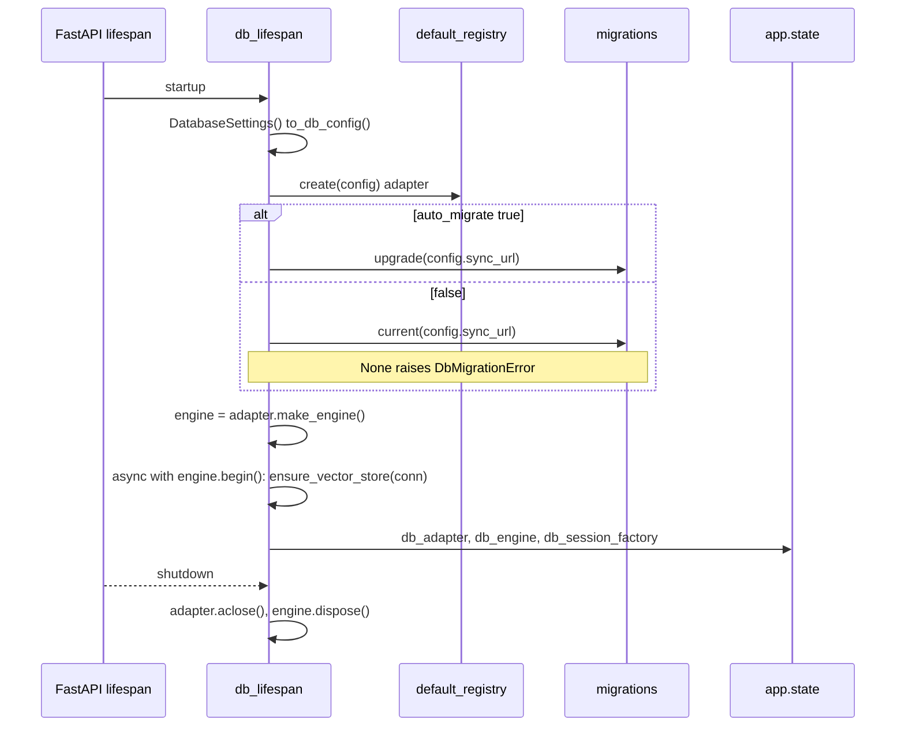

# DB Lifespan & Auto-Migrate on Startup — Design

**Work item:** #85 — feat(db): wire DB lifespan and auto-migrate on startup
**Branch:** `feature/db-lifespan-auto-migrate` · **Draft PR:** [#88](https://github.com/Svagtlys/Octave/pull/88)
**Date:** 2026-09-16
**Status:** Approved in brainstorming 2026-09-16
**Parent spec:** [vector-db-schema-orm-design](2026-09-13-vector-db-schema-orm-design.md) (Follow-up issues, item 1)

---

## Context

The `octave.db` package ships fully-tested but unwired: `migrations.upgrade()`/`current()` exist as callables, `get_db_session()` resolves `app.state.db_session_factory` (and 503s because nothing ever sets it), and the health endpoint is a static `{"status": "ok"}` that reports nothing. The parent spec deliberately parked this wiring ("lifespan wiring and auto-migrate-on-startup deferred to a follow-up issue") along with the `auto_migrate` config flag ("No `auto_migrate` flag yet — arrives with the lifespan issue").

This work item closes the loop: on startup, Octave builds the configured adapter, applies pending migrations, ensures the vector index exists, and publishes the session factory so every future route that depends on `get_db_session` just works. On shutdown it releases engine resources. `OCTAVE_DB_AUTO_MIGRATE` (default `true`) gates the migration step. The health endpoint grows a real DB check.

### Requirements gathered during brainstorming

1. **Fail-fast startup** — any DB setup failure (migration error, unknown adapter, vector-store DDL failure) propagates and the process exits. A broken DB means a broken Octave; there is no useful degraded mode to boot into, and serving traffic against an untrusted schema invites corruption. Matches the codebase's fail-loud ethos (NOT NULL owner, `UNIQUE(session_id, seq)`).
2. **`auto_migrate=false` still verifies** — startup checks `migrations.current()`; an unmigrated DB raises with an actionable message ("run `alembic upgrade head` or set `OCTAVE_DB_AUTO_MIGRATE=true`"). The flag disables *running* migrations, not *detecting* their absence.
3. **Aggregate health pattern** — one `/api/health` endpoint reporting per-component checks with an overall verdict, so inference/MCP checks slot in later without API fragmentation. Status codes carry the signal (monitoring-tool universal contract); the body serves optional assertions.
4. **No contention policy** — this work item exercises the concurrency *mechanics* already shipped (WAL, `busy_timeout`, per-session connections); contention *policy* stays deferred to the first real write path per the parent spec's Non-goals.

## Decision 1 — Config: `auto_migrate` on `DatabaseSettings` only

Add `auto_migrate: bool = True` to `DatabaseSettings` (`octave/db/config.py`), env var `OCTAVE_DB_AUTO_MIGRATE`. **Not** added to `DbConfig`.

`DbConfig` is what adapters consume — connection facts (url, adapter name, embedding dim). Migration policy is an app-lifecycle concern the adapter layer must never see: `to_db_config()` is unchanged, and a future pgvector adapter gains nothing from knowing whether the harness ran migrations. The lifespan reads `settings.auto_migrate` directly.

## Decision 2 — New module `octave/db/lifespan.py`

One public export: `db_lifespan`, an `@asynccontextmanager` async context manager taking `app: FastAPI`. FastAPI accepts it directly as the `lifespan=` argument.

```python
@asynccontextmanager
async def db_lifespan(app: FastAPI) -> AsyncIterator[None]:
    settings = DatabaseSettings()
    config = settings.to_db_config()
    adapter = default_registry.create(config)
    engine: AsyncEngine | None = None
    try:
        if settings.auto_migrate:
            upgrade(config.sync_url)
        else:
            if current(config.sync_url) is None:
                raise DbMigrationError(
                    "database not migrated — run `alembic upgrade head` "
                    "or set OCTAVE_DB_AUTO_MIGRATE=true"
                )
        engine = adapter.make_engine()
        async with engine.begin() as connection:
            await adapter.ensure_vector_store(connection)
        app.state.db_adapter = adapter
        app.state.db_engine = engine
        app.state.db_session_factory = adapter.make_session_factory(engine)
        logger.info("database ready: adapter=%s dim=%s", config.adapter, config.embedding_dim)
        yield
    finally:
        await adapter.aclose()
        if engine is not None:
            await engine.dispose()
```

Startup sequence:



Notes:

- **Sync migration calls in async code are deliberate.** `upgrade()`/`current()` drive a sync engine (Alembic's API); the lifespan runs before uvicorn accepts connections, so brief blocking is harmless. Documented in the docstring. If the event loop ever matters here, the fix is `anyio.to_thread.run_sync` — not a reason to defer wiring now.
- **`engine.begin()` owns the transaction** around `ensure_vector_store`, per the ABC contract ("the caller owns the transaction"). SQLite DDL is transactional, so a failed vector-store setup cannot leave a half-created index.
- **Failure cleanup:** if anything after `make_engine()` raises, the `finally` block still runs — adapter closed, engine disposed — then the exception propagates and uvicorn exits non-zero. No leaked file handles on the crash path. `logger.exception` per the logging rules.
- **`app.state` keys:** `db_session_factory` is the exact key `octave.db.deps.get_db_session` already reads — the seam closes with zero changes to `deps.py`. `db_adapter` and `db_engine` are stored now so the Context Manager work item can reach `search_similar`/`ensure_vector_store` without rewiring; storing them is a one-line cost today.
- **Idempotent restart:** `upgrade()` is idempotent (Alembic), `ensure_vector_store()` is idempotent (name-exists check). Re-running the lifespan against the same file is a no-op.
- **`DatabaseSettings()` is instantiated inside the lifespan**, matching `InferenceSettings` usage — env/`.env` are read at startup, and tests monkeypatch `OCTAVE_DB_URL`/`OCTAVE_DB_AUTO_MIGRATE` before invoking `db_lifespan` on a throwaway `FastAPI()` instance.

## Decision 3 — `app.py` wiring: `lifespan=` on the existing module-level `app`

```python
from octave.db.lifespan import db_lifespan

app = FastAPI(title="Octave Backend", lifespan=db_lifespan)
```

Rejected alternatives:

- **`create_app(settings)` factory** — maximum test injection, but breaks the `from octave.app import app` contract used by `test_health.py`, `test_cors.py`, `test_error_handling.py`, `test_websocket.py`, and the uvicorn target. Churn beyond this work item's scope; remains a clean refactor from here if a settings UI ever needs app factories.
- **Wiring inline in `octave.app`** — bleeds adapter/registry/migration orchestration into the app module; untestable without importing the global app.
- **`on_startup`/`on_shutdown` event hooks** — deprecated in FastAPI in favor of `lifespan=`.

Existing tests are unaffected: `ASGITransport` and context-less `TestClient` do not run lifespan handlers. Only tests that wrap the app in `with TestClient(app):` trigger startup/shutdown.

## Decision 4 — Health endpoint: aggregate check registry

`/api/health` becomes the single aggregate health endpoint. Shape:

```json
200 {"status": "ok", "db": {"status": "ok"}}
503 {"status": "degraded", "db": {"status": "unavailable"}}
```

Implementation in `octave/routes/health.py`:

- `_check_db(request) -> dict[str, str]`: resolve `app.state.db_session_factory`; unset → `{"status": "unavailable"}`. Else `SELECT 1` through the factory. Any exception → `logger.warning` (never escapes the check) → `{"status": "unavailable"}`.
- `CHECKS: dict[str, CheckFn] = {"db": _check_db}` — the endpoint iterates the map, gathers results, and computes `status = "ok" if all checks ok else "degraded"`; returns `JSONResponse(status_code=200 or 503, content=body)`.
- `SELECT 1` via the session factory, **not** `migrations.current()` — the latter opens a fresh sync engine per call, too heavy for a 30-second healthcheck poll.

**Monitoring-tool compatibility (rationale for keeping our own vocabulary):** Uptime Kuma, Gatus, Docker `HEALTHCHECK`, and Kubernetes probes all key off the HTTP status code; response bodies are only used for *optional user-configured assertions* (Kuma's JSON-query expressions, Gatus `[BODY]` conditions). De facto body conventions exist (Spring Actuator `UP`/`DOWN`, the unadopted IETF health-check draft `pass`/`fail`) but no tool requires them. We keep `ok`/`degraded`/`unavailable` — continuity with the existing `{"status": "ok"}` — while the status codes preserve both consumers unchanged (`urlopen` raises on ≥400 → container unhealthy; frontend `res.ok`).

**Deferred policy (recorded, not built):** optional components — MCP with zero configured servers is healthy-by-design (`octave.mcp.deps` treats it as such), so a future "MCP not configured" check must not mark the aggregate unhealthy the way "DB down" does. The tri-state question (`ok | unavailable | unconfigured`) lands in the check-function contract when the second component arrives. With exactly one mandatory component today, inventing the vocabulary now is YAGNI.

## Decision 5 — Error posture

| Condition | Behavior |
|---|---|
| Migration fails | `DbMigrationError` propagates → process exits non-zero |
| Unknown adapter / malformed config | registry/config error propagates → process exits |
| `auto_migrate=false` + unmigrated DB | `DbMigrationError` with actionable message → process exits |
| Vector-store DDL fails | engine disposed via `finally`, error propagates → process exits |
| Runtime DB failure (post-startup) | health `503 degraded`; routes fail per their own paths |

Startup failure and runtime failure are different problems: startup gets a crash (schema cannot be trusted), runtime gets health reporting + per-request errors.

## Concurrency: mechanics shipped, policy deferred

This work item is what makes the shipped mechanics *real* — until now nothing built an engine. Exercised here (all shipped in the parent work item):

- **One shared engine, per-session connections** — the lifespan builds a single `AsyncEngine` and one `db_session_factory`; every concurrent request gets its own `AsyncSession` over pooled connections. This prevents the per-request-engine anti-pattern.
- **WAL + `busy_timeout=5000` + FK pragmas** on every connection (`_bootstrap.py`) — readers never block the writer; colliding writers wait instead of raising `SQLITE_BUSY`.
- **Fail-closed ordering** — `UNIQUE(session_id, seq)` turns append races into loud `IntegrityError`s.
- **Startup is single-threaded by construction** — the lifespan completes before uvicorn accepts connections.

Contention **policy** (retry-on-busy helper, optimistic locking, single-writer queue) remains deferred per the parent spec's Non-goals: there are zero write paths in the app today, and the first candidate is the event-append helper, which must follow the pinned `seq`-inside-the-transaction pattern from the parent spec's Decision 4.

## Testing

- **`tests/db/test_lifespan.py`** — `db_lifespan` against a throwaway `FastAPI()` with monkeypatched `OCTAVE_DB_URL` (temp-file SQLite per test, no shared state):
  - default (`auto_migrate=true`): schema created (`migrations.current()` non-None), vector table exists at configured dim, all three `app.state` keys set;
  - `auto_migrate=false` + unmigrated DB → raises `DbMigrationError` with actionable message;
  - `false` + pre-migrated DB → boots, no new revision stamped;
  - unknown adapter name → `UnknownDbAdapterError` propagates;
  - teardown disposes the engine (second lifespan run on the same file succeeds);
  - double-run startup is idempotent.
- **`tests/test_health.py`** — updated for the aggregate shape: `200` + `{"status": "ok", "db": {"status": "ok"}}` when a working factory is on `app.state`; `503` + `degraded` when unset; `503` when the ping fails (factory bound to a deleted DB file). Existing exact-equality assertion is replaced, not extended.
- **`tests/test_db_deps.py`** — unchanged; proves the seam still resolves against lifespan-populated state semantics.
- Gates per task: `uv run pytest -q`, `uv run ruff check src tests`, `uv run mypy src`.

## Documentation updates

- `.agents/context/architecture.md` — Data Layer bullet: startup auto-migration is now wired (replaces "startup auto-migration is a separate work item").
- `docs/API.md` — does not exist yet; health response shape recorded in this spec, endpoint docs land with the API docs work item.

## Non-goals

- Liveness vs readiness probe split.
- Inference/MCP health checks (the `CHECKS` map is the seam).
- Contention policy (retry helpers, optimistic locking, write queue) — deferred to the event-append work item with the pinned `seq` pattern.
- Structured-logging rework (correlation-id filter) — lifespan logs follow existing module-logger usage.
- `docker-compose.yml` / env-file changes — `OCTAVE_DB_AUTO_MIGRATE` defaults true; nothing to add. Volume persistence for `octave.db` in compose is a separate ops concern.
- Vendor-error translation gaps in `ensure_vector_store` (pre-existing; adapter boundary already translates the paths exercised by tests).
- Storing `db_settings` on `app.state` — the flag is consumed at startup; nothing needs it at runtime.

## Follow-up issues

None created by this work item. Consumes follow-up item 1 of the parent spec; unblocks nothing new (Context Manager and Agent Manager work items consume `app.state.db_session_factory` / `db_adapter` as consumers, not blockers).
