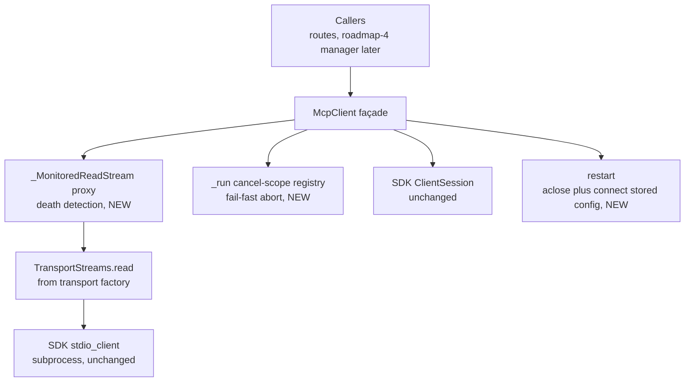
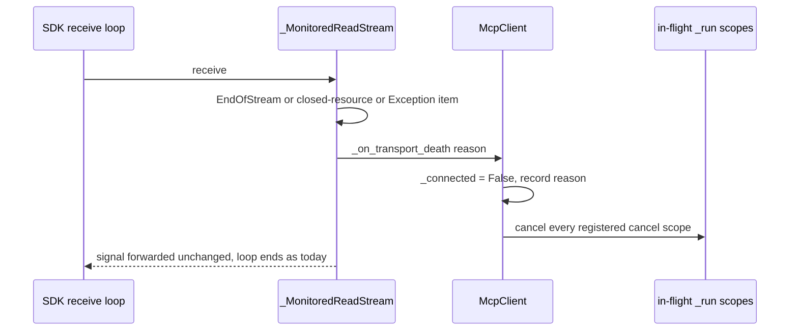
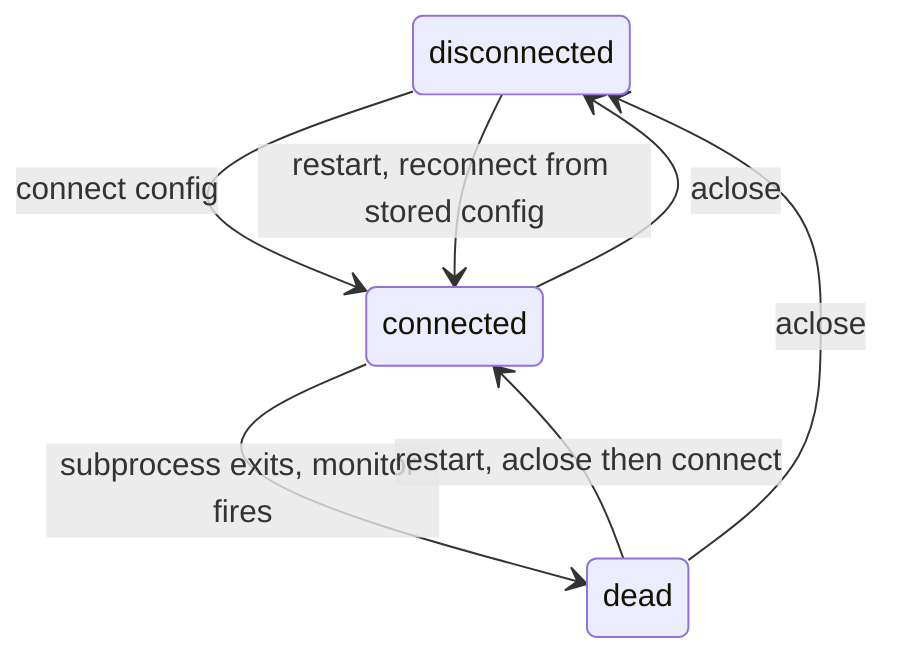

# Design: MCP stdio Subprocess Lifecycle — Exit Detection & Manual Restart

- **Issue:** #16 — feat(mcp): add stdio transport support
- **Branch:** `feature/mcp-stdio-transport`
- **Draft PR:** [#91](https://github.com/Svagtlys/Octave/pull/91)
- **Date:** 2026-09-17
- **Status:** Approved

## Problem

Issue #16 asks for MCP server connections via local subprocesses over stdin/stdout:
spawn subprocess, pipe JSON-RPC, and handle subprocess lifecycle (start, capture exit,
restart). An audit against the [MCP client-core spec](./2026-09-10-mcp-client-core-design.md)
(PR #81) shows most of the scope already exists:

| Issue #16 scope item | Status | Evidence |
|---|---|---|
| Spawn subprocess | Done | `open_transport` → SDK `stdio_client` ([`transport.py`](../../backend/src/octave/mcp/transport.py)) |
| Pipe JSON-RPC | Done | SDK `ClientSession` behind `McpClient` ([`client.py`](../../backend/src/octave/mcp/client.py)) |
| Start lifecycle | Done | `connect()`/`aclose()` with exit-stack teardown; spawn failure → `McpConnectionError` |
| **Capture exit** | **Gap** | Subprocess death mid-session is invisible: in-flight requests hang until the 30 s timeout (misleading `McpTimeoutError`) or raw SDK/anyio errors leak past the boundary; nothing surfaces liveness |
| **Restart** | **Gap** | No restart path; the client discards its config after `connect()`, so reconnection requires an external caller to keep the config |

This work item closes the two gaps. Everything else is a regression-test surface.

## Decisions from brainstorming

| # | Topic | Decision |
|---|-------|----------|
| 1 | Exit-capture depth | **Detect death only.** Keep the SDK `stdio_client`; no exit-code retrieval, no stderr capture, no process supervision. Owning the spawn (`anyio.open_process` + SDK framing) to expose `returncode` was considered and rejected — smallest-delta wins; exit codes can be added later without changing this design's surface. |
| 2 | Restart ownership | **Manual restart only.** `McpClient` stores its config and gains `restart()` (teardown + respawn + re-handshake). No auto-restart, no backoff — supervision policy stays with roadmap #4 (lifecycle manager), consistent with the client-core spec's decision 5. |
| 3 | Surfacing | **Exceptions + `is_connected` property.** In-flight and subsequent calls raise `McpConnectionError` immediately (fail fast, no timeout hang); `is_connected` lets non-calling observers (future health checks, Settings UI) poll liveness without pinging. |
| 4 | Detection mechanism | **Read-stream monitor proxy in `client.py`.** The client wraps the transport's read stream in a monitoring proxy; when the stream ends (EOF, closed-resource, or an `Exception` item — what SDK `stdio_client` forwards on process failure), the client marks itself disconnected and cancels in-flight requests via client-owned cancel scopes. `transport.py` is untouched; the quarantine rule survives unchanged. |

### Rejected alternatives

- **Close-callback wrapper in `transport.py`** — violates the transport's bounded role
  ("transport constructors only … no MCP semantics") from the client-core spec's
  quarantine rule. Connection-state semantics belong to the client.
- **Periodic `ping()` health poll** — detection delayed by the poll interval, in-flight
  requests still hang, and traffic burns on healthy servers. That mechanism is roadmap
  #4's health monitoring, not exit capture.
- **Own the spawn in `transport.py` via `anyio.open_process`** — enables exit codes and
  stderr capture but re-implements SDK plumbing, expands the quarantine surface, and
  was deferred by decision 1.

## Architecture



All changes live in `octave.mcp.client` — the module that already owns MCP semantics and
exception translation. `transport.py`, `config.py`, `errors.py`, `types.py`, and `deps.py`
are unmodified (one docstring touch on `McpConnectionError`).

## Exit detection

The SDK read stream yields `SessionMessage | Exception`. Subprocess death surfaces in one
of three ways, all observed at the same choke point — the client wraps
`TransportStreams.read` in a `_MonitoredReadStream` proxy before handing it to
`ClientSession`:

1. `receive()` raises `anyio.EndOfStream` — clean EOF when the dead process's pipe closes.
2. `receive()` raises `anyio.ClosedResourceError` / `BrokenResourceError`.
3. `receive()` returns an `Exception` **item** — the SDK `stdio_client` forwards process
   failures through the stream (the reason for the `| Exception` union).

On any of these (unless the client is tearing down — see *No false positives*), the proxy
invokes the client's death handler:



Design points:

- **The proxy delegates everything else** (`aclose`, iteration — anyio's generic
  `__aiter__`/`__anext__` route through `receive()`, which is intercepted). The SDK
  receive loop behaves exactly as it does today; detection is a side effect, so no
  behavior depends on undocumented SDK internals about pending-request handling.
- **Fail-fast for in-flight requests:** every `_run` call wraps its await in a fresh
  `anyio.CancelScope` registered in a client-owned set (deregistered in `finally`).
  The death handler cancels all registered scopes. anyio delivers cross-task scope
  cancellation, so blocked callers wake within one checkpoint. `scope.cancelled_caught`
  distinguishes death-cancellation (converted to `McpConnectionError`) from genuine
  outer cancellation (re-raised unchanged — Ctrl-C / task-group teardown stays intact).
- **Teardown timing:** the death handler does *not* unwind the exit stack — it fires
  inside the SDK's receive loop, where async teardown cannot run. The stack unwinds on
  the next `aclose()` or `restart()`. The process is already gone; only pipe handles
  linger until then. Documented and acceptable.
- **No false positives:** `aclose()` sets a `_closing` flag before unwinding the stack;
  the proxy suppresses the death handler while it is set (intentional stream close is
  not death). `connect()` clears the flag.
- **Connect-time death:** if the subprocess dies during the initialize handshake, the
  existing `except Exception` path in `connect()` unwinds the stack; it gains explicit
  translation of `ClosedResourceError`/`BrokenResourceError` → `McpConnectionError`
  ("server process exited during initialize") so no raw SDK error escapes.
- **Transport-agnostic:** the same path fires on Streamable HTTP connection drops —
  a free consistency win, no extra code.

## Restart & the state machine

`connect(config)` retains the config (`self._config`) — frozen dataclasses with redacting
`__repr__`, safe to store. `restart()` is then trivial:

```python
async def restart(self) -> None:
    """Tear down and re-establish the connection from the stored config."""
    if self._config is None:
        raise McpNotConnectedError("cannot restart: connect() has never been called")
    await self.aclose()
    await self.connect(self._config)
```



- `aclose()` is idempotent and works from `dead` (stack unwind is safe against an
  already-exited process; the SDK tolerates it).
- Respawn failure (binary removed, spawn error) propagates the normal
  `McpConnectionError`/`McpConfigError` from `connect()`; the client stays `dead`
  with `_config` intact, so `restart()` is retryable.
- `server_info` refreshes from the new handshake; notification subscribers attached to
  the client keep their streams across restart (the fan-out registry is client-level,
  not session-level — subscriptions survive; in-flight notifications during the gap
  are dropped like any other lost message).
- Lifecycle ops (`connect`/`aclose`/`restart`) are single-caller by documented contract —
  same convention as today. Concurrent request-methods remain safe.
- `restart()` after intentional `aclose()` is legal (config is kept) and behaves as a
  plain reconnect.

## Error mapping & logging

| Situation | Today | After |
|---|---|---|
| In-flight call when process dies | hangs → `McpTimeoutError`, or raw SDK error leaks | `McpConnectionError("… process exited …")` immediately |
| Call after death | `McpNotConnectedError` or hang | `McpConnectionError` (reason recorded; `restart()` available) |
| `ClosedResourceError`/`BrokenResourceError` from session | escapes boundary | translated in `_run` → `McpConnectionError` |
| Death during initialize handshake | raw SDK error re-raised | `McpConnectionError` |
| Genuine outer cancellation | propagates | propagates unchanged |

`McpConnectionError` docstring extends to: *"The server could not be reached, was
spawned but died mid-session, or dropped unexpectedly."* No new exception classes.

Logging per [`.agents/rules/coding.md`](../rules/coding.md) pipe format via
`logging.getLogger(__name__)`:

- `WARN` on death detection — include `config.command` (never `env` values — redaction
  rule).
- `INFO` on successful restart; `logger.exception` on restart failure.
- `INFO` on connect/aclose already partially implicit; keep quiet otherwise (no
  per-request logging).

## API surface (additive only)

```python
class McpClient:
    @property
    def is_connected(self) -> bool: ...
    # True between successful connect() and aclose()/death. Sync, no I/O.

    async def restart(self) -> None: ...
    # Manual restart from the stored config. McpNotConnectedError if connect()
    # was never called.
```

`McpClient.is_connected` and `McpClient.restart` re-export nothing new at package level
(methods on an already-exported class). `transport.py` unchanged; quarantine rule intact.

## Testing

**Unit (`tests/mcp/test_client.py`, in-memory streams, deterministic):**

- Death via `Exception` item — an injected transport sends an `Exception` item through
  the read stream (exactly what SDK `stdio_client` does on process failure); assert
  `is_connected is False` and a subsequent `call_tool` raises `McpConnectionError`.
- Death via stream close — close the harness peer's send stream; same assertions.
- In-flight fail-fast — `call_tool("slow")` running, then inject death; assert
  `McpConnectionError` arrives within `fail_after(2)` against a 5 s request timeout
  (proves cancellation, not timeout).
- Cancellation hygiene — cancelling the caller's own task still raises
  `Cancelled`, not `McpConnectionError`.
- No false positive — clean `aclose()` emits no death warning (`caplog`).
- `restart()` re-establishes — fake transport factory counted; factory called twice,
  `is_connected True`, `server_info` present after restart.
- `restart()` respawn failure — factory raises on second call → `McpConnectionError`,
  `is_connected False`, config retained (restart retryable).
- `restart()` before any `connect()` → `McpNotConnectedError`.
- Death during connect — factory yields streams that immediately die → 
  `McpConnectionError` from `connect()`.

**Integration (`tests/mcp/test_stdio_integration.py`, real subprocess, skipped via
`OCTAVE_MCP_SKIP_SUBPROCESS_TESTS=1`):**

- New fixture `tests/mcp/fixtures/dying_server.py`: FastMCP server exposing `echo`
  (round-trip sanity) and `exit_now` (calls `os._exit(3)` before responding).
- Exit capture: connect → `call_tool("exit_now")` raises `McpConnectionError` (dies
  mid-call) → `is_connected False` → second call raises `McpConnectionError`.
- Restart: `restart()` → `is_connected True` → `echo` round-trips again. Full
  spawn → exit → respawn cycle against the real SDK `stdio_client`.

Existing tests must pass unchanged; none assert the old hang-until-timeout behavior
(audited: `test_slow_tool_times_out_and_session_survives` uses a live server, unaffected).

## Files touched

| File | Change |
|---|---|
| `backend/src/octave/mcp/client.py` | `_MonitoredReadStream` proxy, death handler, cancel-scope registry, `is_connected`, `restart()`, `_run`/`connect` error translations, logging |
| `backend/src/octave/mcp/errors.py` | `McpConnectionError` docstring only |
| `backend/tests/mcp/test_client.py` | exit-detection & restart unit tests |
| `backend/tests/mcp/fixtures/dying_server.py` | new fixture (`echo`, `exit_now`) |
| `backend/tests/mcp/test_stdio_integration.py` | exit → restart integration test |
| `docs/ARCHITECTURE.md` | MCP Connector: exit detection + manual restart shipped |
| `docs/TODO.md` | MCP Connector #2 complete (PR #91); note auto-restart/health deferred to #4 |

## Conformance to project rules

- Type hints on all signatures; `async/await` for I/O.
- Explicit error handling; no bare `except`; SDK/anyio exceptions translated at the
  `client.py` boundary (rule extended, not weakened).
- Pipe-delimited logging; `env` values never logged.
- Docstrings on all public additions.
- Tests independent; integration tests opt-out-able in constrained sandboxes.
- `mypy --strict` and `ruff` clean (proxy subclass must satisfy the
  `MemoryObjectReceiveStream[SessionMessage | Exception]` protocol).

## Roadmap consequences

- **MCP Connector #2 (stdio transport): complete** with this PR — spawn, piping, start,
  exit capture, restart all shipped.
- **#4 (lifecycle manager):** builds auto-restart/backoff, health polling, and
  multi-server supervision on top of `is_connected` + `restart()`; consumes
  `ServerConfig`s from the DB (#7). `restart()`'s single-caller contract gives it one
  obvious place to serialize.
- **Exit codes / stderr capture:** if ever needed, revisit decision 1 — Octave-owned
  spawn inside `transport.py`; the client-side surface (`is_connected`,
  `McpConnectionError`) stays identical.

## Open follow-ups to file after this issue

- Auto-restart policy with exponential backoff + crash-loop detection (roadmap #4).
- Health monitoring / status surface over `is_connected` (+ REST endpoint when the
  MCP Connector view exists).
- Inbound request handler registry, non-text `ToolContent`, DB-backed config —
  unchanged from the client-core spec's follow-up list.
