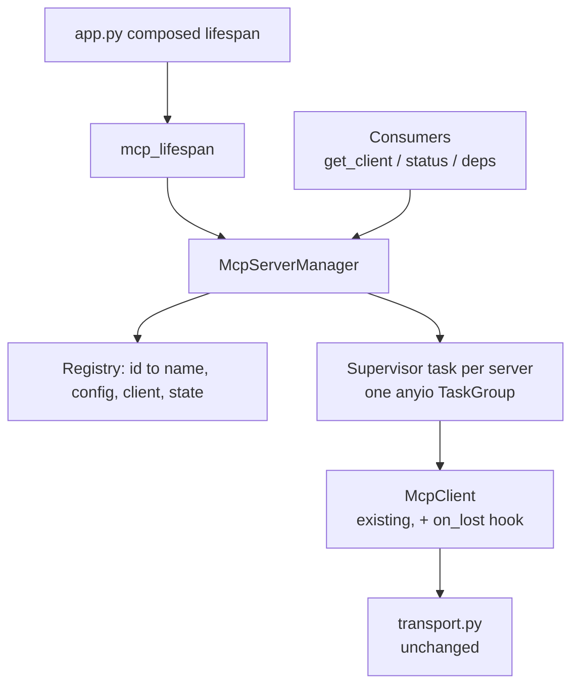
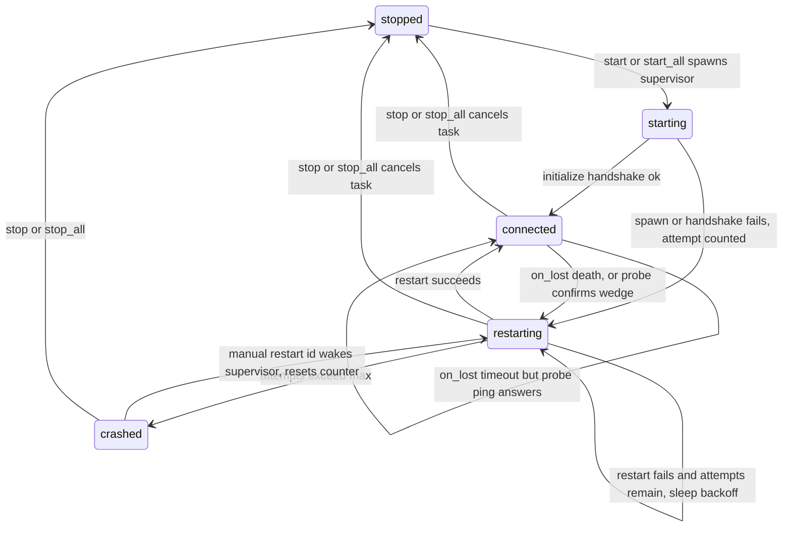

# Design: MCP Server Lifecycle Manager — Supervision, Auto-Restart & Health

- **Issue:** #18 — feat(mcp): build server lifecycle manager
- **Branch:** `feature/mcp-server-lifecycle-manager`
- **Draft PR:** [#93](https://github.com/Svagtlys/Octave/pull/93)
- **Date:** 2026-09-18
- **Status:** Approved

## Problem

Issue #18 asks for the manager that starts, stops, restarts, and monitors the
health of connected MCP servers, tracking connection state so agents have a
reliable view of which servers are available. It builds on shipped pieces:

| Capability | Status | Evidence |
|---|---|---|
| Connect / handshake / calls | Done | `McpClient` ([client.py](../../backend/src/octave/mcp/client.py)), #15 |
| stdio spawn / exit capture / manual `restart()` | Done | #16; `is_connected`, stored config, `_MonitoredReadStream` |
| Streamable HTTP transport | Done | `open_transport`, #15 |
| `McpServer` ORM model | Done (schema only) | [models/mcp.py](../../backend/src/octave/db/models/mcp.py), #7 schema |
| **Multi-server supervision** | **Gap** | Nothing manages >1 server; no registry |
| **Auto-restart / backoff / crash-loop** | **Gap** | `restart()` is manual, single-shot; the #16 spec deferred policy here |
| **Health monitoring** | **Gap** | `is_connected` misses hung-but-alive servers; `ping()` unused |
| **App wiring** | **Gap** | `deps.py` resolves `app.state.mcp_client` that nothing publishes |

## Decisions from brainstorming

| # | Topic | Decision |
|---|-------|----------|
| 1 | Config sourcing | **Injected configs, DB-agnostic.** The manager consumes `ServerConfig`s via constructor/registration API only. DB-backed loading is out of scope (roadmap #7 / #21). `mcp_lifespan` takes an injectable config source; default is empty. |
| 2 | Supervision depth | **Full supervision** per the #16 roadmap bullet: auto-restart with exponential backoff + crash-loop detection (`crashed` state halts retries until manual restart), health checks, multi-server supervision. |
| 3 | Health mechanism | **Passive flag + probe-on-timeout.** No periodic timer. The client gains an `on_lost` hook fired on (a) transport death and (b) request timeout. Death → immediate restart path. Timeout → manager confirms with a short-timeout `ping()`; answered = healthy-but-slow (no action), failed = wedged → restart. Zero traffic on healthy/idle servers. |
| 4 | Integration surface | **Manager + lifespan only.** `mcp_lifespan` publishes `app.state.mcp_manager`; consumers use `get_client(id)` / `status()` in-process. REST endpoints deferred to the MCP Connector UI work item. |
| 5 | Concurrency model | **Approach A: per-server supervisor task** in one manager-level `anyio.TaskGroup`. The supervisor task is the sole writer of its server's state and the sole caller of lifecycle methods — honoring `restart()`'s single-caller contract by construction. Alternatives rejected below. |
| 6 | Startup posture | **Do not fail fast.** A server that can't spawn enters the backoff → `crashed` path with `ERROR` logs; the app boots regardless (matches `deps.py`'s "Octave boots fine without any MCP servers" posture). Contrast: `db_lifespan` fails fast — deliberate divergence; MCP servers are peripheral, the schema is not. |

### Rejected alternatives

- **Periodic ping polling** — constant traffic to healthy servers, detection
  delayed up to one tick, extra config knobs. Probe-on-timeout detects the same
  failures demand-driven; a poller can be added later without changing the
  state machine.
- **Single monitor loop scanning all servers** — death detection delayed by the
  scan interval; restarts race with the manual API; reintroduces the timer
  decision 3 rejected.
- **Purely reactive (spawn a task per `on_lost`)** — the death hook fires inside
  the SDK receive loop where teardown can't run, so tasks are spawned from a
  callback anyway; backoff sleeps and crash counting then race with manual
  calls. Approach A gives the state machine one owner per server.
- **Manager owns processes directly** — process spawn/kill is `transport.py`'s
  job via the SDK context manager unwound by `aclose()`; the manager is policy
  only (when to restart, how many times, what state).

## Architecture



New modules in `octave.mcp`:

- **`manager.py`** — `McpServerManager` + `ServerStatus` + supervisor tasks.
  Never imports the `mcp` SDK (quarantine rule intact); clients are built via
  an injectable `client_factory`.
- **`lifespan.py`** — `mcp_lifespan(app, configs=...)`: build → register →
  `start_all()` → publish `app.state.mcp_manager` → yield → `stop_all()`.

Modified: `client.py` (one additive `on_lost` hook), `config.py` (five
supervision settings), `deps.py` (resolve through the manager), `__init__.py`
(re-exports), `app.py` (compose `db_lifespan` + `mcp_lifespan`).

**Ownership model (stdio):** Octave is the server's parent process.
`aclose()` unwinds the exit stack → SDK `stdio_client` terminates the
subprocess; `connect()` respawns a fresh one. "Restart" = kill child, spawn
child, re-handshake — all via existing `McpClient` methods. For HTTP servers
the same calls tear down / re-establish the session; the difference is
invisible above `client.py`.

## Manager API

```python
ServerState = Literal["stopped", "starting", "connected", "restarting", "crashed"]

@dataclass(frozen=True)
class ServerStatus:
    id: str
    name: str
    state: ServerState
    transport: str              # "stdio" | "http" — display metadata
    restart_count: int          # successful restart cycles
    consecutive_failures: int   # current backoff streak
    last_error: str | None      # most recent failure reason (already redacted)
    last_state_change: datetime # aware UTC

class McpServerManager:
    def __init__(
        self,
        *,
        settings: McpSettings | None = None,
        client_factory: Callable[[], McpClient] = McpClient,
    ) -> None: ...
    def register(self, *, id: str, name: str, config: ServerConfig) -> None
    # Pre-start_all only; duplicate id → McpConfigError.

    async def start_all(self) -> None
    # Open the TaskGroup and spawn one supervisor per registered server.
    # Returns once supervisors are spawned — not once servers are healthy.

    async def stop_all(self) -> None
    # Cancel every supervisor scope; each finally-block acloses. Awaited.

    async def start(self, id: str) -> None    # stopped → spawn supervisor
    async def stop(self, id: str) -> None     # cancel scope → finally: aclose
    async def restart(self, id: str) -> None
    # Supervisor-driven cycle, resets the failure counter. From crashed this is
    # the only exit. From stopped → McpNotConnectedError.

    def get_client(self, id: str) -> McpClient
    # Same instance across restarts (config is retained client-side).
    # Unknown id → McpConfigError.

    def status(self) -> list[ServerStatus]
    def status_of(self, id: str) -> ServerStatus
```

`client_factory` is the test seam: unit tests inject fake clients that
die/fail on command; no subprocesses, no SDK. `octave.mcp.__init__`
re-exports `McpServerManager`, `ServerStatus`, `ServerState`.

## Client seam: `on_lost` hook

Additive only — `client.py` gains a constructor keyword:

```python
class McpClient:
    def __init__(
        self,
        *,
        transport_factory: TransportFactory = open_transport,
        settings: McpSettings | None = None,
        on_lost: Callable[[str], None] | None = None,  # NEW: "death" | "timeout"
    ) -> None: ...
```

- Fired from the existing `_on_transport_death` (reason `"death"`) and from
  `_run`'s `TimeoutError` branch (reason `"timeout"`).
- Synchronous, never raises into the client: hook exceptions are caught,
  logged `WARN`, suppressed. Same discipline as the existing death monitor.
- The manager's hook implementation just sets an `anyio.Event` — safe to call
  from the SDK receive loop or a caller task.
- `is_connected`, `restart()`, error translation: unchanged.

## State machine

One supervisor task per server is the sole writer of state; all readers
(`status()`, deps, tests) are lock-free reads of plain attributes.



Supervisor loop (pseudocode):

```
on_lost(reason):                    # sync hook, any task
    lost_event.set()

supervisor():                       # the server's only lifecycle caller
    state = starting
    try:
        connect()                   # ok → connected
    except McpError as exc:
        last_error = str(exc)       # first spawn/handshake failure
        state = restarting          # first pass skips the wake wait
    while True:
        if state is not restarting:
            await wake_event.wait() # set by on_lost, restart(id), stop
            clear wake_event
        if state is not restarting and reason == "timeout" and not cmd_restart:
            if probe_ping_ok():     # healthy-but-slow; keep serving
                continue            # wedged → fall through to restart
        state = restarting
        await aclose()
        while attempts < max:
            attempts += 1
            await sleep(backoff(attempts))
            try:
                connect()           # restart cycle
                state = connected
                break
            except McpError as exc:
                last_error = str(exc)
        else:
            state = crashed         # parks; manual restart(id) sets wake_event
    # stabilization: after holding connected for stabilization_seconds,
    # attempts resets to 0 (implemented as a deadline checked in the wait)
```

Wake/clear invariant: the supervisor clears `wake_event` *before* probing. A
probe-ping that itself times out re-fires `on_lost("timeout")` and re-sets
the event — harmless: the supervisor is already on the unhealthy path and
clears again before re-entering the wait. A parked `crashed` supervisor wakes
only on manual `restart(id)`, which sets `wake_event`.

## Restart policy

Defaults are `McpSettings` fields (`OCTAVE_MCP_*` env prefix), added to
`config.py`:

| Setting | Default | Meaning |
|---|---|---|
| `restart_base_delay_seconds` | `1.0` | first retry delay |
| `restart_max_delay_seconds` | `60.0` | cap; delay = `min(base · 2^(attempt−1), max)` |
| `restart_max_attempts` | `5` | consecutive failed cycles → `crashed` |
| `probe_timeout_seconds` | `5.0` | confirming-ping budget (≪ request timeout) |
| `stabilization_seconds` | `60.0` | quiet window in `connected` that resets the failure counter |

- **Probe-ping budget:** the supervisor wraps `client.ping()` in
  `anyio.move_on_after(settings.probe_timeout_seconds)` — no client change; a
  probe exceeding the budget counts as failed (wedged). The client's
  `request_timeout_seconds` stays the caller-facing knob.
- **Crash-loop detection:** the counter resets only after a connection *holds*
  for `stabilization_seconds`. A server that restarts "successfully" but
  re-crashes in 5 s keeps escalating to `crashed` instead of flapping forever.
- **No jitter** — few local servers, independent timers; thundering-herd
  jitter is YAGNI.
- **Manual API semantics:** `restart(id)` runs on the supervisor (single-caller
  contract), resets the counter, and exits `crashed`. `stop(id)` / `stop_all()`
  cancel the supervisor's cancel scope; the `finally` block `aclose()`s —
  cancellation *is* the stop mechanism, so stop/restart cannot race.
- **`start_all` is non-blocking on health:** it returns once supervisors are
  spawned; callers observe readiness via `status()`.

## Lifespan & app wiring

```python
# octave/mcp/lifespan.py
@asynccontextmanager
async def mcp_lifespan(
    app: FastAPI,
    *,
    configs: Iterable[tuple[str, str, ServerConfig]] = (),   # (id, name, config)
    client_factory: Callable[[], McpClient] = McpClient,
) -> AsyncIterator[None]: ...
```

- Build manager → `register` each config → `start_all()` → publish
  `app.state.mcp_manager` → yield → `stop_all()`.
- Default `configs=()` → Octave boots with zero MCP servers, preserving today's
  behavior until #7 wires the DB.
- `app.py` composes: a five-line `compose_lifespans(*lifespans)` helper on
  `contextlib.AsyncExitStack`, defined in `octave/app.py` (its only consumer).
  `lifespan=compose_lifespans(db_lifespan, mcp_lifespan)`.
- `deps.py`: `get_mcp_client` is **removed** — with N servers it cannot
  resolve "the" client, and no route consumes it today. Replaced by
  `get_mcp_manager(request) → app.state.mcp_manager` (503 when absent);
  consumers pick a server explicitly via `manager.get_client(id)`.

## Error handling & logging

| Situation | Handling |
|---|---|
| `McpConfigError` / `McpConnectionError` / `McpTimeoutError` during a restart attempt | recorded as `last_error`, `WARN` (retrying) / `ERROR` (entering `crashed`); backoff continues |
| Unexpected exception inside a supervisor | `ERROR` + `exc_info`; supervisor terminates, state → `crashed` (bug containment — never a silent loop) |
| `on_lost` hook raises | caught, `WARN`, suppressed (client never breaks on a manager bug) |
| `stop(id)` on unknown id | `McpConfigError` |
| `restart(id)` on stopped server | `McpNotConnectedError` |
| Startup spawn failure | supervisor's first `connect()` fails → backoff → possibly `crashed`; app boots (decision 6) |

Logging follows [`.agents/rules/coding.md`](../rules/coding.md) pipe format via
`logging.getLogger(__name__)`: `INFO` on state transitions to `connected` /
`stopped`; `WARN` on death detection, wedge confirmation, restart retries;
`ERROR` on `crashed` and supervisor crashes. Never log `env`/`headers` values;
`last_error` strings derive from Octave exception messages, which already
redact config reprs.

## Testing

**Unit — `tests/mcp/test_manager.py`** (fake `McpClient` via `client_factory`,
`anyio` virtual clock; no subprocesses, no SDK):

- register/start_all/stop_all happy path; state transitions observable via
  `status()`.
- death → supervisor restarts → `connected`, `restart_count` increments.
- restart-failure backoff: delays follow `1, 2, 4, …` capped at max
  (virtual-clock assertion); `crashed` after `restart_max_attempts`.
- crash-loop: connect succeeds, re-dies within `stabilization_seconds` →
  counter keeps escalating to `crashed`; hold past stabilization → counter
  resets.
- timeout + probe answers → no restart, stays `connected`; timeout + probe
  fails → restart path.
- manual `restart(id)` exits `crashed`, resets counter; `restart(id)` on
  stopped → `McpNotConnectedError`; `stop(id)` unknown id → `McpConfigError`.
- `stop(id)` mid-backoff → clean `aclose`, state `stopped`, no respawn.
- `get_client(id)` returns the same instance across restarts; unknown →
  `McpConfigError`; duplicate `register` → `McpConfigError`.
- supervisor crash containment: fake client raising `RuntimeError` from
  `connect()` → `crashed`, other servers unaffected.
- multi-server: one crashed server's backoff never blocks another's restart.

**Client seam — `tests/mcp/test_client.py` additions:**

- `on_lost("death")` fires exactly once on stream death (both EOF and
  Exception-item paths).
- `on_lost("timeout")` fires on request timeout; not fired on success or on
  genuine outer cancellation.
- hook raising never propagates to the caller; existing tests pass unchanged.

**Lifespan / app — `tests/mcp/test_lifespan.py` + `tests/test_mcp_deps.py`:**

- app boots with default `configs=()`; `app.state.mcp_manager.status() == []`.
- with fake factory + configs: statuses reflect lifecycle; shutdown `aclose()`s
  all clients.
- `get_mcp_manager` resolves with the lifespan, 503 without it;
  `get_mcp_client` removed (tests updated to assert its absence from the
  public API).

**Subprocess integration — `tests/mcp/test_stdio_integration.py`** (existing
`OCTAVE_MCP_SKIP_SUBPROCESS_TESTS=1` opt-out):

- manager + real `echo_server.py`: drive a tool that kills the server →
  supervisor auto-restarts → `echo` round-trips again; `status()` shows
  `restart_count == 1`.
- `dying_server.py` crash loop → `crashed` state with bounded restart count.

Existing tests must pass unchanged; the `on_lost` hook defaults to `None`.

## Files touched

| File | Change |
|---|---|
| `backend/src/octave/mcp/manager.py` | **new** — `McpServerManager`, `ServerStatus`, `ServerState`, supervisor tasks |
| `backend/src/octave/mcp/lifespan.py` | **new** — `mcp_lifespan` |
| `backend/src/octave/mcp/client.py` | additive `on_lost` hook (ctor kwarg, two fire sites, exception suppression) |
| `backend/src/octave/mcp/config.py` | five supervision settings on `McpSettings` |
| `backend/src/octave/mcp/deps.py` | `get_mcp_client` removed; `get_mcp_manager` added (503 when `app.state.mcp_manager` absent) |
| `backend/src/octave/mcp/__init__.py` | re-export `McpServerManager`, `ServerStatus`, `ServerState` |
| `backend/src/octave/app.py` | compose `db_lifespan` + `mcp_lifespan` |
| `backend/tests/mcp/test_manager.py` | **new** — supervision unit tests |
| `backend/tests/mcp/test_client.py` | `on_lost` seam tests |
| `backend/tests/mcp/test_lifespan.py` | **new** — lifespan/app-wiring tests |
| `backend/tests/test_mcp_deps.py` | deps resolution updates |
| `backend/tests/mcp/test_stdio_integration.py` | manager auto-restart + crash-loop integration tests |
| `docs/ARCHITECTURE.md` | MCP Connector: lifecycle manager shipped |
| `docs/TODO.md` | MCP Connector #4 complete (PR #93) |

## Conformance to project rules

- Type hints on all signatures; `async/await` for I/O; no bare `except`.
- `manager.py` imports no `mcp` SDK — quarantine rule preserved (client_factory
  seam).
- Pipe-delimited logging; secrets never logged.
- Docstrings on all public additions.
- Tests independent; subprocess tests keep the existing opt-out.
- `mypy --strict` and `ruff` clean.

## Roadmap consequences

- **MCP Connector #4 (lifecycle manager): complete** with this PR.
- **#7 (config persistence):** swaps `mcp_lifespan`'s `configs` source for DB
  rows (`McpServer` → `ServerConfig` mapping); the manager API doesn't move.
- **MCP Connector UI:** REST endpoints (`GET /api/mcp/servers`, start/stop/
  restart routes) over `status()` / manager methods — the deferred surface.
- **Tool discovery/caching (#5), execution engine (#6):** consume
  `get_client(id)`; restart transparency already holds because the manager
  hands out the same client instance whose config is retained.
- **Periodic health polling:** addable later inside the supervisor loop without
  changing states or the client seam, if idle-server health reporting is ever
  needed.

## Open follow-ups to file after this issue

- REST status/control endpoints when the MCP Connector view is built.
- DB-backed config loading (#7) → replace `configs` parameter.
- Event-stream notification of state changes (WebSocket push to frontend) —
  pairs with the UI work item.
