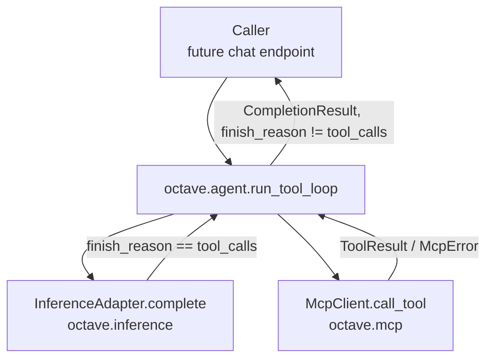

# Design: Tool-Use Orchestration Loop

- **Issue:** [#79](https://github.com/Svagtlys/Octave/issues/79) — feat(agent): implement tool-use orchestration loop
- **Branch:** `feature/tool-use-orchestration-loop`
- **Draft PR:** [#92](https://github.com/Svagtlys/Octave/pull/92)
- **Date:** 2026-09-18
- **Status:** Approved

## Problem

The LLM can be asked to make a decision, but Octave has no way to act on a tool-call
request the LLM generates: `InferenceAdapter.complete()` returns a single
`CompletionResult` and nothing inspects `finish_reason`, executes anything via MCP, or
calls the adapter again with the result. This item delivers the "reason → act → observe"
loop: given a `finish_reason == "tool_calls"` response, execute each requested tool
through `McpClient`, append the results to the conversation, and trigger a follow-up
completion — repeating until the LLM stops requesting tools.

## Scope boundary (decision 1)

This issue implements the **consumption** side of tool calls only: reading `tool_calls`
off a `CompletionResult` and acting on them. It does **not** implement sending tool
definitions to the LLM in the first place — that is
[#78](https://github.com/Svagtlys/Octave/issues/78) ("add tool schema translation
layer"), a sibling issue, not a dependency. The two compose (the loop only needs
`tool_calls` to be populated by *some* means) and are independently testable: this
issue's tests drive the loop with a scripted fake adapter that returns canned
`tool_calls`, never touching `CompletionRequest.tools`.

Streaming (`InferenceAdapter.stream()` / `CompletionChunk`) is out of scope — the issue
only concerns the non-streamed `complete()` path. Wiring the loop into a real chat
endpoint is also out of scope: `octave.websocket.connection` is currently an echo/pong
stub with no chat handler, and the issue's scope list is limited to the loop itself.

## Decisions from brainstorming

| # | Topic | Decision |
|---|-------|----------|
| 1 | Scope | Consumption side only (read `tool_calls`, execute, loop). Sending tool defs to the LLM is #78's job, not a dependency. Streaming and endpoint wiring are out of scope. |
| 2 | Module location | New top-level `octave.agent` package. Matches the architecture doc's "Agent Manager" as the natural home for cross-cutting orchestration, and keeps `octave.inference` and `octave.mcp` mutually independent as they are today. |
| 3 | Multi-tool concurrency | Tool calls from one LLM turn execute **concurrently** via `anyio.create_task_group`, mirroring the concurrency contract `McpClient` already exposes and is tested against (`tests/mcp/test_client.py::test_concurrent_calls_correlate_responses`). Results are collected by index to preserve request order in the appended messages. |
| 4 | Loop safety limit | `run_tool_loop` takes `max_iterations: int = 10`. Exceeding it raises `ToolLoopMaxIterationsError` rather than looping forever or silently truncating — a stuck LLM is a real bug signal. |
| 5 | Tool error surfacing | An MCP execution failure (`McpError` and subclasses, or `ToolResult.is_error=True`) is **not** raised out of the loop. It becomes a normal `role="tool"` message with error text content, so the LLM sees the failure and can react (retry, apologize, try a different tool) rather than the whole turn aborting because one tool call failed. |

## Architecture



`octave.agent` imports both `octave.inference` and `octave.mcp` through their existing
public seams (`InferenceAdapter`, `CompletionRequest`/`CompletionResult`/`Message`,
`McpClient`, `ToolResult`, `McpError`) — no new coupling is introduced into either of
those packages themselves.

### Package layout

New package `backend/src/octave/agent/`:

| File | Responsibility |
|------|----------------|
| `tool_loop.py` | `run_tool_loop()` — the reason → act → observe loop |
| `errors.py` | `AgentError` hierarchy (`ToolLoopMaxIterationsError`) |
| `__init__.py` | Public re-exports |

## Type changes (`octave/inference/types.py`)

```python
Role = Literal["system", "user", "assistant", "tool"]

class ToolCall(BaseModel):
    """One tool invocation requested by the LLM."""
    id: str
    name: str
    arguments: dict[str, Any]

class Message(BaseModel):
    role: Role
    content: str
    tool_calls: list[ToolCall] | None = None   # assistant messages that requested tools
    tool_call_id: str | None = None            # tool messages: which call this answers

class CompletionResult(BaseModel):
    text: str
    model: str
    finish_reason: str | None = None
    usage: Usage | None = None
    tool_calls: list[ToolCall] | None = None
```

`ToolCall.arguments` stays a parsed `dict`, matching how `ToolInfo.input_schema` stays a
raw dict rather than an opaque string (`mcp/types.py` decision) — Octave's internal
vocabulary is structured; wire-format string encoding is an adapter-boundary concern.

### `OpenAIAdapter` changes (`inference/openai_adapter.py`)

- `complete()`: read `choice.message.tool_calls` (SDK
  `list[ChatCompletionMessageToolCall] | None`) and translate each into Octave's
  `ToolCall`, parsing `function.arguments` (a JSON string on the wire) into a dict via
  `json.loads`. `None`/empty stays `None` on `CompletionResult`.
- `_chat_kwargs()`: switch `message.model_dump()` to
  `message.model_dump(exclude_none=True)` so `tool_calls`/`tool_call_id` don't appear as
  explicit `null` on every message. When a message carries `tool_calls`, re-serialize
  each `ToolCall.arguments` dict back to a JSON string (OpenAI's wire format expects
  `function.arguments` as a string) — this is the mirror-image translation of the read
  path, both localized to the adapter (SDK quarantine rule).

## The loop (`octave/agent/tool_loop.py`)

```python
async def run_tool_loop(
    adapter: InferenceAdapter,
    mcp_client: McpClient,
    request: CompletionRequest,
    *,
    max_iterations: int = 10,
) -> CompletionResult:
    """Run reason -> act -> observe until the LLM stops requesting tools.

    Each iteration calls ``adapter.complete()``; when the result carries
    ``finish_reason == "tool_calls"``, every requested tool is executed
    concurrently via ``mcp_client.call_tool`` and the results are appended
    to the conversation before the next completion. Returns the first
    result whose ``finish_reason`` is not ``"tool_calls"``.
    """
    messages = list(request.messages)
    for _ in range(max_iterations):
        result = await adapter.complete(request.model_copy(update={"messages": messages}))
        if result.finish_reason != "tool_calls" or not result.tool_calls:
            return result
        messages.append(
            Message(role="assistant", content=result.text, tool_calls=result.tool_calls)
        )
        messages.extend(await _execute_tool_calls(mcp_client, result.tool_calls))
    raise ToolLoopMaxIterationsError(max_iterations)
```

`_execute_tool_calls` runs each `ToolCall` in its own task under an
`anyio.create_task_group`, writing results into a pre-sized list by index (not append)
so message order matches the LLM's requested tool-call order regardless of completion
order:

```python
async def _execute_tool_calls(
    mcp_client: McpClient, tool_calls: list[ToolCall]
) -> list[Message]:
    results: list[Message] = [None] * len(tool_calls)  # type: ignore[list-item]

    async def run_one(index: int, call: ToolCall) -> None:
        results[index] = await _call_and_wrap(mcp_client, call)

    async with anyio.create_task_group() as tg:
        for index, call in enumerate(tool_calls):
            tg.start_soon(run_one, index, call)
    return results
```

`_call_and_wrap` is where per-call outcomes become a `Message(role="tool",
tool_call_id=call.id, content=...)`:

- **Success (`ToolResult.is_error=False`)** — content is the joined text of
  `ToolResult.content` blocks.
- **MCP-level tool failure (`ToolResult.is_error=True`)** — MCP itself flagged this as an
  error string meant for the model; still delivered as a normal tool message, content is
  the joined text (no exception — this is expected protocol behavior, not a wire fault).
- **Transport/RPC failure (`McpError` and subclasses raised out of `call_tool`)** —
  caught per call so one failing tool doesn't abort the others or the loop; content is
  `f"Error: {exc}"`.

## Errors (`octave/agent/errors.py`)

```python
class AgentError(Exception):
    """Base class for every agent orchestration failure."""

class ToolLoopMaxIterationsError(AgentError):
    """The LLM kept requesting tools past the configured iteration limit."""

    def __init__(self, max_iterations: int) -> None:
        self.max_iterations = max_iterations
        super().__init__(f"Tool loop exceeded {max_iterations} iterations")
```

Same shape and fail-loud philosophy as `inference/errors.py` and `mcp/errors.py`.

## Testing

- **`tests/inference/test_openai_adapter.py`** — new cases: SDK response with
  `tool_calls` translates to `CompletionResult.tool_calls`; outgoing request with an
  assistant `Message.tool_calls` set serializes `arguments` back to a JSON string;
  messages with `tool_calls=None`/`tool_call_id=None` don't emit those keys.
- **`tests/inference/fakes.py`** — extend `FakeAdapter` (or add a small scripted test
  double) to return a queued sequence of `CompletionResult`s per call, so a test can
  script "first call returns tool_calls, second call returns stop".
- **New `tests/agent/test_tool_loop.py`**:
  - Single tool call → one follow-up completion, correct message history shape
    (assistant-with-`tool_calls` immediately followed by the matching tool message).
  - Multiple simultaneous tool calls → all execute, results appended in request order
    regardless of completion order, one follow-up completion.
  - MCP tool call raises `McpError` → surfaces as an error-content tool message; other
    tool calls in the same turn and the loop itself are unaffected.
  - `ToolResult.is_error=True` → surfaces as a normal tool message (no exception raised).
  - Exceeding `max_iterations` raises `ToolLoopMaxIterationsError`.
  - Tool execution reuses the existing in-memory `harness()` fixture from
    `tests/mcp/test_client.py` so tool calls run against a real (in-memory) MCP session,
    not a mock of `McpClient`.

## Conformance to project rules

- Type hints on all signatures; `async/await` for I/O (`.agents/rules/coding.md`).
- Explicit error handling; no bare `except` — every MCP failure path is a named
  `McpError` subclass caught deliberately.
- Docstrings on all public functions/classes.
- `docs/ARCHITECTURE.md` Inference Engine Connector / MCP Connector sections updated to
  note the loop's existence once implemented.

## Open follow-ups to file after this issue

- Wiring `run_tool_loop` into an actual chat/WebSocket endpoint (depends on the endpoint
  itself existing, and pairs naturally with #78 landing).
- Multi-server tool routing (which `McpClient` owns a given tool name) once the Server
  Lifecycle Manager (`docs/ARCHITECTURE.md` MCP Connector roadmap #4) supports more than
  one connected server.
