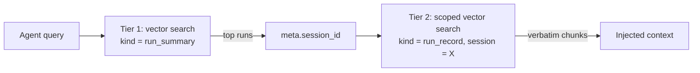

# Context Vault — Data Model Design

**Work item:** #31 — feat(context): design context vault data model
**Branch:** `feature/context-vault-data-model` · **Draft PR:** [#96](https://github.com/Svagtlys/Octave/pull/96)
**Date:** 2026-09-20
**Status:** Approved in brainstorming 2026-09-20 (pending written-spec review)

**Scope summary:** reconcile the shipped `vault_items` schema (PR #84) against the target context-vault data model. Ships: the `VaultKind` enum as app-level validation for `vault_items.kind`, per-kind JSON conventions documented (not yet validated), relationship design as named references with link tables deferred, and a two-tier run-archival model (`run_summary` + `run_record`). Ships **no** migration, **no** new tables/columns, **no** writer/CRUD code.

---

## Context

The issue asks to "design the data model for the context vault: skills, prompts, preferences, and agent state schemas" plus "relationships and foreign keys". The base table already shipped in the initial migration ([`4bf075ee2ede`](../../backend/src/octave/db/migrations/versions/4bf075ee2ede_initial_schema.py)) with the [`VaultItem`](../../backend/src/octave/db/models/vault.py) ORM model: `id`, `user_id` FK→`users`, `kind`, `name`, `content`, `metadata` JSON (ORM attr `meta`), embedding cache columns (`embedding`, `embedding_model`, `embedding_dim`), and index `ix_vault_items_user_kind`. The [2026-09-13 vector-db design](./2026-09-13-vector-db-schema-orm-design.md) deliberately deferred `skill_links`, `tool_tags`, `model_tags`, `tools`, and `injection_rules` to their consumer work items, parking tags in the `metadata` JSON column.

This work item is therefore a **reconciliation**, not a greenfield design: decide what the existing columns must mean per kind, make the kind vocabulary real in code, and record the relationship design so consumer work items inherit it instead of re-inventing it.

### Requirements gathered during brainstorming

1. **Design-only for schema**: relationships are defined in this doc; tags/links stay in `meta` JSON; link tables remain deferred to consumer work items (consistent with the 2026-09-13 deferral).
2. **Convention-only per-kind schemas**: no Pydantic content-validation models in this item; the storage-layer item (Context Manager TODO #2) promotes conventions to models.
3. **Enum ships now**: `VaultKind` StrEnum in `octave.db.types` — the one piece of the data model currently enforced nowhere in code.
4. **`content` stays pure**: it is simultaneously the embedded text, the injected prompt text, and the re-embedding source of truth; no non-prose structure may enter it.
5. **Rename `agent_state` → `run_record`** (name rejected in review: it describes no part of the semantics; the 09-13 design already speaks of "agent runs"). Free now — no enum in code, no production data.
6. **Two-tier run archival**: searchable per-run summaries (`run_summary`) plus verbatim chunked records (`run_record`), so agents can find *which* run, then search *inside* that run for the exact steps. Summaries alone were rejected — lossy paraphrase can drop crucial steps.

---

## Decision 1 — Kind vocabulary: five kinds, `VaultKind` enum in code

```python
class VaultKind(StrEnum):
    """One vault item's type. Values are stored verbatim in ``vault_items.kind``."""

    SKILL = "skill"
    PROMPT = "prompt"
    PREFERENCE = "preference"
    RUN_SUMMARY = "run_summary"
    RUN_RECORD = "run_record"
```

- Lives in [`octave.db.types`](../../backend/src/octave/db/types.py) beside [`EventKind`](../../backend/src/octave/db/types.py), mirroring it exactly: TEXT column, **app-level enum validation, no DB `CHECK`** — the enum grows freely without an SQLite table rebuild (the 2026-09-13 rationale, unchanged).
- `agent_state` is renamed to `run_record` before the enum ever ships; the old name exists only in docstrings and diagrams and is updated with this item.
- `run_summary` is a fifth kind rather than a `meta.role` flag because Tier-1 search needs a cheap filter, and `kind` is an indexed column while `meta` is a JSON blob (see Decision 4). The codebase already treats kinds as subtypes (`EventKind` has `user_message`/`assistant_message`, not just `message`).
- The vocabulary is **not exhaustive by design**: if conversation indexing (TODO #10) later needs its own kind, that is one enum member and one doc line, no migration.

## Decision 2 — Thin envelope: `content` is prose, `meta` is structure

Invariant for all kinds: **`content` = 100% injectable prose** — what gets embedded, what gets injected, what re-embedding reads. **`meta` = all structure**, as documented JSON conventions. Extra keys are always allowed (forward-compatible: future consumers extend `meta` without a coordination event; the storage-layer item validates with Pydantic using `extra="allow"`).

Rejected alternatives: **structured JSON in `content`** for machine kinds (breaks the uniform "content is what you inject/embed" rule and forces kind-special-casing in the embedding pipeline) and **markdown+frontmatter in `content`** (echoes the 2026-06-27 KB-files ADR but conflicts with the shipped `meta` JSON column and pollutes embeddings unless stripped).

### Common `meta` conventions (all optional)

| field | shape | purpose |
|---|---|---|
| `tags` | `list[str]`, lowercase, colon-namespaced | free-form tagging; reserved namespaces: `model:` (capability tags, e.g. `"model:coding"`); future `role:` reserved for MCP tool role tagging |
| `links` | `list[{"kind": str, "name": str}]` | named references to other vault items, MCP tools, or prompts (see Decision 3). `kind` here is the **target category** (`"tool"`, `"prompt"`, `"skill"`, `"preference"`, `"run_record"`) — not a `VaultKind` filter value |

### Per-kind conventions

**`skill`** — a procedure the agent can be told.
- `content`: procedure prose; may contain `{{param}}` placeholders (substituted at assembly time by the injection engine, TODO #9).
- `meta.params`: `{ "<name>": {"description": str, "default": str | null} }` — declares placeholders.
- `meta.links`: → tools and prompts the skill uses. `meta.tags` `model:` entries → required capability tags (TODO #12 resolves them at runtime).

**`prompt`** — a reusable prompt fragment.
- `content`: the fragment verbatim. No additional structure.

**`preference`** — a standing user wish.
- `name`: the namespaced key (`"ui.theme"`, `"comm.language"`).
- `content`: the injectable sentence ("The user prefers a dark UI theme.").
- `meta.value`: optional machine-readable mirror (`"dark"`) for programmatic consumers (Settings UI). Divergence between `content` and `meta.value` is a bug; the storage layer validates, and the vault remains truth (the Settings UI writes the vault item, not a parallel store).

**`run_summary` / `run_record`** — Decision 4.

## Decision 3 — Relationships: named references now, tables on demand

All cross-references are **named references inside `meta`**, resolved at runtime by `kind`/`name`/tag lookup — consistent with the tag-driven wiring principle and with the non-existent tables they point at (`tools`, `model_tags`). The enum-grows-freely design plus `meta.links`' shape means **promoting any reference to a real link table later is a parse-and-insert migration, not a re-design**.

| relationship | convention now | table later | trigger |
|---|---|---|---|
| skill → tool / prompt | `meta.links` entries (`{"kind": "tool", "name": "…"}`) | `skill_links` | CM TODO #8 (skill-to-tool/prompt linking) |
| item → tags | `meta.tags` | `vault_tags` | when tag queries need indexes (injection engine, CM TODO #4) |
| skill → model capability | `meta.tags` `model:` namespace | `model_tags` | CM TODO #12 (skill-to-model linking) |
| injection rules | — (rule semantics are the injection engine's design) | `injection_rules` | CM TODO #4 |
| run item → session / agent | `meta.session_id`, `meta.agent_id`, `meta.seq_range` (Decision 4) | none planned | provenance stays in `meta`; see FK rationale below |

**No FK from `vault_items` to `agents`.** Vault items are user-owned (`user_id` FK); `run_record`/`run_summary` items are written *about* an agent's run, and a multi-agent run touches several agents. An `agent_id` column with an FK would break user-authored items and mis-model multi-agent runs; `meta.agent_id` as a named reference is sufficient for provenance and retrieval scoping. (Cross-user visibility of vault items remains the known open question from follow-up issue 2 of the 09-13 design; single-user scope today.)

## Decision 4 — Two-tier run archival: `run_summary` + `run_record`

Completed agent runs are archived into the vault so future runs can recall them (CM TODO #5). Summaries alone were rejected — a single vector over a whole run retrieves badly *and* a lossy paraphrase can drop crucial steps. The fix is not summary-vs-full but **tiering**:



- **`run_summary`** — one item per completed run. `content` = short headline prose ("Imported ICS calendar; 47 events, 3 malformed lines skipped"). Short summaries keep the Tier-1 corpus small and high-precision: "which run?" is answered without wading through chunks.
- **`run_record`** — N items per run: the run's **verbatim text, chunked**, each chunk embedded. Hits surface the actual text, not a paraphrase. `sessions`/`events` remain the lossless source of truth.
- **Provenance conventions** (both kinds): `meta.session_id` (required for run items), `meta.agent_id` (optional; present when attributable), `meta.seq_range` (optional `{"from": int, "to": int}` — the `events.seq` window the chunk covers, so an injection-time consumer can expand a hit into surrounding transcript context).
- **`content` of a `run_record` chunk is verbatim transcript text** (rendered), never re-narrated — the thin-envelope invariant holds: what you inject is what was embedded.

**Deferred to consumers (explicitly not this item):** chunking policy (boundaries, size, optional headline extras) and archival triggers/dedup → CM TODO #5; whether chat transcripts reuse these kinds, add a sixth kind, or embed `events` directly (the deferred `events.embedding` column) → CM TODO #10.

**Recorded requirement for the storage layer:** Tier-2 search needs vector search **scoped by kind and `session_id`**. The shipped adapter surface — `search_similar(session, embedding, *, limit) -> list[VectorHit]` — has no filter parameter. The storage item (CM TODO #2/#11) must extend `DbAdapter.search_similar` with filters (vec0 joins `vault_items` fine; pgvector filters natively) or, as an interim, over-fetch-and-filter in the app layer. The data model serves this need; the adapter change is not this item's.

## Decision 5 — Reconciliation: the vault is canonical, not derived

The 2026-06-27 ADR describes the vault as "a derived index… read-only (edits go to KB source)". The shipped schema treats `vault_items.content` as **source of truth**. This design records the September reality as governing: **`vault_items` is canonical for injectable context**; a future KB/MCP-populated vault (CM TODO #3, TODO #7) may introduce *externally-owned items* — then provenance/ownership semantics (`meta.source`?) become that work item's decision, not a retroactive change to this model. The ADR gets an amendment note pointing here.

## Deliverables

**Code:**
1. `VaultKind` StrEnum in `octave.db.types` (added to `__all__`), docstring stating it is the app-level validation layer for `vault_items.kind`.
2. Tests in `tests/db/test_types.py`: stable string values, exhaustive membership, round-trip against stored `kind` values — mirroring existing `EventKind` tests.
3. Docstring update in `octave.db.models.vault` (`skill | prompt | preference | agent_state` → five-kind vocabulary). No schema/migration/model change.

**Documentation:**
4. This design doc.
5. `docs/diagrams/data-flow.md`: `VAULT_ITEM.kind` comment → five kinds; "Planned, not yet created" list updated (link tables retained; run-item provenance noted).
6. `.agents/memory/decisions.md`: ADR "Context Vault data model — thin envelope, five kinds, two-tier run archival", plus an amendment note on the 2026-06-27 KB-separation ADR (Decision 5).

## Non-goals (this work item)

- No Alembic migration; no new tables or columns; no index changes.
- No Pydantic content-validation models (storage-layer item CM TODO #2 promotes the conventions documented here).
- No CRUD/storage layer, no writer/archival code (CM TODO #2/#5), no conversation indexing (TODO #10).
- No `DbAdapter.search_similar` filter extension — only the requirement is recorded (Decision 4).
- No `events.embedding` decision (TODO #10's fork).
- No multi-user vault visibility changes (09-13 follow-up issue 2 remains open).

## Testing

- `tests/db/test_types.py`: `VaultKind` member/value stability; `VaultKind(value)` round-trip for every stored kind string; invalid value raises.
- Gates per project convention: `uv run pytest -q`, `uv run ruff check src tests`, `uv run mypy src`.
- No migration or adapter tests — nothing in the schema or adapter surface changes.
