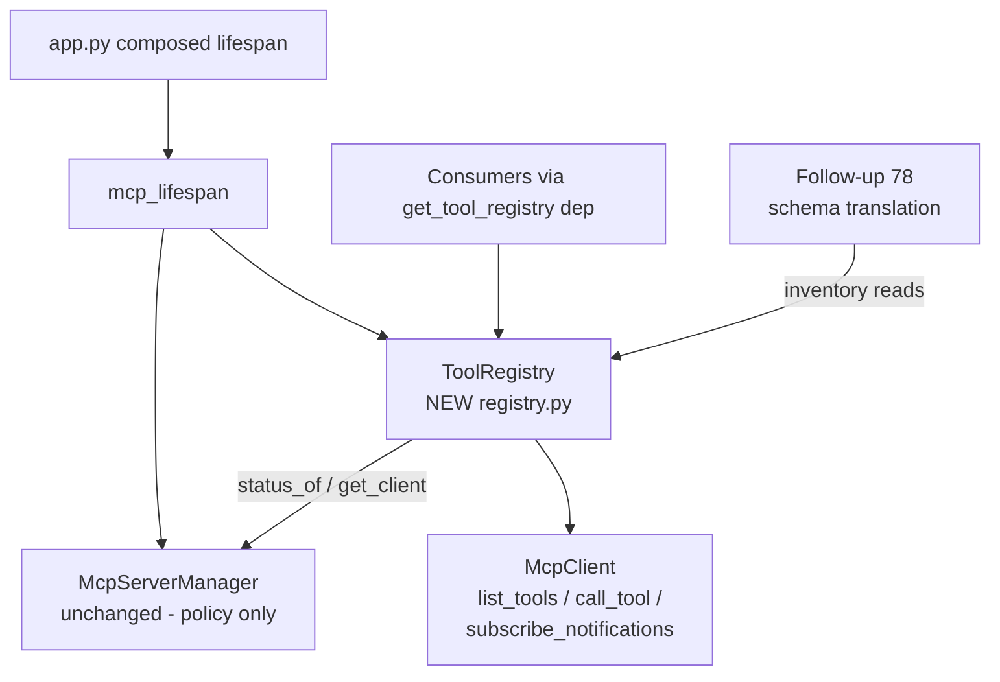

# Design: MCP Tool Discovery & Execution Engine — Inventory, Caching & Invocation

- **Issue:** #77 — feat(mcp): implement tool discovery and execution engine
- **Branch:** `feature/mcp-tool-discovery-execution`
- **Draft PR:** [#98](https://github.com/Svagtlys/Octave/pull/98)
- **Date:** 2026-09-21
- **Status:** Approved

## Problem

Issue #77 asks for `tools/list` (query connected servers for available tools +
cache results) and `tools/call` (invoke a named tool with arguments) on top of
the shipped JSON-RPC client, with error/timeout handling, exposing the tool
inventory to the rest of the harness for schema translation in follow-up #78.
It subsumes superseded issue #19 (tool discovery and caching) — this spec is
its scope reconciliation.

| Capability | Status | Evidence |
|---|---|---|
| Per-server `tools/list` / `tools/call` over JSON-RPC | Done | `McpClient.list_tools()` / `call_tool()` ([client.py](../../backend/src/octave/mcp/client.py)), #15 |
| Timeout + error translation at the SDK boundary | Done | `McpClient._run` → `McpTimeoutError` / `McpRpcError` / `McpConnectionError`, #15 |
| Multi-server fleet registry + supervision | Done | `McpServerManager` ([manager.py](../../backend/src/octave/mcp/manager.py)), #18 |
| Notification fan-out seam | Done | `McpClient.subscribe_notifications()`, #15 |
| **Fleet-wide tool inventory** | **Gap** | No object answers "what tools exist across all servers" |
| **Caching + invalidation of discovery results** | **Gap** | `list_tools()` hits the wire every call |
| **Unified execution surface over the fleet** | **Gap** | Callers must resolve `manager.get_client(id)` themselves |
| **Inventory consumption surface for #78** | **Gap** | Nothing publishes `ToolInfo` collections |

## Decisions from brainstorming

| # | Topic | Decision |
|---|-------|----------|
| 1 | Module placement | **New `ToolRegistry` module composed on `McpServerManager`.** The #18 spec scopes the manager as "policy only" (supervision); inventory cache state, invalidation tasks, and the execution surface live in a new `octave/mcp/registry.py`, published via `app.state.mcp_registry` + a `get_tool_registry` dep. Manager and client gain zero changes. |
| 2 | Invalidation | **Event-driven, no TTL.** Refresh a server's inventory when: its `restart_count` changes (detected lazily on read), it emits `notifications/tools/list_changed` (via `subscribe_notifications()`), or an explicit `refresh(id)`/`refresh_all()` runs. Zero timer traffic — matches the manager's passive/probe-on-demand posture (#18 decision 3). |
| 3 | Invocation addressing | **`(server_id, tool_name)`.** MCP does not guarantee cross-server name uniqueness; the registry forwards to `client.call_tool` without name resolution. Fleet-wide name resolution/namespacing is #78's schema-translation job. |
| 4 | Population & read semantics | **Eager kick-off + lazy fallback.** `mcp_lifespan` calls `registry.start()`, which spawns a background warm-up (wait per server for `connected`/`crashed`, then refresh) without blocking boot. Reads serve the cache; a read finding a server unpopulated or stale refreshes that server synchronously. Failed discovery keeps last-known-good tools, records `last_error`, logs `ERROR` — never raises from a read path (mirrors #18 decision 6: never fail fast). |
| 5 | Cursor pagination | **Out of scope; assumption recorded.** `McpClient.list_tools()` currently ignores `nextCursor` (first page only). The registry assumes `list_tools()` returns the complete inventory. Pagination is a client-level fix tracked as a **follow-up issue**; when fixed, the registry inherits correctness with zero changes. |

### Rejected alternatives

- **Extend `McpServerManager` with inventory/call methods** — contradicts the
  recorded #18 "policy only" scope, mixes cache state into the most
  concurrency-sensitive module, and grows supervision tests' surface.
- **Hybrid (pass-throughs on manager + logic elsewhere)** — two public paths to
  the same data; re-couples the layers the separation exists to keep apart.
- **TTL-based expiry** — adds a config knob, a staleness window, and background
  refresh races, to solve a problem `restart_count` + `list_changed` already
  solve deterministically.
- **Embedding tools for LLM lookup** — the program plan routes tool discovery
  for prompts through schema translation (#78) and role tagging (TODO #8–10);
  embeddings belong to the Context Vault (`vault_items`), and the 2026-09-21
  ADR keeps `octave.db` free of `octave.inference`. The inventory is derived,
  re-fetchable state — persisting/embedding a cache invites the desync
  problems that ADR exists to avoid.
- **Registry-side cursor paging via `send_request()`** — duplicates request
  plumbing and leaves the client subtly wrong for every other caller.

## Architecture



New module in `octave.mcp`:

- **`registry.py`** — `ToolRegistry` + `ServerToolInventory`. Composes on the
  manager's public API (`status()`, `status_of()`, `get_client()`); never
  imports the `mcp` SDK (quarantine rule holds — it touches only `McpClient`
  and `McpServerManager`). Registry-specific vocabulary lives in `registry.py`
  (precedent: `ServerStatus`/`ServerState` live in `manager.py`, not
  `types.py`); re-exported from `octave.mcp.__init__`.

Modified (additive only):

- `lifespan.py` — build registry on the manager; `await registry.start()` after
  `start_all()`; publish `app.state.mcp_registry`; `await registry.stop()` in
  teardown before `stop_all()`.
- `deps.py` — `get_tool_registry` (503 when absent, mirroring
  `get_mcp_manager`).
- `__init__.py` — re-exports `ToolRegistry`, `ServerToolInventory`.
- `tests/mcp/fixtures/echo_server.py` — add `fail_tool` and `slow_tool`
  fixtures (see Testing).

`client.py`, `manager.py`, `transport.py`, `config.py`, `types.py`,
`errors.py`: **no changes.** No new `McpSettings` knobs (YAGNI — the request
timeout already governs discovery and calls).

## Ownership & layering

`ToolRegistry` is the **tool-plane** counterpart to the manager's
**lifecycle-plane**:

- The manager remains the sole caller of client *lifecycle* methods
  (connect/aclose/restart). The registry only ever calls client *request*
  methods (`list_tools`, `call_tool`, `subscribe_notifications`) — safe for
  concurrent use per `McpClient`'s documented contract.
- The registry never starts, stops, or restarts servers. A discovery failure
  against a `connected` server is recorded, not acted on: supervision is the
  manager's job (a wedged server surfaces via the existing probe-on-timeout
  path when a request times out).
- Consumers reach the fleet through `get_tool_registry` (HTTP/WS routes, later
  services) or `app.state.mcp_registry` (in-process), alongside the existing
  `get_mcp_manager` for lifecycle/health.

## Data model & API

```python
class ServerToolInventory(BaseModel):
    """One server's cached tool inventory + freshness metadata."""

    server_id: str
    server_name: str
    state: ServerState          # manager state at read time
    tools: list[ToolInfo]       # last-known-good; empty if never fetched ok
    fetched_at: datetime | None # aware UTC; None until first success
    last_error: str | None      # last discovery failure (Octave msg, redacted)


class ToolRegistry:
    """Fleet-wide tool inventory + execution surface over McpServerManager."""

    def __init__(self, *, manager: McpServerManager) -> None: ...

    async def start(self) -> None
    # Enter an internal task group (manual entry, same-task convention as the
    # manager — lifespan calls start/stop from the lifespan task). Spawn:
    #   - one tools/list_changed listener per registered server, consuming
    #     client.subscribe_notifications();
    #   - one warm-up task: per server, poll status (in-memory, no MCP traffic)
    #     until connected/crashed, then refresh.

    async def stop(self) -> None
    # Cancel the task group; awaited. Idempotent.

    async def refresh(self, id: str) -> None
    # Re-run tools/list for one server under its lock. Unknown id ->
    # McpConfigError. Failure -> keep last-known-good, set last_error, log
    # ERROR, do not raise (read paths must stay safe). Raises only on
    # McpConfigError (unknown id).

    async def refresh_all(self) -> None
    # refresh(id) for every registered server (concurrent, per-server locks).

    async def inventory(self) -> list[ServerToolInventory]
    # Cache-served snapshot of every registered server, registration order.
    # Stale/unpopulated entries are refreshed synchronously first.

    async def tools_for(self, id: str) -> list[ToolInfo]
    # One server's tools; same staleness refresh as inventory().

    async def call_tool(
        self, id: str, name: str, arguments: dict[str, Any] | None = None
    ) -> ToolResult
    # Resolve via manager.get_client(id) and forward. Never consults the
    # cache to pre-validate names (see Execution).
```

Internal state: `dict[str, _CachedInventory]` keyed by server id — cached
`tools`, `fetched_at`, `last_error`, `restart_count_at_fetch` — plus a
per-server `anyio.Lock`. All mutation happens under the per-server lock;
reads of the dict are lock-free snapshots (same lock-free-read posture as the
manager).

## Invalidation & concurrency mechanics

**Staleness rule.** An entry is stale if `fetched_at is None` **or**
`manager.status_of(id).restart_count != restart_count_at_fetch`. A read of a
stale entry takes the server lock, re-checks staleness, and refreshes once —
concurrent readers coalesce into one `list_tools()` call. `restart_count` is
bumped by the supervisor on every successful (re)connect, so restarts,
crash-recoveries, and manual restarts all invalidate without a manager hook.

**`tools/list_changed` listener.** Per server: iterate
`client.subscribe_notifications()`; when `method ==
"notifications/tools/list_changed"`, run `refresh(id)`. The subscription
stream lives on the `McpClient` instance and survives restarts (the manager
retains the same client instance across restart cycles; `aclose()` does not
tear down notification senders), so listeners are restart-safe. Listener
bodies contain exceptions: a listener task failure is logged `ERROR` and the
task returns; the lazy staleness path remains as backstop.

**Failure posture.** `refresh` catches every `McpError` (including
`McpNotConnectedError`/`McpConnectionError` from a `crashed` or `stopped`
server): last-known-good `tools` are kept, `last_error` records the message,
`ERROR` is logged. `fetched_at` is **not** updated on failure, so the entry
stays stale and the next read retries. A server that has never fetched
successfully reports `tools=[]`, `fetched_at=None`, `last_error` set —
callers can distinguish "empty inventory" from "discovery failing".

**Warm-up.** `start()` spawns one task that, for each registered server, polls
`manager.status_of(id).state` on a short in-memory sleep until
`connected`/`crashed`, then refreshes. No MCP traffic while servers are
`starting`/`restarting`; boot is never blocked (decision 4). `start_all()`
returning before health is the manager's documented posture (#18); the warm-up
is the registry's answer to it.

## Execution path & error handling

`call_tool(id, name, arguments)` → `manager.get_client(id)` (unknown id →
`McpConfigError`) → `client.call_tool(name, arguments)` with **no cache
pre-validation**: the server is the source of truth for tool existence, and a
stale cache must never block a valid call. Error semantics are inherited, not
re-invented:

| Failure | Outcome |
|---|---|
| Server-side tool exception (MCP-level) | `ToolResult(is_error=True)` — returned, not raised |
| Unknown tool / invalid params (JSON-RPC error) | `McpRpcError` (code verbatim; -32602 typical) |
| Request exceeds `request_timeout_seconds` | `McpTimeoutError`; `on_lost("timeout")` fires → manager probe-on-timeout |
| Server dead / dying | `McpConnectionError` |
| Never connected | `McpNotConnectedError` |

Timeouts need no new machinery: `_run` already wraps every request in
`request_timeout_seconds` and a death-cancel scope. `call_tool` is a pure
forward — it adds addressing resolution and logging, nothing else.

**Logging** (per `.agents/rules/coding.md`): generate a correlation ID at each
`call_tool` and `refresh` entry point. Discovery success → `INFO` with server
id + tool count; discovery failure → `ERROR` with exception context
(`logger.exception`); `tools/list_changed` reaction → `INFO`. Never log
tool arguments (may carry user data) or env/secrets — log tool **names** and
counts only.

## Wiring

```python
# lifespan.py (sketch)
manager = McpServerManager(client_factory=client_factory)
... register ...
await manager.start_all()
app.state.mcp_manager = manager
registry = ToolRegistry(manager=manager)
await registry.start()
app.state.mcp_registry = registry
try:
    yield
finally:
    await registry.stop()
    await manager.stop_all()
```

Registry teardown precedes manager teardown so listeners stop consuming
streams before connections unwind. `deps.get_tool_registry` raises 503
"MCP tool registry not configured" when `app.state.mcp_registry` is absent —
same posture as `get_mcp_manager` (Octave boots fine without MCP servers).

## Scope reconciliation & deferrals

**#77 subsumes superseded #19** (tool discovery and caching): discovery is
the registry's refresh path, caching is the in-memory inventory with
event-driven invalidation. #19 needs no separate implementation.

Deferred, with triggers:

| Deferred | Trigger / home |
|---|---|
| `tools/list` cursor pagination | **Follow-up issue** (client-level fix in `list_tools()`; registry assumes completeness meanwhile) |
| REST endpoints for inventory/tool testing | MCP Connector UI work item (#18 decision 4: REST surface deferred) |
| Tool tagging, re-naming, re-describing | TODO MCP Connector #8–10; `ToolInfo` stays the raw vocabulary; overrides compose over the inventory later without reshaping it |
| Fleet-wide name resolution / namespacing | #78 schema translation (decision 3) |
| Per-call timeout overrides | When long-running tools appear; today `request_timeout_seconds` governs |
| Persisting the inventory | The inventory is derived, re-fetchable state — no persistence story until a cold-start cost is demonstrated |
| `notifications/resources/*`, output schemas, non-text content blocks | Existing client deferrals (#15 spec follow-ups) — unchanged |

## Testing

**Unit — `tests/mcp/test_registry.py`** (fake manager + fake clients, pattern
of `test_manager.py`; no subprocesses, no SDK):

1. Warm-up populates inventory once a fake server reaches `connected`.
2. `tools_for` on an unpopulated server fetches synchronously (lazy fallback).
3. `restart_count` bump observed on read → re-fetch; coalescing — N concurrent
   stale reads produce one `list_tools()` call.
4. Discovery failure keeps last-known-good, sets `last_error`, leaves
   `fetched_at` unchanged (next read retries); never raises from
   `inventory()`/`tools_for()`.
5. `notifications/tools/list_changed` on the fake notification stream triggers
   exactly one refresh.
6. `call_tool` forwards `(name, arguments)` to the right client; unknown id →
   `McpConfigError`; `is_error=True` result passes through; `McpRpcError`,
   `McpTimeoutError`, `McpConnectionError` propagate untranslated.
7. `refresh_all` covers every registered server; per-server failure isolated
   (one bad server doesn't drop others' entries).
8. `stop()` is idempotent; listener tasks exit cleanly.

**Integration — `tests/mcp/test_stdio_integration.py` + fixtures** (real
subprocess, same skip-env guard): extend `echo_server.py` with `fail_tool`
(raises → MCP-level `is_error=True`) and `slow_tool` (sleeps → `McpTimeoutError`
under a tiny `request_timeout_seconds`). Round-trip: `mcp_lifespan`-style
manager + registry over the real echo server → inventory lists `echo`,
`call_tool("echo", ...)` returns text, `fail_tool` yields `is_error=True`,
`slow_tool` raises `McpTimeoutError`.

**Wiring — `tests/mcp/test_lifespan.py` / `test_mcp_deps.py`:** lifespan
publishes `app.state.mcp_registry`; `get_tool_registry` resolves it and 503s
when absent.
