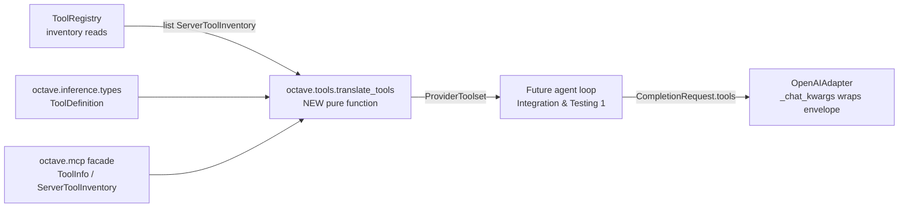

# Design: Tool Schema Translation Layer — MCP inputSchema → Provider-Native Tools

- **Issue:** #78 — feat: tool schema translation layer
- **Branch:** `feature/tool-schema-translation-layer`
- **Draft PR:** [#100](https://github.com/Svagtlys/Octave/pull/100)
- **Date:** 2026-09-22
- **Status:** Approved

## Problem

Issue #78 asks for the bridge between the two vocabularies shipped by #77 and
the inference adapter: MCP servers advertise tools with JSON Schema
`inputSchema` (`ToolInfo`, [mcp/types.py](../../backend/src/octave/mcp/types.py)),
while OpenAI-dialect engines expect a `tools` array of
`{"type": "function", "function": {name, description, parameters}}` objects on
`/chat/completions`. `CompletionRequest` ([inference/types.py](../../backend/src/octave/inference/types.py))
has no `tools` field, and nothing converts between the shapes. The #77 spec
recorded this work item as the home of **fleet-wide name resolution /
namespacing** (its decision 3); the inventory surface it needs
(`ToolRegistry.inventory()` / `tools_for()`) already exists.

| Capability | Status | Evidence |
|---|---|---|
| Per-server `ToolInfo` inventory with cache | Done | `ToolRegistry` ([mcp/registry.py](../../backend/src/octave/mcp/registry.py)), #77 |
| `CompletionRequest.tools` field | **Gap** | Not present in `inference/types.py` |
| MCP `inputSchema` → `function.parameters` | **Gap** | No translator anywhere |
| Envelope wrapping in the adapter | **Gap** | `_chat_kwargs` never emits `tools` |
| Fleet-wide name dedupe (prefixing) | **Gap** | Deferred to #78 by #77 decision 3 |
| Reverse routing (exposed name → server + tool) | **Gap** | Agent loop cannot yet resolve model tool calls |

## Decisions from brainstorming

| # | Topic | Decision |
|---|-------|----------|
| 1 | Name dedupe | **`mcp__<server_name>__<tool_name>` prefix (standard MCP-proxy convention).** Components sanitized to OpenAI's function-name charset `^[a-zA-Z0-9_-]{1,64}$`; whole name truncated to 64 chars. Prefix uses `server_name` (LLM-readable; unique-constrained by `uq_mcp_servers_name` in [models/mcp.py](../../backend/src/octave/db/models/mcp.py)); routing keys off `server_id` (stable PK). |
| 2 | Rename / re-describe | **Deferred to TODO MCP Connector #9–10** (user rename/description overrides). Issue exists; #78 ships dedupe + translation only. Overrides will compose over the translator input later without reshaping it. |
| 3 | Reverse mapping | **Emit now.** `translate_tools()` returns both provider-facing `tools` and a `routes` lookup (exposed name → `server_id` + original `tool_name`) so the agent loop never re-implements the prefixing scheme. Pure derivation from the same input. |
| 4 | Collisions | **Raise `ToolNameCollisionError`.** After sanitization/truncation, two tools landing on one exposed name is pathological (server names are unique; MCP forbids per-server duplicate tool names). Loud and deterministic beats silent renaming; auto-disambiguation returns only if a real fleet hits it. |
| 5 | Module placement | **New `octave/tools/` package** — pure translator importing both vocabularies; `octave.mcp` and `octave.inference` never import each other or the translator. Precedent: subsystem independence ADRs (`octave.db` never imports `octave.inference`). Future tool-plane concerns (tagging #8, overrides #9–10, routing) land in this package. |
| 6 | Schema body | **Verbatim passthrough minus `$schema`.** Octave never interprets JSON Schema (`ToolInfo` docstring invariant). Only the `$schema` key is stripped — local engines (Ollama/vLLM/llama.cpp) are strict about it. Deep copy; never mutate cached `ToolInfo`. |
| 7 | Envelope location | **Adapter wraps.** `ToolDefinition` stays Octave-neutral in `inference/types.py`; the `{"type": "function", ...}` envelope is built in `OpenAIAdapter._chat_kwargs` — same boundary rule as exception translation (SDK dialect stays inside the adapter). |

### Rejected alternatives

- **Pass-through names verbatim** — violates OpenAI's `^[a-zA-Z0-9_-]{1,64}$`
  charset for many real servers (dots, colons, CJK) and leaves cross-server
  duplicates unresolved; #77 explicitly assigned namespacing to #78.
- **Full namespacing + call-time routing in the registry** — registry stays a
  pure cache/call surface; routing is a translation-output concern (decision 3).
- **Translator inside `octave.mcp` or `octave.inference`** — forces a
  subsystem→subsystem dependency in one direction (MCP knowing provider
  dialect, or inference knowing MCP vocabulary). Rejected in brainstorming.
- **`tool_choice` / `parallel_tool_calls` first-class fields** — YAGNI; they
  flow through `CompletionRequest.extra` → `extra_body` today.
- **Silent numeric-suffix disambiguation on collision** — unstable names across
  inventory refreshes (suffix order depends on iteration order), which would
  silently break any persisted agent-loop decisions.

## Architecture



New package `backend/src/octave/tools/`:

- **`types.py`** — `ToolRoute`, `ProviderToolset` (translation-output vocabulary).
- **`errors.py`** — `ToolTranslationError(Exception)` base; `ToolNameCollisionError` subclass.
- **`translate.py`** — `translate_tools()` pure function + name sanitization helpers.
- **`__init__.py`** — re-exports `translate_tools`, `ProviderToolset`, `ToolRoute`, errors.

Modified (additive only):

- `inference/types.py` — `ToolDefinition` model; `CompletionRequest.tools: list[ToolDefinition] | None = None`.
- `inference/openai_adapter.py` — `_chat_kwargs` emits the `tools` envelope when `request.tools` is non-empty.

`octave/mcp/*`: **no changes.** No new settings knobs. No runtime wiring — the
consumer (agent loop) is a later work item; this issue ships the complete seam.

## Data model & API

```python
# octave/inference/types.py (additive)
class ToolDefinition(BaseModel):
    """One tool in Octave's provider-neutral shape. The adapter wraps it
    into the provider envelope; SDK types never appear here."""

    name: str
    description: str | None = None
    parameters: dict[str, Any] = Field(default_factory=dict)

class CompletionRequest(BaseModel):
    ...
    tools: list[ToolDefinition] | None = None

# octave/tools/types.py
class ToolRoute(BaseModel):
    """Reverse-resolution target for one exposed tool name."""

    server_id: str
    tool_name: str
    """Original (unprefixed) MCP tool name."""

class ProviderToolset(BaseModel):
    """Translator output: what the engine sees + how to route calls back."""

    tools: list[ToolDefinition]
    routes: dict[str, ToolRoute]
    """Exposed name -> route. Keys match ``tools[*].name`` exactly."""

# octave/tools/errors.py
class ToolTranslationError(Exception):
    """Base for translation failures."""

class ToolNameCollisionError(ToolTranslationError):
    """Two tools landed on the same exposed name after sanitization."""

# octave/tools/translate.py
def translate_tools(
    inventories: Sequence[ServerToolInventory],
) -> ProviderToolset:
    """Pure: fleet inventories -> provider tool defs + reverse routes.

    Raises ToolNameCollisionError when two tools expose the same name.
    Never mutates inputs; no I/O, no logging.
    """
```

## Translation mechanics

**Exposed name.** For each `(inventory, tool)`:

1. `component = re.sub(r"[^a-zA-Z0-9_-]", "_", s)` applied independently to
   `inventory.server_name` and `tool.name`.
2. Join: `mcp__{sanitized_server}__{sanitized_tool}`.
3. Truncate the whole name to 64 chars (`[:64]`).

**Collision.** After step 3, if the exposed name is already claimed within
this call, raise `ToolNameCollisionError` naming both sources
(`server_id/tool_name` pairs). Detection is per-call; stateless translator.

**Route.** `routes[exposed_name] = ToolRoute(server_id=inv.server_id, tool_name=tool.name)`
— `server_id` for addressing (matches `ToolRegistry.call_tool(id, name)`),
original `tool_name` for the wire call.

**Schema body.** `parameters = copy.deepcopy(tool.input_schema)` with the
`$schema` key removed at the top level. Everything else verbatim — `$defs`,
`definitions`, `anyOf`, `enum`, nesting all pass through untouched. Octave
never validates or rewrites JSON Schema internals.

**Description.** `tool.description` forwarded; `None` omitted from the
provider payload (`model_dump(exclude_none=True)` at envelope time).

**Ordering.** Inventories in input order, tools in per-server order —
deterministic output for a given input snapshot.

**Empty inputs.** No inventories, or inventories with `tools=[]` (never
fetched / failed discovery), contribute nothing. All-empty input returns an
empty `ProviderToolset` — callers decide whether to send `tools` at all.

## Adapter forwarding

In `_chat_kwargs` (shared by `complete` and `stream`):

```python
if request.tools:
    kwargs["tools"] = [
        {"type": "function", "function": tool.model_dump(exclude_none=True)}
        for tool in request.tools
    ]
```

Omitted entirely when `tools` is `None` or empty (some local engines behave
differently with an explicit empty array). `tool_choice`,
`parallel_tool_calls`, and friends flow through `extra` → `extra_body`
unchanged. No changes to `complete`/`stream` bodies, error translation, or
the SDK quarantine rule.

## Scope reconciliation & deferrals

| Deferred | Trigger / home |
|---|---|
| Response-side `tool_calls` parsing (assistant messages, streaming deltas) | Agent-loop work item (Integration & Testing #1) — #78 ships request-side only, per issue scope |
| Tool rename / re-describe overrides | TODO MCP Connector #9–10 (existing issue; user decision 2026-09-22) |
| Tool tagging (`kb_read` etc.) | TODO MCP Connector #8 |
| Collision auto-disambiguation | Only if a real fleet triggers `ToolNameCollisionError` |
| `tool_choice` / `parallel_tool_calls` first-class fields | When a caller needs them; `extra` carries them meanwhile |
| Registry→translator glue service | Agent loop composes `inventory() → translate_tools()` itself; a convenience wrapper waits for a second consumer |
| `strict` mode / structured outputs | Engine capability matrix work item |

## Testing

**Unit — `tests/tools/test_translate.py`** (pure functions, hand-built
`ServerToolInventory` fixtures; no manager, no SDK):

1. Happy path: one server, one tool → correct exposed name, envelope-ready
   `parameters`, route entry.
2. Multi-server / multi-tool: ordering deterministic; all routes present.
3. Sanitization: dots/colons/spaces/CJK in server or tool name → `_`.
4. Truncation: >64-char composed name cut to exactly 64.
5. Collision: two servers whose sanitized names collide → `ToolNameCollisionError`
   naming both sources.
6. Routes map to `server_id` + **original** (unsanitized) tool name.
7. `$schema` stripped; sibling keys (`type`, `properties`, `required`,
   `$defs`) verbatim and deep-equal to input.
8. Input not mutated (deep-copy check); cached `ToolInfo` safe.
9. `description=None` → field absent in dump; present when set.
10. Empty inventories / empty `tools=[]` / empty input → empty `ProviderToolset`.

**Unit — `tests/inference/test_types.py`:** `CompletionRequest` defaults
`tools=None`; round-trips a list of `ToolDefinition`.

**Adapter — `tests/inference/test_openai_adapter.py`** (`httpx.MockTransport`):

11. `complete()` with tools → request body carries
    `{"type": "function", "function": {...}}` envelope, `exclude_none` applied.
12. `stream()` with tools → same envelope on the stream request body.
13. No tools / empty list → body has no `tools` key.

**Package hygiene — `tests/tools/test_package.py`:** `octave.tools` imports
neither `openai` nor `mcp` SDK (guards the quarantine posture, mirrors
`tests/inference/test_package.py`).
