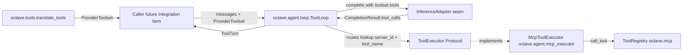
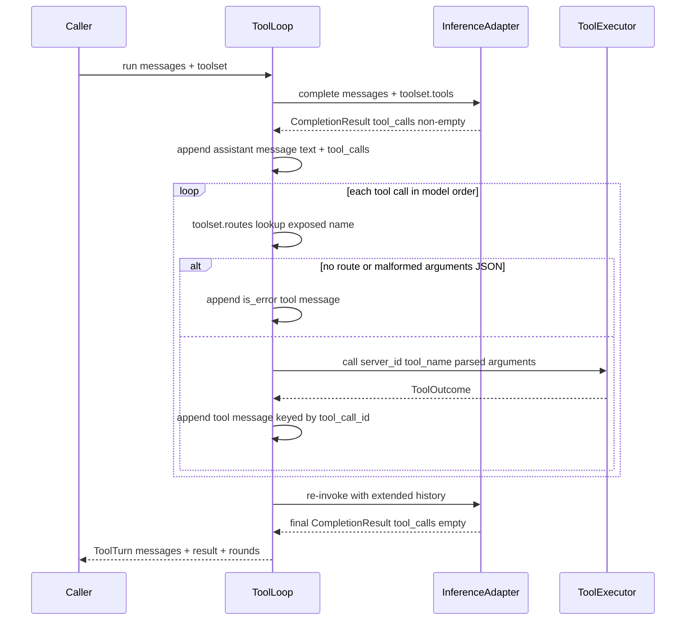

# Design: Tool-Use Orchestration Loop — reason → act → observe

- **Issue:** #79 — feat(agent): implement tool-use orchestration loop
- **Branch:** `feature/tool-use-orchestration-loop`
- **Draft PR:** [#103](https://github.com/Svagtlys/Octave/pull/103)
- **Date:** 2026-09-25
- **Status:** Approved

## Problem

Issue #79 asks for the loop that turns a tool-capable LLM into an agent:
detect `finish_reason == "tool_calls"` in completions, execute the requested
calls against MCP servers, feed results back as tool messages, and re-invoke
the model for final synthesis. Every prerequisite seam has shipped and each
explicitly deferred its half of this bridge:

| Capability | Status | Evidence |
|---|---|---|
| `CompletionRequest.tools` + request-side envelope | Done | `inference/types.py`, `OpenAIAdapter._chat_kwargs`, #78 |
| MCP tool inventory + `(server_id, tool_name)` call surface | Done | `ToolRegistry.call_tool`, #77 |
| Exposed-name → route reverse map (`ProviderToolset.routes`) | Done | `octave.tools.translate`, #78 |
| `finish_reason` surfaced on `CompletionResult` | Done | `inference/types.py` |
| `CompletionResult.tool_calls` parsing | **Gap** | `OpenAIAdapter.complete` drops `choice.message.tool_calls` |
| Assistant message carrying `tool_calls` | **Gap** | `Message` has no tool vocabulary |
| `role="tool"` result messages | **Gap** | `Role` lacks `"tool"`; no `tool_call_id` |
| Tool-call → MCP `tools/call` mapping + result wrapping | **Gap** | No composition layer exists |
| Multi-tool-call turns, error surfacing to the LLM | **Gap** | No loop anywhere |

The #78 spec recorded this work item as the consumer that composes
`inventory() → translate_tools()` and named "response-side `tool_calls`
parsing" as its scope. This design ships the complete loop as a library
primitive.

## Decisions from brainstorming

| # | Topic | Decision |
|---|-------|----------|
| 1 | Scope | **Library-only.** Loop primitive + inference adapter changes + tests. Collaborators injected; no routes, no lifespan wiring, no session persistence — the Integration & Testing work item composes it with `ToolRegistry` + lifespans. Matches how #8/#15/#77/#78 shipped seams without consumers. |
| 2 | Loop termination | **`max_tool_rounds: int = 8` constructor option; hitting the limit raises `ToolLoopLimitError`** carrying `.messages` (partial transcript). Silent truncation is a footgun: the truncated result's `finish_reason == "tool_calls"` is indistinguishable from a clean answer without disciplined inspection. "Loud and deterministic beats silent" (#78 decision 4 precedent). |
| 3 | Error taxonomy | **Two-tier split.** Model-correctable failures become `is_error` tool messages and the loop continues; orchestration-fatal conditions raise. `ToolError(Exception)` added as package base in `octave.tools.errors`; `ToolTranslationError` re-based under it (backward-compatible); `ToolLoopLimitError(ToolError)` new. |
| 4 | Message model | **OpenAI-dialect minimal (additive).** `ToolCall(id, name, arguments: str)`; `Message` gains `tool_calls`/`tool_call_id`/`name`, `Role` gains `"tool"`; `CompletionResult` gains `tool_calls`. The whole stack (Ollama/vLLM/llama.cpp/LM Studio) speaks this wire shape; Anthropic-style content blocks would need re-translation back to it and break every existing `Message` caller. |
| 5 | Arguments representation | **Raw JSON string on `ToolCall.arguments`**, exactly as the wire provides — mirrors the `ToolInfo.input_schema` "never interpret" posture. The loop parses to a dict for the executor; malformed JSON is model-correctable → `is_error` tool message, never an exception. Keeps the adapter a lossless translator. |
| 6 | Package placement | **New `octave/agent/` package** — the composition layer and future Agent Manager home (`octave.agent.loop`, later `.manager`/`.registry`/`.router`). `octave.tools` stays pure (no I/O, `test_package.py` AST guard untouched); `octave.agent` is the only package importing both `octave.mcp` and `octave.inference`. Package docstring states which Agent-Manager components exist vs. are planned. |
| 7 | MCP access | **`ToolExecutor` Protocol + `McpToolExecutor`.** The loop depends only on the Protocol (`async call(server_id, tool_name, arguments) -> ToolOutcome`, never raises for tool-level failures); `McpToolExecutor` wraps `ToolRegistry` and owns `McpError → ToolOutcome(is_error=True)` conversion. Testability without a live fleet; the integration item swaps in richer executors (tagging, retries) without touching the loop. |
| 8 | Toolset input | **Loop consumes a pre-built `ProviderToolset`.** Honors #78's "the consumer composes `inventory() → translate_tools()` itself"; no new registry→translator glue service (waits for a second consumer). |
| 9 | Execution order | **Sequential within a turn, in model call order** (deterministic history). Concurrent fan-out deferred — follow-up issue drafted at [`plans/2026-09-25-issue-concurrent-tool-execution.md`](../../plans/2026-09-25-issue-concurrent-tool-execution.md); protocol invariant (all N results before next completion) is identical either way. |
| 10 | Streaming | **Deferred non-goal.** `CompletionChunk` unchanged; delta accumulation of `tool_calls` across stream chunks is its own concern (arrives with the streaming UI work item). |

### Rejected alternatives

- **Content-block message model (Anthropic-style).** Engine-portable in
  theory; in practice every target engine speaks the OpenAI tool-calling wire
  shape, so the adapter would translate blocks → OpenAI payloads anyway.
  Breaking change to every `Message` construction site for zero present gain.
- **Side-channel tool-call structure (keep `Message` frozen).** Provider
  history rules require assistant-with-`tool_calls` messages *in* the history
  immediately followed by their results; splitting one ordered transcript
  across two structures forces sync invariants on every consumer.
- **Loop inside `octave.tools`.** Dilutes the package's documented pure
  functions / no-I/O contract (#78 decision 5) and drags `octave.mcp`
  imports into a package whose test guards purity via AST scan.
- **Async generator loop (yield events).** Event streaming is a streaming/UI
  concern; deferred with it. The class-based primitive leaves room to add it
  later without signature churn on the terminal result.
- **Silent stop at round limit.** Returned transcript would be indistinguishable
  from a clean final answer for callers that don't inspect `finish_reason`.
- **Raising on tool failures.** Defeats the loop's purpose: the model must see
  failures as tool results to retry, rephrase, or give up gracefully.

## Architecture



Dependency posture:

- `octave.agent` imports `octave.inference` (types + `InferenceAdapter` ABC)
  and `octave.tools` (types) — and `octave.mcp` **only** inside
  `mcp_executor.py`. No SDK imports anywhere in the package (new
  `tests/agent/test_package.py` AST guard, mirroring `tests/tools/test_package.py`).
- `octave.tools` unchanged except `errors.py` gaining the `ToolError` base.
- `octave.inference` changes are additive types + `OpenAIAdapter` response
  parsing; the SDK quarantine rule is untouched.
- Responses-API compatibility: a future adapter maps `function_call` /
  `function_call_output` wire items to/from the same Octave types internally;
  nothing above the adapter seam changes.

## Data model & API

```python
# octave/inference/types.py (additive)
class ToolCall(BaseModel):
    """One tool call as the model requested it. `arguments` is the raw JSON
    string from the wire; Octave never interprets it (adapter stays lossless)."""

    id: str
    name: str
    arguments: str

Role = Literal["system", "user", "assistant", "tool"]

class Message(BaseModel):
    role: Role
    content: str
    tool_calls: list[ToolCall] | None = None   # assistant messages
    tool_call_id: str | None = None            # tool messages
    name: str | None = None                    # tool messages: exposed tool name

class CompletionResult(BaseModel):
    ...
    tool_calls: list[ToolCall] | None = None

# octave/tools/errors.py (additive restructure)
class ToolError(Exception):
    """Base for tool-plane failures (translation and orchestration)."""

class ToolTranslationError(ToolError): ...  # existing, re-based

# octave/agent/errors.py
class ToolLoopLimitError(ToolError):
    """max_tool_rounds exhausted without a final answer."""

    def __init__(self, message: str, *, messages: list[Message]) -> None:
        super().__init__(message)
        self.messages = messages

# octave/agent/types.py
class ToolOutcome(BaseModel):
    """Flattened result of one tool execution."""

    content: str
    is_error: bool = False

class ToolTurn(BaseModel):
    """Result of one orchestrated turn."""

    messages: list[Message]
    """Input + appended assistant/tool messages + final assistant message."""

    result: CompletionResult
    """The final (no tool_calls) completion."""

    tool_rounds: int
    """Tool-execution rounds performed."""

# octave/agent/executor.py
class ToolExecutor(Protocol):
    """Executes one resolved tool call. Must not raise for tool-level
    failures — return ToolOutcome(is_error=True) instead."""

    async def call(
        self, server_id: str, tool_name: str, arguments: dict[str, Any]
    ) -> ToolOutcome: ...

# octave/agent/mcp_executor.py
class McpToolExecutor:
    """ToolExecutor over ToolRegistry. Joins text content blocks with
    newlines; empty content becomes '(no output)'. Catches McpError
    (Rpc/Timeout/Connection/Config/NotConnected) -> ToolOutcome(is_error=True)."""

    def __init__(self, registry: ToolRegistry) -> None: ...

# octave/agent/loop.py
class ToolLoop:
    def __init__(
        self,
        *,
        adapter: InferenceAdapter,
        executor: ToolExecutor,
        max_tool_rounds: int = 8,
    ) -> None: ...

    async def run(
        self,
        messages: list[Message],
        toolset: ProviderToolset,
        *,
        model: str | None = None,
    ) -> ToolTurn: ...
```

## Loop mechanics



- **Trigger:** a tool round runs iff `result.tool_calls` is non-empty.
  Content is the signal; `finish_reason` is advisory — some local engines
  emit `"stop"` alongside populated tool calls, and engines that set
  `"tool_calls"` always populate the field. `finish_reason == "tool_calls"`
  with an empty/absent list is treated as final (engine bug, not a loop).
- **History order:** assistant message (with `tool_calls`) immediately
  followed by exactly one `role="tool"` message per call, keyed by
  `tool_call_id`, carrying `name` = exposed name. This is the provider
  invariant; the loop constructs it unconditionally.
- **Round accounting:** `max_tool_rounds` bounds tool-execution rounds; the
  synthesis completion always follows the last executed round, so a limit of
  N permits at most N executions. `ToolTurn.tool_rounds` reports the count.
- **Tools on every request:** `toolset.tools` is sent each round, enabling
  multi-round chains.
- **Returned transcript:** `ToolTurn.messages` is the complete turn
  (input + everything appended, including the final assistant message),
  ready for later persistence by the transcript/session work item.
- **`tool_call_id` provenance:** always the model's own id — echoed exactly,
  never generated or rewritten (strict engines validate the pairing).

## Error handling — the two-tier split

**Tier 1 — model-correctable → `is_error` tool message, loop continues:**

| Condition | Detected by | Tool message content |
|---|---|---|
| `arguments` not valid JSON object | loop (parse step) | `Tool call arguments are not a valid JSON object: <detail>` |
| Exposed name not in `routes` (hallucinated call) | loop (route lookup) | `Unknown tool: <name>` |
| MCP-level tool failure (`ToolResult.is_error=True`) | `McpToolExecutor` | joined content, `is_error=True` |
| `McpRpcError` / `McpTimeoutError` / `McpConnectionError` / `McpConfigError` / `McpNotConnectedError` | `McpToolExecutor` | `Tool execution failed: <exception message>` |
| Empty tool output | `McpToolExecutor` | `(no output)` sentinel (some engines reject empty content) |

**Tier 2 — orchestration-fatal → raise:**

- `ToolLoopLimitError` with `.messages` — caller can persist the partial
  transcript, show partial work, or retry.
- `AdapterError` (or subclass) from the inference call propagates untouched —
  the adapter's contract; no retries here (adapter `max_retries` owns that).

Rationale: the model can recover from Tier 1 by retrying the call, changing
tools, or answering around the failure — it must see failures *as tool
results*. Tier 2 conditions are invisible or meaningless to the model.

## Scope reconciliation & deferrals

| Deferred | Trigger / home |
|---|---|
| Streaming `tool_calls` delta accumulation (`CompletionChunk`) | Streaming chat work item (UI Chat #3) |
| Concurrent execution of multiple calls in one turn | Drafted issue: [`plans/2026-09-25-issue-concurrent-tool-execution.md`](../../plans/2026-09-25-issue-concurrent-tool-execution.md) |
| Registry→translator→loop convenience glue + lifespan/deps wiring | Integration & Testing #1 |
| Session/event persistence of `ToolTurn.messages` | Transcript persistence work item (sessions/events schema exists) |
| Agent Manager (lifecycle, registry, router) | Agent Manager #1–6 — same `octave.agent` package, later modules |
| `tool_choice` / `parallel_tool_calls` first-class fields | Ride `CompletionRequest.extra` until a caller needs them (#78 precedent) |
| Tool rename/re-describe overrides, tagging | TODO MCP Connector #8–10 — compose over translator input |
| Progress/observability events (UI shows in-flight tool calls) | Arrives with streaming; orthogonal to model history |

## Testing

**Inference — `tests/inference/test_types.py`:** `ToolCall` round-trip;
`Message` with/without tool fields defaults `None`; `CompletionResult.tool_calls`
default `None`; `role="tool"` validates.

**Inference — `tests/inference/test_openai_adapter.py`** (`httpx.MockTransport`):

1. Response carrying `choice.message.tool_calls` → parsed to
   `CompletionResult.tool_calls` with id/name/arguments verbatim.
2. Response without tool calls → `tool_calls is None`.
3. Request with assistant `tool_calls` message → body carries
   `tool_calls: [{id, type: "function", function: {name, arguments}}]`.
4. Request with `role="tool"` message → body carries `tool_call_id`, `name`.
5. Plain messages → body has **no** `tool_calls`/`tool_call_id`/`name` null
   keys (`exclude_none=True` regression guard).
6. `arguments` passed through as opaque string (no re-serialization).

**Agent loop — `tests/agent/test_loop.py`** (scripted fake adapter queue +
recording fake executor):

7. No tool calls first round → passthrough; `tool_rounds == 0`; messages =
   input + final assistant.
8. One round, multiple calls → assistant + N tool messages in call order;
   second completion returns final; history ordering asserted exactly.
9. Multi-round chain (tool → tool → final) → two rounds, ordering across
   rounds.
10. Limit exhausted → `max_tool_rounds = N`: the first N completions return
    tool_calls (all executed); the (N+1)th synthesis completion also returns
    tool_calls → `ToolLoopLimitError`; `.messages` ends on that unfulfilled
    assistant message (no tool messages appended for it); total adapter calls
    exactly N+1.
11. `finish_reason="tool_calls"` but empty list → treated as final.
12. Malformed arguments JSON → `is_error` tool message with the call's id;
    executor not invoked for that call; other calls in the turn proceed.
13. Unknown exposed name → `is_error` tool message; executor not invoked.
14. Executor `is_error=True` outcome → tool message `is_error=True`, loop
    continues.
15. `AdapterError` from any round propagates untouched.
16. `tool_call_id` echo: each tool message's id matches its call's id.

**MCP executor — `tests/agent/test_mcp_executor.py`** (fake/stubbed
`ToolRegistry`):

17. Text blocks joined with newlines; `is_error` passthrough.
18. Empty content → `"(no output)"`.
19. Each `McpError` subclass → `ToolOutcome(is_error=True)` with message
    included; nothing raised.
20. Arguments dict forwarded to `registry.call_tool` verbatim.

**Package hygiene — `tests/agent/test_package.py`:** AST guard — `octave.agent`
imports neither `openai` nor `mcp` SDK; re-export surface matches `__all__`.

**Translator regression:** existing `tests/tools/*` green with `ToolError`
re-base (`ToolTranslationError` still catchable as before; `isinstance`
chain asserted).
