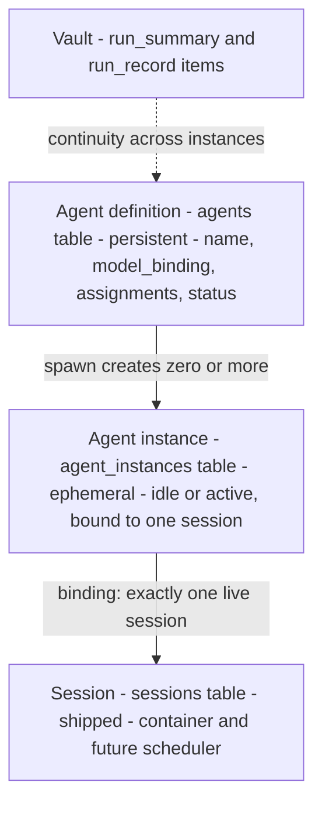
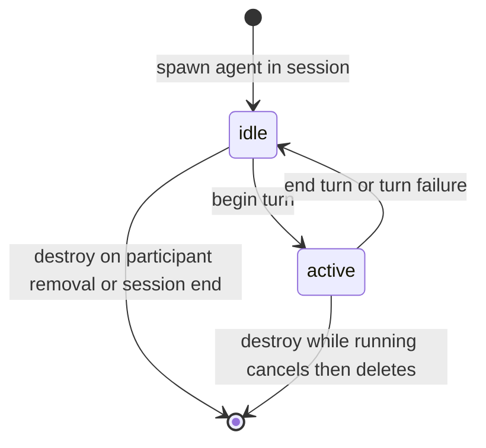

# Agent Lifecycle Model — Design

> Issue: #25 (scope redesigned in planning) · PR: #105 · Branch: `feature/agent-lifecycle-model`
> Date: 2026-09-27 · Status: Approved in brainstorming
> Depends on: 2026-09-13 Sessions/Events/Participants ADR, 2026-09-20 Context Vault Data Model ADR
> Consumers: Agent Manager roadmap #2–#6, Context Manager #5, Agent Manager UI

## Problem Statement

Issue #25 as originally written ("spawned, running, paused, resumed, terminated")
places a single lifecycle on the **agent definition** (`agents.status`). That
contradicts two requirements surfaced during planning:

1. **Isolation** — one user talking to the same agent in multiple sessions (or
   multiple users) must not share running state. A `status` column on the
   definition row makes pause in one session pause it everywhere.
2. **Mobility** — an agent's running context should be movable to a new session
   in the future. A lifecycle welded to a single row offers no seam between
   "the thing the user configured" and "the thing currently executing".

The shipped schema already half-agrees: `sessions` owns its own status, and the
2026-09-13 ADR deliberately deferred orchestration (`mode`,
`driver_participant_id`, `turn_policy`) to this area of work.

## Design Decisions (from brainstorming)

| # | Decision | Rejected alternative |
|---|----------|----------------------|
| 1 | Split **definition** (persistent config) from **instance** (ephemeral runtime binding to one session) | Lifecycle on the `agents` singleton |
| 2 | The session is the scheduler: "this agent doesn't get the next turn" is session turn-policy, not instance state | Instance-level `paused` gate |
| 3 | Instances are **ephemeral**: created on spawn, hard-deleted on removal. They carry **no context** — live context *is* the session transcript; long-term memory *is* the vault | Persistent instance rows with `terminated` tombstones; dormant detach state |
| 4 | `pause` exists only on the **definition** ("don't run this agent anywhere"); terminate-in-session is `session_participants.left_at` | `paused`/`terminated` instance states |
| 5 | Run archival is **decoupled from instance lifecycle**: `run_record` appends ride the turn boundary; instance destroy is a pure row delete | Archive-on-destroy hook |
| 6 | Definition assignments (prompt, skills, preferences) are **named vault-item references in a JSON column**, per the vault ADR's convention | Inline prompt TEXT; eager link tables |

## Entity Model



- **Definition** (`agents`): user-authored configuration; read-only at runtime.
  The only place `paused` exists.
- **Instance** (`agent_instances`, new): the runtime binding of a definition to
  a session. Exists only while it can take turns. Holds no private context, so
  nothing is stored twice — the vault and the transcript remain the sole
  persistent context stores.
- **Session**: unchanged by this spec. Owns its lifecycle
  (`active | waiting | completed | failed | cancelled`) and will own
  `turn_policy` (2026-09-13 ADR deferral).

**Isolation guarantee:** N sessions running one agent produce N independent
instances with zero shared mutable state. The definition row is never written
during execution; `instance_id` keys all running state.

**Mobility:** "moving an instance to a new session" = spawn a fresh instance in
the target session. Continuity flows from the unchanged definition plus vault
retrieval (`run_record` provenance is keyed by `session_id`/`agent_id`, never
`instance_id`). No detach races, no garbage collection of dormant rows.

## Schema Changes

### `agents` (modified)

| Column | Change | Notes |
|---|---|---|
| `id`, `name`, `created_at` | keep | |
| `model_binding` (JSON) | **replaces `model_tag`** | Pydantic discriminated union (below). Migration copies existing `model_tag` values into tag form |
| `assignments` (JSON) | new | Named vault-item references (below) |
| `status` | narrow to `active \| paused` | `terminated` dropped for definitions. App-validated enum `AgentStatus`; deleting a definition is a row delete (see Deletion caveat) |

`ModelBinding` union (discriminator `kind`):

```json
{"kind": "tag", "tag": "thinking"}
{"kind": "explicit", "adapter": "openai", "model": "llama3"}
```

`AgentAssignments` (extra keys allowed, per vault `meta` convention):

```json
{"prompt": "<vault_item_id or null>", "skills": ["<vault_item_id>"], "preference_tags": ["<tag>"]}
```

- References are app-validated strings; the DB does not understand them
  (deliberate, matching `vault_items.meta` conventions from 2026-09-20).
- **Dangling references are tolerated at resolution time** (skip + warn):
  vault items may be edited/deleted between turns; an agent with a missing
  prompt simply runs without a system prompt.
- **Link-table promotion triggers** (recorded per the 2026-09-20 deferral
  rule): promote `agent_prompts`/`agent_skills`/`agent_preferences` join tables
  when (i) a consumer needs reverse lookup ("which agents use vault item X"),
  or (ii) vault deletion requires DB-enforced `RESTRICT` semantics.

### `agent_instances` (new)

| Column | Type | Notes |
|---|---|---|
| `id` | TEXT PK | ULID |
| `agent_id` | FK → `agents.id`, `RESTRICT` | refuse deleting an agent with live instances |
| `session_id` | FK → `sessions.id`, `CASCADE` | session ends → instances die |
| `status` | TEXT, app-validated `InstanceStatus` | `idle \| active` — TEXT by house style (no DB CHECK; cf. 2026-09-13 ADR rationale for `events.kind`) |
| `created_at` / `updated_at` | `UTCDateTime` | |

Constraint: `UniqueConstraint(agent_id, session_id)` — one live instance per
agent per session. Rows are hard-deleted on destroy, so a later re-invite of
the same agent into the same session inserts cleanly under a fresh `instance_id`
and extends the same `(session_id, agent_id)` archival lineage.

### Vocabulary placement

`AgentStatus`, `InstanceStatus`, `ModelBinding`, `AgentAssignments` live in
`octave.db.types` alongside `EventKind`/`VaultKind`, following the established
app-validated-enum pattern. The ORM `AgentInstance` model lives in
`octave.db.models.instances`.

## Lifecycle State Machine



All transitions are enforced by a single write path — `AgentInstanceManager`
(in `octave.agent`), which follows the `VaultStore` transaction convention:
operates on a caller-supplied session, **never commits**.

1. **spawn(agent, session)** — requires definition `status = active` and a
   resolvable tag-form binding; requires the session not be in a terminal
   status. Creates the instance row (`idle`) and a `session_participants`
   membership row (`role = speaker`) if absent. Spawning a paused definition
   raises `AgentPausedError`. Spawning a duplicate raises `InstanceExistsError`.
2. **begin_turn(instance)** — `idle → active` via atomic
   `UPDATE ... WHERE id = ? AND status = 'idle'`; rowcount 0 raises
   `TurnInProgressError`. This mutex *is* the interference guarantee: two
   callers can never drive one instance concurrently.
3. **end_turn(instance)** — `active → idle`. Turn failure (adapter error,
   `ToolLoopLimitError`) still lands `idle`; the error is an event in the
   session, not instance state. There is no `failed` instance status — sessions
   already own `failed`.
4. **destroy(instance)** — pure row delete. No hook, no archival coupling,
   nothing to roll back. Triggered by participant removal (`left_at` set) or
   session end (FK cascade).
5. **Crash reconciliation** — a manager startup hook resets any `active` row
   to `idle` with a warning log. The interrupted turn is already visible as a
   truncated transcript in `events`; no zombie states survive restart.

**Pause semantics:** pausing a definition prevents new spawns and new
`begin_turn` calls; already-`active` turns run to completion (no kill — pause
is a policy gate, not an interrupt). Resuming restores both.

**Mapping from the original issue vocabulary:** `spawned` → spawn + `idle`;
`running` → `active`; `paused` → definition status (session-scoped refusal is
`turn_policy`, deferred); `resumed` → transition, not a state; `terminated` →
`left_at` in-session, definition pause everywhere; instance destroy carries no
name because it is just a delete.

## Model Binding Resolution

At spawn (or first turn), the manager resolves `model_binding` to a concrete
`(adapter, model)` pair for `CompletionRequest`:

- `tag` form → resolved through the inference registry's model-tag lookup
  (roadmap Inference #7). **Tag miss fails loud at spawn**: an agent with no
  usable model is unusable; silent fallback would hide misconfiguration.
- `explicit` form → used directly. Adapter existence is validated when the
  definition is saved (a contract for the future definition CRUD routes), not
  at spawn — config may legitimately change between turns.

The resolved pair is **not persisted** on the instance: binding edits take
effect on the next turn, and the instance stays a thin binding record.

## Archival Contract (turn boundary, not instance lifecycle)

An agent leaving a session does not end the run — other participants remain and
the session may continue. Archival therefore rides the **turn boundary**:

- **`run_record`** (verbatim chunks): extended at `end_turn` to cover the
  completed `seq` range, scoped by existing vault provenance
  (`session_id`, `agent_id`, `seq_range`). Cheap (no inference), always
  current, crash-safe: a lost append is recoverable because `events` remains
  the source of truth.
- **`run_summary`** (headline prose): regeneration requires an LLM call, so
  per-turn refresh is not mandated. This spec records the requirement — the
  summary stays fresh with respect to the session — and defers trigger policy
  (per-N-turns / session-end / on-demand) to Context Manager #5, which the
  2026-09-20 ADR already designated as owner of archival triggers.
- The mechanism (callback, event, or direct `VaultStore` composition) is chosen
  by CM #5. This spec's obligation is only that the turn-completion path
  exposes the completed `seq` range per `(session_id, agent_id)`.

## Integration Caveats

- **Definition deletion is app-guarded, not solved here.**
  `participants.agent_id` is `ON DELETE CASCADE` (`core.py`), and events cascade
  from participants — deleting a definition row would silently destroy
  transcript authorship. Rule recorded: deletion is refused while any session
  references the agent; full deletion semantics (tombstone vs. authorship
  rewriting) is a **follow-up issue**.
- **`events.instance_id` is deferred**, recorded as a known one-way door: a
  nullable column with a cheap ALTER while the table is small. Per-instance
  provenance is added only when a consumer needs it.

## Non-Goals

- Message router (roadmap #3), result collector (#4), inter-agent sharing (#5),
  priority & scheduling (#6).
- Session `turn_policy` / multi-agent orchestration columns (2026-09-13 ADR
  deferral; this spec supplies the instance entity they will act on).
- REST routes and frontend wiring for definitions or instances.
- Run archival implementation (CM #5) — contract only.
- Link tables, definition tombstones, `events.instance_id` (all recorded above
  with promotion triggers).

Library-level scope only — consistent with how `octave.agent` has shipped so
far (`ToolLoop` is unwired by design; composition arrives with Integration &
Testing #1).

## Testing

- **Transition table**: every legal edge; every illegal edge (`begin_turn` on
  `active`, `end_turn` on `idle`, spawn paused definition, spawn into terminal
  session, duplicate spawn).
- **Turn mutex**: concurrent `begin_turn` calls → exactly one wins.
- **Cascade**: session delete destroys instances; agent delete refused while
  instances exist (`RESTRICT`).
- **Migration**: existing `model_tag` values survive into `model_binding` tag
  form; model-vs-migration equivalence test per the 2026-09-13 adapter ADR.
- **Binding resolution**: tag hit / tag miss (fail loud) / explicit pair.
- **Crash reconciliation**: stale `active` row resets to `idle` on manager
  startup.
- **Pause semantics**: paused definition blocks spawn and `begin_turn`; does
  not interrupt an `active` turn.
- **Assignments validation**: shape validation, extra keys allowed, dangling
  references skipped with warning at resolution.
- **Archival decoupling**: destroy performs no archival; `end_turn` exposes the
  completed seq range (stub consumer asserts the contract).

## Implementation Sketch

Paths for the implementation plan to refine:

| File | Change |
|---|---|
| `backend/src/octave/db/types.py` | `AgentStatus`, `InstanceStatus`, `ModelBinding`, `AgentAssignments` |
| `backend/src/octave/db/models/core.py` | `Agent`: `model_binding`, `assignments`, narrowed status docstring |
| `backend/src/octave/db/models/instances.py` | new `AgentInstance` model |
| `backend/src/octave/db/migrations/versions/` | revision: alter `agents`, create `agent_instances`, copy `model_tag` → `model_binding` |
| `backend/src/octave/agent/instances.py` | `AgentInstanceManager` (spawn / begin_turn / end_turn / destroy / reconcile) |
| `backend/src/octave/agent/errors.py` | `AgentPausedError`, `InstanceExistsError`, `TurnInProgressError`, `InstanceNotFoundError` |
| `backend/tests/db/` | model + migration + types tests |
| `backend/tests/agent/test_instances.py` | manager transition, mutex, pause, reconcile tests |

## Consequences

- `octave.agent` gains its first DB-touching component; the SDK-quarantine AST
  guard is unaffected (no `openai`/`mcp` imports).
- Agent Manager #2 (registry) becomes queries over `agent_instances` rather
  than a parallel bookkeeping structure.
- Context Manager #5 inherits a well-keyed archival surface:
  `(session_id, agent_id, seq_range)` — no `instance_id` in provenance.
- The original issue's five-state machine is deliberately **not** implemented;
  this spec supersedes its vocabulary with the entity split recorded above.

## Follow-up Issues to File

1. Definition deletion semantics (tombstone vs. refuse-forever; authorship
   preservation under `participants` cascade).
2. Surface for definition CRUD routes to validate `ModelBinding.explicit`
   adapter existence at save time.
