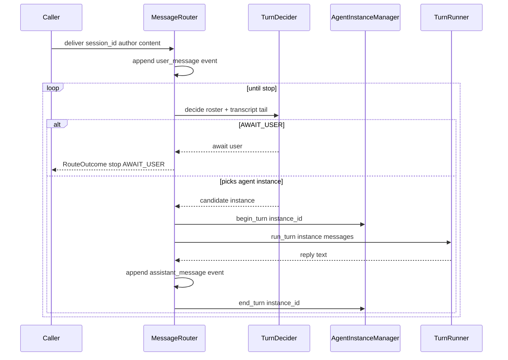

# Agent Message Routing — Design

> Issue: #27 · PR: #107 · Branch: `feature/agent-message-routing`
> Date: 2026-09-28 · Status: Approved in brainstorming
> Depends on: 2026-09-27 Agent Lifecycle Model design (#25, PR #105 — shipped), 2026-09-27 Agent Registry design (#26, PR #106 — shipped)
> Consumers: Integration & Testing #1 (composition + real TurnRunner), Context Manager #5 (archival seam), Agent Manager #6 (scheduling), Agent Manager View UI

## Problem Statement

Issue #27 asks for the message router: deliver incoming user messages to the
correct agent instance, broadcast when needed. Multi-agent conversations must
keep context isolated per session.

The routing model agreed in brainstorming is **session-level turn-taking**:
when U1 says "Hello" in a session with AI1 and AI2, a *next-turn decider*
(an LLM acting as referee) picks which agent responds; that agent's turn runs
to completion and its reply lands in the transcript; the decider then picks
the next agent or hands control back to the user. Repeat until await-user or a
hop limit.

Two substrate facts shape this work item:

1. **#25 decided instances carry no context** — "the live context *is* the
   session transcript." There are therefore no per-agent queues to deliver
   into: delivering to an agent means *its next turn reads the transcript up
   to the current seq*. The transcript is the single shared medium; isolation
   comes from the session boundary, not from inboxes.
2. **No transcript write path exists.** `events.seq` is documented as
   gap-free monotonic and `target_participant_id` (NULL = broadcast) is
   FK-backed by `session_participants`, but nothing in the codebase appends
   events yet. The router is the first consumer that requires one, so this
   work item ships `EventStore` in `octave.db`.

Library-level scope only — no routes, no WebSocket wiring — consistent with
#25/#26; composition arrives with Integration & Testing #1.

## Design Decisions (from brainstorming)

| # | Decision | Rejected alternative |
|---|----------|----------------------|
| 1 | **Full session driver**: `MessageRouter.deliver()` appends the user message, then loops — decider picks → `begin_turn` → turn-runner port → append reply → `end_turn` → decider again — until await-user / hop limit / error | Primitives only (decide-one-step, loop deferred to Integration #1 — leaves mutex interplay and event ordering unproven); deterministic policy only |
| 2 | **Shared-transcript delivery**; `events.target_participant_id` stays NULL. Routing is ephemeral driver state, derivable from event authorship order; the schema keeps the column for future A2A DMs | Per-agent inbox/queue tables (contradicts #25's "context *is* the transcript"); pre-writing targets onto events (couples persistence to an ephemeral decision) |
| 3 | **`EventStore` in `octave.db`** — the first transcript write path: gap-free `seq`, per-kind payload validation, VaultStore transaction convention | The router writing raw ORM `Event` rows (distributes the seq/payload invariant); deferring persistence entirely to Integration #1 (the driver's core observable behavior — "the message landed in the transcript" — would be untested) |
| 4 | **`TurnDecider` protocol + `LlmTurnDecider` default** with a 1:1 fast path (no LLM call in single-agent chat); structured JSON choice (`participant_id` or `await_user`), roster-validated, one retry, await-user fallback | Scored choice (argmax over model-reported scores — unreliable confidence, wider failure surface); hard-coding round-robin (no intelligence for multi-agent) |
| 5 | **Decision models (Laya/Jev) = follow-up issue.** Their declare-a-decision-space API (`choice`/`score`/`noul` → answers + probabilities) is not chat completion; the shipped `InferenceAdapter` ABC is chat-only. `TurnDecider` is the swap seam; the follow-up adds a decision capability to the inference seam (or a sibling adapter) and a `DecisionTurnDecider` | Extending `InferenceAdapter` now (churns the ABC before any decision model is deployed; the seam already isolates the change) |
| 6 | **`TurnRunner` protocol stays separate from `AgentInstanceManager`** — referee vs. player: the manager owns the turn bracket (`begin_turn`/`end_turn`, `octave.db`-only imports); the runner is what happens inside it (context assembly, `ToolLoop`, inference, MCP). Mirrors the shipped `ToolExecutor`/`McpToolExecutor` split | Folding execution into the manager (pulls inference + MCP + CM imports into the one component #25 kept DB-only; every execution-policy change edits a shipped lifecycle component; routing tests would drag in fake adapters) |
| 7 | **`run_record` archival deferred to CM #5**; the driver exposes `TurnRecord(instance_id, agent_id, seq_range)` per completed turn — the exact surface #25's archival contract demands. CM #5 plugs its mechanism (callback on the turn boundary) into this seam | Archiving from the router now (chunking policy and embedding provenance are CM territory per the 2026-09-20/21 ADRs; `octave.db` must not import `octave.inference`) |
| 8 | **Hop limit `max_agent_turns` (default 4)** bounds agent turns per user message | Unlimited turns (agent-chatter loops); treating scheduling as policy here (#6 owns priority/queueing; this is a guard rail only) |

## Delivery Model



No per-agent queues exist. When the decider picks AI1, "AI1's message plus
everything queued for it" is precisely the transcript through the current
`seq` — which the turn runner reads as its input. U1's message, AI1's reply,
and any system events are all in it when AI2's turn is claimed. Context
isolation follows from the session row: instances in other sessions are
never in this transcript or this roster.

## EventStore (`octave.db`)

The canonical transcript write path. VaultStore convention: constructed with
the caller's `AsyncSession`, **never commits**; callers own transaction
boundaries (`octave.db.deps`).

```python
class EventStore:
    def __init__(self, session: AsyncSession) -> None: ...

    async def append(
        self,
        session_id: str,
        kind: EventKind,
        *,
        author_participant_id: str | None = None,
        target_participant_id: str | None = None,
        payload: dict[str, Any],
    ) -> Event: ...

    async def read(
        self, session_id: str, *, after_seq: int = 0
    ) -> list[Event]: ...
```

- **seq assignment**: `SELECT COALESCE(MAX(seq), 0) + 1` scoped to the
  session, then INSERT; `uq_events_session_seq` is the backstop. The flush
  runs inside `session.begin_nested()` (SAVEPOINT) so an `IntegrityError`
  from a racing append is recoverable without poisoning the caller's
  transaction; retry re-computes seq, up to 2 retries, then raise. Gap-free
  monotonic per the `events.seq` docstring.
- **Payload validation**: `user_message` → `UserMessagePayload`,
  `assistant_message` → `AssistantMessagePayload` (Pydantic-validated,
  stored via `model_dump`); `tool_call` / `tool_result` / `system` pass
  through as dicts (the `octave.db.types` module docstring assigns their
  validation to consumers). A malformed validated-kind payload raises
  `ValidationError` — a write-path bug, fail loud.
- **`read`**: `seq > after_seq`, ordered `seq ASC`. The driver's
  transcript-so-far source.
- `octave.db` never imports `octave.inference` (2026-09-21 ADR holds):
  `EventStore` takes/returns dicts and ORM rows; the transcript→`Message`
  mapping lives in the agent plane.

## Driver (`octave.agent.router`)

```python
class MessageRouter:
    def __init__(
        self,
        *,
        session: AsyncSession,
        manager: AgentInstanceManager,
        registry: AgentRegistry,
        decider: TurnDecider,
        turn_runner: TurnRunner,
        max_agent_turns: int = 4,
    ) -> None: ...

    async def deliver(
        self, session_id: str, *, author_participant_id: str, content: str
    ) -> RouteOutcome: ...
```

Collaborators are constructor-injected (composition root wires them in
Integration #1); `EventStore` is constructed internally over the same
session.

### Loop semantics

1. **Author gate**: `author_participant_id` must be a current member of the
   session (`session_participants` row with `left_at IS NULL`); otherwise
   `NotAMemberError`. (The events FK covers author *identity*; membership is
   the app-level gate.)
2. **Append** the `user_message` event (`UserMessagePayload`), author = the
   gate-passed participant.
3. **Roster**: `AgentRegistry.list_instances(session_id=...)` filtered to
   `instance_status == IDLE` and `definition_status == ACTIVE`, each joined
   to its `Participant` row (guaranteed by `spawn`) for identity. Plus the
   `AWAIT_USER` option. Empty roster → stop `AWAIT_USER` immediately.
4. **Decide** via `TurnDecider` over `DecisionState` (roster + transcript
   tail: last `decider_tail_events` events, default 30).
5. **Claim** with `begin_turn` (the #25 mutex; re-checks the pause gate).
   `TurnInProgressError` propagates — concurrent drivers on one session is a
   caller bug; the mutex is fail-loud by design.
6. **Run**: map transcript → `list[Message]` (`user_message`→`user`,
   `assistant_message`→`assistant`; `tool_*`/`system` skipped with a debug
   log), hand to `TurnRunner.run_turn`, receive reply text.
7. **Record**: append `assistant_message` (author = the instance's
   participant), `end_turn`, append a `TurnRecord` to the outcome with the
   completed `(session_id, agent_id, seq_range)`.
8. Repeat from 4 until stop.

**Error policy**: a `turn_runner` exception → `end_turn` still releases the
instance (#25: turn failure lands idle; the error is an event, not state) →
append a `system` event with the error text → stop `ERROR`. A decider choice
outside the roster → `DeciderChoiceError` → one retry → fallback
`AWAIT_USER` (a confused referee hands control to the human; never crashes
the session, never picks a phantom).

**Hop limit**: `max_agent_turns` bounds *agent* turns per `deliver()` call;
exhausted → stop `HOP_LIMIT`. Checked before claiming, so the limit never
truncates a turn mid-flight.

### Outcome types

```python
class StopReason(StrEnum):
    AWAIT_USER = "await_user"
    HOP_LIMIT = "hop_limit"
    ERROR = "error"

@dataclass(frozen=True)
class TurnRecord:
    session_id: str
    agent_id: str
    instance_id: str
    seq_start: int
    seq_end: int
    """Events contributed by this turn (``assistant_message`` now; tool
    events when Integration #1's real runner appends them inside the
    bracket). CM #5's archival key per #25: (session_id, agent_id,
    seq_range) — never instance_id."""

@dataclass(frozen=True)
class RouteOutcome:
    turns: list[TurnRecord]
    stop_reason: StopReason
    error: str | None = None
```

`TurnRecord.seq_range` is the archival seam #25 mandated: CM #5's
`run_record` append rides this boundary (likely an `on_turn_complete`
callback added in CM #5), keyed `(session_id, agent_id, seq_range)` — never
`instance_id`, per #25.

## Decider (`octave.agent.decider`)

```python
@dataclass(frozen=True)
class Candidate:
    instance_id: str
    participant_id: str
    label: str

@dataclass(frozen=True)
class DecisionState:
    roster: list[Candidate]
    messages: list[Message]  # transcript tail, mapped

class Decision(StrEnum):
    """Sentinel vocabulary for decider output. A decision is a plain
    ``str``: either ``Decision.AWAIT_USER`` or a candidate's
    ``participant_id`` (StrEnum members are strs, so the union collapses
    cleanly)."""

    AWAIT_USER = "await_user"

class TurnDecider(Protocol):
    async def decide(self, state: DecisionState) -> str:
        """Return ``Decision.AWAIT_USER`` or a participant_id from
        ``state.roster``. Deciders raise ``DeciderChoiceError`` on
        malformed backend output; the driver owns retry + fallback."""
```

### `LlmTurnDecider` (default, ships now)

Constructed with an `InferenceAdapter`, `model: str | None` (which model is
"the system one" is wiring policy for Integration #1), and the tail budget.

- **1:1 fast path**: roster of exactly one candidate and no LLM call —
  if the last transcript event is the user's, pick the candidate; if the
  sole agent just spoke, `AWAIT_USER`. Keeps the common chat case
  deterministic, zero-latency, and terminating.
- **Multi-agent**: one `complete()` — prompt presents the roster
  (participant_id + label each) and the transcript tail, and requires
  exactly `{"next": "<participant_id>" | "await_user"}`. Parse → Pydantic
  validate → check membership in the roster. Malformed or out-of-roster →
  `DeciderChoiceError` (driver retries once, then falls back `AWAIT_USER`).
- `AdapterError` propagates (the driver's decider-failure path applies).

### Decision models (Laya/Jev) — follow-up, not #27

A decision model's API — declare a decision space (`choice` / `score` /
`noul` with criteria), receive answers with per-option probabilities — is
not expressible through `complete(CompletionRequest)`. Locally hosted, it
still belongs behind the inference seam, but as a new **capability**: the
follow-up issue decides between a `decision()` method on `InferenceAdapter`
(+ registry/config plumbing) and a sibling adapter seam, then ships a
`DecisionTurnDecider` implementing `TurnDecider`. The driver never learns
which backend chose; `TurnDecider` is the swap seam this spec guarantees.

## TurnRunner port (`octave.agent.router`)

```python
class TurnRunner(Protocol):
    async def run_turn(
        self, *, instance: RunningAgent, messages: list[Message]
    ) -> str: ...
```

The real runner — context assembly (CM territory), `resolve_model`,
`ToolLoop` over the instance's model binding and toolset — is Integration
#1's composition, mirroring the shipped `ToolExecutor`/`McpToolExecutor`
split. #27 tests inject a scripted fake. The protocol returns final text;
`ToolLoop` already returns exactly that (`ToolTurn.result.text`).

## Error Handling

- `NotAMemberError(RoutingError)` — author is not a current session member.
- `DeciderChoiceError(RoutingError)` — decider output malformed/out-of-roster;
  raised by deciders, caught by the driver (retry → `AWAIT_USER` fallback).
- `RoutingError(AgentError)` — new base in `octave.agent.errors`, alongside
  the #25 lifecycle-gate errors. No new error for "no instances": that is a
  normal `AWAIT_USER` stop, not a failure.
- `TurnInProgressError`, `AdapterError`, `InstanceNotFoundError` propagate
  unchanged from existing owners.
- Transaction discipline: `EventStore` and the driver never commit. One
  `deliver()` call is one caller-owned transaction — the user message, agent
  turns, and replies commit atomically or not at all. (Crash mid-loop
  therefore rolls back to the last turn boundary; reconcile (#25) plus the
  transcript's gap-free seq make the residue consistent.)

## Non-Goals

- REST/WebSocket routes, frontend wiring (Integration #1 composes; the
  current `/ws` echo stub is untouched).
- `run_record`/`run_summary` archival (CM #5; the seam is `TurnRecord`).
- Decision-model adapter + `DecisionTurnDecider` (follow-up issue below).
- A2A direct messages / non-NULL `target_participant_id` (column stays as
  shipped; broadcast semantics throughout).
- Priority, queueing, resource constraints (#6); session `turn_policy`
  column (the decider *is* the policy — in code, swappable, per-turn).
- Streaming agent replies into the transcript (assistant_message is
  appended whole at turn end; streaming is Integration #1/UI territory).
- Multi-user session vault-visibility concerns (2026-09-13 ADR follow-up).

## Testing

Real SQLite via the shared `session_factory` fixture; scripted fakes for
`TurnRunner`/`TurnDecider`/`InferenceAdapter`; spawns driven through
`AgentInstanceManager`; seed helpers modeled on
`tests/agent/test_instances.py`.

**EventStore**
- seq starts at 1; gap-free and monotonic across interleaved appends to two
  sessions; `read(after_seq=N)` windows correctly.
- Concurrent append race (two sessions appending the same session) → retry
  path yields distinct gap-free seqs; retry exhaustion raises.
- `user_message`/`assistant_message` payloads validated (malformed →
  `ValidationError`); `tool_call`/`tool_result`/`system` dicts pass through.
- Never commits: a fresh session with no writes flushed sees appended rows
  only after the caller commits; DB byte-identical on read-only use.

**MessageRouter**
- 1:1 chat end-to-end: deliver → user_message event → one agent turn →
  assistant_message event → stop `AWAIT_USER`; turn mutex held during the
  runner call (fake asserts instance is `active` mid-turn).
- Multi-agent scripted decider (the issue's scenario): U1 → AI1 → AI2 →
  await_user; transcript order and authorship correct; AI2's runner input
  contains U1's message *and* AI1's reply.
- Empty roster → immediate `AWAIT_USER`, no runner call.
- Runner raises → instance back to `idle`, `system` event recorded, stop
  `ERROR` with message; user_message event survives.
- Hop limit: decider always picks an agent → stop `HOP_LIMIT` after
  `max_agent_turns`; all claimed turns properly ended (no leaked `active`).
- Decider returns out-of-roster twice → fallback `AWAIT_USER`, no crash.
- Author not a member (or `left_at` set) → `NotAMemberError`, no event
  appended.
- Transcript mapping skips `tool_*`/`system` events with debug log.
- Post-loop registry consistency: `AgentRegistry.count_by_status` shows no
  `active` instances left behind.

**LlmTurnDecider**
- Fast path both directions (user spoke last → pick sole candidate; agent
  spoke last → `AWAIT_USER`); zero adapter calls on the fast path.
- Multi-agent: fake adapter returns valid JSON → candidate id; malformed →
  `DeciderChoiceError`; out-of-roster id → `DeciderChoiceError`;
  `AdapterError` propagates.

**Package** — `MessageRouter`, `TurnDecider`, `LlmTurnDecider`,
`TurnRunner`, `RouteOutcome`, `TurnRecord`, `StopReason`, `Candidate`,
`DecisionState`, `Decision` exported from `octave.agent`;
`EventStore` from `octave.db`; `test_package.py` updated. SDK-quarantine AST
guard unaffected (no `openai`/`mcp` imports).

## Implementation Sketch

Paths for the implementation plan to refine:

| File | Change |
|---|---|
| `backend/src/octave/db/event_store.py` | new: `EventStore` (append with gap-free seq + SAVEPOINT retry, read) |
| `backend/src/octave/db/__init__.py` | export `EventStore` |
| `backend/src/octave/agent/decider.py` | new: `Candidate`, `DecisionState`, `Decision`, `TurnDecider`, `LlmTurnDecider` |
| `backend/src/octave/agent/router.py` | new: `TurnRunner`, `StopReason`, `TurnRecord`, `RouteOutcome`, `MessageRouter`, transcript→Message mapping |
| `backend/src/octave/agent/errors.py` | `RoutingError`, `NotAMemberError`, `DeciderChoiceError` |
| `backend/src/octave/agent/__init__.py` | export router/decider surface |
| `backend/tests/db/test_event_store.py` | new: EventStore tests |
| `backend/tests/agent/test_router.py` | new: driver tests |
| `backend/tests/agent/test_decider.py` | new: LlmTurnDecider tests |
| `backend/tests/agent/test_package.py` | assert new public names |
| `docs/TODO.md` | mark Agent Manager #3 done |

## Consequences

- `octave.db` gains its first transcript write path; every future event
  writer (Integration #1's `tool_call`/`tool_result` recording, CM system
  events) goes through `EventStore` — the seq invariant has exactly one
  owner.
- `octave.agent` gains driver vocabulary; Integration #1's job shrinks to
  composition: wire a real `TurnRunner` + adapter + session deps behind
  `MessageRouter.deliver()`.
- CM #5 inherits the archival seam #25 required (`TurnRecord` seq ranges at
  the turn boundary) — no rework when archival lands.
- The inference seam is untouched; the decision-model capability question is
  isolated behind `TurnDecider` with a follow-up issue.
- `events.target_participant_id` remains NULL everywhere it is written; the
  A2A-DM door stays open, unopened.
- No schema change, no migration — purely additive Python, green migration
  chain.

## Follow-up Issues to File

1. **Decision-model adapter for turn decisions (Laya/Jev-style).** A
   decision-space API (`choice`/`score`/`noul` → answers + probabilities)
   hosted behind the inference seam: decide `decision()` on
   `InferenceAdapter` vs. sibling adapter; config/registry plumbing for a
   locally hosted decision model; ship `DecisionTurnDecider` implementing
   `TurnDecider`. Reference: Laya's declare-space-in / answers-out shape.
