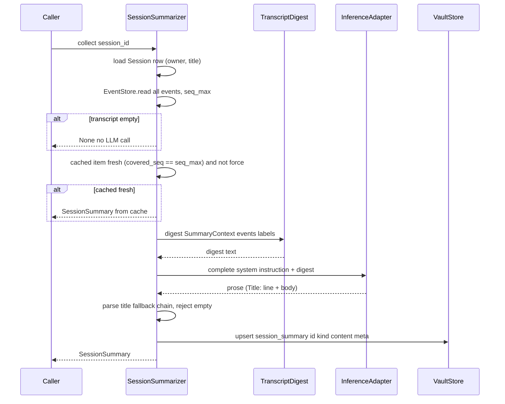

# Agent Result Collection (Session Summaries) — Design

> Issue: #28 · PR: #108 · Branch: `feature/agent-result-collection`
> Date: 2026-09-29 · Status: Approved in brainstorming
> Depends on: 2026-09-27 Agent Lifecycle Model design (#25, PR #105 — shipped), 2026-09-27 Agent Registry design (#26, PR #106 — shipped), 2026-09-28 Agent Message Routing design (#27, PR #107 — shipped)
> Consumers: Agent Manager View UI (result viewer), Context Manager #5 (Tier-1 archival/embedding of the same item), Integration & Testing #1 (composition)

## Problem Statement

Issue #28 ("Agent Manager #4 — create agent result collection") asks to capture agent
outputs and make them queryable, and to format them for display. Since #27 shipped, the
transcript already persists every agent reply (`EventStore` in `octave.db`), and
`TurnRecord` carries per-turn provenance `(session_id, agent_id, seq_range)`. The
collector must not re-invent that storage.

Brainstorming settled the product shape: the user-side deliverable is a **session
summary** — LLM prose covering what was done and the end result — that serves both the
result viewer and CM #5's Tier-1 archival (`run_summary` vault items per the 2026-09-20
ADR). The transcript is the record; the summary is the derived, searchable headline.

Library-level scope only — no routes, no WebSocket wiring — consistent with #25/#26/#27;
composition arrives with Integration & Testing #1.

## Design Decisions (from brainstorming)

| # | Decision | Rejected alternative |
|---|----------|----------------------|
| 1 | **Session-scoped summaries**: one summary per session covering all agents that spoke; generated on demand, cached, refreshed when the transcript grows | Per-turn summaries (N LLM calls per exchange, fragments the "what was done" narrative); the initially-considered run=turn model (collided with whole-session intuition for `run_record`/`run_summary`) |
| 2 | **The transcript is the record.** `events` is the canonical, replayable log; `transcript_chunk` vault items (CM #5) are derived prose chunks of it, chunked by policy, never one-per-event | A parallel "record" store duplicating events; per-turn `run_record` rows (vault bloat, retrieval fragments, breaks the ADR tiering rationale) |
| 3 | **LLM-generated summaries** behind a `ModelBinding` (the shipped `tag \| adapter:model` union) resolved via `resolve_model` — same selection machinery as agent turns | Deterministic compilation only (mechanical prose rejected by product owner); hard-coded summarizer model (no tag/config flexibility) |
| 4 | **Out-of-band lifecycle**: `SessionSummarizer` is never invoked inside `MessageRouter.deliver()`; the LLM call happens before any DB write; the collector never commits | Turn-boundary hooks in the router (holds a SQLite write transaction open across inference latency; #27 assigned turn-boundary hooks to CM #5) |
| 5 | **Persist via `VaultStore` as `VaultKind.SESSION_SUMMARY`**, deterministic item id `session_summary:<session_id>`, embedding left NULL — CM #5 attaches embeddings to the same item (read-modify-write upsert) | Return-only (result viewer re-runs the LLM per browse); embedding in #28 (violates the 2026-09-21 ADR: embeddings are caller-supplied, CM owns model-selection policy) |
| 6 | **Rename vault kinds now**: `RUN_SUMMARY → SESSION_SUMMARY`, `RUN_RECORD → TRANSCRIPT_CHUNK`. App-validated TEXT enum, zero rows written — enum + docs change, no migration | Keep `run_*` names (the "run" prefix collides with turn-level intuition; once #28 or CM #5 writes rows, renaming becomes a data migration — one-way door closing now) |
| 7 | **Component named `SessionSummarizer`** (`octave.agent.summaries`), returning `SessionSummary` — vocabulary aligned end to end (`SessionSummarizer` → `SessionSummary` → `VaultKind.SESSION_SUMMARY`); the architecture.md capability bullet ("Result collector") stays as the capability statement | `ResultCollector` (implies gathering many result objects; the component produces one cached summary per session) |
| 8 | **Digest strategy seam**: `TranscriptDigest` protocol produces the model-facing material; `HeadTailDigest` default (whole transcript under budget, else head + tail with an omission marker, tool events as compact one-liners). Future strategies (full transcript, search-augmented over CM #5 chunks, map-reduce) swap without touching the summarizer | Hard-coded rendering in the summarizer (bakes in one material policy; search-augmented digests would require re-editing the shipped component) |
| 9 | **`TurnRecord` seam unchanged.** CM #5 keeps turn seq-ranges for verbatim `transcript_chunk` archival; only the summary moved to session scope | Repurposing `TurnRecord` as a summary trigger (couples summary freshness to turn accounting; staleness is computed from `seq_max` instead) |

## Vocabulary Map

| Term | Meaning | Artifact |
|---|---|---|
| record | canonical, exact, replayable log of everything that happened | `events` table (shipped; `EventStore.read(after_seq)` is the replay/turn-input source) |
| transcript chunk | derived prose slices of the record, embeddable, Tier-2 verbatim search | `VaultKind.TRANSCRIPT_CHUNK` items (CM #5 writes; chunk policy is CM territory) |
| session summary | derived LLM prose: what was done + end result, Tier-1 "which session?" search and the result-viewer body | `VaultKind.SESSION_SUMMARY` item (this work item writes; CM #5 embeds) |

## Component (`octave.agent.summaries`)

```python
@dataclass(frozen=True)
class SessionSummary:
    session_id: str
    owner_user_id: str
    title: str
    content: str            # the summary prose
    covered_seq: int        # transcript seq at generation time
    model_name: str | None  # model that produced it, when reported
    generated_at: datetime  # from the vault item's updated_at


@dataclass(frozen=True)
class SummaryContext:
    session_id: str
    events: list[Event]      # full transcript, already read
    labels: dict[str, str]   # participant_id -> display label


class TranscriptDigest(Protocol):
    """Produces the model-facing material for one summary. Strategies may
    read beyond ctx.events (they hold their own seams); ctx is the
    baseline, not a leash."""

    async def digest(self, ctx: SummaryContext) -> str: ...


class HeadTailDigest:
    """Default strategy. Whole transcript when
    ``len(events) <= head_events + tail_events``; else first
    ``head_events`` + last ``tail_events`` with a
    ``… N earlier events omitted …`` marker between them (N = number
    omitted). Tool events render as compact one-liners
    (``Tool result: <truncated>``); message events as
    ``User: …`` / ``<label>: …`` / ``System: …``."""

    def __init__(self, *, head_events: int = 10, tail_events: int = 40,
                 tool_line_chars: int = 200) -> None: ...


class SessionSummarizer:
    def __init__(
        self,
        *,
        session: AsyncSession,
        binding: ModelBinding,
        adapter_for: Callable[[str | None], InferenceAdapter],
        tag_lookup: Callable[[str], str | None] | None = None,
        digest: TranscriptDigest | None = None,  # default HeadTailDigest()
    ) -> None: ...

    async def collect(self, session_id: str, *, force: bool = False) -> SessionSummary | None:
        """Fresh cached summary, or generate + persist. Empty transcript →
        None (no LLM call, no item written)."""

    async def peek(self, session_id: str) -> SessionSummary | None:
        """Cached summary only; never calls the adapter. The cheap path
        for list views. Malformed cached meta is treated as missing
        (lenient reporting surface, mirrors registry _parse_assignments)."""
```

Follows the VaultStore convention: constructed with the caller's `AsyncSession`,
**never commits**. The LLM call happens before any DB write, so inference latency never
sits inside a transaction.

### Selection seam

`binding` (the shipped `ModelBinding` union) → `resolve_model(binding, tag_lookup=...)`
→ `ResolvedModel(adapter, model)` → `adapter_for(adapter_name_or_None)` returns the
`InferenceAdapter` instance. `adapter_for` is the one new seam: the composition root
wires it from `octave.inference.registry` (`default_registry.create(config)` per
configured adapter, plus a default); `None` means "the default adapter", matching
`ResolvedModel` semantics. Tag miss fails loud via `ModelBindingError` (the shipped
fail-loud rule).

### Generation flow



### Prompt & output contract

One `complete()` call. System instruction: recap the agent session — what was done, and
the end result — first line exactly `Title: <short title>`. The digest is the user
message. Title parse: strip the `Title:` line → vault item `name`; fallback chain when
absent: `session.title` → first user message truncated → `Session <id[:8]>`. Malformed
output never fails a generation; only an empty/whitespace completion fails
(`SummaryError`).

### Storage & staleness

- `VaultStore.upsert(item_id=f"session_summary:{session_id}", user_id=session.created_by_user_id, kind=VaultKind.SESSION_SUMMARY, name=title, content=prose, meta={"session_id": session_id, "covered_seq": seq_max, "model_name": model}, embedding=None)`.
- Deterministic id ⇒ regeneration is an idempotent full-replacement upsert; concurrent
  collects both write, last write wins (documented; `upsert` is replacement — no
  corruption, no lock).
- `meta.session_id` is present from day one so CM #5's later embedding picks up the
  vec0 aux-column session scoping for free.
- Freshness is computed, never stored: fresh iff `covered_seq == transcript seq_max`.
  `force=True` regenerates regardless. No invalidation machinery.
- Browsing many sessions needs no new query surface: `VaultStore.list_items(kind=SESSION_SUMMARY)` exists.
- `upsert(embedding=None)` drops any vector mirror row; items have no embedding until
  CM #5 attaches one — consistent with the shipped staleness rule (content is the
  source of truth).

## Error Handling

- `SessionNotFoundError` (existing, `octave.agent.errors`) — unknown session id.
- Empty transcript → `None`; no adapter call, no item written.
- `AdapterError`, `ModelBindingError` propagate — the composition root/UI owns retry
  policy; no partial writes (the write happens only after a successful completion).
- New `SummaryError(AgentError)` — empty/whitespace completion; never persist empty
  summaries.
- Never commits; callers own transaction boundaries (`octave.db.deps`).

## Rename Mechanics (no migration)

`VaultKind` values are app-validated TEXT; zero rows exist for either kind (no writer
shipped before this PR). Rename is code + docs only:

- `backend/src/octave/db/types.py`: `RUN_SUMMARY → SESSION_SUMMARY = "session_summary"`,
  `RUN_RECORD → TRANSCRIPT_CHUNK = "transcript_chunk"`.
- `backend/src/octave/db/models/vault.py`: docstring kind list.
- `backend/tests/db/test_types.py`, `backend/tests/db/test_vault_store.py`: updated
  references.
- `.agents/memory/decisions.md`: new ADR (session-scoped summaries; events=record /
  vault=search-index division; kind renames) + amendment note on the 2026-09-20 entry.

## Non-Goals

- REST/WebSocket routes, frontend wiring (Integration #1 composes; the viewer renders
  `SessionSummary` fields).
- Embedding generation and `transcript_chunk` archival (CM #5; the seams are the
  `session_summary` vault item and `TurnRecord` seq ranges).
- Inter-agent result sharing (AM #5) — the vault item + `VaultStore.search` is the
  future substrate; nothing here precludes it.
- Exchange-level (per-user-message) rollups; per-agent summaries within a session
  (the digest strategy is the extension point if wanted later).
- Background/scheduled regeneration (scheduling is AM #6; staleness is computed
  on read).
- Multi-human session vault-visibility concerns (2026-09-13 ADR follow-up).

## Testing

Real SQLite via the shared `session_factory` fixture; scripted fake `InferenceAdapter`;
seed helpers modeled on `tests/agent/test_instances.py`.

**SessionSummarizer**
- Cache: fresh item → `collect()` returns cached, zero adapter calls; `peek()` never
  calls the adapter; absent item → `None`.
- Staleness: transcript grows → regenerate; same item id; `covered_seq` advances;
  `force=True` regenerates a fresh summary.
- Empty transcript → `None`, no adapter call, no item.
- Persistence: item id `session_summary:<id>`, kind `session_summary`, `user_id` from
  `Session.created_by_user_id`, `meta.session_id`/`covered_seq`/`model_name` correct,
  embedding NULL.
- Title: `Title:` line parsed into item name; fallback chain when absent
  (session.title → first user message → `Session <id[:8]>`).
- Errors: `AdapterError` propagates, no item written; empty completion →
  `SummaryError`, no item written; `SessionNotFoundError`; tag binding with
  `tag_lookup=None`/miss → `ModelBindingError`; explicit binding → `adapter_for`
  receives the adapter name.
- Never commits: a fresh session sees the item only after the caller commits.
- Concurrency: two collects on one session → two upserts, last write wins, no error.

**HeadTailDigest**
- Under budget → whole transcript rendered in order.
- Over budget → head + tail with `… N earlier events omitted …`; N correct.
- Rendering: `User:` / participant label / `System:` lines from labels map;
  `tool_call`/`tool_result` compact one-liners truncated at `tool_line_chars`.

**Rename**
- `VaultKind` member values; `test_package.py`/`test_types.py` updated.

**Package** — `SessionSummarizer`, `SessionSummary`, `SummaryContext`,
`TranscriptDigest`, `HeadTailDigest`, `SummaryError` exported from `octave.agent`;
`octave.db` unchanged (no new export). SDK-quarantine AST guard unaffected (no
`openai`/`mcp` imports).

## Implementation Sketch

Paths for the implementation plan to refine:

| File | Change |
|---|---|
| `backend/src/octave/db/types.py` | `VaultKind` rename: `SESSION_SUMMARY`, `TRANSCRIPT_CHUNK` |
| `backend/src/octave/db/models/vault.py` | docstring kind list |
| `backend/src/octave/agent/summaries.py` | new: `SessionSummary`, `SummaryContext`, `TranscriptDigest`, `HeadTailDigest`, `SessionSummarizer` |
| `backend/src/octave/agent/errors.py` | `SummaryError(AgentError)` |
| `backend/src/octave/agent/__init__.py` | export summaries surface |
| `backend/tests/db/test_types.py` | renamed enum assertions |
| `backend/tests/db/test_vault_store.py` | renamed kind references |
| `backend/tests/agent/test_summaries.py` | new: summarizer + digest tests |
| `backend/tests/agent/test_package.py` | assert new public names |
| `.agents/memory/decisions.md` | new ADR + amendment on 2026-09-20 entry |
| `docs/TODO.md` | mark Agent Manager #4 done (PR #108) |

## Consequences

- The vault gains its first writer (`session_summary` items) from the agent plane;
  CM #5 embeds the same items rather than regenerating prose — one summary, two
  consumers.
- `run_record`/`run_summary` vocabulary retires before any data exists; CM #5 designs
  `transcript_chunk` chunking against a name that matches what it is.
- `octave.agent` gains a second inference consumer (`SessionSummarizer`), still behind
  the `ModelBinding`/`resolve_model` machinery — no new config vocabulary.
- The router is untouched: #27's transaction discipline and `TurnRecord` seam survive
  unchanged.
- No schema change, no migration — purely additive Python plus the enum rename.

## Follow-up Issues to File

1. **Search-augmented digest strategy** (`SearchAugmentedDigest`): head/tail + vector
   search over the session's `transcript_chunk` items (depends on CM #5 archival).
2. **Map-reduce digest strategy** for very long sessions (chunk → per-chunk summaries →
   merge; multiple completions owned by the strategy).
3. **Result-viewer UI wiring** (UI — Agent Manager View #3): list via
   `VaultStore.list_items(kind=SESSION_SUMMARY)`, detail via `peek`/`collect`.
