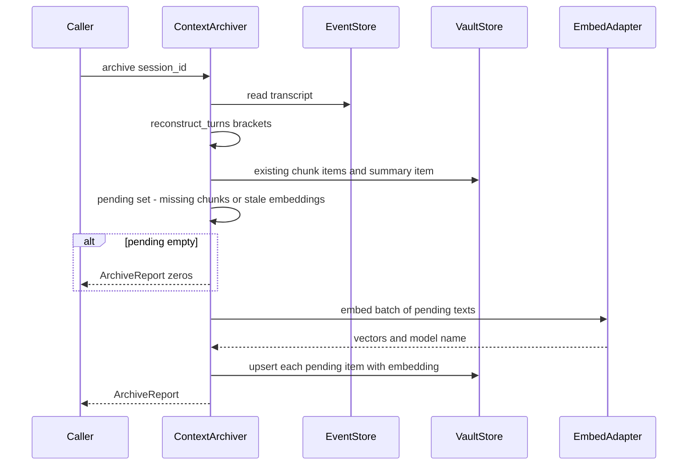

# Agent Context Lifecycle (Archival & Embedding) — Design

> Issue: #35 · PR: #114 · Branch: `feature/agent-context-lifecycle`
> Date: 2026-09-30 · Status: Approved in brainstorming
> Depends on: #32 vector-capable storage layer (PR #97 — shipped), #28 agent result collection (PR #108 — shipped), #27 agent message routing (PR #107 — shipped), #31 vault data model (PR #96 — shipped)
> Consumers: CM #11 (vector search query interface), CM #4 (context injection engine), AM #5 (inter-agent result sharing), Integration & Testing #1 (composition)

## Problem Statement

CM TODO #5: "Implement agent context lifecycle (receive full context from
completed agent runs via Agent Manager, embed into vector DB for future linked
agent runs to query)." The upstream pieces all shipped but stop short of
searchability:

- #28 writes `session_summary` vault items with `embedding=None`, deferring
  embedding to this item ("CM #5 attaches embeddings to the same item
  (read-modify-write upsert)" — 2026-09-29 ADR).
- The 2026-09-20 ADR defines the Tier-2 half — `transcript_chunk` items,
  verbatim prose chunks of the transcript — and defers "chunking policy,
  archival triggers/dedup, and scoped vector search" to exactly this item.
  No writer exists.
- #32 shipped the storage mechanics (filtered ANN search with `kind`/
  `session_id` aux columns, caller-supplied embeddings) but no policy for
  who embeds what, when, or how content maps to items.

Nothing today makes completed agent runs *queryable*. This item is that
missing layer: capture → embed → store.

## Design Decisions (from brainstorming)

| # | Decision | Rejected alternative |
|---|----------|----------------------|
| 1 | **Both tiers ship**: embed the existing `session_summary` item (Tier-1) AND author + embed `transcript_chunk` items from reconstructed turn brackets (Tier-2). "Full context" needs verbatim detail; the ADR trail assigns both duties to CM #5 | Tier-1 only (summaries lose the steps the 2026-09-20 ADR says "retrieves badly" without); Tier-2 only (leaves #28's explicit NULL-embedding seam half-finished) |
| 2 | **Pull-only trigger**: a single `ContextArchiver.archive(session_id)` catch-up primitive that reconstructs turn brackets from the transcript. No router coupling, no `RouteOutcome` plumbing; *when* to call is Integration #1's decision | Push-only (forces every consumer to hold and forward `RouteOutcome.turns`); both (archiver surface bloat before a caller needs it) |
| 3 | **Brackets are reconstructible, exactly.** Agent-authored events fall into seq-ordered runs terminated by `assistant_message`; anchor rule `start = max(prev_agent_reply_seq, last_non_agent_event_seq) + 1`, `end = reply_seq`. An equivalence test pins the pure function against the shipped router's `RouteOutcome.turns`. Failed turns (no closing reply) produce no bracket — matching push semantics | Storing `TurnRecord`s in a new table (schema change to persist what the transcript already encodes); trusting push over reconstruction when both agree on every committed transcript |
| 4 | **Chunk-per-bracket, verbatim.** One chunk per completed bracket, full event content, labeled lines, no truncation. Deterministic id `transcript_chunk:<session_id>:<seq_start>-<seq_end>`; oversized brackets split at whitespace with `:N` part suffixes | Fixed character windows (straddles turns/agents, ids can't carry provenance); one chunk per event (2026-09-29 ADR: "never one vault row per event"); digest-rendered chunks (the 200-char tool one-liners are summary budget, not archival material) |
| 5 | **`max_chars` is an explicit archiver parameter** derived by the composition root from the embedding model's *input context window* (chars ≈ tokens × conservative 3–4 factor; default 6000). Chunk boundaries freeze at first archival (id exists → skip), documented | Tying to `embedding_dim` (vector width is orthogonal to input capacity); probing `list_models()` (shipped `ModelInfo` has no context-window field — extending the frozen inference contract is scope creep); split-on-error retry (fragile error-string matching; silent server truncation means no error to catch) |
| 6 | **Embedding via the shipped `ModelBinding` + `adapter_for` seam**, as a dedicated `embed_binding` separate from any chat binding. Explicit bindings expected (capability tags are chat vocabulary); tag bindings remain legal | A new embedding-policy config type (new vocabulary for what `ModelBinding` already expresses); importing an embedder into `octave.db` (violates the 2026-09-21 ADR) |
| 7 | **Re-embed rule**: an item is (re-)embedded iff `embedding IS NULL` OR `embedding_model != embed result model`. NULL covers #28's regeneration path (collect drops the vec row); model-mismatch discharges the 2026-09-21 "detection primitives" hand-off — swap the embed model in config, next pass repairs | Re-embed only on NULL (abandons model-swap repair); a watermark/invalidation table (events are immutable; staleness is detectable from the row itself) |
| 8 | **The archiver only embeds — never generates prose.** If no `session_summary` item exists, Tier-1 is skipped (no chat call). `SessionSummarizer.collect()` remains the sole summary writer; composition calls `collect()` then `archive()` | Archiver calls `collect()` itself (couples archival to chat-model availability and turns one inference verb into two; the archiver must stay embed-only) |
| 9 | **New package `octave/context/`** — CM's first service module, mirroring `octave/agent/` for AM. Imports `octave.db` + `octave.inference` only; **never `octave.agent`** | Living in `octave/agent/` (wrong plane; the pull model needs nothing from the router); in `octave/db/` (policy, not plumbing; `octave.db` must not import `octave.inference`) |
| 10 | **No new query surface.** The "future linked runs can query it" promise is discharged by proving the shipped `VaultStore.search` works end-to-end over archived content (Tier-1 and Tier-2, scoped and unscoped). Ranking, relevance, token budgets stay CM #11/#6 | Building a query interface here (CM #11's assigned scope; this item owns the write side) |

## Vocabulary Map

| Term | Meaning | Artifact |
|---|---|---|
| record | canonical, replayable log | `events` table (shipped) |
| turn bracket | reconstructed agent turn: agent-authored events closed by that agent's `assistant_message` | `TurnBracket` (this design; ephemeral, pure-function output) |
| transcript chunk | verbatim prose of one bracket, embeddable, Tier-2 | `VaultKind.TRANSCRIPT_CHUNK` item (this design writes + embeds) |
| session summary | derived LLM headline, Tier-1 | `VaultKind.SESSION_SUMMARY` item (#28 writes prose; this design embeds) |

`TurnBracket` is deliberately not imported from `octave.agent`: it carries
`(agent_id, seq_start, seq_end)` only — no `instance_id` (the #25 ADR keys
archival on `(session_id, agent_id, seq_range)`, never `instance_id`).

## Component (`octave.context.archiver`)

```python
@dataclass(frozen=True)
class TurnBracket:
    agent_id: str
    seq_start: int
    seq_end: int


def reconstruct_turns(events: Sequence[Event]) -> list[TurnBracket]:
    """Pure. Walk by seq; an agent-authored assistant_message closes a
    bracket; non-agent events (user messages, unauthored system notices)
    are anchors — they open a region but belong to no bracket.
    start = max(prev_agent_reply_seq, last_non_agent_event_seq) + 1."""


@dataclass(frozen=True)
class ArchiveReport:
    session_id: str
    turns: int
    summary_embedded: bool
    chunks_written: int
    chunks_skipped: int


class ContextArchiver:
    def __init__(
        self,
        *,
        session: AsyncSession,
        db_adapter: DbAdapter,
        embed_binding: ModelBinding,
        adapter_for: Callable[[str | None], InferenceAdapter],
        tag_lookup: Callable[[str], str | None] | None = None,
        max_chars: int = 6000,
    ) -> None: ...

    async def archive(self, session_id: str) -> ArchiveReport: ...
```

Follows the shipped convention: constructed with the caller's
`AsyncSession`, **never commits**. Embed API calls happen before any DB
write (inference latency never sits inside a transaction).

### Archive flow



Steps in detail:

1. Load `Session` row (owner `user_id`); `SessionNotFoundError` if absent.
2. Read full transcript; `reconstruct_turns` → brackets.
3. Compute desired chunk set: for each bracket, render verbatim text,
   apply `max_chars` split → desired chunk items (id, content, meta).
4. Load existing items by deterministic id; load summary item.
5. Pending = desired chunks whose item is absent, plus any item (chunk or
   summary) where `embedding IS NULL` or `embedding_model != result.model`.
   The model name for comparison comes from the embed call's `model`
   result field (what the server reports), consistent with #28 storing
   `result.model`.
6. If pending empty → return zero report; **no embed call**.
7. One batched `adapter.embed(EmbeddingRequest(model=resolved.model,
   inputs=[...texts]))`. Pair vectors with items by order (shipped
   `EmbeddingResult` contract).
8. `VaultStore.upsert` each pending item with its embedding +
   `embedding_model`. Chunks are full-replacement upserts (content
   unchanged for existing brackets — events are immutable); the summary
   upsert re-supplies its existing `name`/`content`/`meta` read from the
   item (read-modify-write per the 2026-09-29 ADR).
9. Return `ArchiveReport`.

### Verbatim chunk rendering

A module-level renderer, distinct from `HeadTailDigest` (no truncation, no
omission markers — that machinery is summarization budget):

```
Echo: Tool call: web.search {"q": "red sox game today weather"}
Echo: Tool result: Red Sox vs Nationals, today: final score 3-1, Red Sox won. No rain delay.
Echo: No rainout — the Red Sox beat the Nationals 3-1 today.
```

- Author labels resolved via the same `Participant.label` lookup #28 uses.
- Bracket events are agent-authored by construction; user/system events
  never appear (they're anchors outside brackets).
- `tool_call`/`tool_result`/`system` payloads render their full JSON-ish
  content (not compacted).
- `name`: `"{label} · events {seq_start}–{seq_end}"` (part suffix when
  split: `"… (part 2/3)"`).
- Split at whitespace boundaries nearest `max_chars`; each part is
  independently embeddable.

### Item shapes

```python
# Tier-2 chunk
VaultStore.upsert(
    item_id=f"transcript_chunk:{session_id}:{seq_start}-{seq_end}",        # + f":{part}" when split
    user_id=session.created_by_user_id,
    kind=VaultKind.TRANSCRIPT_CHUNK,
    name="Echo · events 2–7",
    content=<verbatim rendering>,
    meta={"session_id": session_id, "agent_id": agent_id,
          "seq_start": seq_start, "seq_end": seq_end,
          "part": 1, "part_total": 1, "model_name": embed_model},
    embedding=vector,
    embedding_model=embed_model,
)

# Tier-1 summary (read-modify-write: name/content/meta from the existing item)
VaultStore.upsert(
    item_id=f"session_summary:{session_id}",
    user_id=session.created_by_user_id,
    kind=VaultKind.SESSION_SUMMARY,
    name=item.name, content=item.content, meta=item.meta,
    embedding=vector,
    embedding_model=embed_model,
)
```

`meta.session_id` feeds the vec0 aux column via `VaultStore` (shipped), so
`search(kind=TRANSCRIPT_CHUNK, session_id=...)` is exact and pre-`k`.

## Idempotence & Transaction Discipline

- Events are immutable ⇒ a bracket's rendered content never changes ⇒
  deterministic id + existence check makes `archive()` safe to re-run.
  Second call on an unchanged transcript: zero embed calls, zero writes
  (tested).
- `max_chars` changes between passes do not re-split already-archived
  brackets (id exists → skip); new brackets use the new value. Documented
  in the archiver docstring.
- Never commits. Chunk rows + vec mirror + summary re-embed ride the
  caller's transaction; rollback leaves both stores clean (tested once at
  this layer; the pairing itself is `VaultStore`'s tested invariant).
- Concurrency: two concurrent `archive()` calls on one session may both
  embed and both upsert; deterministic ids make last-write-wins benign
  (same content, same vectors). Documented, matching #28's concurrent-collect
  note.

## Error Handling

The ban on `octave.context → octave.agent` imports is unconditional. That
has a second consequence beyond error types: `resolve_model` and
`ModelBindingError` both live in `octave.agent.instances` /
`octave.agent.errors`, so the archiver cannot reuse the shipped resolver.

- Binding resolution is a ~15-line pure function over
  `octave.db.types.ModelBinding` (`ExplicitModelBinding → (adapter,
  model)`; tag form → `tag_lookup(tag)`, fail loud on `None` lookup or
  miss). It is **duplicated locally** as `archiver._resolve_binding`
  rather than imported across the plane boundary. The shared vocabulary
  (`ModelBinding`, `ExplicitModelBinding`) already lives in `octave.db`
  where both planes can see it; only the resolver logic is copied. If a
  third consumer appears, extract the resolver to a neutral home then
  (recorded as an open question).
- `octave.context.errors.SessionNotFound` — CM-local, raised on unknown
  session id. Mirrors the agent error's name with an independent type;
  the composition root maps whichever it catches from its two components.
- `octave.context.errors.ModelBindingNotResolved` — CM-local, raised on
  tag binding without `tag_lookup` or on tag miss (same fail-loud policy
  as the shipped `ModelBindingError`, independent type).
- Empty transcript → zero report; no embed call, no writes.
- `AdapterError` (embed endpoint down) propagates; no partial writes
  (embed precedes any write).
- `DbDimensionMismatchError` propagates — the configured embed model
  returning wrong-width vectors is a config error; fail loud (shipped
  `VaultStore` guard does the check).
- No exception types beyond the two CM-local ones above.

## Testing

Real SQLite via the shared `session_factory` fixture (same as
`tests/agent/`); scripted fake `InferenceAdapter` implementing `embed`
(records requests, returns deterministic vectors). Gates from `backend/`:
`uv run pytest -q && uv run ruff check src tests && uv run mypy src`.

**`tests/context/test_brackets.py`** — pure function, no DB:
- Single agent, multi-turn: contiguous non-overlapping brackets.
- Multi-agent alternation: one bracket per agent reply; anchors excluded.
- Failed-turn orphan events (tool events with no closing reply): no
  bracket.
- Trailing unclosed events in a live session: no bracket.
- Trigger event (user/system, unauthored) excluded from every bracket.
- Router equivalence: drive the shipped `MessageRouter` over a seeded
  session, assert `reconstruct_turns(transcript)` matches
  `RouteOutcome.turns` seq ranges + agent ids.

**`tests/context/test_chunks.py`**:
- Verbatim rendering: full content, labels, no truncation markers.
- `max_chars` split: whitespace boundary, part ids/`part_total`, every
  part ≤ `max_chars`.
- Id/name/meta construction exact.

**`tests/context/test_archiver.py`**:
- Happy path: scripted transcript → chunk items embedded, meta correct,
  summary embedded when present.
- Idempotence: second `archive()` → zero embed calls, zero writes.
- Re-embed: summary with `embedding=None` → embedded; `embedding_model`
  mismatch → re-embedded; match → skipped.
- Summary-absent: Tier-2 proceeds, `summary_embedded=False`, no chat
  call ever (fake asserts `complete` untouched).
- Batch: exactly one `embed()` call per pass regardless of pending count.
- Errors: `AdapterError` propagates with no writes;
  `DbDimensionMismatchError` propagates; `SessionNotFound`.
- Rollback: caller rollback → no vault rows, vec table clean.
- Search end-to-end: archive → embed a query via the fake →
  `VaultStore.search(user_id, kind=TRANSCRIPT_CHUNK)` finds chunks;
  scoped `session_id=` finds only this session's; Tier-1 findable via
  `kind=SESSION_SUMMARY`; another user's search never sees them.

**`tests/context/test_package.py`**: public names exported; quarantine AST
guard (no `openai`/`mcp` imports) holds; import-guard test asserts
`octave.context` does not import `octave.agent`.

## Deliverables

| File | Action |
|---|---|
| `backend/src/octave/context/__init__.py` | **new** — exports `ContextArchiver`, `ArchiveReport`, `TurnBracket`, `reconstruct_turns`, `SessionNotFound`, `ModelBindingNotResolved` |
| `backend/src/octave/context/errors.py` | **new** — `SessionNotFound`, `ModelBindingNotResolved` |
| `backend/src/octave/context/archiver.py` | **new** — `ContextArchiver`, `ArchiveReport` |
| `backend/src/octave/context/brackets.py` | **new** — `TurnBracket`, `reconstruct_turns` |
| `backend/src/octave/context/chunks.py` | **new** — verbatim renderer, `max_chars` split, id/name/meta builders |
| `backend/tests/context/__init__.py` | **new** |
| `backend/tests/context/test_brackets.py` | **new** |
| `backend/tests/context/test_chunks.py` | **new** |
| `backend/tests/context/test_archiver.py` | **new** |
| `backend/tests/context/test_package.py` | **new** |
| `.agents/memory/decisions.md` | modify — ADR: pull-only archival via reconstructed brackets; chunk-per-bracket; embed-only archiver; re-embed rule |
| `docs/TODO.md` | modify — mark CM #5 done with PR ref |

## Non-Goals (this work item)

- Prose generation of any kind (summaries stay #28's; the archiver calls
  only `embed`).
- HTTP/REST routes, WebSocket, frontend (composition = Integration #1).
- Relevance scoring, token budgets, cross-corpus ranking (CM #6/#11).
- `SearchAugmentedDigest` (filed follow-up from #28).
- Watermark/invalidation machinery; background scheduling (AM #6).
- Tokenizer dependency; inference-contract changes (`ModelInfo` context
  windows).
- pgvector; `events.embedding`; multi-user vault visibility.
- Push-based `archive_turns(turns)` — add later if a caller needs it.

## Open Questions (recorded, not blocking)

- **CM #10 overlap.** "Conversation-to-vector indexing" (CM #10) overlaps
  Tier-2; this item archives *agent-run* content (brackets). If #10 later
  subsumes general conversation indexing, revisit the split — the
  deterministic-id scheme makes selective re-archival cheap.
- **`max_chars` default.** 6000 chars is conservative for common 8k-token
  endpoints; the composition root should override per deployed model. No
  auto-detection ships (Decision 5).
- **Chunk content for non-text payloads.** `tool_result` payloads render
  their `content`/`result` fields verbatim; structured payloads without
  those keys render via `json.dumps`. If embedding quality suffers on
  JSON blobs, the renderer is the seam to revisit.
- **Resolver duplication.** `_resolve_binding` copies the shipped
  `resolve_model` logic (in `octave.agent.instances`) because the plane
  ban forbids the import. If a third consumer needs binding resolution,
  extract it to a neutral home (e.g. `octave.db.types` gains a resolver
  or a small shared module) and delete both copies.
