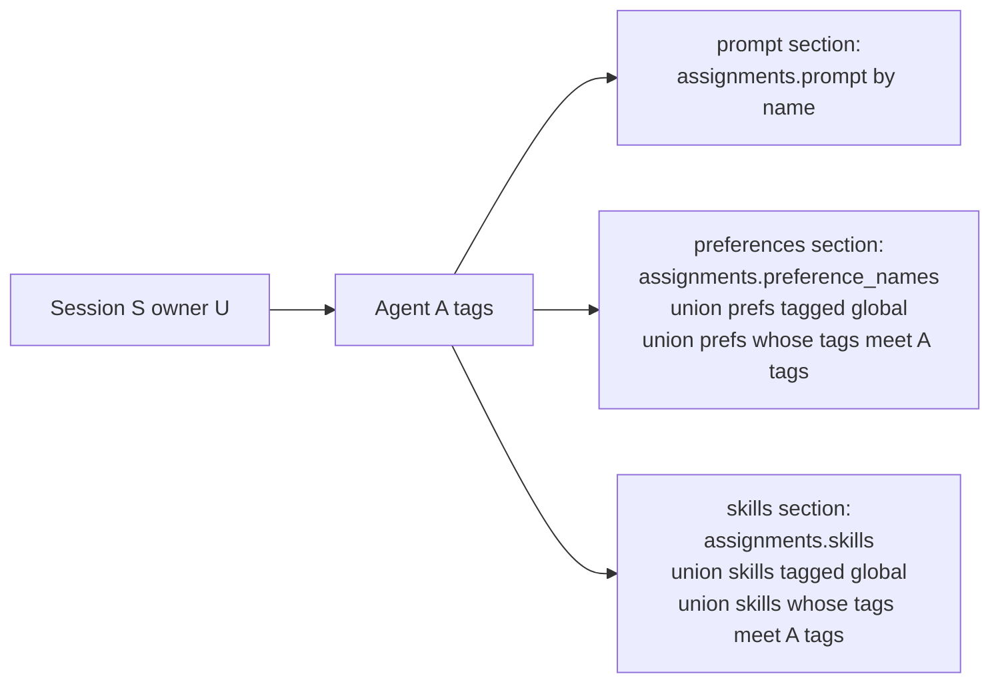

# Context Injection Engine — Design

> Issue: #34 · PR: #117 · Branch: `feature/context-injection-engine`
> Date: 2026-10-01 · Status: Approved in brainstorming
> Depends on: #31 vault data model (PR #96 — shipped), #32 vector-capable storage layer (PR #97 — shipped), #25/#26 agent definitions & registry (PRs #105/#106 — shipped), #35 agent context lifecycle (PR #114 — shipped)
> Consumers: Integration & Testing #1 (the real `TurnRunner` composition), CM #6 (relevance scoring), CM #11 (vector search / "found context")

## Problem Statement

CM TODO #4: "Create context injection engine (select relevant context items
based on rules/triggers)". This is the tag-driven core: it decides **what
context each agent sees**. The shipped pieces stop just short of it:

- The vault holds `skill`/`prompt`/`preference` items with `meta.tags`
  conventions (#31) and the storage layer reads/writes them (#32), but
  nothing selects items for an agent.
- `agents.assignments` (`AgentAssignments`: `prompt` / `skills` /
  `preference_tags`) is raw pass-through; the registry explicitly deferred
  "vault resolution of assignment references" to this item.
- The router's `TurnRunner` port is unimplemented — "context assembly +
  ToolLoop ... is Integration #1's composition". This engine supplies the
  context-assembly half.

Cadence requirement (from brainstorming): users want standing context —
"how they want to be addressed", preferences — injected **at the start of a
conversation**. Per-prompt (`every_turn`) injection is explicitly deferred
post-1.0.0. Multi-user requirement: preference sets belong to the user who
**owns the session** (Gorim's session A gets Gorim's preferences; Momo's
session B gets Momo's) — separate conversations, never mixed.

## Design Decisions (from brainstorming)

| # | Decision | Rejected alternative |
|---|----------|----------------------|
| 1 | **Session-start cadence only.** All selected items are injected once per (session, agent); `meta.injection.cadence` vocabulary reserved (`session_start` \| `every_turn`) but not read this round | Implementing `every_turn` now (unimplemented consumer, doubles the semantics before Integration #1 needs them) |
| 2 | **Durability via a new transcript event kind** `EventKind.CONTEXT_INJECTION = "context_injection"`, written once per agent, `target_participant_id` = the agent's participant, author NULL (harness-authored). The router rebuilds each turn's messages from transcript events and skips non-message kinds, so this is the only injection cadence that *survives* the rebuild — and the 2026-09-13 ADR named this kind in advance ("not every transcript entry is a message ... context injection"). Enum grows freely (TEXT column, app-validated) | Stateless read-only bundles ("once at the start" silently degrades: nothing persisted vanishes on the next transcript rebuild); a parallel `injections` table (transcript is the record; a second store of what-was-injected desyncs) |
| 3 | **Dual tagging + additive explicit selection.** Item `meta.tags` containing reserved tag `global` → every agent; item tags intersecting the agent's tag set → that agent. Explicit named assignments (`skills`, `preference_names`) are the **union**, never a replacement | Narrowing semantics on `preference_tags` (empty = all, non-empty = filter — contradicts "adding them in addition to tagged ones"); assignment-only (every preference must be wired to every agent) |
| 4 | **Agent tags live in `agents.assignments` JSON** — `AgentAssignments` gains typed `tags: list[str]`; shipped `preference_tags` becomes a deprecated alias. `AgentAssignments.effective_tags` is a read-only property returning the case-folded, order-stable dedup union of `tags` and `preference_tags` — a plain property, not a pydantic field (excluded from serialization; stored JSON is never rewritten). `preference_tags` has no production consumer (tests/docstrings only). Zero migrations | A new `agent_tags` column + migration (JSON column already models this; the 2026-09-20 ADR defers tag tables until indexed queries need them); keeping `preference_tags` as the live field (preference-only vocabulary can't match skills); a `model_validator` folding the alias into `tags` at validation time (would mutate definitions on save and erase the deprecation trail) |
| 5 | **Owner scoping is the person axis.** Selection reads `sessions.created_by_user_id`; only that user's vault items are candidates. Multi-user = separate sessions, per the shipped model (`vault_items.user_id` ownership, user-scoped search). No per-speaker logic inside a session | Per-speaker preference injection (reopens the 2026-09-13 multi-user visibility question for a requirement that separate sessions already satisfy) |
| 6 | **Prompts are assignment-only** (`assignments.prompt`, exclusive persona by name); preferences and skills compose by tag + explicit union | Tag-matched prompts (two personas injected together is incoherent; persona conflicts need arbitration this item doesn't own) |
| 7 | **Named references resolve by `name`** within `(owner, kind)`, exact case-sensitive match; dangling → skip + warn (registry/#25 precedent); multiple matches → include all + warn. Item `id` is not the reference format (2026-09-20 ADR: "resolved at runtime by kind/name/tag lookup") | id-based references (names are the human-managed handle in the data model; ids leak storage detail into agent definitions) |
| 8 | **Snapshot payload:** the event carries the full injected prose per item (`item_id`, `kind`, `name`, `content`, `reason`) — validated by a new `ContextInjectionPayload` model registered in `EventStore._PAYLOAD_MODELS`. The transcript records exactly what the agent saw; the runner needs no vault join | Id-only payload (runner must re-join the vault, and later vault edits silently rewrite what the agent "saw"; snapshot staleness is the *point* of session-start semantics) |
| 9 | **Provenance-tagged bundle.** Every selected item carries `reason: explicit \| global \| agent_tag`; dedup by item id keeps the highest-precedence reason (`explicit > global > agent_tag`). The `reason` vocabulary is the extension seam for CM #11's "found context" (future `retrieved` member — one enum value, no shape change) | Un-attributed item lists (debugging "why did the agent see this?" is the injection engine's core observability; UI Context Manager View #3 needs it) |
| 10 | **Read-side engine + idempotent writer in `octave/context/injection.py`.** `ContextInjector.select(...)` is pure (no writes, no inference); `ensure_injected(...)` = select + existence check + one event write. Never commits (VaultStore convention). `octave.context` still never imports `octave.agent`; the injector needs no `octave.inference` either — zero LLM/embedding calls this item | Living in `octave.db` (policy, not plumbing); router coupling (when to call is Integration #1's decision, mirroring #35's pull-only precedent) |

## Vocabulary Map

| Term | Meaning | Artifact |
|---|---|---|
| standing context | preferences/skills/prompts injected for their presence, not relevance | vault items, kinds `preference` / `skill` / `prompt` |
| agent tag set | capability tags on the agent definition | `AgentAssignments.tags` ∪ `preference_tags` (deprecated alias) |
| global tag | reserved item tag meaning "all agents" | `"global"` in `meta.tags` |
| explicit selection | user-picked item by name on the agent definition | `assignments.skills` / `preference_names` / `prompt` |
| provenance | why an item was selected | `SelectionReason` (this design) |
| injection event | durable snapshot of what the agent was told at session start | `EventKind.CONTEXT_INJECTION` (this design) |
| found context | future relevance-retrieved context per prompt | CM #11; seam = `SelectionReason` extension |

## Selection Rule

For agent A in session S owned by user U (`S.created_by_user_id`):



- Candidate corpus = items **owned by U** only, kinds `prompt` / `skill` /
  `preference`. Another user's items are never candidates (ownership, not
  filtering — enforced by the query).
- Item tags = `meta.tags` (`list[str]`); comparison is case-insensitive
  (both sides lowercased; data-model convention is lowercase).
- Reserved item tag `global` matches every agent. An agent tag `global` is
  meaningless (ignored).
- Section order in the bundle: **prompt → preferences → skills** (persona
  first). Within a section: by reason precedence `explicit > global >
  agent_tag`, then `(created_at, id)`. Dedup by item id keeps first
  (highest precedence).
- `meta.injection.cadence` is **not consulted** this round (Decision 1);
  all selected items inject.

## Component (`octave.context.injection`)

```python
SelectionReason = Literal["explicit", "global", "agent_tag"]

@dataclass(frozen=True)
class InjectedItem:
    item_id: str
    kind: VaultKind
    name: str
    content: str
    reason: SelectionReason

@dataclass(frozen=True)
class ContextBundle:
    session_id: str
    agent_id: str
    items: list[InjectedItem]

class ContextInjector:
    def __init__(self, session: AsyncSession) -> None: ...

    async def select(self, *, session_id: str, agent_id: str) -> ContextBundle:
        """Pure selection: resolve session/agent, gather, dedupe, order.
        No writes, no inference calls, no participant requirement."""

    async def ensure_injected(
        self, *, session_id: str, agent_id: str
    ) -> ContextBundle | None:
        """Idempotent session-start write. Resolves the agent's
        participant (ParticipantNotFound if absent). If that participant
        already has a context_injection event in this session, return None
        without writing. Otherwise select + append ONE event: kind
        CONTEXT_INJECTION, author_participant_id=None,
        target_participant_id=the agent's participant, payload
        ContextInjectionPayload(agent_id=..., items=[...snapshot...]).
        Never commits."""
```

Follows the shipped convention: constructed with the caller's
`AsyncSession`, never commits; the event rides the caller's transaction
(rollback leaves transcript and vault untouched).

### Item gathering

Corpus fetch pages `VaultStore.list_items(user_id, kind)` to exhaustion
(pages of 100; local-first corpora are small, but a silent cap is a
correctness cliff). Tag filtering is app-layer — `vault_tags` stays
deferred until queries need indexes (2026-09-21 one-way-door note; this
item adds no vec0 aux column because selection never filters by tag at
the ANN layer).

Named-reference resolution (Decision 7): `SELECT` items by
`(user_id, kind, name)` exact match; zero matches → skip + `logger.warning`
with the dangling reference; multiple → include all + warn.

### Event shape

```json
{
  "agent_id": "a_1",
  "items": [
    {"item_id": "v_pref_addr", "kind": "preference", "name": "form-of-address",
     "content": "The user wants to be addressed as Momo.", "reason": "global"},
    {"item_id": "v_skill_py", "kind": "skill", "name": "python-style",
     "content": "...", "reason": "agent_tag"}
  ]
}
```

`ContextInjectionPayload` + `InjectedContextItem` ship in
`octave.db.types` (shared vocabulary home, mirroring
`UserMessagePayload`/`AssistantMessagePayload`) and register in
`EventStore._PAYLOAD_MODELS`, so the write path validates like the message
kinds.

### Interaction with shipped components

- **Router:** unchanged. `_transcript_messages` skips non-message kinds —
  the injection event never enters chat history or the decider tail.
  Integration #1's `TurnRunner` composition calls `ensure_injected()` at
  the agent's first turn (idempotent thereafter) and renders the event
  payload (or fresh `select()`) into the system prompt.
- **Archiver (#35):** the event is unauthored → an **anchor** by the
  bracket rule; it opens the agent's first bracket and is never chunked
  (its prose already lives verbatim in the vault). Regression test pins
  this.
- **Vault:** read-only for this engine. Mid-session vault edits take effect
  in the **next** session — documented consequence of session-start-only
  cadence; `every_turn` (post-1.0.0) reads fresh.

## Error Handling

- `octave.context.errors.SessionNotFound` — reused (raised on unknown
  session id; same type as #35).
- `octave.context.errors.AgentNotFound` — new CM-local; unknown agent id.
- `octave.context.errors.ParticipantNotFound` — new CM-local; the agent has
  no participant row (write-path corruption or not spawned — fail loud
  rather than write an untargeted injection).
- Dangling named references → skip + warn (never raise; references are
  tolerated, per registry precedent).
- Malformed `assignments` JSON → `AgentAssignments()` empty + warn
  (registry's lenient-parsing rule copied at read time).
- Malformed `meta.tags` (not a list of strings) → treat that item as
  untagged + warn; `content` remains injectable via explicit name.
- Empty selection → `ContextBundle(items=[])`; `ensure_injected` still
  writes an event with `items: []` so idempotence is anchored and the
  transcript records "we injected nothing" (distinguishes "nothing
  matched" from "never ran").

## Testing

Real SQLite via the shared context-test fixture (same as
`tests/context/test_archiver.py`); no inference fakes needed (zero model
calls). Gates from `backend/`: `uv run pytest -q && uv run ruff check src
tests && uv run mypy src`.

**`tests/db/test_types.py`** (additions):
- `EventKind.CONTEXT_INJECTION` value stability + membership; round-trip.
- `AgentAssignments`: new `tags` / `preference_names` defaults;
  `effective_tags` = `tags ∪ preference_tags` (dedup, order-stable);
  existing pass-through tests keep passing (fields not removed).
- `ContextInjectionPayload` validation: required fields, reason literal
  rejection of garbage.

**`tests/db/test_event_store.py`** (addition): `context_injection` payload
validated on append (garbage → `ValidationError`).

**`tests/context/test_injection.py`** (new):
- Selection matrix over tags: item `global` → both agents; item tagged
  `code` + agent tagged `code` → that agent only; untagged item → nobody
  (unless explicitly assigned).
- Additive explicit: agent with `skills: ["named"]` gets named + global +
  tag-matched (union, deduped); same for `preference_names`.
- Prompt assignment-only: prompt item tagged `global` does NOT inject
  unless named by `assignments.prompt`.
- Owner scoping: two users with same-tag preferences → each session sees
  only its owner's items.
- Provenance + dedup precedence: item both global and explicitly named →
  `reason == "explicit"`; global + tag-match → `global`.
- Ordering: prompt → preferences → skills; within section by reason then
  `(created_at, id)`; deterministic across runs.
- Tag case-insensitivity: `"Code"` item tag vs `"code"` agent tag matches.
- Dangling name → skipped + warned (caplog), others still inject.
  Multi-match → both included + warned.
- Corrupt `assignments` → empty + warn, no raise.
- `ensure_injected`: first call writes exactly one event (author NULL,
  target = agent participant, payload snapshot exact); second call returns
  `None`, zero new events; two agents → one event each, correctly
  targeted.
- Rollback: caller rollback → no event rows.
- Empty selection → event with `items: []` written once.
- Router regression: session containing an injection event →
  `_transcript_messages` output unchanged (event skipped).
- Archiver regression: transcript with injection event →
  `reconstruct_turns` brackets unchanged; chunk content does not contain
  injected prose.

**`tests/context/test_package.py`** (update): exports
`ContextInjector`, `ContextBundle`, `InjectedItem`, `AgentNotFound`,
`ParticipantNotFound`; import quarantine (no `octave.agent`, no
`openai`/`mcp`) holds.

## Deliverables

| File | Action |
|---|---|
| `backend/src/octave/db/types.py` | modify — `EventKind.CONTEXT_INJECTION`; `AgentAssignments.tags`, `.preference_names`, `.effective_tags` (+ deprecation note on `preference_tags`); `InjectedContextItem`, `ContextInjectionPayload`; `__all__` |
| `backend/src/octave/db/event_store.py` | modify — register `ContextInjectionPayload` in `_PAYLOAD_MODELS` |
| `backend/src/octave/db/models/core.py` | modify — `assignments` docstring (field list) |
| `backend/src/octave/context/injection.py` | **new** — `ContextInjector`, `ContextBundle`, `InjectedItem`, `SelectionReason` |
| `backend/src/octave/context/errors.py` | modify — `AgentNotFound`, `ParticipantNotFound` |
| `backend/src/octave/context/__init__.py` | modify — export new public names |
| `backend/tests/db/test_types.py` | modify — enum + assignments + payload tests |
| `backend/tests/db/test_event_store.py` | modify — payload validation test |
| `backend/tests/context/test_injection.py` | **new** — selection matrix, durability, integration regressions |
| `backend/tests/context/test_package.py` | modify — exports + quarantine |
| `.agents/memory/decisions.md` | modify — ADR: dual-tag additive selection; session-start durability via `context_injection` event; snapshot payload; owner-scoped person axis |
| `docs/TODO.md` | modify — mark CM #4 done with PR ref |

## Non-Goals (this work item)

- `every_turn` cadence and per-prompt re-injection (post-1.0.0;
  `meta.injection.cadence` reserved in vocabulary, unread).
- Keyword/`when` triggers (`meta.injection.when` reserved, unread).
- Relevance scoring, token budgets, priority ranking (CM #6).
- Vector-search "found context" (CM #11; seam = `SelectionReason`
  extension, no shape change needed).
- `injection_rules` / `vault_tags` / `agent_tags` tables (2026-09-20/21
  deferrals stand; trigger conditions unchanged).
- REST/WebSocket routes, frontend (Integration #1 / UI views).
- Router or `TurnRunner` changes (this item supplies the port's input).
- Skill parameter templating `{{param}}` substitution (CM #9 — injected
  content is verbatim `content`).
- Mid-session refresh / invalidation of an injected snapshot.
- Multi-user visibility beyond owner-scoping (2026-09-13 follow-up stays
  open).

## Open Questions (recorded, not blocking)

- **Stale snapshots.** If vault edits mid-session become a real workflow,
  the fix is `every_turn` (cadence already reserved) or an explicit
  re-inject verb — decide when the first consumer complains.
- **Name collisions.** Multi-match-includes-all is a placeholder policy;
  when the vault editor UI lands, name uniqueness per `(user, kind)` may
  become a write-path invariant, collapsing this case.
- **`preference_tags` removal.** Deprecation is soft (alias folded via
  `effective_tags`). Remove the field outright once no caller sets it —
  one-line deletion, no migration (JSON column).
- **Injection event in decider.** The decider tail currently skips
  non-message kinds; if the referee should see injected context, that's a
  decider change (AM follow-up), not an injection one.
