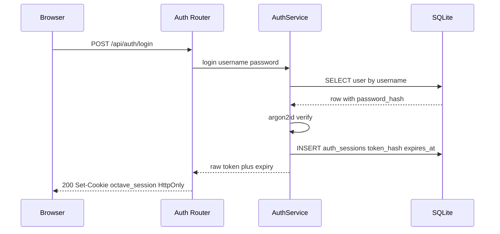
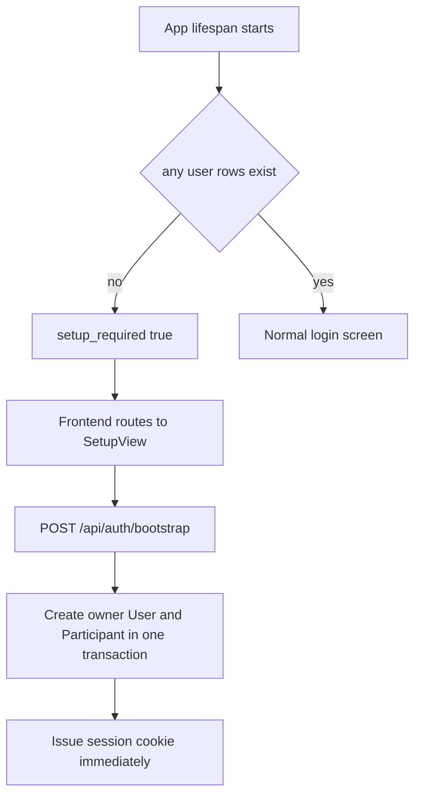

# Multi-User Authentication — Design

**Issue:** to be filed (see Dependencies)
**Branch:** `feature/multi-user-auth`
**Date:** 2026-10-04
**Status:** Approved in brainstorming; awaiting spec review

## Goal

Give Octave a real notion of *who is making a request*. Land credentials, session
tokens, an identity dependency, first-run setup, and account administration, so that
the per-user isolation the schema **already enforces** becomes meaningful instead of
parameterised by a hardcoded `"u_1"`.

This is the first authenticated HTTP surface in the backend. It unblocks #121
(session create/list endpoints), and unblocks the ownership half of #86 (multi-user
vault visibility) and #59 (user preferences panel).

## What already exists (and what this design does *not* add)

Audited before designing:

| Surface | Isolation today | Evidence |
|---|---|---|
| Context vault | **Hard-partitioned per user.** `user_id` is `NOT NULL` and a required argument on every read path — enforced as an adapter filter *and* re-checked on row load. | [`vault.py:36`](../../backend/src/octave/db/models/vault.py), [`vault_store.py:165`](../../backend/src/octave/db/vault_store.py) |
| Sessions | Single owner (`created_by_user_id NOT NULL`) + N-member `session_participants` that no multi-human writer uses yet. | [`sessions.py:47`](../../backend/src/octave/db/models/sessions.py) |
| Agents | Instance-global — no `user_id`. Shared by all users. | [`core.py:36`](../../backend/src/octave/db/models/core.py) |

**So: privacy is the shipped default, not a future option.** What auth contributes is
the *caller identity* that makes the existing filters meaningful. The walls are built;
auth points them at the right person.

## Scope

**In scope**

- `users` credential + role/status columns; `auth_sessions` table (one Alembic migration)
- `octave/auth/` package: hashing, token generation, `AuthStore`, `AuthService`, dependencies
- HTTP endpoints: status, bootstrap, login, logout, me, user administration
- First-run setup flow (owner creation) + `reset-password` CLI
- WebSocket handshake authentication
- Frontend: `useAuth`, `RequireAuth`, `LoginView`, `SetupView`, 401 handling
- Test matrix incl. an anonymous-rejection guard test and an existing-DB migration test
- ADR amendment recording multi-user login vs. sync

**Out of scope (recorded, not silently skipped)**

- **Sync** — the 2026-06-27 local-first ADR stands. Accounts are per-instance; one
  canonical copy of all data. Login ≠ replication.
- **OIDC / external IdP** — post-1.0.0. Pre-commitments taken below; no table built now.
- **Open self-registration** — the policy seam exists, the flag does not ship.
- **Per-user inference / MCP config** — those settings stay instance-global.
- **Password reset by email** — no mail infrastructure; CLI reset instead.
- **Fine-grained permissions** — `role` gates account administration only.

## Threat model

Deployment decision: **LAN now, internet-exposed later behind a reverse proxy.** Design
for HTTPS-awareness, test on LAN for 1.0.

- **Adversary assumed:** any device on the LAN (unauthenticated network access is not
  the same as trust), plus any browser-resident XSS in the frontend.
- **Asset protected:** every user's sessions, transcripts, and vault — and the ability
  to add an MCP server whose tools then run for everyone.
- **Explicitly out of scope:** an attacker with filesystem access to the SQLite DB.
  They own the machine; hashing and token hashing slow them down but do not stop them.
  Full-at-rest encryption is a separate concern with a separate cost profile.

| Threat | Mitigation |
|---|---|
| Password theft via DB leak | argon2id (`argon2-cffi`), OWASP-parameterised |
| Session theft via DB leak | store `sha256(token)`, never the token |
| Session theft via XSS | `HttpOnly` cookie; token never enters JS-readable storage |
| CSRF | `SameSite=Lax` blocks cross-site POST cookie delivery (covers all mutating endpoints); double-submit token deferred until a GET triggers a mutation |
| Username enumeration | dummy argon2 verify on unknown username → constant-ish timing |
| Brute force | in-process counter on (username, source IP) — **advisory**: per-worker, needs shared state before real exposure |
| Stale sessions | idle sliding expiry + absolute cap; row deletion = instant revocation |
| Plaintext over LAN | `Secure` cookie gated on config flag; TLS termination is the proxy's job |

## Schema — one migration

```
users:  + username        TEXT NOT NULL UNIQUE   # lowercased [a-z0-9._-]{2,32}, immutable
        + password_hash   TEXT NULL              # argon2id; NULL = no password credential
        + role            TEXT NOT NULL DEFAULT 'member'   # owner | member
        + status          TEXT NOT NULL DEFAULT 'active'   # active | deactivated
        + last_login_at   UTCDateTime NULL

auth_sessions:
        id            TEXT PK          # sha256(token) hex, never the raw token
        user_id       TEXT FK -> users.id ON DELETE CASCADE
        created_at    UTCDateTime NOT NULL
        expires_at    UTCDateTime NOT NULL
        last_seen_at  UTCDateTime NOT NULL
        INDEX (user_id), INDEX (expires_at)
```

Decisions and why:

- **`password_hash` is NULL-able — a deliberate one-way-door decision.** SQLite cannot
  drop `NOT NULL` without a batch table rebuild (the same `writable_schema` dance the
  [`sessions.py:116`](../../backend/src/octave/db/models/sessions.py) composite-FK comment
  warns about). Nullable now costs nothing; nullable after installs exist costs a rebuild.
  NULL means "this account has no password credential" — the OIDC-provisioned shape.
  Login on a NULL-hash account fails closed.
- **Hash the token, store the hash.** Raw token exists only in the `Set-Cookie` response.
- **`status` instead of row deletion.** Deactivating must preserve sessions/vault for
  reactivation; `CASCADE` would destroy years of data to revoke access. Deactivation
  deletes that user's `auth_sessions` rows → instant logout everywhere.
- **`role`/`status` are TEXT + app-validated enums** (`UserRole`, `UserStatus` in
  `octave.db.types`) — the established pattern for `EventKind`/`VaultKind`. A DB `CHECK`
  forces a table rebuild per new value, which is exactly why `events.kind` avoided one.
- **Username is immutable in 1.0** and is *not* the OIDC identity (see pre-commitments).
  Mutable usernames create impersonation drift against denormalised `Participant.label`.
- **Every `User` gets a `Participant` row in the same transaction.** Users author events
  through participants; creating them separately permits a "user exists but can't speak"
  state. Mirrors the flush-ordering relationships already declared in
  [`core.py:97-101`](../../backend/src/octave/db/models/core.py).
- **Sliding expiry:** `expires_at` extends on authenticated use (idle timeout, default
  14 days), absolute cap 90 days. LAN users shouldn't re-login daily; revocation stays
  instant via row deletion. Expired-row cleanup runs opportunistically at login, not on a timer.

## Package layout

New plane `octave/auth/`, mirroring `octave/inference` and `octave/mcp` (self-contained
package, public surface in `__init__.py`, own `errors.py` / `types.py` / `config.py` /
`deps.py`).

| Module | Responsibility |
|---|---|
| `passwords.py` | `PasswordHasher` protocol + `Argon2Hasher` default. Seam exists so tests inject a fast hasher — argon2id is deliberately ~100 ms and would drag the suite. |
| `tokens.py` | `secrets.token_urlsafe(32)`; `hash_token()` → sha256 hex |
| `store.py` | `AuthStore` — takes the caller's `AsyncSession`, **never commits** (the `VaultStore`/`MessageRouter` convention) |
| `service.py` | `AuthService` — orchestration: `provision_user`, `issue_session`, bootstrap, login, logout, deactivate |
| `deps.py` | `get_current_user`, `require_owner` |
| `config.py` | `AuthSettings` via `pydantic-settings`: `OCTAVE_AUTH_COOKIE_SECURE`, `OCTAVE_AUTH_IDLE_TTL_DAYS`, `OCTAVE_AUTH_ABSOLUTE_TTL_DAYS` |
| `errors.py` | `AuthError` subclasses, mapped centrally in [`middleware.py:64`](../../backend/src/octave/middleware.py) |
| `cli.py` | `python -m octave.auth.cli reset-password <username>` |

### The two seams that matter

Every login method — present or future — funnels through the same pair, so adding a
method never touches `deps.py`, routes, or the WS layer:

```python
provision_user(*, display_name: str, role: UserRole,
               password_hash: str | None) -> User      # + Participant, one transaction
issue_session(user_id: str) -> tuple[str, datetime]     # raw token + expiry
```

## API surface — `octave/routes/auth.py`

```
POST   /api/auth/status      -> {setup_required: bool}          # public
POST   /api/auth/bootstrap   -> create owner; 409 once any user exists
POST   /api/auth/login
POST   /api/auth/logout      -> deletes the session row
GET    /api/auth/me          -> current identity for the frontend
GET    /api/auth/users       -> owner only
POST   /api/auth/users       -> owner only  (registration seam for the future flag)
PATCH  /api/auth/users/{id}  -> owner only  (status / role)
```





- **`Set-Cookie`, not a JSON token body.** The frontend never holds the secret, so XSS
  can't exfiltrate it. Consequence: CORS needs `allow_credentials=True` with **explicit
  origins** — wildcard + credentials is invalid per spec — so
  [`add_cors`](../../backend/src/octave/middleware.py) changes, and
  [`client.ts`](../../frontend/src/lib/api/client.ts) sends `credentials: 'include'`.
- **Registration policy lives in one check**, not scattered conditionals — that's where
  a future `registration_mode` flag plugs in.
- Owner cannot deactivate or demote the **last** owner (single-owner lockout guard).

## WebSocket identity

Browsers attach same-origin cookies to the WS upgrade, so
[`connection.py`](../../backend/src/octave/websocket/connection.py) resolves the token
and `close(4401)` **before** `accept()`. No token in query strings, no `?token=` leaking
into access logs. This is the concrete payoff of DB-backed tokens over bearer tokens.

**Known gap, recorded:** identity is checked at handshake and per `join` message, so an
already-open socket survives deactivation until it reconnects. Accepted for 1.0;
periodic revalidation on heartbeat is a noted follow-up, not an oversight.

## OIDC pre-commitments

OIDC is post-1.0.0. Three cheap-now commitments, chosen because retrofitting each is
expensive or policy-unsafe:

1. **`password_hash` nullable** (above) — the one-way door. OIDC users have no password.
2. **`provision_user` / `issue_session` seams** — an OIDC callback becomes: verify IdP
   token → find-or-create via `provision_user` → `issue_session`. Nothing downstream changes.
3. **JIT must respect `status`** — auto-provisioning reads `status` and never reactivates.
   Without this pinned, deactivation silently becomes decorative the day JIT lands.

Deferred landing shape — **recorded, not built** (purely additive, so not a one-way door;
per the 2026-09-21 precedent we open doors only when they're actually one-way):

```
auth_identities:  id           TEXT PK
                  user_id      TEXT FK -> users.id ON DELETE CASCADE
                  method       TEXT        # 'password' | 'oidc' | future 'passkey'
                  identifier   TEXT        # username, or 'issuer|sub'
                  credential   TEXT NULL   # password_hash; NULL for oidc
                  UNIQUE (method, identifier)
```

Login becomes one uniform lookup (`WHERE method = ? AND identifier = ?`) instead of two
code paths, and one account can hold both a password and an IdP link. Migration backfills
`('password', username, users.password_hash)`.

Username caveat: JIT provisioning derives `preferred_username` with a collision suffix
(`.2`, `.3`) rather than failing or hijacking an existing local account — `(issuer, sub)`
is the identity; usernames are display conveniences.

## Migration safety

The real risk isn't auth — it's **upgrading an existing install that already has `users`
rows without username or password** (every dev DB that ran current migrations).

Backfill in the migration:

1. Add columns nullable, without defaults where semantics matter.
2. Derive `username` from a slug of `display_name`; de-duplicate with `.2`, `.3`.
3. `role = 'owner'` for the oldest row by `created_at`; `'member'` for any others.
4. `password_hash` = a random unknowable value → nobody is silently locked in, nobody
   can log in until `reset-password`.
5. `status = 'active'`.
6. Backfill missing `Participant` rows for users lacking one.

`python -m octave.auth.cli reset-password <username>` covers lockout recovery — the
substitute for email reset, since local-first means the operator has shell access.

## Consequences to accept knowingly

1. **MCP and inference config are instance-global.** Any authenticated user can add an
   MCP server whose tools then run in *everyone's* agents. Accepted under the LAN trust
   model; the fix if that's unwanted is gating those two surfaces on `require_owner` —
   two lines, not a redesign. Deliberately **not** gated in 1.0 to keep one uniform
   feature-access rule.
2. **Server-side writers resolve owner from the session row, never the caller.**
   `SessionSummarizer` and `ContextArchiver` run outside any HTTP request — no
   `current_user` to read. They derive `user_id` from `Session.created_by_user_id`. If
   they took it from a request-scoped dependency, background archival would crash or
   misattribute another user's transcript.
3. **Global agents, private outputs.** Agent definitions are shared; their archived
   output (`session_summary`, `transcript_chunk`) lands in the session owner's vault.
   Alice's conversation with Echo does not pollute Bob's retrieval corpus.
4. **Rate limiting is advisory** until shared state exists (see threat model).
5. **ADR amendment required.** The 2026-06-27 local-first ADR lists "No built-in
   multi-user sync" — a future reader could misread that as rejecting multi-user *at
   all*. Amendment: multi-user **login** is compatible with local-first (accounts are
   per-instance, data stays on-prem); **sync** remains out of scope.

## Testing strategy

**Unit:** `Argon2Hasher` verify/rehash-needed; `hash_token` determinism and length;
`AuthStore` create/lookup/expiry/cascade; `AuthService` bootstrap-once, login success and
failure, deactivate-revokes-sessions, last-owner guard.

**Route-level (httpx `ASGITransport`):** status/bootstrap/login/logout/me round-trips;
cookie flags (`HttpOnly`, `SameSite=Lax`, `Secure` under flag); 401 anonymous, 403
member-hitting-owner-endpoint; 409 double-bootstrap; expired token rejected.

**Guard test — the one that prevents regressions:** enumerate the FastAPI route table
and assert every route outside an explicit public-path allowlist depends on
`get_current_user`. This stops the next endpoint author from forgetting the dependency.

**WebSocket:** handshake without cookie → closed `4401` before accept; with valid cookie
→ accepted.

**Migration:** build a DB on the pre-auth schema with seeded sessions/vault rows, run the
full Alembic chain, assert every row survives, usernames are unique, oldest user is owner,
and login fails until password reset.

**Frontend (Vitest):** `useAuth` state transitions; `RequireAuth` redirects anonymous to
login and renders when authed; `SetupView` appears when `setup_required`; 401 interceptor
clears auth state. **E2E (Playwright):** bootstrap → login → logout happy path.

**Dependencies added:** backend `argon2-cffi`. Nothing else — FastAPI supplies cookies,
`secrets` supplies tokens; no JWT library, no OAuth provider.

## Success criteria

1. `pytest`, `ruff`, `mypy --strict` pass in `backend/`; `npm run test` and `lint` in `frontend/`.
2. Fresh install: `setup_required` true → bootstrap creates owner → session cookie valid
   → `GET /api/auth/me` returns them. Second bootstrap returns 409.
3. Guard test passes: no non-public route reachable anonymously.
4. Deactivating a user immediately fails their existing session on the next request.
5. Migration test proves a pre-auth DB upgrades with all sessions/vault rows intact.
6. WS rejects an unauthenticated handshake before accept.
7. ADR amendment recorded in `.agents/memory/decisions.md`.

## Dependencies

**Blocks (must be updated when the issue is filed):**

- **#121** session create/list endpoints — needs caller identity for
  `created_by_user_id` and "the caller's sessions" scoping.
- **#86** multi-user vault visibility — ownership half becomes enforceable.
- **#59** user preferences panel — preferences are per-user (`vault_items`), needs an
  authenticated user to be meaningful.

**Follow-up issues to file:** OIDC integration (with the `auth_identities` landing
shape), WS revalidation on heartbeat, double-submit CSRF token (if GET ever mutates),
shared-state rate limiting (before internet exposure), optional `require_owner` gating
on MCP/inference config.
