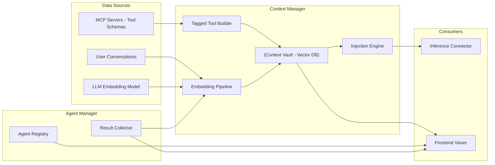
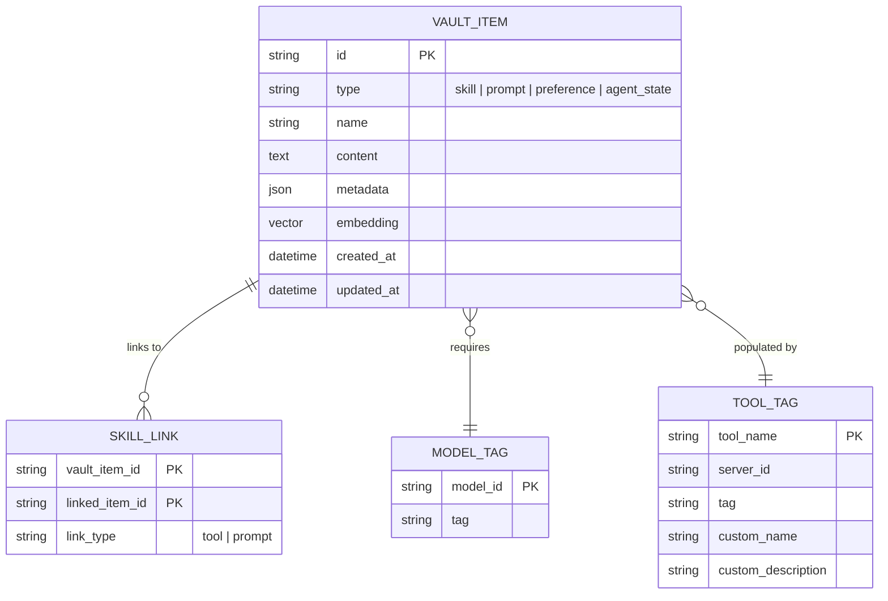

# Data Flow Diagram

## Context and Agent Data Paths

Shows how data moves between components for context management, agent state, and tool metadata.

```mermaid
flowchart LR
  subgraph Sources["Data Sources"]
    MCPServers["MCP Servers - Tool Schemas"]
    LLM[LLM Embedding Model]
    UserConv[User Conversations]
  end

  subgraph ContextMgr["Context Manager"]
    ToolTag[Tagged Tool Builder]
    Embedder[Embedding Pipeline]
    Vault["(Context Vault - Vector DB)"]
    Injection[Injection Engine]
  end

  subgraph AgentMgr["Agent Manager"]
    Registry[Agent Registry]
    Results[Result Collector]
  end

  subgraph Consumers["Consumers"]
    Inference[Inference Connector]
    UI[Frontend Views]
  end

  MCPServers --> ToolTag
  ToolTag --> Vault
  UserConv --> Embedder
  LLM --> Embedder
  Embedder --> Vault
  AgentMgr --> Results
  Results --> Embedder
  Vault --> Injection
  Injection --> Inference
  Vault --> UI
  Registry --> UI
  Results --> UI
```

## Context Vault Data Model

```mermaid
erDiagram
  VAULT_ITEM {
    string id PK
    string type "skill | prompt | preference | agent_state"
    string name
    text content
    json metadata
    vector embedding
    datetime created_at
    datetime updated_at
  }

  SKILL_LINK {
    string vault_item_id PK
    string linked_item_id PK
    string link_type "tool | prompt"
  }

  MODEL_TAG {
    string model_id PK
    string tag
  }

  TOOL_TAG {
    string tool_name PK
    string server_id
    string tag
    string custom_name
    string custom_description
  }

  VAULT_ITEM ||--o{ SKILL_LINK : "links to"
  VAULT_ITEM }o--|| MODEL_TAG : "requires"
  VAULT_ITEM }o--|| TOOL_TAG : "populated by"
```
