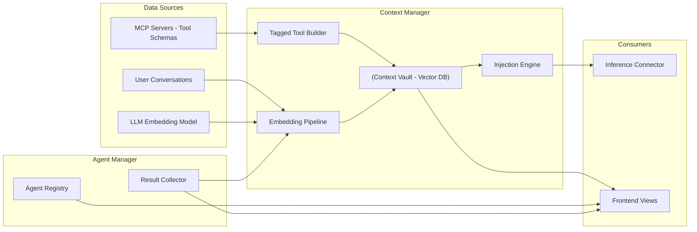
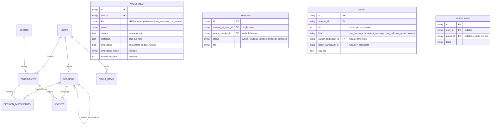

# Data Flow Diagram

## Context and Agent Data Paths

Shows how data moves between components for context management, agent state, and tool metadata.

## Shipped Schema (v1 — PR #84)

Planned, not yet created (additive migrations in their consumer work items):
`SKILL_LINK`, `TOOL_TAG`, `MODEL_TAG`, `TOOLS`, `INJECTION_RULES`.

Vault item structure conventions (`metadata` tags, links, skill params, run
provenance) are documented in the
[context vault data model design](../../.agents/specs/2026-09-20-context-vault-data-model-design.md).
Run archival is two-tier: `run_summary` (Tier 1 — "which run?") then
`run_record` (Tier 2 — verbatim chunks), linked by `metadata.session_id`.
