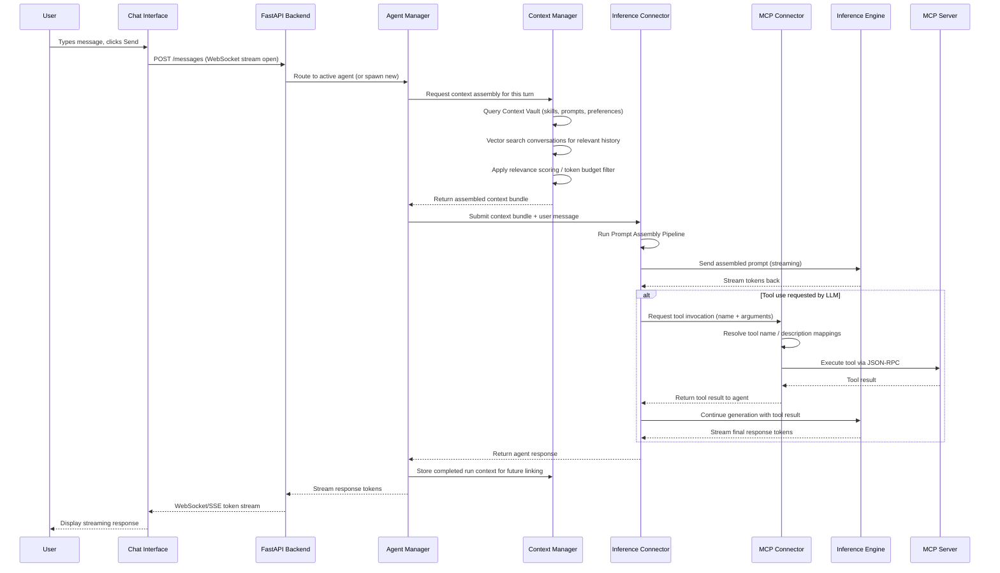
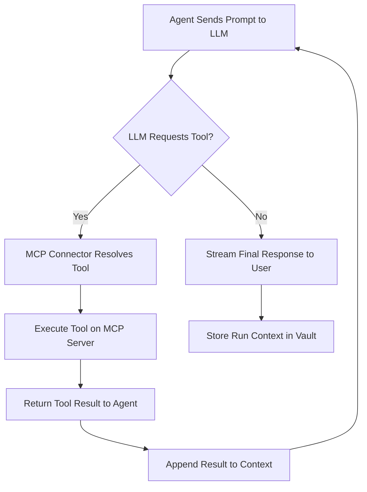

# User Request Flow Diagram

## End-to-End Request Lifecycle

Illustrates how a user message travels through Octave from input to response, including context assembly, inference, and MCP tool execution.

## Inference Loop (Tool Use Cycle)

Shows the iterative loop when the agent requests multiple tool calls within a single turn.

