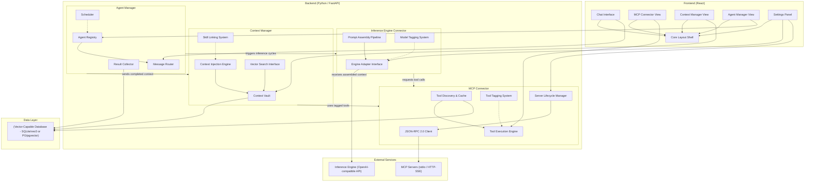

# System Architecture Diagram

## Octave Component Overview

```mermaid
graph TB
  subgraph Frontend["Frontend (React)"]
    ChatUI[Chat Interface]
    MCPUI[MCP Connector View]
    CtxUI[Context Manager View]
    AgUI[Agent Manager View]
    SetUI[Settings Panel]
    Shell[Core Layout Shell]
  end

  subgraph Backend["Backend (Python / FastAPI)"]
    subgraph Inference["Inference Engine Connector"]
      Adapter[Engine Adapter Interface]
      Prompt[Prompt Assembly Pipeline]
      ModelTag[Model Tagging System]
    end

    subgraph MCP["MCP Connector"]
      JSONRPC[JSON-RPC 2.0 Client]
      Lifecycle[Server Lifecycle Manager]
      ToolCache[Tool Discovery & Cache]
      ToolExec[Tool Execution Engine]
      ToolTag[Tool Tagging System]
    end

    subgraph ContextMgr["Context Manager"]
      Vault[Context Vault]
      Injection[Context Injection Engine]
      VecSearch[Vector Search Interface]
      SkillLink[Skill Linking System]
    end

    subgraph AgentMgr["Agent Manager"]
      Registry[Agent Registry]
      Router[Message Router]
      Results[Result Collector]
      Scheduler[Scheduler]
    end
  end

  subgraph DataLayer["Data Layer"]
    DB["(Vector-Capable Database - SQLite/vec0 or PG/pgvector)"]
  end

  subgraph External["External Services"]
    LLM["Inference Engine (OpenAI-compatible API)"]
    MCPServers["MCP Servers (stdio / HTTP-SSE)"]
  end

  %% Internal wiring
  ChatUI --> Shell
  MCPUI --> Shell
  CtxUI --> Shell
  AgUI --> Shell
  SetUI --> Shell

  Prompt --> Adapter
  Adapter --> LLM
  ModelTag -.-> Adapter

  JSONRPC --> MCPServers
  Lifecycle --> JSONRPC
  ToolCache --> ToolExec
  ToolTag -.-> ToolExec

  Injection --> Vault
  VecSearch --> Vault
  SkillLink -.-> Injection

  Registry --> Router
  Results --> DB
  Scheduler -.-> Registry

  %% Cross-component connections
  ChatUI --> Router
  MCPUI --> ToolExec
  CtxUI --> Vault
  AgUI --> Registry
  SetUI --> Adapter
  SetUI --> Lifecycle

  Vault --> DB
  ToolCache --> DB

  ContextMgr -->|"uses tagged tools"| MCP
  AgentMgr -->|"sends completed context"| ContextMgr
  Inference -->|"receives assembled context"| ContextMgr
  AgentMgr -->|"triggers inference cycles"| Inference
  Inference -->|"requests tool calls"| MCP
```
